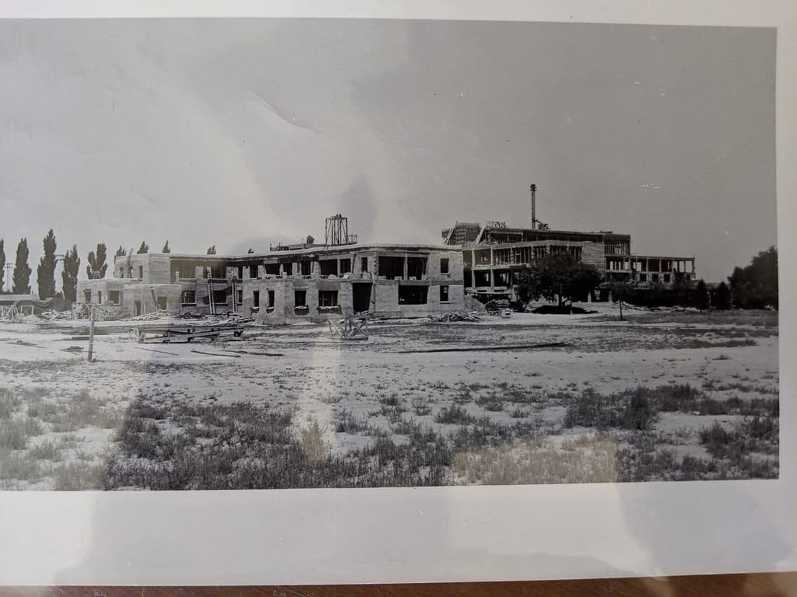
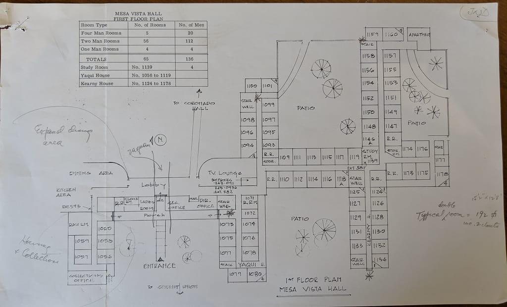
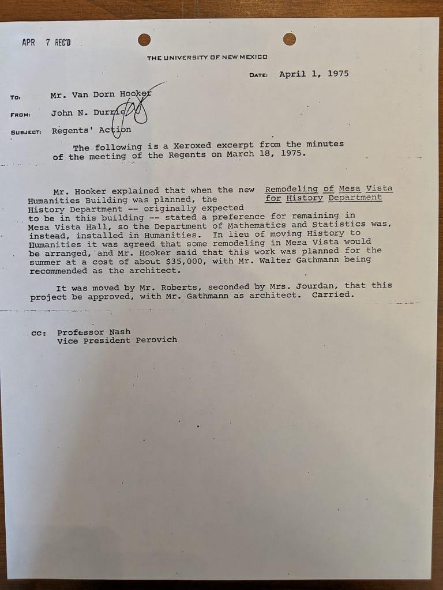

# _Metahistory_ images

This page is useful after you've completed the directions for [adding a new page](metahistory-addition-guide). It describes the process for finding, renaming, committing, and displaying images on your fork of _Metahistory_.


## Image Preparation

### Find Images
Because our work is not merely a class project but an actual publication (yay internet!), **we need to make sure we have sufficient permissions to use the images that we do** and provide a link back to the original. As a non-commercial education resource, the doctrine of fair use gives us a wide latitude for using images. But it's always best to use images for which the copyright and licensing permissions are very clear.

You don't need to restrict yourself to these, but below are some fun places to search that have a lot of historical images:

- [Wikimedia Commons](https://commons.wikimedia.org/wiki/Main_Page)
- [Creative Commons](https://search.creativecommons.org/)
- [Library of Congress](http://www.loc.gov/pictures/)
- It is also useful to peruse particular museum collections, like the [British Museum](https://www.britishmuseum.org/collection), or [Metropolitan Museum of New York](https://www.metmuseum.org/art/collection/search#!#!%3FshowOnly=highlights%7CwithImage%7CopenAccess&offset=0&pageSize=0&sortBy=Relevance&sortOrder=asc&perPage=20&searchField=All), or the [Getty Museum](https://search.getty.edu/gateway/search?q=&cat=highlight&f=%22Open+Content+Images%22&rows=10&srt=a&dir=s&pg=1). Many large international institutions have incredible digital collections that are free to use, but each institution (large or small) has its own permissions and licensing requirements, so you need to see if you can use the image or how it should be credited.

Because you will need to copy the URL of where you got the image so that you paste in into your `source-url` parameter, make sure you're keeping track of the URL where you're images are from so you don't have to track them down later!

### Download and Rename Images
When you find an image you like, download it to your computer. Frequently, images you download will have long and weird filenames. We need to rename the images so we can tell which images go with which essay. This makes site maintenance infinitely easier. Your filenames should look like `gibbs-mesa-vista-hall.jpg`, meaning your last name followed by some very brief description of what the image is of. **Use only lowercase and hyphens (not underscores or spaces) in your filename!**

### Put Images into YOUR Repository
Once you have all your images downloaded, put them into your fork of the _Metahistory_ repository in your own GitHub account (the same place you revised an existing essay). To do this, navigate to the  `images` folder, and then drag and drop your files onto your browser window.

It is much faster to drag and drop multiple files at once, since after you commit a file (of any kind), GitHub kicks you back to the repository home page (not where you were, like the images folder).

**Remember to click the green "Commit Changes" button to upload your images after you drag and drop them!**


## Image Code
As you have already seen, we use a small block of code to help us keep the display of images and captions consistent and flexible. You already have this code in the starter essay, and below you'll find explanations of what to change.

When editing code blocks:

**• Make sure you take extreme care with your quotation marks and other coding symbols!**

**• If you want to use double quotation marks `"` in your titles or captions, you need to have a backslash `\` right before each one. Like: `caption="my caption is \"so\" good."`**


Just for reference, here's a standard code block:
```
{% include figure.html
class="left"
width="50%"
caption="Obviously we need a 50% image somewhere."
image-url="Augustine_Lateran.jpg"
source-url="https://en.wikipedia.org/wiki/Augustine_of_Hippo#/media/File:Augustine_Lateran.jpg"
%}
```

### Edit parameters CAREFULLY
- `class` can be `left`, `right`, or `center`
- `width` is a percent of the page width and can have any value (0--100), but usually less than 25% looks weird.
- `caption` is obviously your caption, but remember we use these to inform the reader about main points of the image, not just describe the image.
  - If you want to use DOUBLE QUOTES in your caption, you need to have a backslash in front of them, like `caption="This is my \"quote\" in my caption."`
- `image-url` is the ONLY the filename of the image, with the appropriate extension (`.jpg`, `.png`, `.jpeg`, `.Jpeg`, etc).
  - **Make sure the image filename as it appears in the code block and your repository MATCH EXACTLY, including capitalization.**
- `source-url` is the URL of wherever you got the image. This is so people can go see the original and how it's published or perhaps get a different version.


### Double check and commit your changes
As you modify the image code blocks, double check that you have:
- matching double quotation marks for all your parameters
- not accidentally deleted one of the `{%`
 or `%}` brackets that signify the beginning and end of the code block.
- an EXACT match (including case, hypens, etc) between your image filename saved in your repository and what's in the `image-url` field.
- **REMEMBER: using a text editor like [Atom](atom.io) (because it color codes markdown) makes editing EASIER, FASTER, AND SAFER.**

### Check your work
If you modify an image code block and want to make sure the image is loading properly, you can test this the same way as you did your earlier revisions. Commit your changes, then wait a few minutes, then reload/refresh your essay's webpage. Your images should appear. If they do not, either you need to wait a little longer for your site to rebuild, or you made a mistake with the code. Better to wait a little more before experimenting with code changes, which might not be necessary.

### Troubleshooting
If you've waited more than 5 minutes and your image is still not appearing, you probably made a typo somewhere and you have to find it and fix it.

- If you see the image code on your webpage, you most likely accidentally deleted one of the {% or %} symbols. Check for that first.

- If you see the missing image icon (<i class="fas fa-image"></i>), then you have a problem either with the image not being in the right place, or the filename in your code does not match the actual file.

The most common problem is a mismatch between image filename and what you put in the `image-url` field.
- Make sure your code and the filename match EXACTLY, including capitalization, spaces, etc.
  - This includes the filename extension---it might be `jpg` or `jpeg` or `Jpg` or `GIF`.
- Make sure your images files are in the `/essays/images` folder.
- Double check your code for a missing quote or bracket.


## Parameter Reference


### Standard Usage
{% include figure.html class="right" width="33%"
caption="Mesa Vista Hall is **awesome**"
image-url="courses/historiography/images/default.jpg" %}

Fusce vulputate eleifend sapien. Vestibulum purus quam, scelerisque ut, mollis sed, nonummy id, metus. Nullam accumsan lorem in dui. Cras ultricies mi eu turpis hendrerit fringilla. Vestibulum ante ipsum primis in faucibus orci luctus et ultrices posuere cubilia Curae; In ac dui quis mi consectetuer lacinia. Nam pretium turpis et arcu. Duis arcu tortor, suscipit eget, imperdiet nec, imperdiet iaculis, ipsum.


---
To embed the image above, we use:
```
{% include figure.html
  class="right"
  width="33%"
  caption="Mesa Vista Hall is **awesome**"
  image-url="default.jpg"
  source-url="https://nmdigital.unm.edu/digital/collection/ULPhotoImag/id/3516/"
%}
```

### Use whatever width you want
You can alter the width of the image **as a percentage of our standard page width**. You can have them appear on the left, right, or center of the page.

### Half-width
{% include figure.html class="left" width="50%" image-url="courses/historiography/images/Augustine_Lateran.jpg" source-url="https://en.wikipedia.org/wiki/Augustine_of_Hippo#/media/File:Augustine_Lateran.jpg" caption="This image is sized to take up half the essay width because the width parameter is set to 50%."
%}

Vestibulum ante ipsum primis in faucibus orci luctus et ultrices posuere cubilia Curae; In ac dui quis mi consectetuer lacinia. Nam pretium turpis et arcu. Duis arcu tortor, suscipit eget, imperdiet nec, imperdiet iaculis, ipsum. Vestibulum ante ipsum primis in faucibus orci luctus et ultrices posuere cubilia Curae; In ac dui quis mi consectetuer lacinia. Nam pretium turpis et arcu. Duis arcu tortor, suscipit eget, imperdiet nec, imperdiet iaculis, ipsum. Vestibulum ante ipsum primis in faucibus orci luctus et ultrices posuere cubilia Curae; In ac dui quis mi consectetuer lacinia. Nam pretium turpis et arcu. Duis arcu tortor, suscipit eget, imperdiet nec, imperdiet iaculis, ipsum.

In ac dui quis mi consectetuer lacinia. Nam pretium turpis et arcu. Duis arcu tortor, suscipit eget, imperdiet nec, imperdiet iaculis, ipsum. Vestibulum ante ipsum primis in faucibus orci luctus et ultrices posuere cubilia Curae; In ac dui quis mi consectetuer lacinia. Nam pretium turpis et arcu. Duis arcu tortor, suscipit eget, imperdiet nec, imperdiet iaculis, ipsum.

Vestibulum ante ipsum primis in faucibus orci luctus et ultrices posuere cubilia Curae; In ac dui quis mi consectetuer lacinia. Nam pretium turpis et arcu. Duis arcu tortor, suscipit eget, imperdiet nec, imperdiet iaculis, ipsum.

---

To achieve the above half-width image, use:
```
{% include figure.html
class="left"
width="50%"
caption="This image is sized to take up half the essay width because the width parameter is set to 50%"
image-url="Augustine_Lateran.jpg"
source-url="https://en.wikipedia.org/wiki/Augustine_of_Hippo#/media/File:Augustine_Lateran.jpg"
%}
```
---


### Full-width
{% include figure.html class="center" width="100%" caption="Set the width parameter to 100% to make images span the whole essay. This usually looks better when the image is much wider than tall. If your image looks grainy/blurry, get a higher resolution image or a new image."  
image-url="courses/historiography/images/Cleve-van_construction-tower-babel.jpg"
source-url="https://commons.wikimedia.org/wiki/File:Cleve-van_construction-tower-babel.jpg"
%}


To achieve the above full-width image, use:

```
{% include figure.html
  class="center"
  width="100%"
  caption="Set the width parameter to 100% to make images span the whole essay. This usually looks better when the image is much wider than tall. If your image looks grainy/blurry, get a higher resolution image or a new image."
  image-url="Cleve-van_construction-tower-babel.jpg"
  source-url="https://commons.wikimedia.org/wiki/File:Cleve-van_construction-tower-babel.jpg"
  %}
```


---


### Side by side
{% include figure.html class="left" width="49%" image-url="courses/historiography/images/Herder.jpg" caption="Here's an image on the left with 49% width."%}

{% include figure.html class="left" width="49%" image-url="courses/historiography/images/Johann.jpg" caption="Here's an image on the right with 49% width."%}

---
To achieve two images side by side use (note the 49% (not 50!) width for each):
```

{% include figure.html
class="left"
width="49%"
caption="Here's an image on the left."
image-url="Herder.jpg"
source-url=""
%}

{% include figure.html
class="left"
width="49%"
caption="Here's an image on the right."
image-url="Johann.jpg"
source-url=""
%}


```
---


### Slide carousel

<div id="carouselExampleControls" class="carousel slide" data-ride="carousel">
  <div class="carousel-inner">

    <div class="carousel-item active">
    <div class="carousel-caption d-none d-md-block">
      <h5>Mesa Vista Hall Construction</h5>
      <p>This place was on the fringe!</p>
    </div>
      
    </div>

    <div class="carousel-item">
      
      <div class="carousel-caption d-none d-md-block">
        <h5>The original floorplan</h5>
        <p>This floorplan is clearer than anything you can find in MVH now</p>
      </div>
    </div>

    <div class="carousel-item">
      
      <div class="carousel-caption d-none d-md-block">
        <h5>History Stays</h5>
        <p>The History Department didn't want to move to the new Humanities building, so "some remodeling was arranged."</p>
      </div>
    </div>
  </div>

  <a class="carousel-control-prev" href="#carouselExampleControls" role="button" data-slide="prev">
    <span class="carousel-control-prev-icon" aria-hidden="true"></span>
    <span class="sr-only">Previous</span>
  </a>
  <a class="carousel-control-next" href="#carouselExampleControls" role="button" data-slide="next">
    <span class="carousel-control-next-icon" aria-hidden="true"></span>
    <span class="sr-only">Next</span>
  </a>
</div>



```
<div id="carouselExampleControls" class="carousel slide" data-ride="carousel">
  <div class="carousel-inner">

    <div class="carousel-item active">
    <div class="carousel-caption d-none d-md-block">
      <h5>Mesa Vista Hall Construction</h5>
      <p>This place was on the fringe!</p>
    </div>
      
    </div>

    <div class="carousel-item">
      
      <div class="carousel-caption d-none d-md-block">
        <h5>The original floorplan</h5>
        <p>This floorplan is clearer than anything you can find in MVH now</p>
      </div>
    </div>

    <div class="carousel-item">
      
      <div class="carousel-caption d-none d-md-block">
        <h5>History Stays</h5>
        <p>The History Department didn't want to move to the new Humanities building, so "some remodeling was arranged."</p>
      </div>
    </div>
  </div>

  <a class="carousel-control-prev" href="#carouselExampleControls" role="button" data-slide="prev">
    <span class="carousel-control-prev-icon" aria-hidden="true"></span>
    <span class="sr-only">Previous</span>
  </a>
  <a class="carousel-control-next" href="#carouselExampleControls" role="button" data-slide="next">
    <span class="carousel-control-next-icon" aria-hidden="true"></span>
    <span class="sr-only">Next</span>
  </a>
</div>
```

