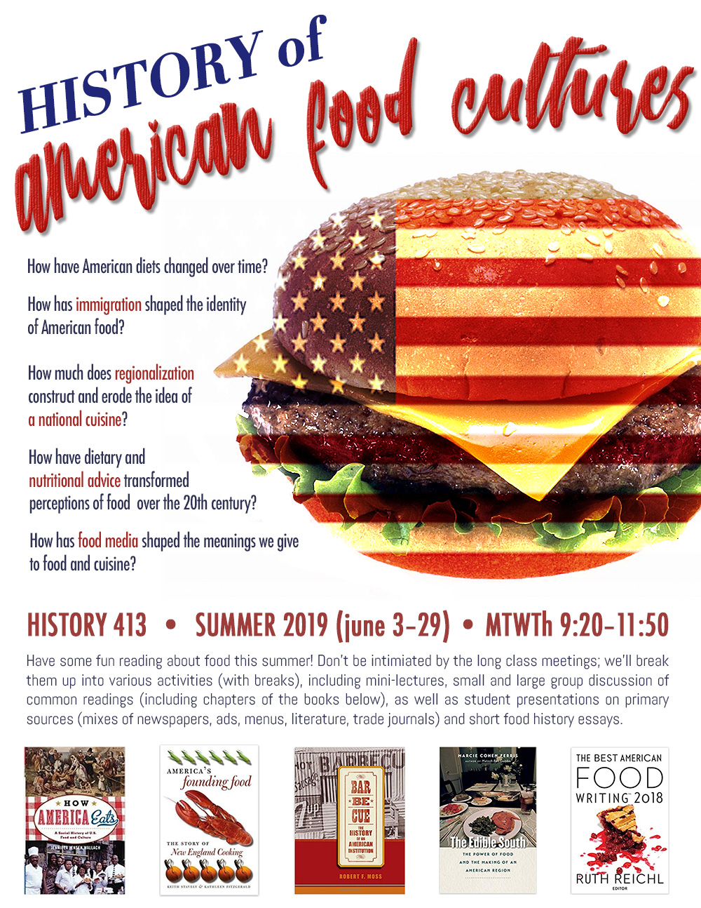
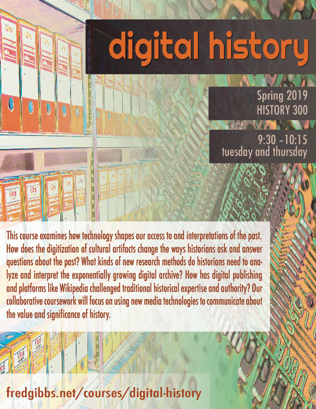
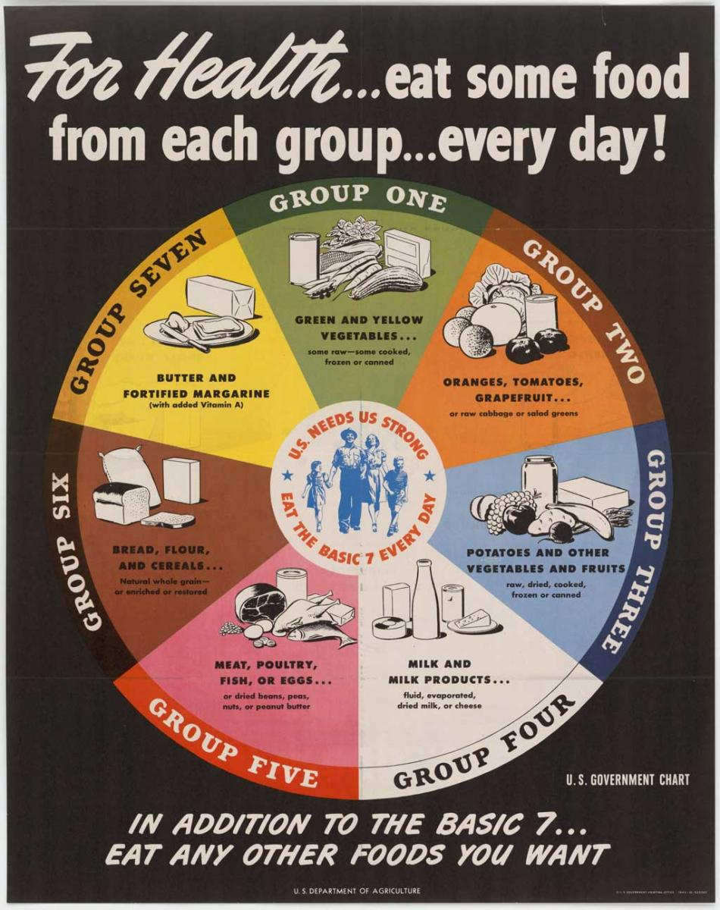
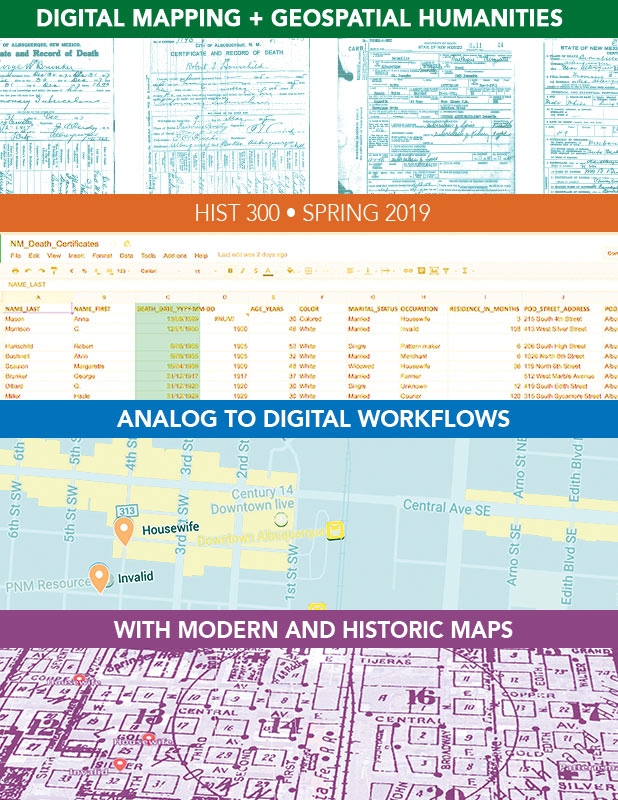
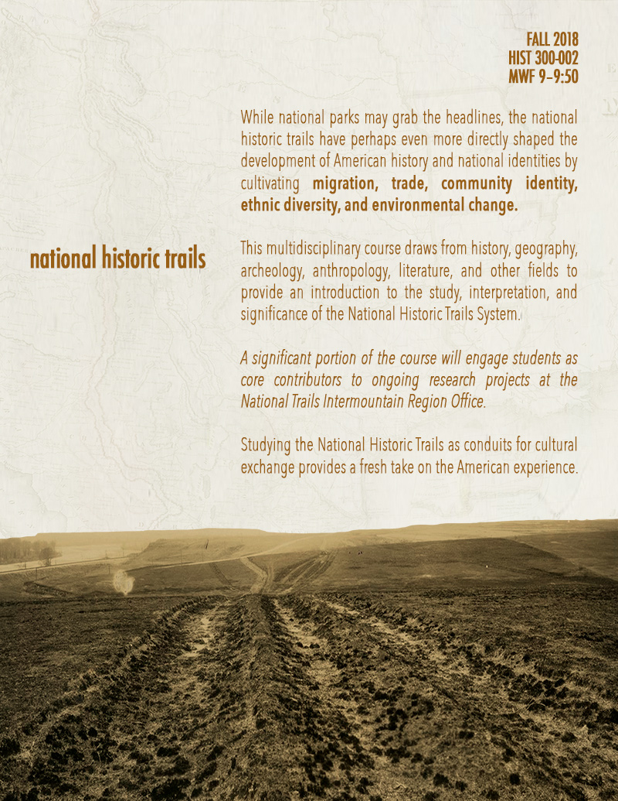

# Regularly Scheduled Courses

## Spring 2020

{% include course-block.html
slug="food-technology-society"
title="Food, Technology, and Society"
poster="images/fts-sm.jpg"
desc="This course explores the complex relationships between food, food production, technology, and society. In some ways, our goal is to explain how and why supermarkets have come to look like they do. Taking chronological and thematic approaches simultaneously, we’ll look at the impact of science and technology on food processing and distribution (such as canning, refrigeration, GMOs, food stabilizers and preservatives). We’ll also put these developments in larger social, cultural, and demographic contexts, including the growing divide between food producers and consumers, governmental regulation, the rise of global food conglomerates, urbanization, and sustainability. Even more broadly, we identify connections between agribusiness, ecology, consumerism, media, politics, and the history of science and medicine."
%}

## Fall 2019

{% include course-block.html
slug="landscape-memory"
title="Landscape and Memory"
poster="images/landscape-memory-sm.jpg"
desc="With ubiquitous digital maps at our finger tips, it’s easy to move through space without giving it much thought. At the same time, we recognize that physical space connects us to our past and charts a course for the future. This multidisciplinary course draws from history, geography, archeology, anthropology, literature, cultural studies and architecture to explore the how we attach meanings to space and how both space and place influence our identities, communities, regions, and nations. Coursework contributes to ongoing projects at the National Park Service on the National Historic Trails (particularly writing about historic sites on the Santa Fe Trail and contributing to [this website](http://trails.unm.edu)), emphasizing qualitative research and historical writing for a broad audience with digital publication technologies."
%}

{% include course-block.html
slug="historiography"
title="Historiography"
poster="images/historiography-sm.jpg"
desc="This course introduces some of the most influential approaches that historians (from antiquity through the present) have taken in thinking and writing about the past. It also addresses various meta-questions about history: What is history? What is it for? Who is it for? It addresses various philosophies of history (the underlying assumptions of how we can access and understand the past), as well as various historical interpretive frameworks that have shaped the professional practice of history. Coursework consists of numerous short essays that compare and contrast different processes, modes of thought, and modes of expression from different historical time periods and in different geographic areas."
%}

## Summer 2019

  

    <h2 class="course-title"><a href="american-food">History of American Food</a></h2>
  

  

    
  

  

    

      This course investigates the changing meanings of food and foodways throughout US history, including what people eaten, how they have attached cultural values to certain foods yet rejected others, and how immigration, and regionalization have shaped notions of American cuisine. When you think of Mexican food, or Italian, or Chinese, a range of dishes and ingredients immediately spring to mind. But what about American food? Is there such a thing? How much does the history of American Food tell a very different story of US History than we typically hear? How are ideas of nationalism reflected in our foodways? What constitutes a “national” cuisine? Does this concept even make sense anymore?
    

  

## Spring 2019

  

    <h2 class="course-title"><a href="digital-history">Digital History</a></h2>
  

  

    
  

  

    
This course examines how technology shapes our access to and interpretations of the past. How does the digitization of cultural artifacts change the ways historians ask and answer questions about the past? What kinds of new research methods do historians need to analyze and interpret the exponentially growing digital archive? How has digital publishing and platforms like Wikipedia challenged traditional historical expertise and authority? Our collaborative coursework will focus on using new media technologies to communicate about the value and significance of history.

  

## Fall 2018

  <h2 class="course-title"><a href="food-diet-health">History of Diet and Health</a></h2>

  

  

    

     The questions of what constitute healthy foods and bodies have been in flux since people had a choice about what to eat. And even today, medical understandings of nutrition, diet, and health seems to change almost daily. This course explores how various cultural, scientific, and medical values have continually shaped our relationship to food, health, and diet since the Renaissance. How have medical authorities continually redefined what it means to be healthy and to eat a healthy diet?  How much do food industries and lobbyists affect our understanding of healthy eating? How can the history of nutrition help us understand our own cultural constructions of natural and healthy diets?
    

  

## Previously

  <h2 class="course-title"><a href="digital-mapping">Digital Mapping + Spatial Humanities</a></h2>

  

  

  We are in the midst of a major paradigm shift in human consciousness and society caused by our ubiquitous connectedness via the internet, smartphones, and digital maps. These globalizing forces have telescoped space and time to an unprecedented degree, while paradoxically heightening the importance of local places. The course explores the technologies, tools, and workflows that can help collect, connect, and present online interpretations of the spaces around us.
  

  

    <h2 class="course-title"><a href="trails">National Historic Trails</a></h2>
  

  

    
  

  

    
This multidisciplinary course provides an introduction to the study, interpretation, and significance of the National Historic Trails System. It also explores the challenges of public history by engaging students as core contributors to research projects at the National Trails Intermountain Region Office that will appear on their official website. Throughout the course we’ll also discuss broad questions about cultural heritage and historic preservation: What constitutes a historic trail? How does a historic trail retain cultural significance? What are the challenges and strategies in communicating about the trails to a 21st-century audience?

    
 Learn about <a href="http://trails.unm.edu/">historic sites on the Santa Fe Trail</a> from the Fall 2018 students!

  

