<!-- ========== TITLE ========== -->
<section data-transition="fade" markdown="1">
Making History • HIST 1105 • Week 8.1
{: .eyebrow}

# The Big Picture in 6 Parts
{: .main-point}

- 1: Who chose the facts · Weeks 1, 3, 4, 6, 7
- 2: What history is for · Weeks 2–4, 7
- 3: The shape of the story · Weeks 2, 3, 5
- 4: Standards of evidence · Weeks 3–6
- 5: What moves history · Weeks 3–7
- 6: Progress as an idea · Weeks 2–4
{: .source-list}
</section>

<!-- ================================================================ -->
<!-- =============== PART ONE · WHO CHOSE THE FACTS ================= -->
<!-- ================================================================ -->

<!-- ========== PART ONE · THE IDEA ========== -->
<section data-transition="fade" markdown="1">
Part one · Weeks 1, 3, 4, 6, 7
{: .eyebrow}

## Somebody chose the facts, often before any historian arrived
{: .main-point}

Every history is a selection. Much of it was made before the historian started: in who kept records, what seemed worth a line, and who paid for the archive.
{: .detail .fragment}
</section>

<!-- ========== 1.1 CARR ========== -->
<section markdown="1">
Part one · 1 / 5 · Carr, Week 1
{: .eyebrow}

## The historian decides which facts get the floor
{: .main-point}

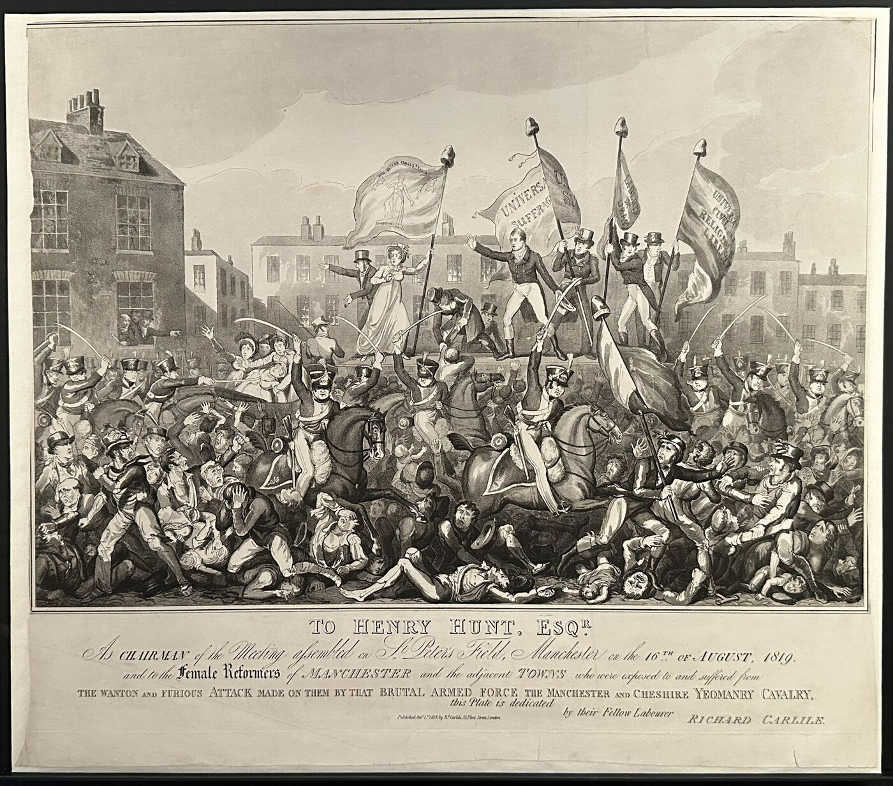

"The facts speak only when the historian calls on them." Carr, *What Is History?*, p. 11
{: .quote.compact}

Caesar crossing the Rubicon is a historical fact; millions of others crossing it interest "nobody at all." This print of Peterloo names Henry Hunt and nobody in the crowd.
{: .detail}

Richard Carlile, *To Henry Hunt, Esq.*, 1819 · St Peter's Field, Manchester, where some sixty thousand gathered · photograph by APK, CC BY 4.0 · cropped
{: .cite}
</section>

<!-- ========== 1.2 THE CHRONICLE ========== -->
<section markdown="1">
Part one · 2 / 5 · the *Anglo-Saxon Chronicle*, Week 3
{: .eyebrow}

## Some years in the *Chronicle* get a number and nothing else
{: .main-point}

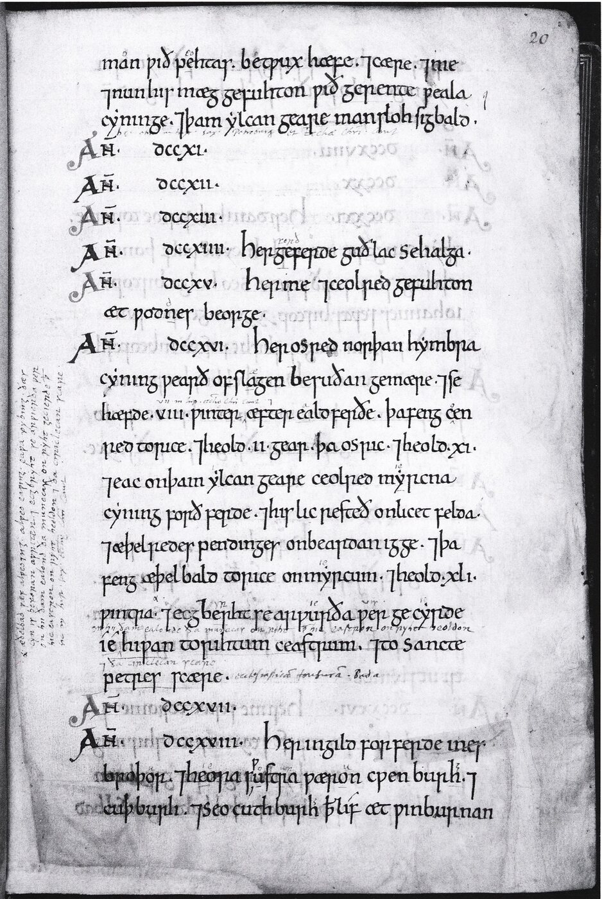

On this page the years 711, 712 and 713 are a heading and a number. Nothing happened to the people who counted, of a kind that counted.
{: .detail}

The sack of Lindisfarne in 793, conventionally the start of the Viking age, gets one clause: about as much as one man's death in the same entry.
{: .detail}

*Anglo-Saxon Chronicle* MS D, fol. 20r · British Library, Cotton MS Tiberius B.iv · public domain
{: .cite}
</section>

<!-- ========== 1.3 WHO COULD WRITE ========== -->
<section markdown="1">
Part one · 3 / 5 · Popkin, Week 3
{: .eyebrow}

## After Rome fell, nearly every western historian was a cleric
{: .main-point}

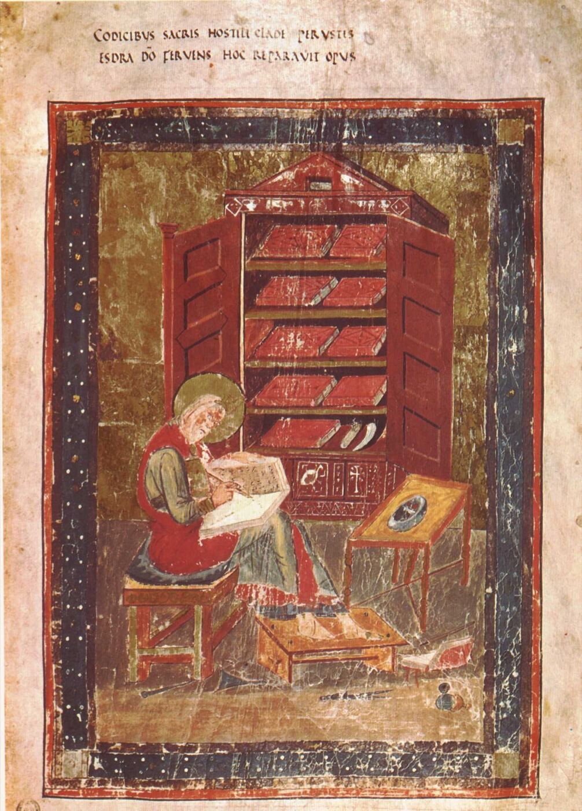

"their ranks would provide almost all of the authors of history for the next several centuries" Popkin, *From Herodotus to H-Net*, p. 41
{: .quote.compact}

Monastery chronicles "often reflected the influence of local rulers who protected the institution" (p. 43). This page was painted at Bede's own monastery.
{: .detail}

Ezra the scribe, Codex Amiatinus, Wearmouth–Jarrow, c. 700–716 · Biblioteca Medicea Laurenziana, MS Amiatino 1, fol. 5r · public domain
{: .cite}
</section>

<!-- ========== 1.4 THE STATE ========== -->
<section markdown="1">
Part one · 4 / 5 · Popkin, Week 4
{: .eyebrow}

## The new professional history ran on archives a state paid for
{: .main-point}

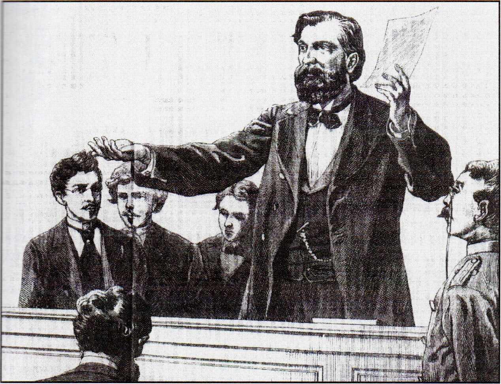

"The increasingly professionalized scholarly history of the nineteenth century was heavily dependent on national governments for support." Popkin, p. 85
{: .quote.compact}

Berlin's university was founded in 1810 as part of a program to promote German national identity (p. 79). Women "remained almost entirely excluded" from the seminars (p. 94).
{: .detail}

Heinrich von Treitschke lecturing in Berlin, 1879 · contemporary engraving, artist unrecorded · public domain
{: .cite}
</section>

<!-- ========== 1.5 HOSTILE RECORDS ========== -->
<section markdown="1">
Part one · 5 / 5 · Thompson and Ginzburg, Weeks 6–7
{: .eyebrow}

## The weavers and the miller reach us through hostile records
{: .main-point}

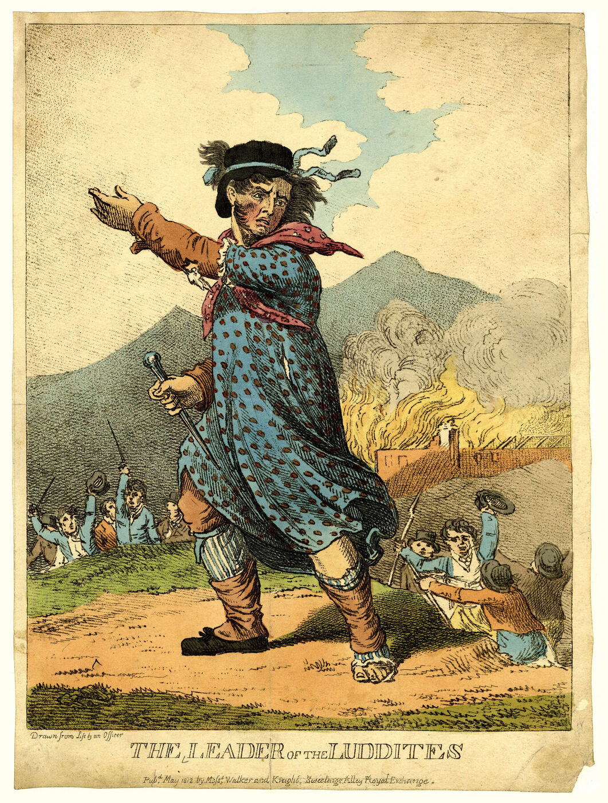

Thompson reads spy reports and trials against the grain. Ginzburg's miller can be heard only because the Inquisition wrote down his answers.
{: .detail}

This print of "General Ludd" says it was "Drawn from Life by an Officer."
{: .detail}

*The Leader of the Luddites*, May 1812 · Working Class Movement Library · public domain
{: .cite}
</section>

<!-- ========== PART ONE · DISCUSSION ========== -->
<section markdown="1">
Part one · discussion
{: .eyebrow}

## Who got the floor
{: .main-point}

---

Carr says the facts speak only when the historian calls on them. Pick a writer from the course and name something they gave the floor to that earlier history had left out.
{: .question .fragment data-fragment-index="1"}

</section>

<!-- ================================================================ -->
<!-- =============== PART TWO · WHAT HISTORY IS FOR ================= -->
<!-- ================================================================ -->

<!-- ========== PART TWO · THE IDEA ========== -->
<section data-transition="fade" markdown="1">
Part two · Weeks 2–4, 7
{: .eyebrow}

## Every writer says what history is for
{: .main-point}

Nearly every writer in the course gives the past a job; Ranke's is to refuse the others. The job decides what is worth telling.
{: .detail .fragment}
</section>

<!-- ========== 2.1 HERODOTUS ========== -->
<section markdown="1">
Part two · 1 / 6 · Herodotus, Week 2
{: .eyebrow}

## Herodotus writes so that great deeds are not forgotten
{: .main-point}

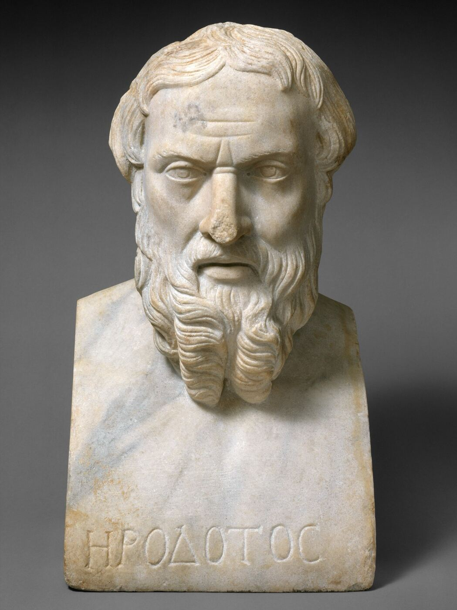

"that the memory of the past may not be blotted out from among men by time, and that great and marvellous deeds … may not lack renown" Herodotus, *Histories* 1.1 (Godley trans.)
{: .quote.compact}

His word for the work, *istoria*, means inquiry (Popkin, p. 28). The face is a reconstruction, carved some six centuries after he died.
{: .detail}

Roman portrait bust of Herodotus, 2nd c. CE · Metropolitan Museum of Art, 91.8 · CC0
{: .cite}
</section>

<!-- ========== 2.2 THUCYDIDES ========== -->
<section markdown="1">
Part two · 2 / 6 · Thucydides, Week 2
{: .eyebrow}

## Readers have taken Thucydides as a warning
{: .main-point}

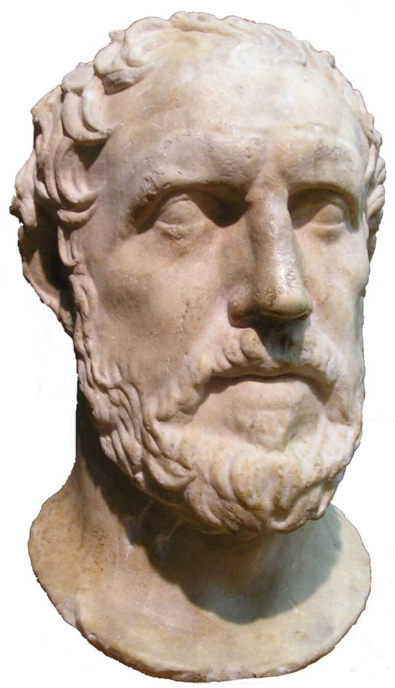

"a warning against the dangers that can befall a society that overestimates its own strength" Popkin, p. 29
{: .quote.compact}

He found the war's real cause in "the growth of the power of Athens, and the alarm which this inspired in Lacedaemon" (1.23).
{: .detail}

Portrait bust of Thucydides, Roman copy of a Greek original · Royal Ontario Museum · public domain
{: .cite}
</section>

<!-- ========== 2.3 LIVY AND BEDE ========== -->
<section markdown="1">
Part two · 3 / 6 · Livy and Bede, Weeks 2–3
{: .eyebrow}

## Livy and Bede give history the same job, centuries apart
{: .main-point}

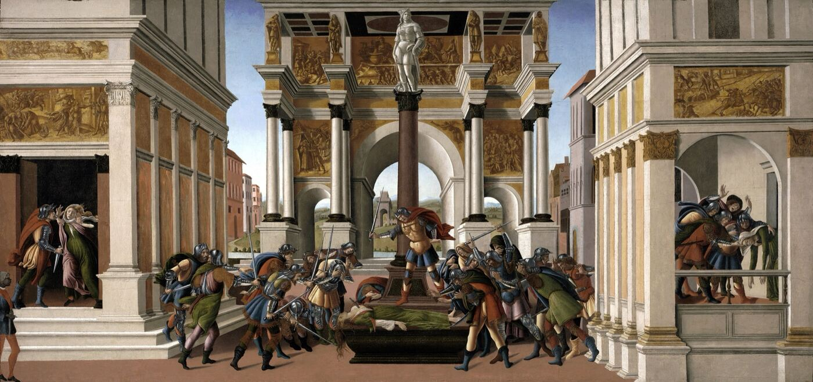

"choose for yourself and for your own state what to imitate" Livy, *Ab Urbe Condita*, Preface (Foster trans.)
{: .quote.compact}

Bede's preface of 731 asks readers to imitate the good and shun the wrong. All he adds is that the good is worthy of the service of God.
{: .detail}

Sandro Botticelli, *The Story of Lucretia*, c. 1500–01: Livy's exemplary death, ending the monarchy · Isabella Stewart Gardner Museum · public domain
{: .cite}
</section>

<!-- ========== 2.4 SIMA QIAN ========== -->
<section markdown="1">
Part two · 4 / 6 · Sima Qian, Week 2
{: .eyebrow}

## Sima Qian wanted a complete record, with his verdict signed
{: .main-point}

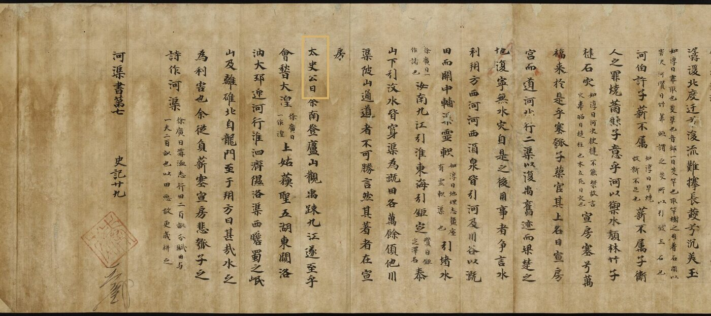

"I have cast a universal net to gather together all the old traditions of the world that were scattered and lost." quoted in Popkin, p. 37
{: .quote.compact}

106 of the 130 chapters close with 太史公曰, "the Grand Historian says," and then his own judgment.
{: .detail}

*Shiji*, Book of Rivers and Canals, Tang dynasty manuscript copy, detail · Tokyo National Museum TB-1573 · CC BY 4.0 · gold box added
{: .cite}
</section>

<!-- ========== 2.5 MACHIAVELLI ========== -->
<section markdown="1">
Part two · 5 / 6 · Machiavelli, Week 3
{: .eyebrow}

## Machiavelli reads Rome for technique, not virtue
{: .main-point}

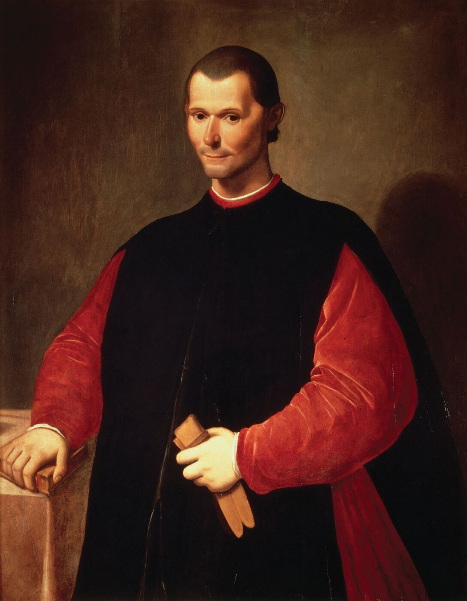

"A wise man ought always to follow the paths beaten by great men, and to imitate those who have been supreme" *The Prince*, ch. 6 (Marriott trans.)
{: .quote.compact}

Livy and Bede say *imitate* too, and mean virtue. Machiavelli means keeping the state. He also wrote a whole book of commentaries on Livy, the *Discourses*.
{: .detail}

Niccolò Machiavelli, by Santi di Tito · Palazzo Vecchio, Florence · public domain
{: .cite}
</section>

<!-- ========== 2.6 ONE RECORD, TWO READERS ========== -->
<section markdown="1">
Part two · 6 / 6 · Ranke and Ginzburg, Weeks 4 and 7
{: .eyebrow}

## Ranke and Ginzburg would read a trial record differently
{: .main-point}

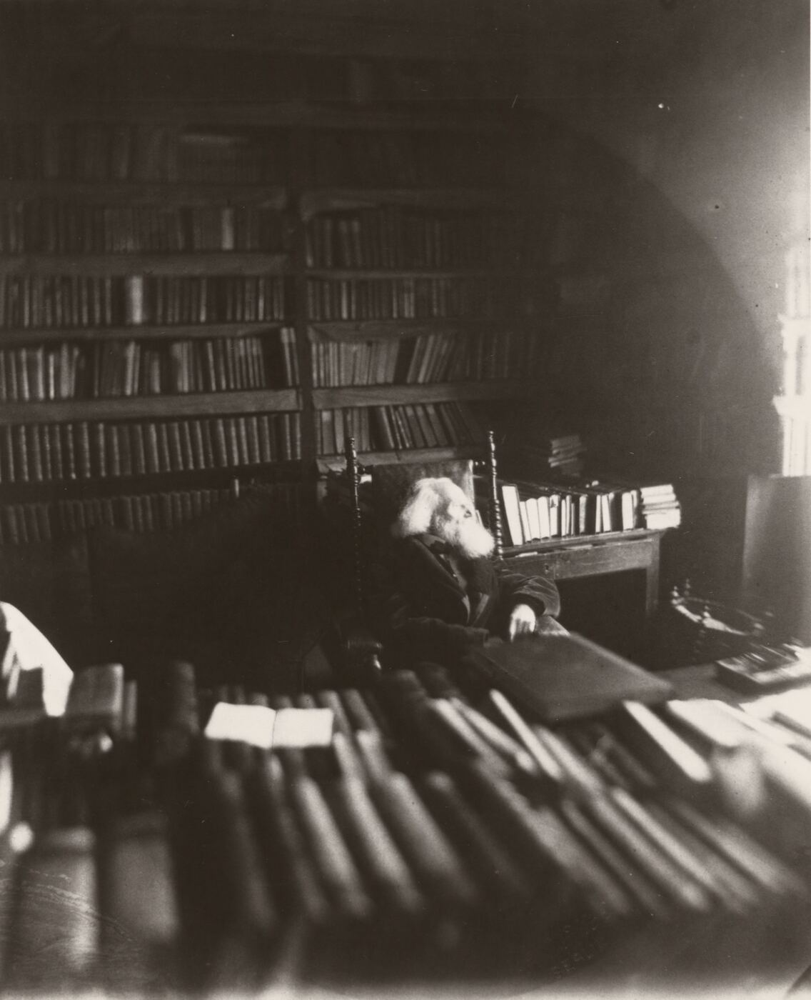

Read as Ranke read his sources, for what officials did and decided, an inquisition record gives a procedure carried out.
{: .detail}

Ginzburg read it for what the miller believed, and got a cosmos.
{: .detail}

Leopold von Ranke in his library, early 1880s · Ranke Papers, Syracuse University · public domain
{: .cite}
</section>

<!-- ========== PART TWO · DISCUSSION ========== -->
<section markdown="1">
Part two · discussion
{: .eyebrow}

## What the past is for
{: .main-point}

---

Pick two writers from the course who want different things from history. What does each want, and why could the same source give them two different histories?
{: .question .fragment data-fragment-index="1"}

</section>

<!-- ================================================================ -->
<!-- =============== PART THREE · THE SHAPE OF THE STORY ============ -->
<!-- ================================================================ -->

<!-- ========== PART THREE · THE IDEA ========== -->
<section data-transition="fade" markdown="1">
Part three · Weeks 2, 3, 5
{: .eyebrow}

## The shape of the story is part of the argument
{: .main-point}

Before any method, each writer chose a form, and the form argues things the facts cannot argue on their own.
{: .detail .fragment}
</section>

<!-- ========== 3.1 CROESUS ========== -->
<section markdown="1">
Part three · 1 / 6 · Herodotus, Week 2
{: .eyebrow}

## Herodotus's Croesus arrives with a parable's shape
{: .main-point}

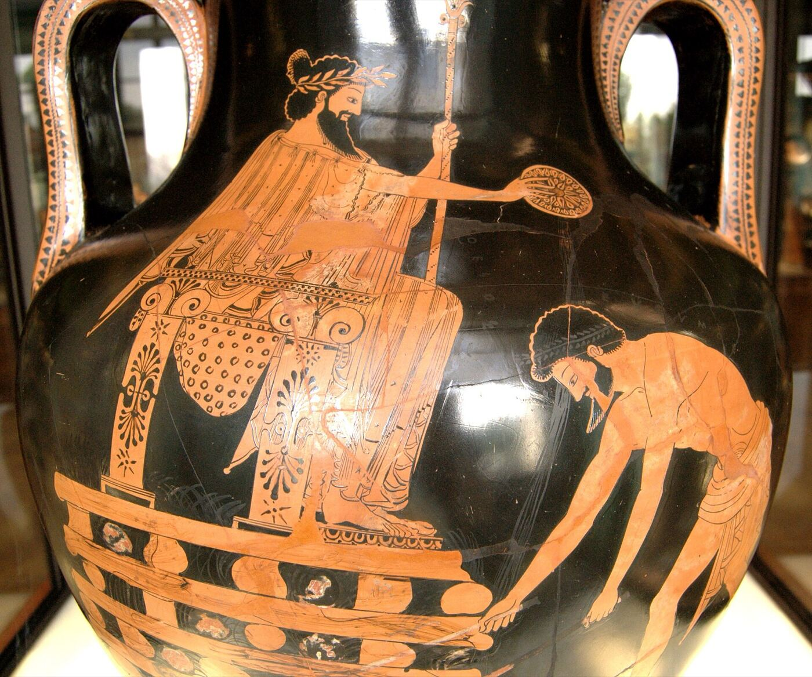

A warning ignored, an ambiguous oracle, pride, reversal, recognition on the pyre.
{: .detail}

The scene was painted about sixty years before Herodotus wrote, so his audience knew the story. The shaping is his, and the moral lives in it.
{: .detail}

Croesus on the pyre, Attic red-figure amphora by Myson, c. 500–490 BCE · Louvre G 197 · photo Bibi Saint-Pol · public domain
{: .cite}
</section>

<!-- ========== 3.2 THUCYDIDES ========== -->
<section markdown="1">
Part three · 2 / 6 · Thucydides, Week 2
{: .eyebrow}

## Thucydides composed the speeches himself
{: .main-point}

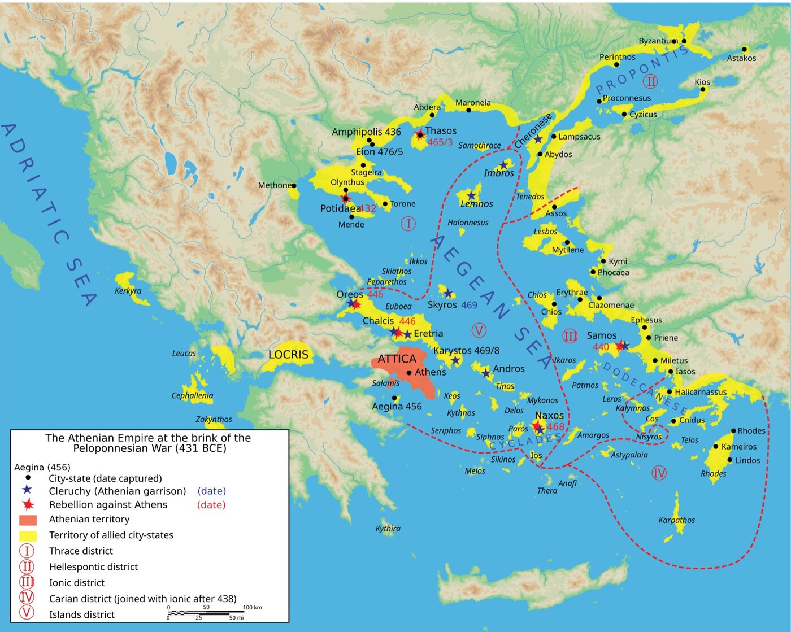

"to make the speakers say what, in my opinion, was called for by each situation" Thucydides 1.22, quoted in Popkin, p. 30
{: .quote.compact}

At Melos "the strong do what they can and the weak suffer what they must" (5.89, Crawley trans.). The dialogue stages justice against power without saying which he backs.
{: .detail}

The Athenian Empire on the eve of the Peloponnesian War, 431 BCE · Marsyas, derivative by Once in a Blue Moon · CC BY-SA 3.0
{: .cite}
</section>

<!-- ========== 3.3 LIVY'S BORROWED STORY ========== -->
<section markdown="1">
Part three · 3 / 6 · Livy, Week 2
{: .eyebrow}

## Livy tells a story Herodotus also tells
{: .main-point}

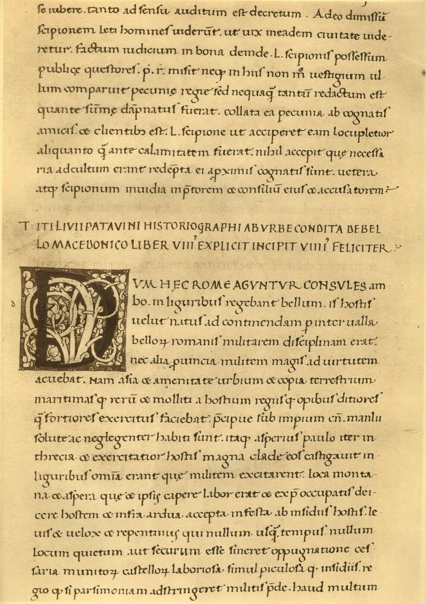

A tyrant answers a messenger by striking off the tallest plants: corn in Herodotus (5.92), poppies in Livy (1.54).
{: .detail}

Aristotle tells it too, so it shows a shared tradition, not that Livy read Herodotus. The story arrives with its claim about tyranny already inside it.
{: .detail}

Livy, *Ab urbe condita*, end of Book 38, copied by Poggio Bracciolini, 1453 · Biblioteca Apostolica Vaticana, Vat. lat. 3331, fol. 156v · public domain
{: .cite}
</section>

<!-- ========== 3.4 SIMA QIAN'S FILING ========== -->
<section markdown="1">
Part three · 4 / 6 · Sima Qian, Week 2
{: .eyebrow}

## Sima Qian makes an argument with his table of contents
{: .main-point}

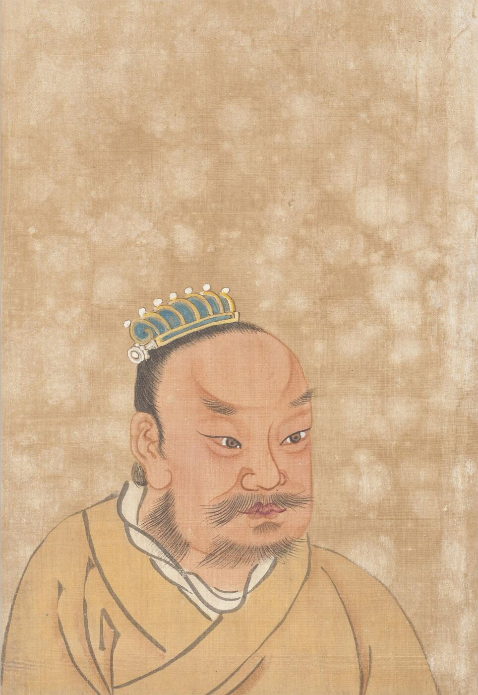

Xiang Yu lost, and never ruled a unified empire. Sima Qian files him in the basic annals, the section for legitimate sovereigns.
{: .detail}

He was still being painted as a king two thousand years later.
{: .detail}

Xiang Wang (Xiang Yu), from *Portraits of Famous Men*, 19th–early 20th c. · Philadelphia Museum of Art · public domain
{: .cite}
</section>

<!-- ========== 3.5 THE EASTER TABLE ========== -->
<section markdown="1">
Part three · 5 / 6 · the annals, Week 3
{: .eyebrow}

## Many medieval annals began in the margins of Easter tables
{: .main-point}

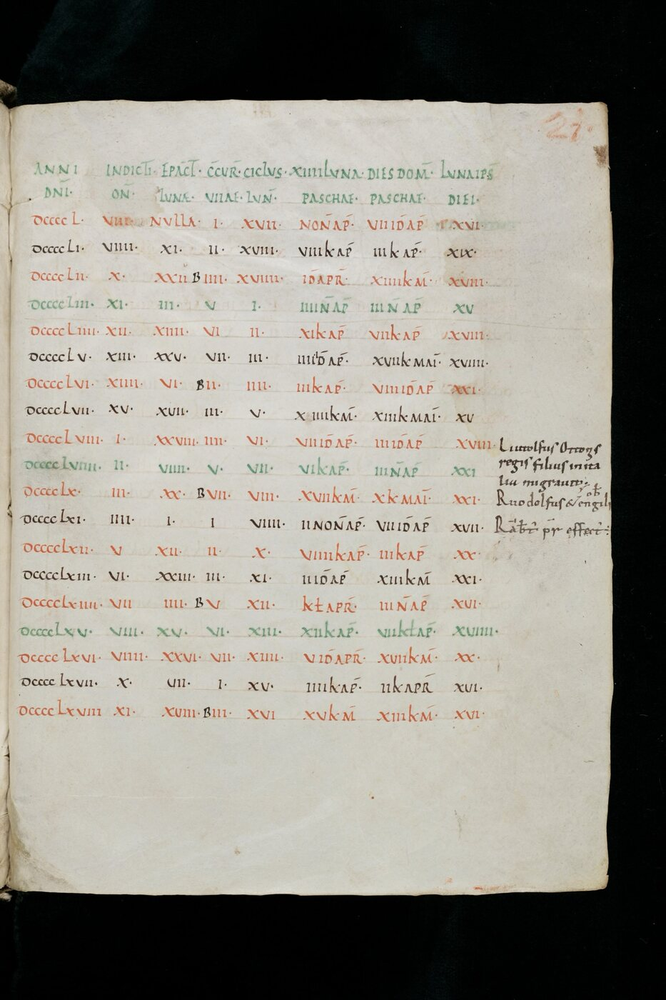

Monasteries ruled a line for every year, decades ahead, to find the date of Easter. Monks jotted events into the blank space beside the numbers.
{: .detail}

So the form gives every year a line, and explains nothing.
{: .detail}

Paschal table for 950–968, with annal entries in the right margin · St. Gallen, Stiftsbibliothek, Cod. Sang. 459, p. 21 · e-codices · CC BY-NC 4.0
{: .cite}
</section>

<!-- ========== 3.6 BRAUDEL ON NARRATIVE ========== -->
<section markdown="1">
Part three · 6 / 6 · Braudel, Week 5
{: .eyebrow}

## For Braudel, telling events in order is already a claim
{: .main-point}

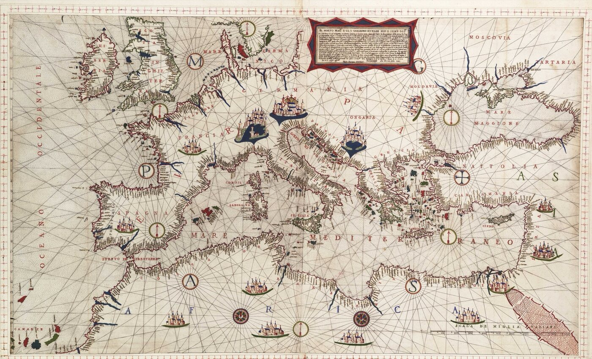

"narrative history is not an objective method, still less the supreme objective method, but is itself a philosophy of history" Braudel, 1949 preface, *On History*, p. 4
{: .quote.compact}

His *Mediterranean* puts events last. A chart like this records the sea as a set of routes, close to what he means by a structure.
{: .detail}

Chart of the Mediterranean and north-east Atlantic, Paolo Forlani after Diogo Homem, Venice, 1569 · National Maritime Museum, Greenwich · public domain · cropped
{: .cite}
</section>

<!-- ========== PART THREE · DISCUSSION ========== -->
<section markdown="1">
Part three · discussion
{: .eyebrow}

## A neutral form
{: .main-point}

---

Is a footnoted, neutral-sounding history a form too? What does it argue by its shape?
{: .question .fragment data-fragment-index="1"}

</section>

<!-- ================================================================ -->
<!-- =============== PART FOUR · STANDARDS OF EVIDENCE ============== -->
<!-- ================================================================ -->

<!-- ========== PART FOUR · THE IDEA ========== -->
<section data-transition="fade" markdown="1">
Part four · Weeks 3–6
{: .eyebrow}

## Each standard of evidence in the course rests on a belief about the world
{: .main-point}

Every period in the course had rules for proof. They differ less in rigour than in what each assumed could happen.
{: .detail .fragment}
</section>

<!-- ========== 4.1 BEDE ========== -->
<section markdown="1">
Part four · 1 / 6 · Bede, Week 3
{: .eyebrow}

## For Bede, miracles are evidence
{: .main-point}

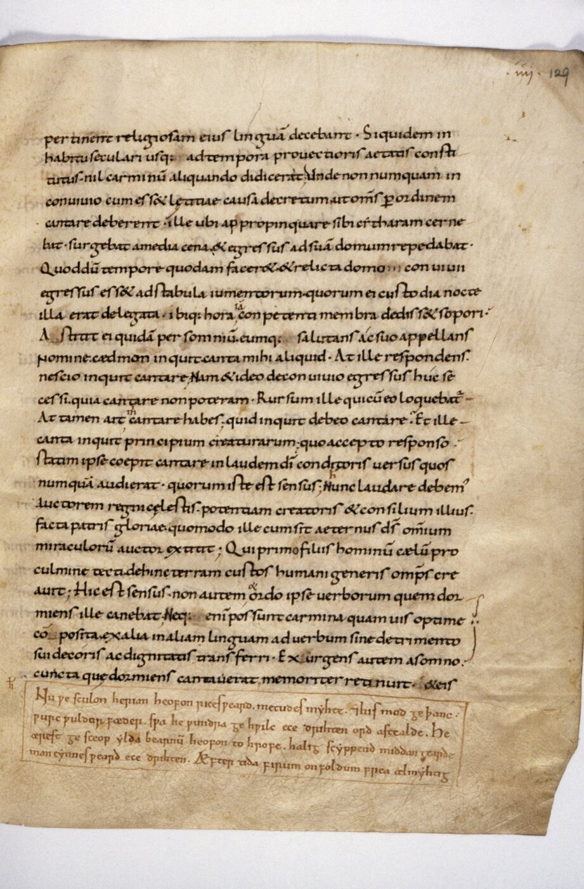

"For it was impossible that the martyr, who had left no water remaining in the river, should desire it on the top of the hill, unless he thought it fitting." Bede, *Ecclesiastical History* I.7
{: .quote.compact}

The cures at Alban's shrine "cease not to this day": evidence anyone could go and check.
{: .detail}

Bede, *Ecclesiastical History* IV.24, where he says his Latin gives "the sense but not the order" of Cædmon's song · Bodleian Libraries, MS Hatton 43, fol. 129r · CC BY-SA 4.0
{: .cite}
</section>

<!-- ========== 4.2 AL-BIRUNI ========== -->
<section markdown="1">
Part four · 2 / 6 · al-Biruni, Week 3
{: .eyebrow}

## Al-Biruni sets out his rules before he begins
{: .main-point}

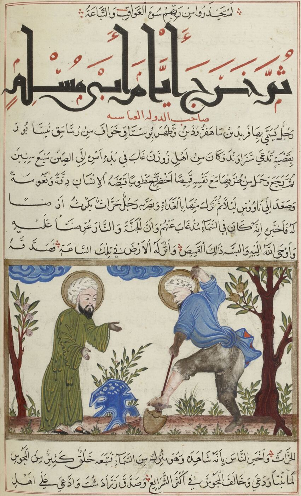

"No one will deny that in questions of historic authenticity hearsay does not equal eyewitness" al-Biruni, *Kitab al-Hind*, preface (Sachau trans.)
{: .quote.compact}

He names five kinds of liar and chases a report back to "the originator of the story." Reports breaking natural law are ruled out before he asks who told them.
{: .detail}

al-Biruni, *al-Āthār al-bāqiya*, fol. 230, the prophet Bihāfrīd, a later illustrated copy · Bibliothèque nationale de France · public domain
{: .cite}
</section>

<!-- ========== 4.3 VALLA ========== -->
<section markdown="1">
Part four · 3 / 6 · Valla, Week 3
{: .eyebrow}

## Valla proved a forgery from its Latin
{: .main-point}

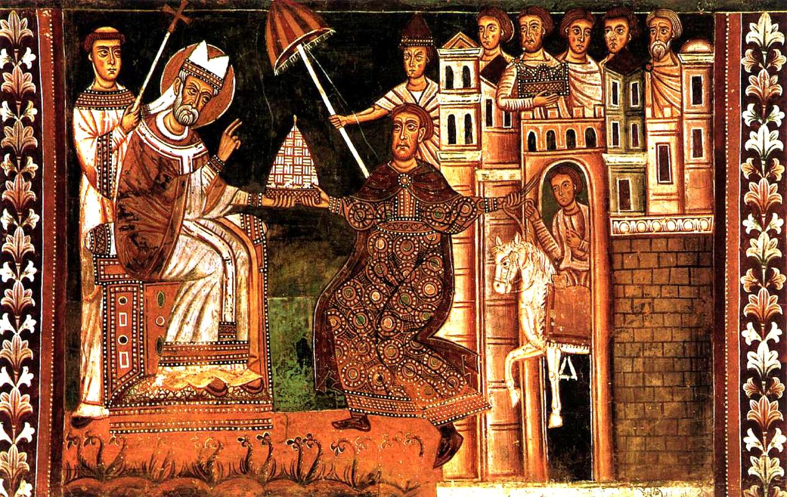

In 1440 he showed that the Donation of Constantine used words that did not exist when it was supposedly written.
{: .detail}

He wrote for a king at war with the pope. The result holds anyway.
{: .detail}

The Donation of Constantine, Italian fresco, 13th c., unknown master · Web Gallery of Art · public domain
{: .cite}
</section>

<!-- ========== 4.4 RANKE'S FOOTNOTE ========== -->
<section markdown="1">
Part four · 4 / 6 · Ranke, Week 4
{: .eyebrow}

## Ranke names his sources on every page
{: .main-point}

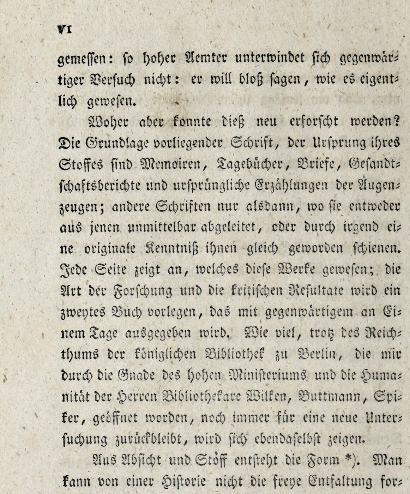

"These sources will be noted on every page." Ranke, 1824 introduction
{: .quote.compact}

In his seminar, students attacked one another's citations. The method catches a misread document, and rarely an assumption the whole room shares.
{: .detail}

Ranke, *Geschichten der romanischen und germanischen Völker* (1824), preface, p. VI · Internet Archive · public domain · cropped
{: .cite}
</section>

<!-- ========== 4.5 THE ANNALES ========== -->
<section markdown="1">
Part four · 5 / 6 · Bloch and Braudel, Week 5
{: .eyebrow}

## The *Annales* used evidence that is nobody's testimony
{: .main-point}

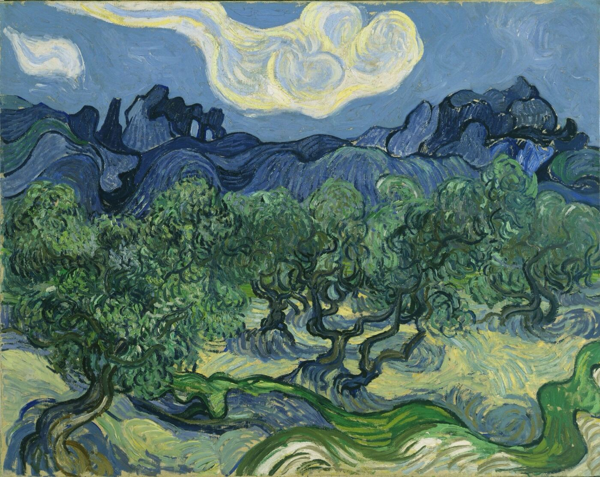

Price series, harvest records, field patterns. Bloch on the long, narrow strips of northern French fields:
{: .detail}

"this pattern dates back to origins so distant that no scholar has yet succeeded in accounting for it satisfactorily. The settlers in the era of the dolmens have more to do with it than the lawyers of the First Empire." *The Historian's Craft*, p. 40
{: .quote.compact}

Vincent van Gogh, *The Olive Trees*, Saint-Rémy, 1889: terraced land in Provence · Museum of Modern Art, New York · public domain
{: .cite}
</section>

<!-- ========== 4.6 VANSINA ========== -->
<section markdown="1">
Part four · 6 / 6 · Vansina, Week 6
{: .eyebrow}

## Vansina treats oral tradition as a chain of documents
{: .main-point}

"A tradition should be seen as a series of successive historical documents all lost except for the last one and usually interpreted by every link in the chain of transmission." Vansina, *Oral Tradition as History*, p. 29
{: .quote.compact}

Islamic scholars had judged hadith by their chains of transmission for centuries (p. 30). Vansina keeps Ranke's rule, a link back to an observer, and drops the need for writing.
{: .detail}
</section>

<!-- ========== PART FOUR · DISCUSSION ========== -->
<section markdown="1">
Part four · discussion
{: .eyebrow}

## What the method misses
{: .main-point}

---

Ranke says his book will "only" show what actually happened. Name one judgment that gets into his history anyway.
{: .question .fragment data-fragment-index="1"}

</section>

<!-- ================================================================ -->
<!-- =============== PART FIVE · WHAT MOVES HISTORY ================= -->
<!-- ================================================================ -->

<!-- ========== PART FIVE · THE IDEA ========== -->
<section data-transition="fade" markdown="1">
Part five · Weeks 3–7
{: .eyebrow}

## Each answer to what moves history comes with a scale
{: .main-point}

The writers disagree about what causes change, and each answer brings a scale that decides what it can see.
{: .detail .fragment}
</section>

<!-- ========== 5.1 GOD ========== -->
<section markdown="1">
Part five · 1 / 8 · Bede and Machiavelli, Week 3
{: .eyebrow}

## Bede explains by God; Machiavelli by technique
{: .main-point}

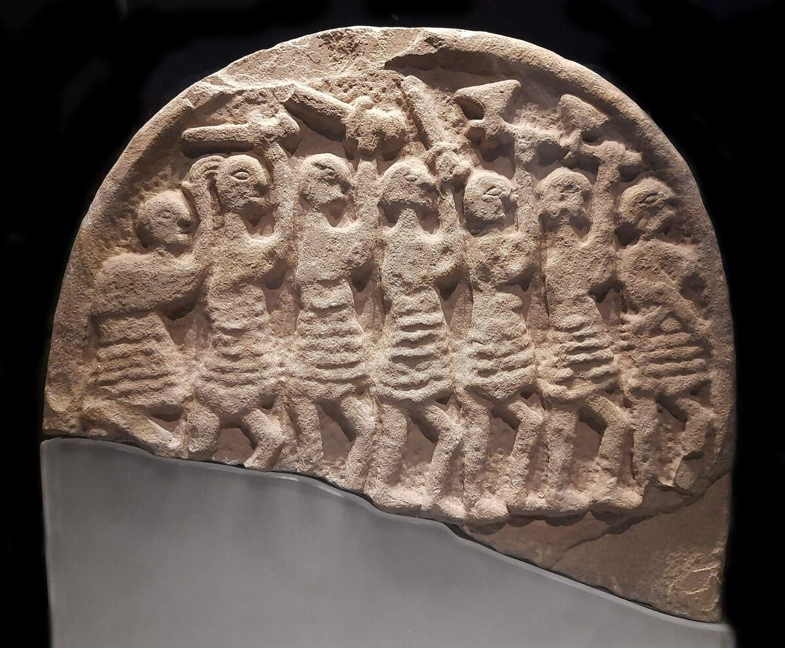

Bede reads English history as Christianity's arrival.
{: .detail}

Machiavelli puts Moses in a list with Cyrus, Romulus and Theseus, and judges all four by the same criteria.
{: .detail}

Grave marker, Lindisfarne, early 9th c.: armed men on this face, a Last Judgement on the other, so it may show raiders or the end of the world · English Heritage · photo Schillerwein, CC0
{: .cite}
</section>

<!-- ========== 5.2 KANT ========== -->
<section markdown="1">
Part five · 2 / 8 · Kant, Week 4
{: .eyebrow}

## Kant gives the whole species a plan, run on vanity rather than virtue
{: .main-point}

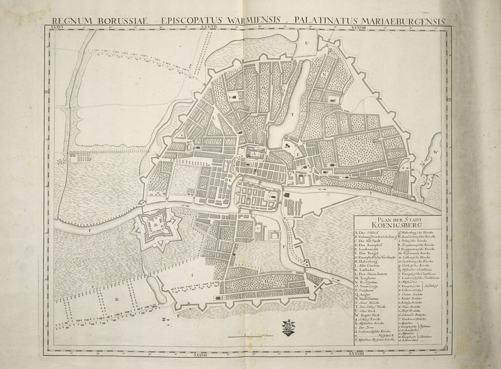

"from such crooked wood as man is made of, nothing perfectly straight can be built" Kant, Sixth Thesis (Beck trans.)
{: .quote.compact}

Nature's plan works through "unsocial sociability" (Fourth Thesis). He argued it from Königsberg, the town on this plan, which he barely left.
{: .detail}

"Plan der Stadt Koenigsberg," 1763 · Leibniz-Institut für Länderkunde, Leipzig · CC0
{: .cite}
</section>

<!-- ========== 5.3 DECISIONS ========== -->
<section markdown="1">
Part five · 3 / 8 · Ranke and Maza, Weeks 4 and 6
{: .eyebrow}

## Ranke's documents record decisions, and some history does turn on one
{: .main-point}

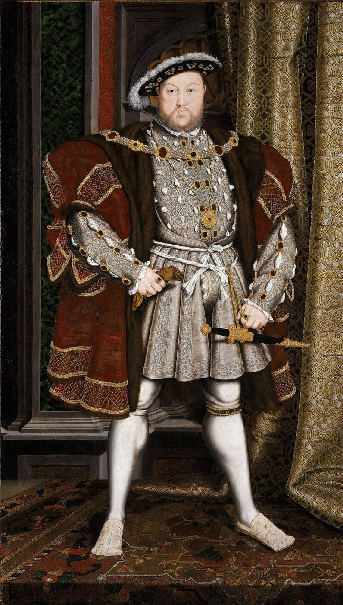

Ranke's sources are memoirs, letters and ambassadors' reports: what participants saw and chose.
{: .detail}

Maza's case where great-man history fits: Henry VIII's divorce broke the English church from Rome (p. 11).
{: .detail}

Henry VIII, after Hans Holbein the Younger · Google Art Project · public domain
{: .cite}
</section>

<!-- ========== 5.4 MARX ========== -->
<section markdown="1">
Part five · 4 / 8 · Marx, Week 5
{: .eyebrow}

## For Marx, how people produce drives history
{: .main-point}

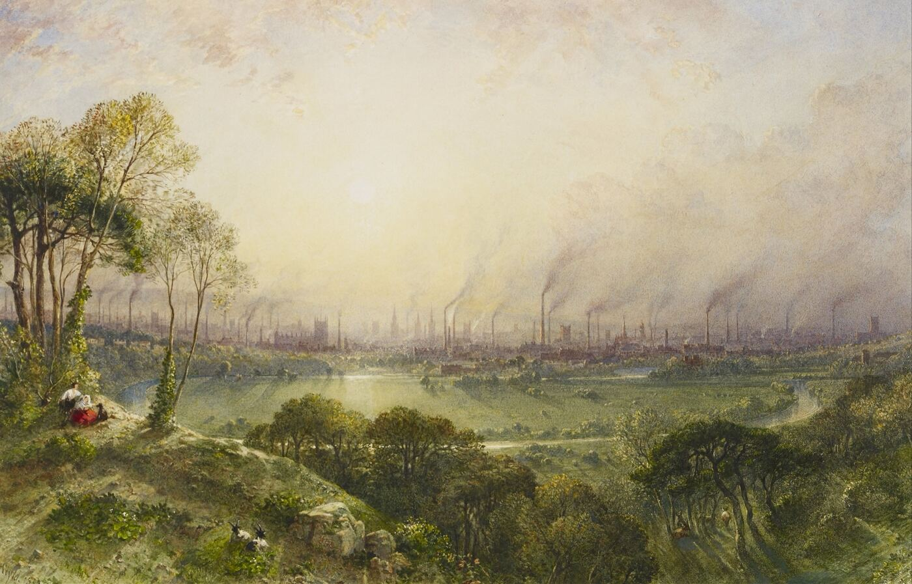

"Men make their own history, but they do not make it just as they please" *The Eighteenth Brumaire*, quoted in Green and Troup, p. 36
{: .quote.compact}

The *Manifesto* called capitalism's fall "equally inevitable." Green and Troup see a paradox: change still depends on "the consciousness and actions of men and women" (p. 36).
{: .detail}

William Wyld, *Manchester from Kersal Moor*, 1852 · Royal Collection · public domain
{: .cite}
</section>

<!-- ========== 5.5 BRAUDEL ========== -->
<section markdown="1">
Part five · 5 / 8 · Braudel, Week 5
{: .eyebrow}

## For Braudel, structures are prisons and events are a surface
{: .main-point}

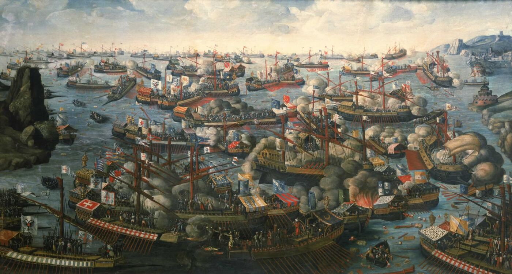

"a surface disturbance, the waves stirred up by the powerful movement of tides" 1949 preface, *On History*, p. 3
{: .quote.compact}

Lepanto killed tens of thousands in an afternoon in 1571. The Ottomans rebuilt their fleet, and Venice made its peace in 1573.
{: .detail}

The Battle of Lepanto, 7 October 1571 · unknown painter, late 16th c. · National Maritime Museum, Greenwich · public domain
{: .cite}
</section>

<!-- ========== 5.6 THOMPSON ========== -->
<section markdown="1">
Part five · 6 / 8 · Thompson, Week 6
{: .eyebrow}

## For Thompson, the working class made itself
{: .main-point}

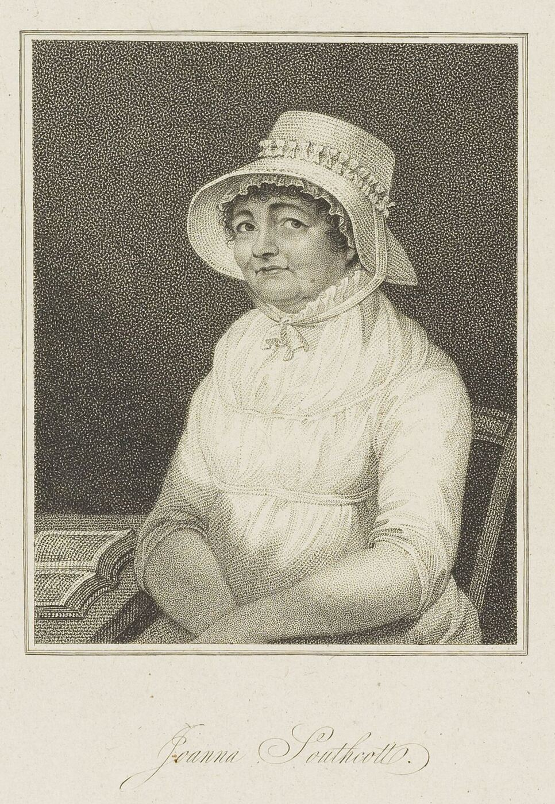

"The working class did not rise like the sun at an appointed time. It was present at its own making." Thompson, p. 9
{: .quote.compact}

He keeps the people history wrote off, down to "the deluded follower of Joanna Southcott" (p. 12), a prophetess with thousands of followers.
{: .detail}

Joanna Southcott, stipple engraving published by John Bell, 2 October 1814 · KU Leuven print collection · public domain · cropped
{: .cite}
</section>

<!-- ========== 5.7 SCOTT ========== -->
<section markdown="1">
Part five · 7 / 8 · Scott, Week 6
{: .eyebrow}

## Scott adds an axis: gender is at work where no women are
{: .main-point}

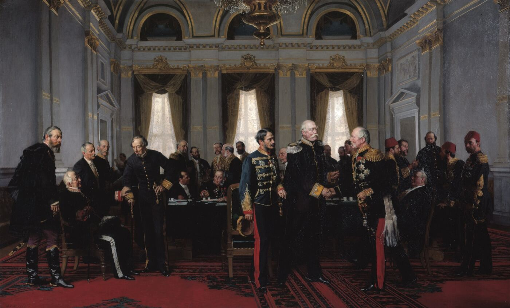

"High politics itself is a gendered concept, for it establishes its crucial importance and public power … precisely in its exclusion of women from its work." Scott, p. 1073
{: .quote.compact}

Anton von Werner, *Der Kongreß zu Berlin*, closing session, 13 July 1878; painted 1892 · Deutsches Historisches Museum · public domain
{: .cite}
</section>

<!-- ========== 5.8 THE SCALE TRADE-OFF ========== -->
<section markdown="1">
Part five · 8 / 8 · Braudel and Ginzburg, Weeks 5 and 7
{: .eyebrow}

## You cannot zoom in and out at the same time
{: .main-point}

###### Zoom out · Braudel
{: .num}

#### Four centuries of a sea

Gets: why conventions last, what no one could change. Loses: the afternoon, the decision, the name.

###### Zoom in · Ginzburg
{: .num}

#### One miller's trial

Gets: a mind in full, in his own words. Loses: any claim about how many others thought it.

**Zoom out and you can explain everything and decide nothing. Zoom in and you can decide everything and explain almost nothing.**

</section>

<!-- ========== PART FIVE · DISCUSSION ========== -->
<section markdown="1">
Part five · discussion
{: .eyebrow}

## Choosing a scale
{: .main-point}

---

Does the scale a historian works at follow from what they think history is for, or the other way round?
{: .question .fragment data-fragment-index="1"}

</section>

<!-- ================================================================ -->
<!-- =============== PART SIX · PROGRESS AS AN IDEA ================= -->
<!-- ================================================================ -->

<!-- ========== PART SIX · THE IDEA ========== -->
<section data-transition="fade" markdown="1">
Part six · Weeks 2–4
{: .eyebrow}

## Progress was an idea with its own history
{: .main-point}

The belief that history improves was argued for in the eighteenth century and contested at once. Histories of history long told the same story about themselves.
{: .detail .fragment}
</section>

<!-- ========== 6.1 VOLTAIRE ========== -->
<section markdown="1">
Part six · 1 / 6 · Voltaire, Week 4
{: .eyebrow}

## Voltaire ranks the ages of history by taste
{: .main-point}

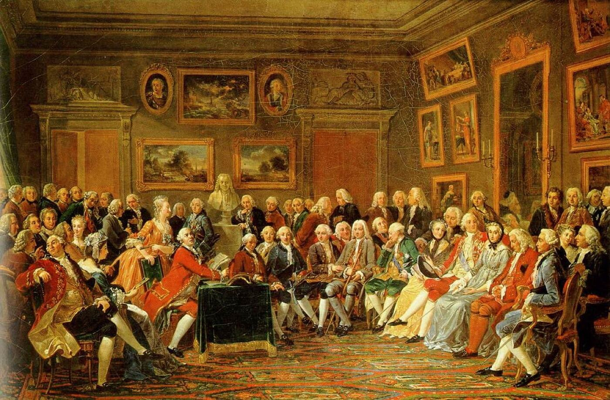

"Whosoever thinks, or, what is still more rare, whosoever has taste, will find but four ages in the history of the world." *Age of Louis XIV*, p. 5
{: .quote.compact}

The fourth, Louis XIV's, ended when he was twenty: "Europe is indebted for its politeness and spirit of society to the court of Louis XIV" (pp. 7–8).
{: .detail}

A reading of Voltaire's *L'Orphelin de la Chine* in Madame Geoffrin's salon, Paris, 1755 · Lemonnier, painted 1812, Château de Malmaison · public domain
{: .cite}
</section>

<!-- ========== 6.2 CONDORCET AND FERGUSON ========== -->
<section markdown="1">
Part six · 2 / 6 · Condorcet and Ferguson, Week 4
{: .eyebrow}

## Condorcet saw no limit to progress; Ferguson gave it stages
{: .main-point}

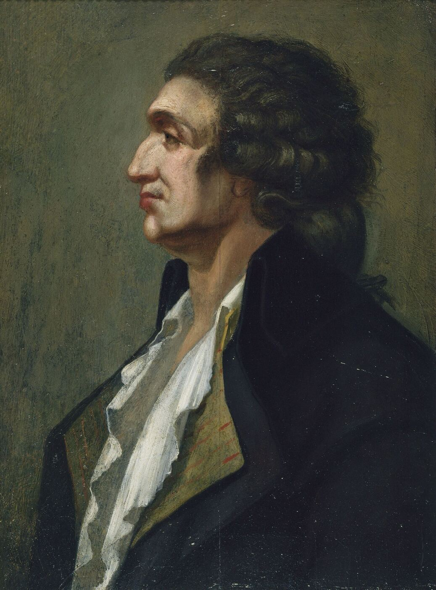

"nature has set no term to the perfection of human faculties" Condorcet, 1794, quoted in Popkin, p. 67
{: .quote.compact}

He wrote it in hiding during the Revolution and died in a cell in 1794. Ferguson's stages, from herding to trade and manufacturing, put any society on a rung.
{: .detail}

Condorcet, anonymous profile portrait · Musée Carnavalet, P1668 · public domain
{: .cite}
</section>

<!-- ========== 6.3 HERDER ========== -->
<section markdown="1">
Part six · 3 / 6 · Herder, Week 4
{: .eyebrow}

## Herder, Kant's former student, refused the single standard
{: .main-point}

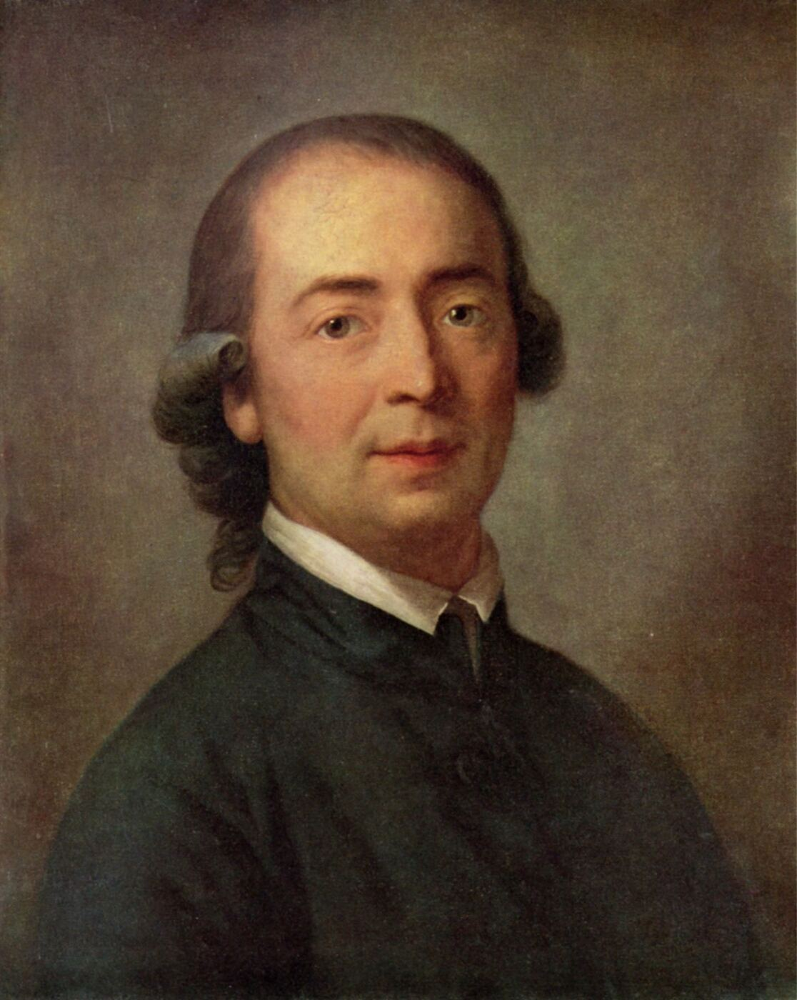

"[Herder] objected to the idea of measuring the distinctive cultures of different nations according to a universal standard of civilization derived from the experience of Western Europe." Popkin, p. 68
{: .quote.compact}

By making the language-defined nation the unit of society, Herder "anticipated the strongly nationalist character of most European history-writing in the nineteenth century" (Popkin, p. 68).
{: .detail}

Johann Gottfried Herder, by Anton Graff, 1785 · public domain
{: .cite}
</section>

<!-- ========== 6.4 RANKE, 1854 ========== -->
<section markdown="1">
Part six · 4 / 6 · Ranke, Week 4
{: .eyebrow}

## Ranke refused the ladder, and still ranked peoples
{: .main-point}

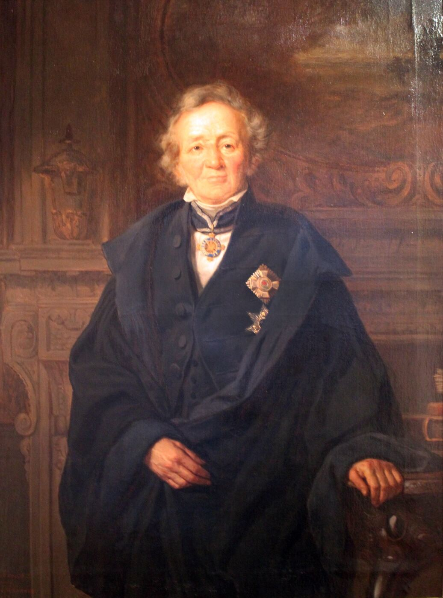

"every epoch is immediate to God, and … its value consists, not in what follows it, but in its own existence" Ranke, 1854 lectures
{: .quote.compact}

Treating earlier generations as "only porters for the following generations" was "a divine injustice." The same lecture calls Asia's history "retrogressive."
{: .detail}

Leopold von Ranke, by Adolf Jebens, 1875 · public domain
{: .cite}
</section>

<!-- ========== 6.5 ACTON ========== -->
<section markdown="1">
Part six · 5 / 6 · Acton, Week 3
{: .eyebrow}

## In 1895 Acton wrote the medieval historians off
{: .main-point}

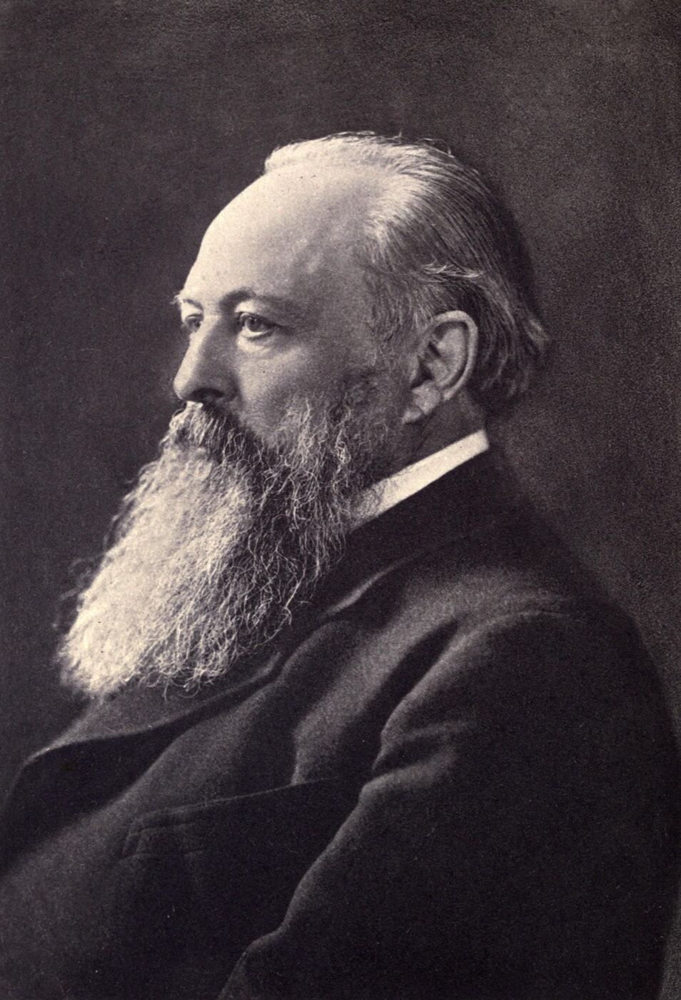

"careless and impatient of older fact. They became content to be deceived, to live in a twilight of fiction." Acton, 1895, quoted in Popkin, pp. 40–41, who notes he allowed them "good writers of contemporary narrative"
{: .quote.compact}

Later scholars, Popkin says, saw a different purpose rather than a failure: to present "truths that would convince their readers of appropriate moral and religious lessons" (p. 41).
{: .detail}

John Dalberg-Acton, 1st Baron Acton · Allen & Co., before 1902 · public domain
{: .cite}
</section>

<!-- ========== 6.6 POPKIN ========== -->
<section markdown="1">
Part six · 6 / 6 · Popkin, Week 2
{: .eyebrow}

## The history of history used to be told as progress
{: .main-point}

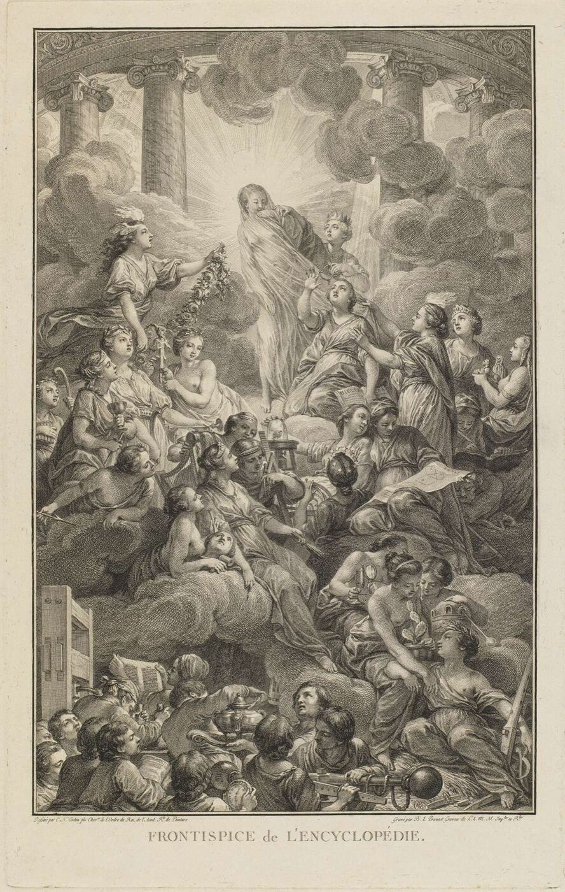

"For much of the twentieth century, for example, the history of history was written as a story of progress" Popkin, p. 26
{: .quote.compact}

His correction: "there have always been multiple perspectives from which the past can be viewed" (p. 27).
{: .detail}

Frontispiece to the *Encyclopédie*: Truth unveiled by Reason and Philosophy · Cochin (design, 1764), Prévost (engraving, 1772) · public domain
{: .cite}
</section>

<!-- ========== PART SIX · DISCUSSION ========== -->
<section markdown="1">
Part six · discussion
{: .eyebrow}

## Progress or accumulation
{: .main-point}

---

Each turn on the syllabus fixed something. What did each one give up, and do the trades add up to progress?
{: .question .fragment data-fragment-index="1"}

</section>

<!-- ================================================================ -->
<!-- =============== TAKE HOME AND CLOSING =========================== -->
<!-- ================================================================ -->

<!-- ========== TAKE HOME ========== -->
<section data-transition="fade" markdown="1">
The take home
{: .eyebrow}

## You cannot measure progress until you say what history is for
{: .main-point}

###### On progress
{: .label}

Tests of sources were sharpened and spread (Valla's anachronism, Ranke's footnote) and the range of evidence widened: oral tradition, the losers, gender. Carr's caution holds: "an infinity of meanings, none any more right than any other" amounts to no meaning at all (p. 26).

###### On purpose
{: .label}

The choice of purpose shapes much of a history before the research begins. A defensible one can probably be stated openly, checked by someone who disagrees, and honest about its blind spots.

</section>

<!-- ========== CLOSING ========== -->
<section data-transition="fade" markdown="1">
Next · Week 9, after the break
{: .eyebrow}

## Many national traditions were invented, and recently
{: .main-point}

Nations feel ancient. Hobsbawm argues that many of their traditions were invented, often deliberately; Anderson calls nations imagined, not faked. Compare Kant's plan nobody alive could see, in Week 4.1.
{: .detail}
</section>
