<!-- ========== TITLE ========== -->
<section data-transition="fade" markdown="1">
Making History • HIST 1105 • Week 3
{: .eyebrow}

# Divine Power and Statecraft
{: .main-point}

- Popkin, ch. 2 (40--47) and ch. 3
- The *Anglo-Saxon Chronicle*
- Bede, *Ecclesiastical History*
- al-Biruni, *Kitab al-Hind*
- Machiavelli, *The Prince*
{: .source-list}

Popkin cited by page; the primary sources by book and chapter.
{: .detail style="margin-top:0.8em; font-size:0.5em;"}
</section>

<!-- ========== THE CLAIM FOR TODAY ========== -->
<section data-transition="fade" markdown="1">
The claim for today
{: .eyebrow}

## Four more answers to an old question: *what makes history trustworthy?*
{: .main-point}

###### The trap to avoid
{: .label}

It is very easy to read today's medieval sources as *bad* history --- credulous, disorganized, superstitious. Don't. Each of these writers has a rule about what counts as proof, and **each rule is defensible on its own terms**.

###### How today is organized
{: .label}

Three medieval answers first: a chronicle that *only* records, a monk for whom miracles are evidence, a Muslim scholar who screens his sources before he starts. Then the 1450s, when a forged document is exposed as fake, and Machiavelli uses the past as a source of practical lessons.

</section>

<!-- ================================================================ -->
<!-- =============== PART ONE: POPKIN ON THE MIDDLE AGES ============ -->
<!-- ================================================================ -->

<section data-transition="fade" markdown="1">
Part one · 3.1
{: .eyebrow}

## Popkin, ch. 2 --- the conditions medieval historians worked in
{: .main-point}

Rome falls in the west. Knowledge of Greek disappears. Almost the only people still literate are clergy --- "their ranks would provide almost all of the authors of history for the next several centuries" (p. 41). Literacy now lives where the books are, and the books are in monasteries --- Bede's monastery at Jarrow was filled with volumes hauled back from Rome.
{: .detail}
</section>

<!-- ========== IMAGE: CODEX AMIATINUS EZRA ========== -->
<section class="image-slide" data-background="#0d1412" markdown="1">
<figure class="portrait">
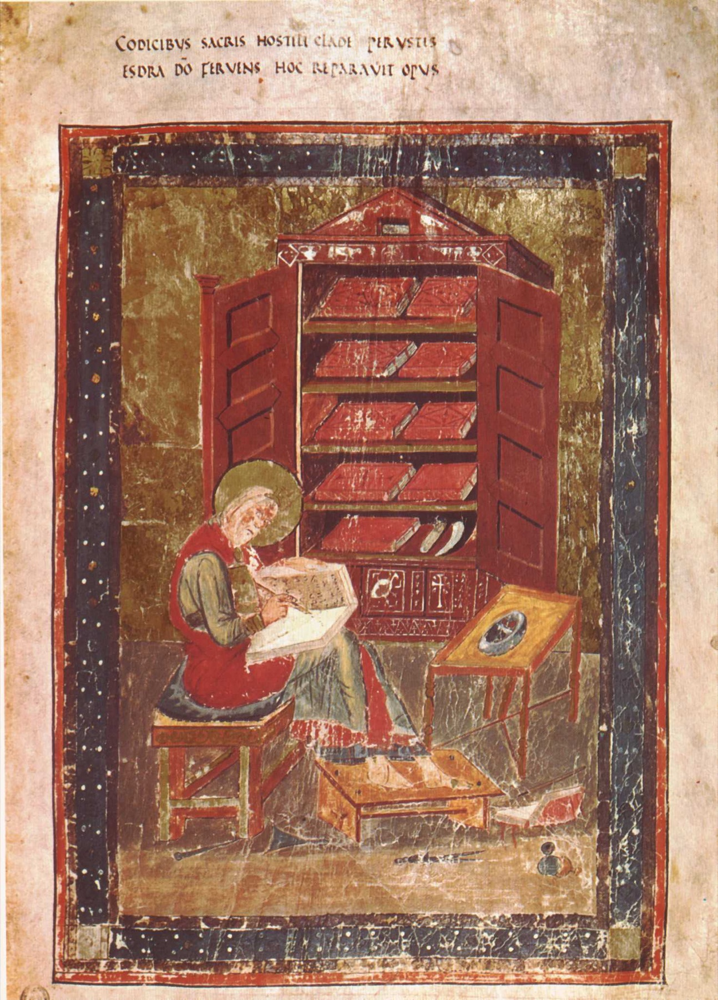
<figcaption markdown="span">
What "a historian" materially <i>was</i> · Codex Amiatinus, c. 700--716
<em>Painted at <strong>Wearmouth--Jarrow</strong> --- Bede's own monastery, in his own lifetime. A monk, a pen, and the whole library behind him: <strong>nine books in a cupboard</strong>. The couplet reads <i>"When the sacred books had been consumed in the fires of war, Ezra, burning for God, repaired this work."</i> Restoring what destruction ate --- that is the job of the historian. (Biblioteca Medicea Laurenziana, MS Amiatino 1, fol. 5r. Public domain.)</em>
</figcaption>
</figure>
</section>

<!-- ========== POPKIN 2: ANNALS AND CHRONICLES ========== -->
<section markdown="1">
Popkin 02 · The characteristic medieval form
{: .eyebrow}

## Events in a row, with nothing connecting them
{: .main-point}

"William Raleigh was elected Bishop of Norwich on 10th April. That horrible race of men known as the Tartars... laid waste Hungary and the neighboring territories. On 18th June Eleanor, queen of England, gave birth to her eldest son Edward." a typical chronicle entry for 1239, quoted in Popkin, p. 43
{: .quote.fragment data-fragment-index="0"}

###### What is missing, and on purpose
{: .label}

Annals record events "in the sequence in which they happened, **without any attempt to connect them to each other**" (pp. 42--43). No causes, no argument, no narrative arc. Popkin: they "made no attempt to explain the causes of the events they described, *leaving it to readers to make sense of them*" (p. 43).

###### Two things that follow
{: .label}

These were compiled by the monks of particular monasteries, often over centuries, so they have **many different authors, with no single point of view**. And they are not neutral: "chronicles kept in a particular monastery often reflected the influence of local rulers who protected the institution" (p. 43). 

###### Where the form comes from
{: .label}

Annals were not invented as history. Monasteries had to know when Easter fell, so they ruled out **paschal tables** --- one line per year, decades in advance, with blank space beside each number. Monks began jotting events into that space. **The genre is a byproduct of calendar arithmetic**, which is why it has a line for every year whether or not anything happened in it, and why nothing in it explains anything. The blank margin came first; the history was written into it.

###### Take home
{: .label}

History even with no argument is still making one --- about what deserves a line at all.

</section>

<!-- ========== IMAGE: PASCHAL TABLE ========== -->
<section class="image-slide" data-background="#0d1412" markdown="1">
<figure class="portrait">
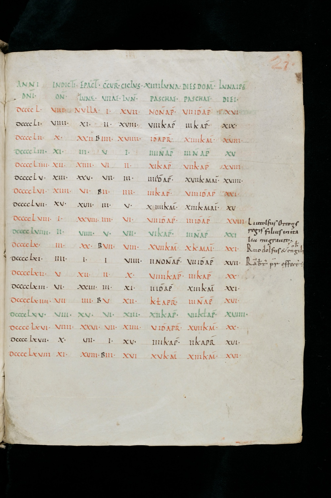
<figcaption markdown="span">
A paschal table · St. Gallen, the years 950--968
<em>Eight columns of arithmetic for finding Easter --- <strong>One ruled line per year, drawn decades before those years arrived.</strong> Most lines stay pure arithmetic. A few have something written out into the empty right-hand margin. <strong>That is where historical writing began.</strong> (St. Gallen, Stiftsbibliothek, Cod. Sang. 459, p. 21. e-codices, CC BY-NC 4.0.)</em>
</figcaption>
</figure>
</section>

<!-- ========== IMAGE: PASCHAL TABLE, DETAIL ========== -->
<section class="image-slide" data-background="#0d1412" markdown="1">
<figure class="landscape">
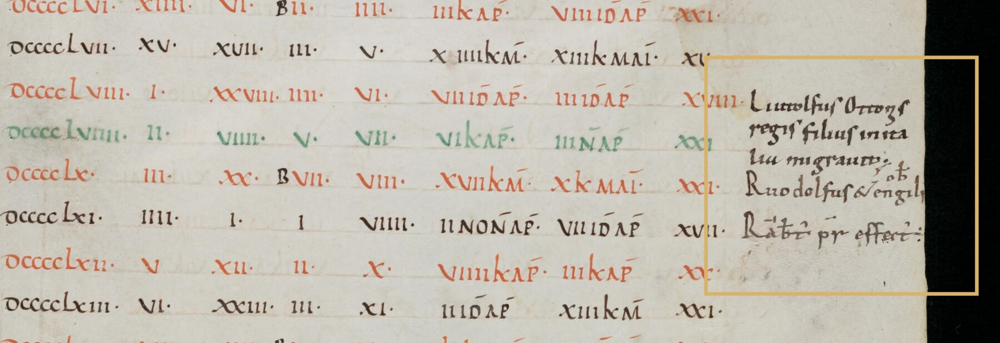
<figcaption markdown="span">
The margin, enlarged · an annal being born
<em>Against the row for <strong>DCCCCLVIII</strong>: <i>Liutolfus Ottonis regis filius in Italia migravit</i> --- Otto the Great's son Liudolf died in Italy --- then two more obits. <strong>Liudolf actually died in September 957</strong>, one row up. All that ruled precision, and the annalist is still a year out. (Cod. Sang. 459, p. 21. e-codices, CC BY-NC 4.0.)</em>
</figcaption>
</figure>
</section>

<!-- ================================================================ -->
<!-- =============== PART TWO: THREE MEDIEVAL ANSWERS =============== -->
<!-- ================================================================ -->

<!-- ========== ASC 1: THE YEAR 793 ========== -->
<section markdown="1">
Part two · *Anglo-Saxon Chronicle* 01 · the year 793
{: .eyebrow}

## Dragons, a famine, a massacre, and a man named Siga
{: .main-point}

"This year dire forwarnings came over the land of the North-humbrians... excessive whirlwinds, and lightnings; and **fiery dragons were seen flying in the air**. A great famine soon followed these tokens; and a little after that, in the same year, **on the 6th before the Ides of January**, the ravaging of heathen men lamentably destroyed God's church at Lindisfarne through rapine and slaughter. And Siga died on the 8th before the Kalends of March." *Anglo-Saxon Chronicle*, annal for 793 (Giles trans.) --- northern recension, MSS D and E; absent from A, B, C
{: .quote.compact.fragment data-fragment-index="0"}

###### Look at the sequence, not the dragons
{: .label}

Everything is joined by *and*. Portents, famine, the sack of Lindisfarne, and one man's death sit on the same flat list, at the same rank. **The chronicle never says the dragons caused anything** --- but it puts them first, and calls them "forwarnings." Then look at the date it gives the raid: *January* --- before the famine that "soon followed" the portents. **The order isn't chronology.** The order is the argument --- it is the only tool this form allows for making one.

###### And the "heathen men"
{: .label}

This is the Lindisfarne raid --- conventionally the start of the Viking age, and the most consequential event in the entry. It gets one clause, barely more than Siga's death. *The scale of an event and the space it gets are unrelated here.* (Historians read the chronicle's January as a slip for 8 June 793 --- the form cannot flag its own errors either.)

###### What was actually lost, and who said so
{: .label}

Lindisfarne held Cuthbert's shrine and had made the Lindisfarne Gospels around 700: **the holiest place in Northumbria**, and undefended. Alcuin, a Northumbrian at Charlemagne's court, wrote that *"never before has such terror appeared in Britain... nor was it thought that such an inroad from the sea could be made"* --- and blamed **the sins of the king**. The chronicle blamed dragons. **Nobody blamed the ships.**

###### Take home
{: .label}

"No interpretation" is a style, not an absence. Sequence is an argument.

</section>

<!-- ========== IMAGE: LINDISFARNE DOOMSDAY STONE ========== -->
<section class="image-slide" data-background="#0d1412" markdown="1">
<figure class="pair">

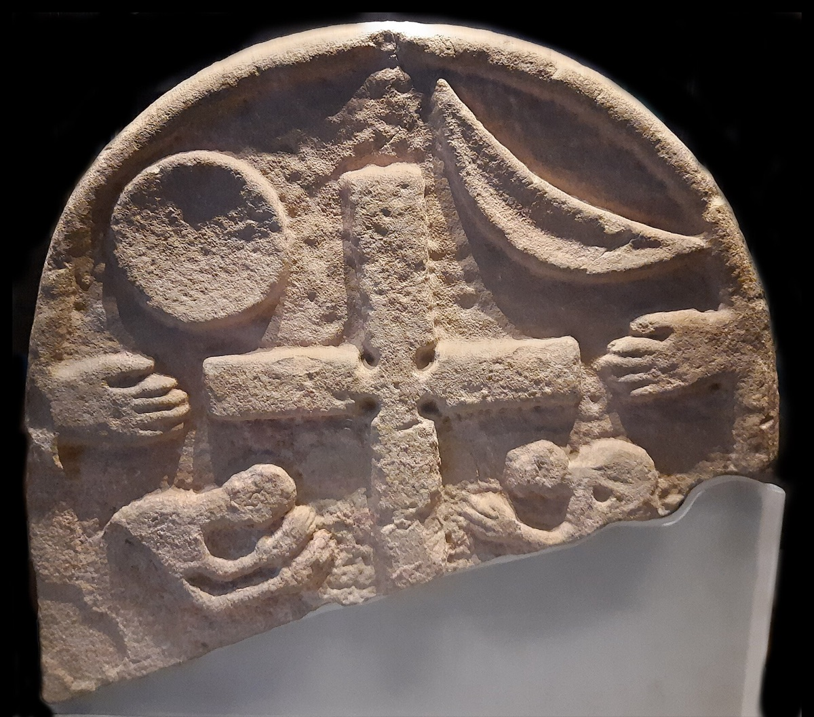

<figcaption markdown="span">
The raid, or the end of the world · <strong>the same stone, both faces</strong> · Lindisfarne, 1st quarter of the 9th century
<em>Left: seven men with raised swords and axes. Right: a cross between sun and moon, hands lifted in prayer. It is called <strong>both</strong> the Viking raider stone <strong>and</strong> the Doomsday stone --- and with a Last Judgement on the back, we cannot tell whether the front shows raiders or the end of the world. <i>The object everyone cites for 793 may not be about 793.</i> (Lindisfarne Priory, English Heritage, inv. 81077057. Photos Schillerwein, CC0.)</em>
</figcaption>
</figure>
</section>

<!-- ========== ASC 2: THE BLANK YEARS ========== -->
<section markdown="1">
*Anglo-Saxon Chronicle* 02 · what doesn't get written
{: .eyebrow}

## Some years are just a number
{: .main-point}

"A. 786."  ·  "A. 807. 808."  ·  "A. 810. 811." complete entries, *Anglo-Saxon Chronicle* (Giles trans.; other editions fill some of these from other manuscripts)
{: .pull-quote.fragment.compact data-fragment-index="0"}

###### Nothing happened?
{: .label}

Obviously a great deal happened in 786. What the blank means is that **nothing happened to the people who counted, of a kind that counted** --- no king died, no bishop was consecrated, no army moved. The empty year is the clearest statement of the chronicle's theory of history, precisely because nobody wrote it down. What historian should this remind you of?

###### Then, once, a voice
{: .label}

In 897 the compiler breaks form. The Danish army "had not utterly broken down the English nation" --- but three years of murrain and mortality came closer --- and he lists the dead by name, adding *"and many also besides these, **though I have named the most distinguished**."* An editorial decision, stated out loud, in a genre that pretends not to make any.

###### Take home
{: .label}

Ask of any archive: *what did it never occur to these people to record?* That question runs the rest of this course.

</section>

<!-- ========== IMAGE: ASC MANUSCRIPT D ========== -->
<section class="image-slide" data-background="#0d1412" markdown="1">
<figure class="portrait">
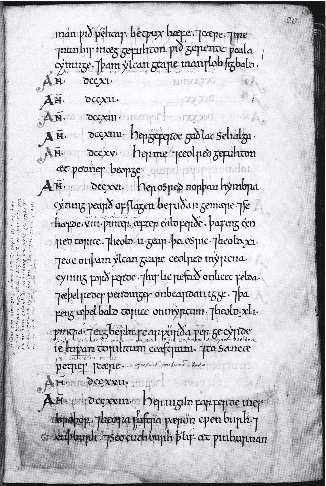
<figcaption markdown="span">
The empty years, on the actual page · Chronicle MS D, fol. 20r
<em>Read down the left column: <strong>AN. DCCXI. AN. DCCXII. AN. DCCXIII.</strong> --- three years, each given its heading, its number, and then <strong>nothing</strong>. 714 gets Guthlac's death in a single line; 716, a king killed, runs on for a dozen; 717 is blank again. The Easter table's habit survives in the skeleton --- <strong>the year is entered whether or not anything happened in it</strong> --- but the scribe is no longer confined to one ruled line, so entries stretch to whatever they need. <i>The frame is fixed in advance. The content is not.</i> (British Library, Cotton MS Tiberius B.iv, fol. 20r. Public domain.)</em>
</figcaption>
</figure>
</section>

<!-- ========== ASC 3: NO SINGLE TEXT ========== -->
<section markdown="1">
*Anglo-Saxon Chronicle* 03 · which chronicle?
{: .eyebrow}

## There is no such thing as *the* Anglo-Saxon Chronicle
{: .main-point}

###### One book, then many
{: .label}

It was assembled in **Wessex around 890**. Copies were then sent out to monasteries that carried on adding to them *independently*, for another two and a half centuries --- the Peterborough copy is still being written in **1154**. **Seven manuscripts survive, A to G.**

###### And they disagree
{: .label}

Different years filled, different silences, different kings worth a line. **The 793 dragons are in D and E and absent from A, B, and C** --- the entry we spent ten minutes reading is not in most copies of the book it comes from. So *"the Chronicle says"* is already a choice about which house's copy you are reading.

###### Take home
{: .label}

Every quotation from a medieval chronicle is a quotation from **one manuscript**. Somebody chose it. Usually an editor, centuries later, and usually without telling you.

</section>

<!-- ========== IMAGE: ASC MANUSCRIPT VARIETY (A + E) ========== -->
<section class="image-slide" data-background="#0d1412" markdown="1">
<figure class="pair">

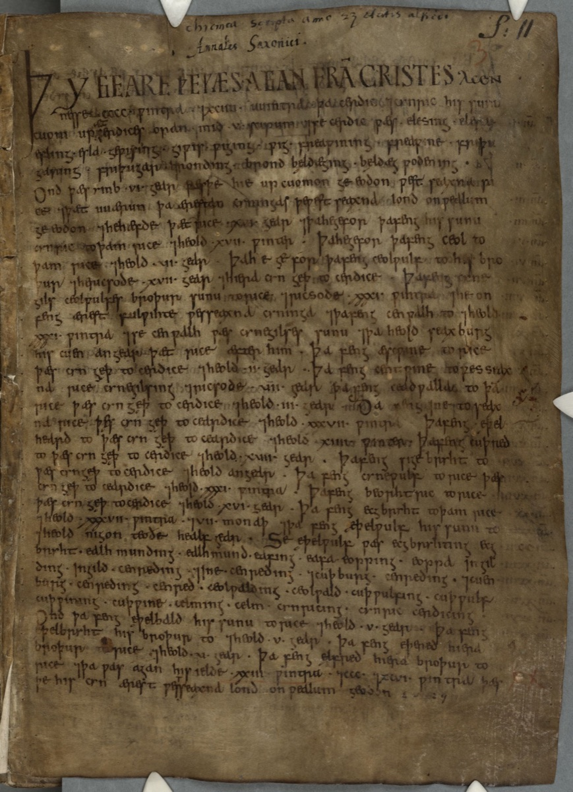
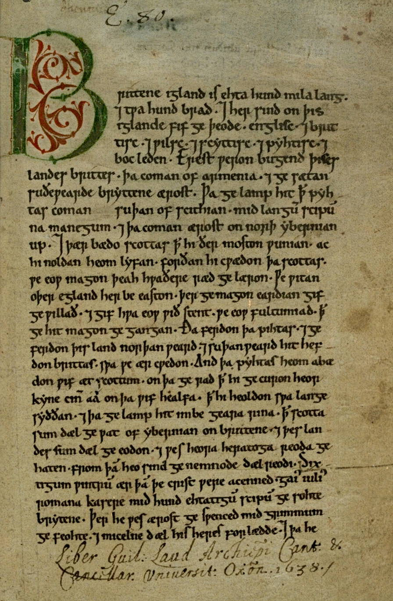

<figcaption markdown="span">
One chronicle, seven books · first pages of <strong>MS A</strong> (Parker, Winchester) and <strong>MS E</strong> (Peterborough, copied c. 1121)
<em>There is no such thing as <i>the</i> Anglo-Saxon Chronicle: it survives in <strong>seven manuscripts</strong>, A to G, copied and continued in different houses --- E is still being written in <strong>1154</strong>. Both these pages open the same work, and they do not open the same way. <strong>A</strong> begins with a royal genealogy; <strong>E</strong> begins with the land --- <i>"Brittene igland is ehta hund mila lang"</i> --- following the opening chapter of <strong>Bede</strong>, whom we meet next. Same work, same language, two centuries and two ideas of where the story starts. <strong>This is also why the 793 dragons are in D and E but not in A.</strong> (Cambridge, CCCC MS 173; Bodleian MS Laud Misc. 636. Public domain.)</em>
</figcaption>
</figure>
</section>

<!-- ========== BEDE 00: WHO HE IS ========== -->
<section markdown="1">
Bede · 673--735
{: .eyebrow}

## A man who never went anywhere, and wrote the book
{: .main-point}

##### The life

Given to **Wearmouth--Jarrow at the age of seven** and never really left --- one or two trips in sixty-two years. He describes his own life as spent "amid the observance of monastic rule and the daily charge of singing in the church, always delighted to learn, to teach, and to write."

##### The desk

The monastery held **one of the best libraries in Europe**, stocked by Benedict Biscop from Rome. Bede wrote some **sixty works** --- commentary, computus, saints' lives --- and finished the *Ecclesiastical History* in **731**, four years before he died.

###### Why this matters

Herodotus travelled; Thucydides commanded. **Bede did neither.** His method has to be built out of letters, informants, and other people's books --- which is exactly why he tells you where each one came from.

</section>

<!-- ========== BEDE 1: THE PREFACE ========== -->
<section markdown="1">
Bede 01 · The preface, 731 CE
{: .eyebrow}

## Livy's preface, rewritten in a monastery
{: .main-point}

"For if history relates good things of good men, the attentive hearer is excited to imitate that which is good; or if it recounts evil things of wicked persons... the devout hearer or reader, shunning that which is hurtful and wrong, is the more earnestly fired to perform those things which he knows to be good." Bede, *Ecclesiastical History*, Preface
{: .quote.fragment data-fragment-index="0"}

###### Put it next to last week
{: .label}

Livy: "from these you may choose... what to imitate, from these mark for avoidance what is shameful." Bede: imitate the good, shun the wrong. **Seven and a half centuries, two religions, one job description.** The only thing Bede adds is the last clause --- the good is "worthy of the service of God."

###### Now the surprise
{: .label}

"To the end that I may remove all occasion of doubting what I have written... I will take care briefly to show you **from what authors I chiefly learned the same**" --- and he does, by name, for pages: Albinus, Nothelm (who searched the papal archives in Rome), Bishop Daniel, the brethren of Lindisfarne. Popkin calls Bede "unusual among medieval historians in his scrupulous concern for accuracy and his acknowledgment of his sources" (p. 42).

###### Who is writing, and what he wants
{: .label}

Bede was handed to the monastery **at seven** and never really left; he almost certainly never travelled further than York. The whole book is written from one library. And it is not a neutral survey --- it argues for the **Roman method of dating Easter** over the Irish one his own region had used, and it addresses something it calls *the English people*, the *gens Anglorum*, at a moment when no such nation existed politically. There were rival kingdoms. **Bede's writing helps create that idea of a unified people.**

###### Take home
{: .label}

A named-source apparatus that would satisfy a modern editor --- attached to a moral purpose Herodotus would have recognized.

</section>

<!-- ========== BEDE 2: ST ALBAN ========== -->
<section markdown="1">
Bede 02 · The martyrdom of St. Alban (I.7)
{: .eyebrow}

## Miracles are not incidental details. They are the evidence.
{: .main-point}

###### One sentence of context
{: .label}

Alban shelters a fugitive priest, converts, and is condemned. On the way to execution the river dries up to let him pass; his executioner throws down the sword and asks to die with him; and the man who finally strikes the blow has his eyes fall out at the same moment as Alban's head.

"For it was impossible that the martyr, who had left no water remaining in the river, should desire it on the top of the hill, **unless he thought it fitting**." Bede, *Ecclesiastical History* I.7
{: .quote.fragment data-fragment-index="1"}

###### Watch what that sentence is doing
{: .label}

This is not credulity. It is **reasoning** --- Bede notices an apparent inconsistency (why be thirsty after drying a river?) and resolves it with a premise about the saint's intent. *The rigor is real; the premises are different.*

###### And it is checkable
{: .label}

The chapter ends at the church built on the site, where "the cure of sick persons and the frequent working of wonders **cease not to this day**." That is an appeal to *present, public, verifiable* evidence: go and look. By his own standard, Bede is showing his work.

###### Take home
{: .label}

If God acts in history, miracles are data. Does this practice "disagree" with modern practice?

</section>

<!-- ========== BEDE 3: THE SPARROW ========== -->
<section markdown="1">
Bede 03 · King Edwin's council, 627 CE (II.13)
{: .eyebrow}

## The most famous speech in English history --- and Bede wasn't there
{: .main-point}

"The present life of man upon earth, O king, seems to me... like to the swift flight of a sparrow through the house wherein you sit at supper in winter... The sparrow, flying in at one door and immediately out at another... passing from winter into winter again. So this life of man appears for a little while, but of what is to follow or what went before we know nothing at all." an unnamed counsellor, in Bede II.13
{: .quote.compact.fragment data-fragment-index="0"}

###### Do the arithmetic
{: .label}

The council meets at Goodmanham in 627. Bede writes at Jarrow in 731 --- **over a century later**, in his own kingdom but well outside living memory, and the speaker is not even named. Nobody transcribed this. Set it beside Thucydides 1.22: *make the speakers say what was called for by each situation.* Bede does the same thing and, unlike Thucydides, does not tell you.

###### And notice the argument it carries
{: .label}

The speech makes the conversion look *reasonable* --- a considered decision by thoughtful men weighing an epistemological problem, not a conquest or a royal whim. Coifi, chief priest of the old religion, has already spoken first, with a blunter reason: the gods he served most diligently never made him prosperous. Then "the other elders and king's counsellors... spoke to the same effect." **Nobody in the room argues the other side.** It looks like a debate, but everyone was already in agreement.

###### Take home
{: .label}

The man with the scrupulous source list also wrote the most memorable passage in his book.

</section>

<!-- ========== IMAGE: BEDE MS HATTON 43 ========== -->
<section class="image-slide" data-background="#0d1412" markdown="1">
<figure class="portrait">
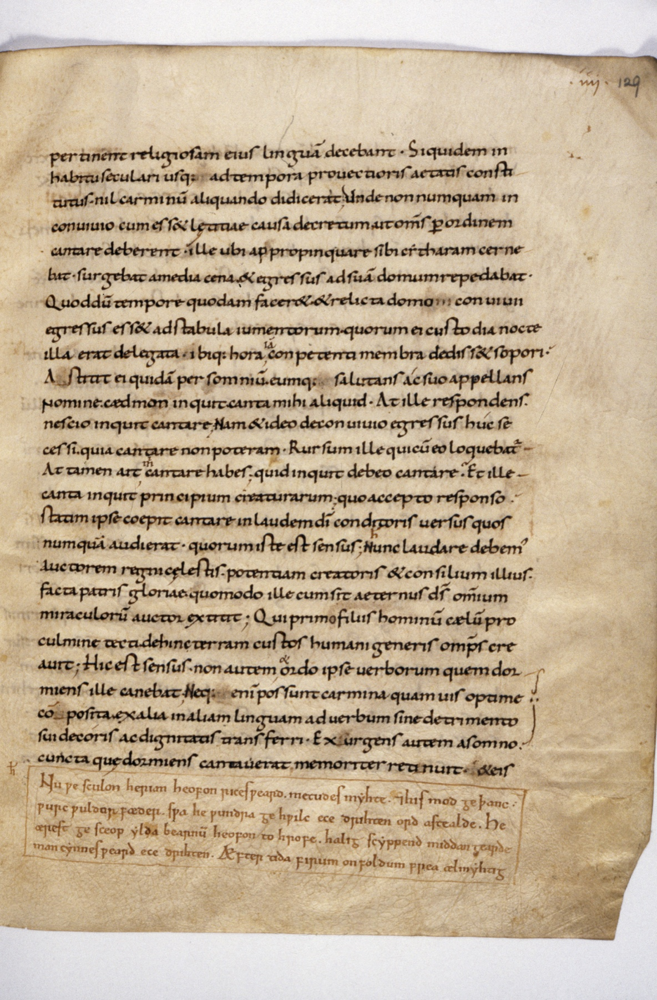
<figcaption markdown="span">
Bede caught being honest · Bodleian MS Hatton 43, fol. 129r
<em>Book IV.24. Bede gives Cædmon's divinely granted poem in Latin prose, then stops to say so: <strong>"This is the sense but not the order of the words as he sang them."</strong> So he <i>does</i> flag his paraphrasing --- just not at the council. And the boxed lines at the foot: a later scribe putting the Hymn back in Old English. (Bodleian Libraries, Oxford, MS Hatton 43, fol. 129r. CC BY-SA 4.0.)</em>
</figcaption>
</figure>
</section>

<!-- ========== AL-BIRUNI 00: WHO HE IS ========== -->
<section markdown="1">
al-Biruni · c. 973 -- c. 1050
{: .eyebrow}

## An astronomer who turned the instruments on people
{: .main-point}

##### The scientist

Born in **Khwarezm**, on the Aral Sea; a Persian speaker writing in Arabic. Astronomer and mathematician first --- he worked on the size of the Earth and whether it turns, and argued about gravity by letter with the young **Avicenna**. **Over a hundred works; twenty-two survive.**

##### The comparatist

At **twenty-seven** he finished the *Chronology of Ancient Nations* --- every calendar he could document, because to line up two eras you must first decide **whose dating to trust**. Taken to Mahmud of Ghazna's court in **1017**, he travelled to India and **learned Sanskrit** rather than work through informants.

###### Where the method comes from

Bede's instrument is a list of informants. Valla's is an ear for Latin. **al-Biruni's is a chain of transmission** --- a discipline built to track how sayings attributed to Muhammad "had been transmitted" (Popkin, p. 44), now turned on history.

</section>

<!-- ========== AL-BIRUNI 1: THE RULE ========== -->
<section markdown="1">
al-Biruni 01 · *Kitab al-Hind*, c. 1030 CE
{: .eyebrow}

## A methodology section, three hundred years early
{: .main-point}

"No one will deny that in questions of historic authenticity **hearsay does not equal eyewitness**... Written tradition is one of the species of hearsay --- we might almost say the most preferable. How could we know the history of nations but for *the everlasting monuments of the pen*?" al-Biruni, preface to the *Kitab al-Hind* (Sachau trans.)
{: .quote.fragment data-fragment-index="0"}

###### What this quote does
{: .label}

He ranks his evidence, concedes the weakness of his best source (writing is *hearsay*), and then argues for using it anyway --- because eyewitness can only reach "actual momentary existence," while written tradition reaches the past at all. **He is arguing with himself in public, in a preface.**

###### Take home
{: .label}

Herodotus let you see where his account might be weak. al-Biruni states his rules for evaluating evidence before he even begins.

</section>

<!-- ========== IMAGE: AL-BIRUNI MANUSCRIPT ========== -->
<section class="image-slide" data-background="#0d1412" markdown="1">
<figure class="portrait">
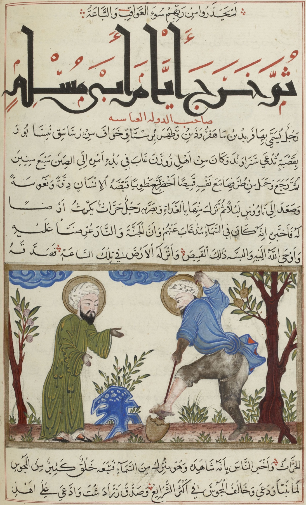
<figcaption markdown="span">
al-Biruni's other book · <i>al-Äthār al-bāqiya</i> (The Remaining Traces of Past Centuries)
<em>His other book, written around 1000, before he ever saw India: a comparative study of <strong>the calendars of every people he could document</strong> --- because to compare eras you must first decide whose dating to trust. Here he retells the claims of the prophet Bihāfrīd, who said he had ascended to heaven. <strong>Recording a miracle is not believing it.</strong> (Bibliothèque nationale de France. Public domain.)</em>
</figcaption>
</figure>
</section>

<!-- ========== AL-BIRUNI 2: THE LIARS ========== -->
<section markdown="1">
al-Biruni 02 · The screen and the taxonomy
{: .eyebrow}

## Five kinds of liar --- and one thing he throws out first
{: .main-point}

"The tradition regarding an event **that in itself does not contradict either logical or physical laws** will invariably depend for its character as true or false upon the character of the reporters." al-Biruni, *Kitab al-Hind*, preface
{: .quote.fragment data-fragment-index="0"}

###### Read the subordinate clause --- it does all the work
{: .label}

Source criticism applies *only* to reports that are physically possible in the first place. Anything that breaks natural law never reaches the interview stage. **Bede's drying river would be screened out before al-Biruni asked who told the story.** Two devout men, two incompatible rules, roughly three centuries apart.

###### Then the taxonomy
{: .label}

Five liars: the partisan for his own family or nation; the man under obligation or nursing a grudge; the coward or profiteer; the habitual liar; and --- his sharpest --- the one who lies *"from ignorance, blindly following others who told him."* Strip out the repeaters, he says, and **"there remains the originator of the story."** That is a modern citation chase, in 1030.

###### Take home
{: .label}

His hardest case is the one he names himself: bias is hardest to detect when the system you describe is *foreign*.

</section>

<!-- ========== IMAGE: MAHMUD OF GHAZNA ========== -->
<section class="image-slide" data-background="#0d1412" markdown="1">
<figure class="landscape">
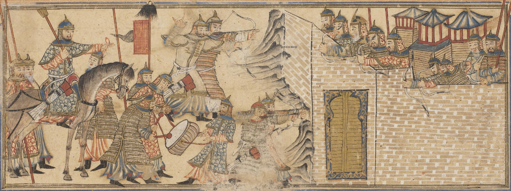
<figcaption markdown="span">
The patron · Mahmud of Ghazna storming a fortress
<em>The enterprise al-Biruni rode behind --- and he says so in the same preface: Mahmud <i>"utterly ruined the prosperity of the country... by which the Hindus became like atoms of dust scattered in all directions,"</i> who now hold <i>"the most inveterate aversion towards all Muslims."</i> <strong>He names his own position, then asks you to trust his sources anyway.</strong> (Rashīd al-Dīn, c. 1314 --- an imagining, not a witness. Public domain.)</em>
</figcaption>
</figure>
</section>

<!-- ========== BEDE VS AL-BIRUNI ========== -->
<section markdown="1">
Comparison · Bede and al-Biruni side by side
{: .eyebrow}

## Which one is doing history?
{: .main-point}

##### Bede · 731
Names every informant. Distinguishes what he read from what he was told. And treats a river parting as **a fact with a cause**, because in his world it is one.

##### al-Biruni · c. 1030
Declares his biases, ranks his evidence, chases claims to their originator. And rules the miracle inadmissible **before** asking who reported it.

###### The question that actually separates them
{: .label}

Not rigor --- both are rigorous. Not honesty --- both are scrupulous. The difference is a prior claim about **what kinds of things can happen**. Every evidence standard rests on one of those, including ours, and ours is not visible to us for the same reason Bede's was not visible to him.

###### One more point from Popkin
{: .label}

Three centuries later Ibn Khaldun (1332--1406) writes the systematic version --- errors from "partisanship toward a creed or opinion," "over-confidence in one's sources," "the inability rightly to place an event in its real context," and the wish to please a patron (p. 44). Popkin calls it "far more probing than anything written in the European west until the era of the Renaissance." **al-Biruni got most of the way there first.**

###### Take home
{: .label}

"Medieval" is a period, not a method. Two writers in it disagree more sharply than Herodotus and Thucydides did. *So what do we do with a period that argues with itself?*

</section>

<!-- ========== IMAGE: LORD ACTON ========== -->
<section class="image-slide" data-background="#0d1412" markdown="1">
<figure class="portrait">
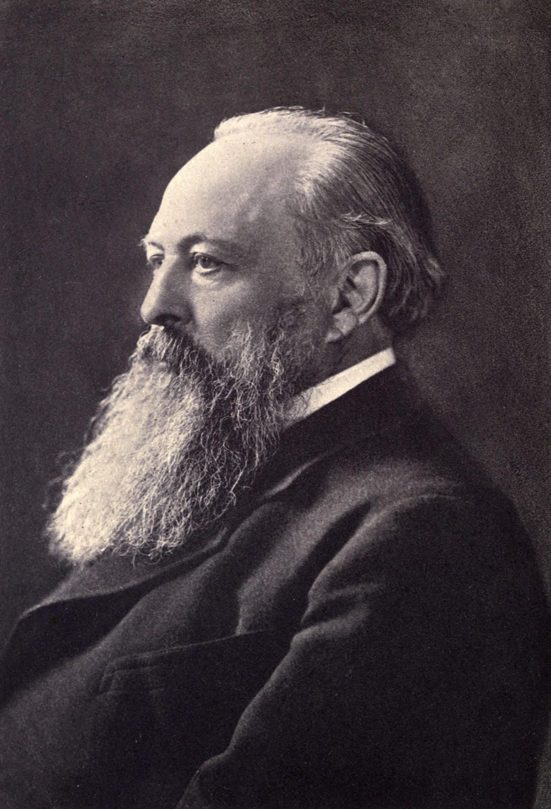
<figcaption markdown="span">
Lord Acton · Regius Professor of Modern History, Cambridge
<em>The man who would write off everything you have just read. Acton took the Cambridge chair in 1895 and said it in his <i>inaugural lecture</i> --- the same man as "power tends to corrupt." Not a crank sneering at monks: <strong>this is the professional discipline of history dismissing the Middle Ages just as it was becoming established.</strong> Now you know enough to argue back. (Allen & Co., before 1902. Public domain.)</em>
</figcaption>
</figure>
</section>

<!-- ========== THE FORK: HOW DO WE READ THEM? ========== -->
<section markdown="1">
The choice · now that you have actually read them
{: .eyebrow}

## So how do we judge any of that?
{: .main-point}

###### What you now know
{: .label}

A chronicle that records dragons and explains nothing. A monk who reasons carefully about a river that dried up. A scholar who rules that river inadmissible before asking who saw it. **Three defensible rules, none of them ours** --- and two things you can do about it.

**Choice A --- dismiss.** The Middle Ages "possessed good writers of contemporary narrative," but they "were careless and impatient of older fact. They became content to be deceived, to live in a twilight of fiction." Lord Acton, 1895, quoted in Popkin, pp. 40--41
{: .quote.compact.fragment data-fragment-index="1"}

###### Choice B --- ask what they were for
{: .label}

Popkin's reply is not that Acton was rude but that he mistook a *different purpose* for a *failure*. Medieval writers "adapted history to a new framework, dominated by religious belief, but they still saw themselves as serving the cause of truth. Their purpose, however, was to present truths that would convince their readers of appropriate **moral and religious lessons**" (p. 41).

###### The sentence to keep
{: .label}

Popkin quotes the medievalist Walter Goffart on Gregory of Tours, and says it applies to nearly all of them: **"Gregory's goal was pastoral, and contemporary history was his means of persuasion"** (p. 41). Swap in any writer from week 2 and ask what *their* goal was. Nobody in this course is doing history for its own sake.

###### Why this choice has a cost
{: .label}

Choice A is cheap, and it is not stupid --- the dragons *are* in the entry. But notice the cost: if credulity is the whole story, you cannot explain **why Bede names his informants**, or why al-Biruni built a taxonomy of liars. Choice B has to explain the dragons. **Choice A has to explain everything else.**

###### Take home
{: .label}

Acton is measuring them against a purpose they never had. That's the "ladder" error from week 2, at its most confident.

</section>

<!-- ================================================================ -->
<!-- =============== PART THREE: THE EARLY MODERN TURN (3.2) ======== -->
<!-- ================================================================ -->

<section data-transition="fade" markdown="1">
Part three · 3.2
{: .eyebrow}

## 1440 --- old assumptions start to break down
{: .main-point}

Printing, the Americas, the Reformation, and a revival of the ancient historians all arrive within a century of each other. Popkin's claim for the period: "many of our tacit assumptions about modern historical thought emerged piecemeal in the scholarly debates of the Renaissance" (p. 50).
{: .detail}
</section>

<!-- ========== VALLA 00: WHO HE IS ========== -->
<section markdown="1">
Lorenzo Valla · c. 1407--1457
{: .eyebrow}

## Not a historian. A grammarian.
{: .main-point}

##### The training

Roman, schooled in the new humanist curriculum. His life's work is the ***Elegantiae linguae Latinae*** --- six books on how classical Latin actually worked, word by word: which form a Roman would use, which he would not, and **when usage changed**. It became the standard reference for a century.

##### The job

From 1435, secretary to **Alfonso of Aragon**, king of Naples --- a court, not a university. Later, and worth holding onto, he took a post in the **papal curia** under Nicholas V: employed by the institution whose oldest charter he had destroyed.

###### Why this matters for what follows

He has no archive, no witnesses, and no interest in going to look. What he has is **an ear for Latin exact enough to hear a century in a word choice.** That is the entire instrument.

</section>

<!-- ========== IMAGE: VALLA ON LATIN ========== -->
<section class="image-slide" data-background="#0d1412" markdown="1">
<figure class="portrait">
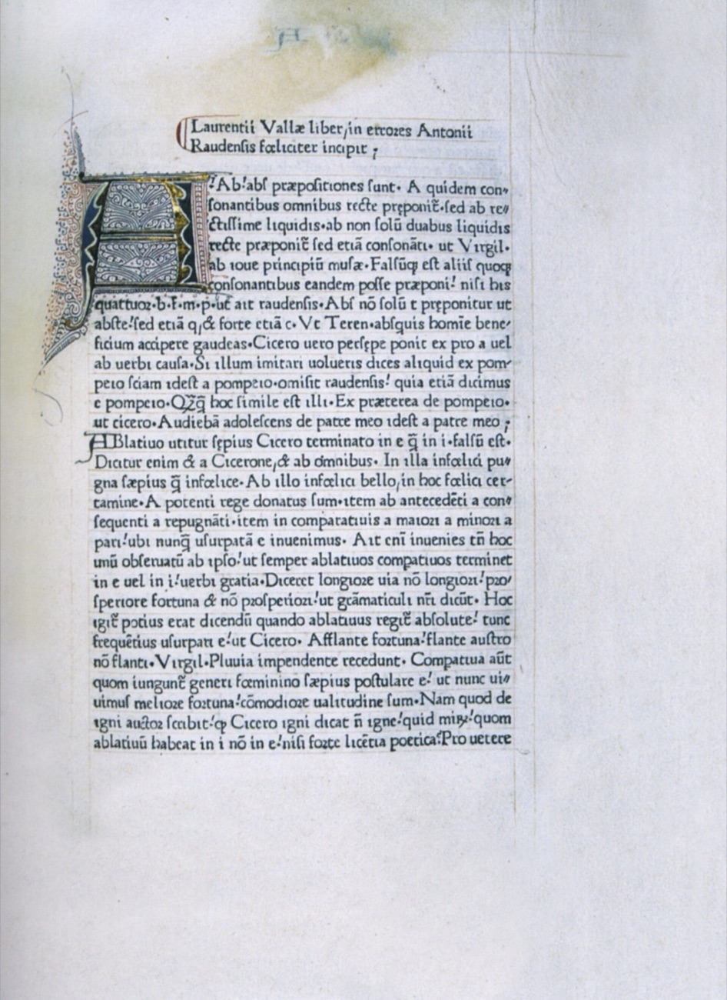
<figcaption markdown="span">
The instrument · Valla on Latin usage · Paris, <strong>1471</strong>
<em>The opening of Valla's <i>In errores Antonii Raudensis</i>, printed alongside his <i>Elegantiae</i> by the first press in Paris. Look at what the argument is actually about: whether to write <strong>ab</strong> or <strong>abs</strong>, settled by appeal to <strong>Virgil, Cicero, and Terence</strong>. No archive, no witnesses --- just usage, tested against the authors. <i>He points this at the Donation next.</i> (Prädikantenbibliothek Isny, Phil. 22. Public domain.)</em>
</figcaption>
</figure>
</section>

<!-- ========== IMAGE: THE DONATION OF CONSTANTINE ========== -->
<section class="image-slide" data-background="#0d1412" markdown="1">
<figure class="landscape">
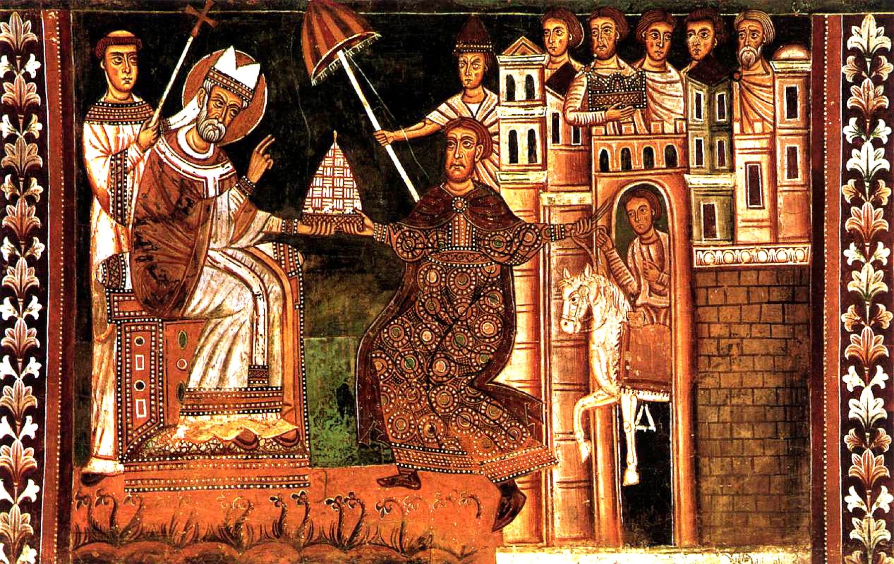
<figcaption markdown="span">
The claim, painted on a wall · Italian fresco, 13th century
<em>Constantine kneels; Sylvester sits. At the right, a figure leads the pope's <strong>white horse</strong> --- the emperor as papal groom. Not an argument: <strong>presented as historical fact in a painting, eight centuries after the event</strong> and two before anyone checked. <strong>This is how effectively the forgery worked.</strong> (Unknown Italian master, 13th c., Web Gallery of Art. Public domain.)</em>
</figcaption>
</figure>
</section>

<!-- ========== VALLA ========== -->
<section markdown="1">
Why it matters · Lorenzo Valla, 1440
{: .eyebrow}

## A grammar lesson destroys a papal claim
{: .main-point}

###### What the document said
{: .label}

The *Donation of Constantine* --- cited in medieval histories for centuries as proof that the emperor had handed sovereignty over Rome to the Pope in the fourth century. Valla showed it used **words and turns of phrase that did not exist** when it was supposedly written, and that no source from that period mentions it (Popkin, p. 50).

###### Why this matters
{: .label}

Nobody had to go anywhere, interview anyone, or witness anything. **The text's own language proved it was a forgery.** A text now has a date written into its language whether the forger likes it or not --- which means evidence can be tested without a witness, and tradition can lose to a philologist.

###### The bigger consequence
{: .label}

If Latin changed that much, the present is *not* a continuation of antiquity. Renaissance historians drop the Biblical "four empires" and invent the scheme we still use --- antiquity, a **"middle age,"** and their own new era (pp. 50--51). The Middle Ages get named by the people who declared them over.

###### What happened to it next
{: .label}

Nothing, for seventy years. The treatise sat in manuscript while the Donation went on being cited. Then **Ulrich von Hutten printed it in 1517** --- the year of the Ninety-Five Theses --- and it went straight into Luther's hands. **A scholarly argument about language became a tool the Reformation used against the Church.** Note the lag: the proof was finished long before anyone was ready to act on it.

###### Take home
{: .label}

Anachronism becomes a detection tool. That is the beginning of source criticism as we practice it.

</section>

<!-- ========== IMAGE: LORENZO VALLA ========== -->
<section class="image-slide" data-background="#0d1412" markdown="1">
<figure class="portrait">
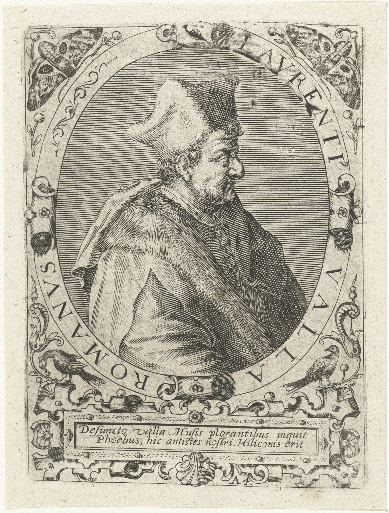
<figcaption markdown="span">
Lorenzo Valla · engraved portrait, c. 1600
<em>Valla wrote the treatise in about seven weeks in <strong>1440</strong>, as secretary to <strong>Alfonso of Aragon</strong> --- who was at that moment at war with <strong>Pope Eugenius IV</strong> over Naples. The Renaissance's greatest piece of source criticism was written to support one side in a political and territorial conflict. The philology holds anyway. <strong>A true result, produced for an interested reason.</strong> (Rijksmuseum, RP-P-1909-4359. CC0.)</em>
</figcaption>
</figure>
</section>

<!-- ========== IMAGE: MACHIAVELLI ========== -->
<section class="image-slide" data-background="#0d1412" markdown="1">
<figure class="portrait">
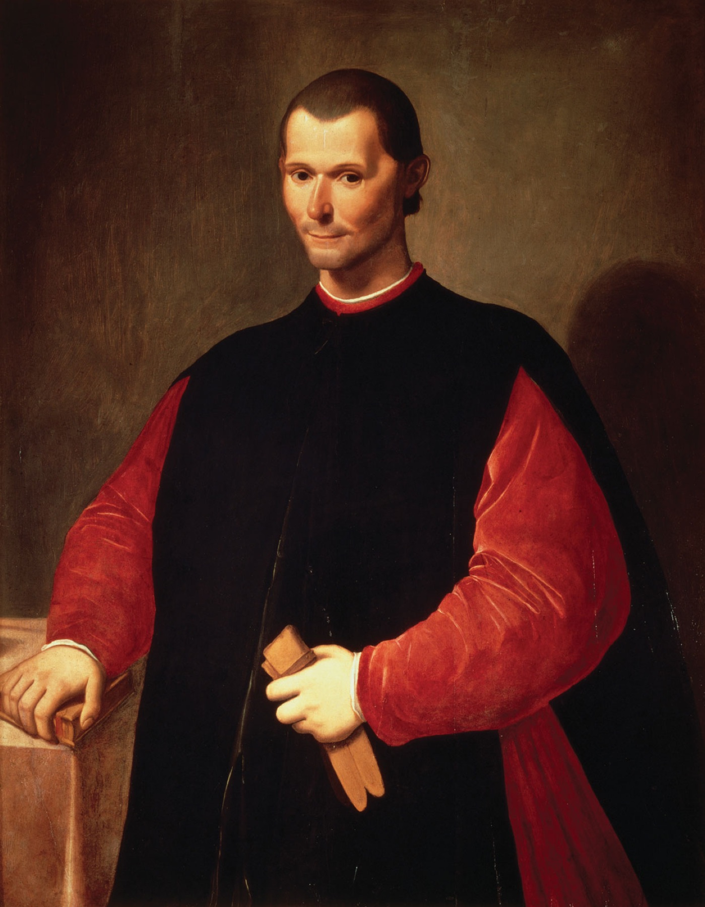
<figcaption markdown="span">
Niccolò Machiavelli · Santi di Tito, later 16th century
<em>Savonarola burned in the Piazza della Signoria in 1498; weeks later Machiavelli got his job. <strong>Fourteen years running Florentine war and diplomacy.</strong> Then the Medici returned in 1512: dismissed, arrested, <strong>tortured on the rope</strong>, exiled to a farm. He wrote <i>The Prince</i> there and <strong>dedicated it to the family that had just done that to him.</strong> (Palazzo Vecchio, Florence. Public domain.)</em>
</figcaption>
</figure>
</section>

<!-- ========== MACHIAVELLI 1: THE TOOLKIT ========== -->
<section markdown="1">
Machiavelli 01 · *The Prince*, written 1513, published 1532
{: .eyebrow}

## The past as a set of instructions
{: .main-point}

"A wise man ought always to follow the paths beaten by great men, and to imitate those who have been supreme, so that **if his ability does not equal theirs, at least it will savour of it**... like the clever archers who... take aim much higher than the mark." Machiavelli, *The Prince*, ch. 6 (Marriott trans.)
{: .quote.fragment data-fragment-index="0"}

###### The same word, a different job
{: .label}

*Imitate.* Livy said it; Bede said it. But they wanted you to imitate **virtue**, and the payoff was a better soul or a better republic. Machiavelli wants you to imitate **technique**, and the payoff is that you keep your state. Same verb, and the history it produces is unrecognizable.

###### Note who is speaking to whom
{: .label}

Bede addressed a king so the king would be good. Machiavelli addresses a prince so the prince will be *effective*. The audience barely changes; the promise changes completely. Popkin: he and Guicciardini wrote "purely secular narratives that made no pretense of trying to fit events into a divinely ordained plan" (p. 52).

###### Take home
{: .label}

History stops teaching virtue and starts teaching technique.

</section>

<!-- ========== MACHIAVELLI 2: MOSES ========== -->
<section markdown="1">
Machiavelli 02 · What he does with God
{: .eyebrow}

## Moses goes in the list
{: .main-point}

"Moses, Cyrus, Romulus, Theseus, and such like are the most excellent examples. And **although one may not discuss Moses**, he having been a mere executor of the will of God, yet he ought to be admired..." Machiavelli, *The Prince*, ch. 6
{: .quote.fragment data-fragment-index="0"}

###### A polite dismissal
{: .label}

He declines to discuss Moses --- and then puts him in a list with two mythical founders and a Persian king he knows mostly through Xenophon's idealized portrait, then analyzes all four by the same criteria. He even concludes the others "will not be found inferior to those of Moses, although he had so great a preceptor." **Divine backing is mentioned, then set aside as irrelevant to the analysis.**

###### And then the conclusion he actually draws
{: .label}

*"All armed prophets have conquered, and the unarmed ones have been destroyed... it is necessary to take such measures that, when they believe no longer, it may be possible to make them believe by force."* Prophecy is redescribed as **a problem of persuasion, solved by force**. Bede would not recognize this as an account of anything.

###### Take home
{: .label}

Thucydides removed the gods as *causes* --- Herodotus never did. Machiavelli keeps the gods in the story but treats them as having no real power to explain anything, which goes further than either.

</section>

<!-- ========== MACHIAVELLI 3: TWO CRUELTIES ========== -->
<section markdown="1">
Machiavelli 03 · How an example is used
{: .eyebrow}

## Two cruelties, two verdicts
{: .main-point}

##### Ramiro d'Orco · ch. 7
Cesare Borgia installs a "swift and cruel man" to pacify the Romagna, then has him cut in two and left in the piazza at Cesena "with the block and a bloody knife at his side." The result: the people were **"at once satisfied and dismayed."** *26 December 1502 --- and Machiavelli was the Florentine envoy attached to Borgia's court that winter, in the Romagna, sending dispatches home. This is not a story he read.*

##### Agathocles · ch. 8
Rose to rule Syracuse by massacring the senate. Machiavelli grants his courage and "greatness of mind" --- then rules that **"such methods may gain empire, but not glory."**

###### He does deliver a verdict --- just not a moral one
{: .label}

Cruelties are "properly used" when "applied at one blow... and not persisted in"; badly used when they "multiply with time." *"Injuries ought to be done all at one time, so that, being tasted less, they offend less; benefits ought to be given little by little, so that the flavour of them may last longer."* The criterion is **timing**, not justice.

###### So what is the Ramiro story *for*?
{: .label}

Compare Livy on Lucretia. Livy's dead body founds a republic and teaches you what to be. Machiavelli's dead body is a **demonstration of a repeatable technique**: transfer the blame, stage the punishment, benefit from the people's relief. The anecdote is not a symbol. It is a worked example.

###### Take home
{: .label}

He is not amoral about history. He has replaced a moral standard with a practical, technical one.

</section>

<!-- ========== LIVY VS MACHIAVELLI ========== -->
<section markdown="1">
Contrast · Two readers of the same Rome
{: .eyebrow}

## Do they want the same kind of lesson?
{: .main-point}

##### Livy wants
A citizen who reads the Republic's past and becomes *worthier of it* --- history as a monument you choose examples from, so that the state deserves to survive.

##### Machiavelli wants
A reader --- prince or republic, depending on the book --- who studies the same Rome and learns *what worked*, so that the state survives, whether or not it deserves to.

###### The awkward part
{: .label}

Machiavelli was Livy's most devoted reader --- he wrote a whole book of commentaries on him, the *Discourses* (c. 1517), and Popkin notes that Livy's "meditations on the fall of the Roman republic" had special force in Florence after 1494 (p. 52). And his two books disagree with each other: the *Discourses* argues that **republics outlast principalities**, which is close to Livy's idea. *The Prince* argues something different. **Same reader, same Rome, opposite lesson.** That is Carr's point about the historian and their audience. 

###### Take home
{: .label}

"The past is useful" is not one position. It splits the moment you ask *useful for what, and to whom*.

</section>

<!-- ========== RECAP ========== -->
<section data-transition="fade" markdown="1">
Week 3 Recap
{: .eyebrow}

## Six things
{: .main-point}

###### 01 · p. 41
{: .num}

#### Pastoral, not incompetent

"Gregory's goal was pastoral, and contemporary history was his means of persuasion."

###### 02
{: .num}

#### Sequence is argument

The chronicle claims to only record. Order, rank, and the empty years do the arguing.

###### 03
{: .num}

#### Miracles as data

Bede reasons *about* the miracle. The rigor is real; the premise about the world is different.

###### 04
{: .num}

#### The screen comes first

al-Biruni tests reporters --- but only for events that don't break physical law. Every method has a prior.

###### 05 · p. 50
{: .num}

#### The text proves the forgery

Valla needs no witness. Language carries its own date, so tradition can now lose to evidence.

###### 06
{: .num}

#### Imitate --- what?

Livy and Bede say virtue. Machiavelli says technique. What do _you_ think history is for?

</section>

<!-- ========== DISCUSSION ========== -->
<section markdown="1">
Discussion · 3.1 + 3.2
{: .eyebrow}

## Discussion Ideas
{: .main-point}

- What makes Bede's history different from Herodotus or Thucydides? From Livy --- or is the preface the same preface?
- What role does God play as a *historical actor* for Bede? What plays the comparable role for al-Biruni?
- al-Biruni tells you what good history requires. **Do miracles count?** Where exactly in his method does Bede's river get thrown out?
- How does Machiavelli use historical examples --- and would Livy recognize what he is doing with them?
- What's the difference between using history to *teach virtue* and using it to *gain power*? Is one of them not history?
{: .questions.compact.fragment}

</section>
