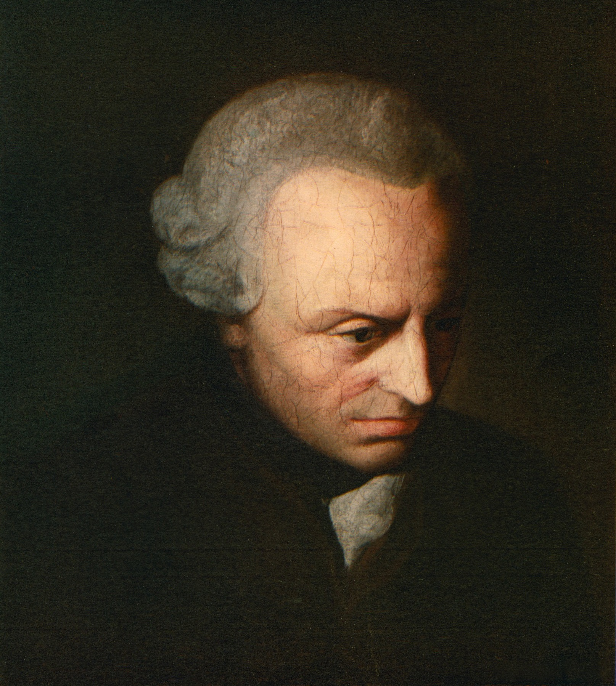
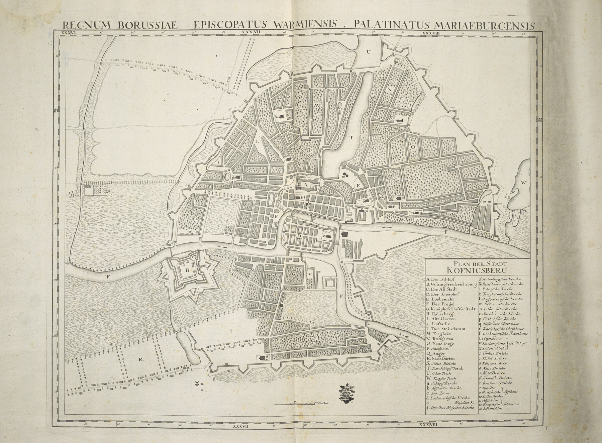
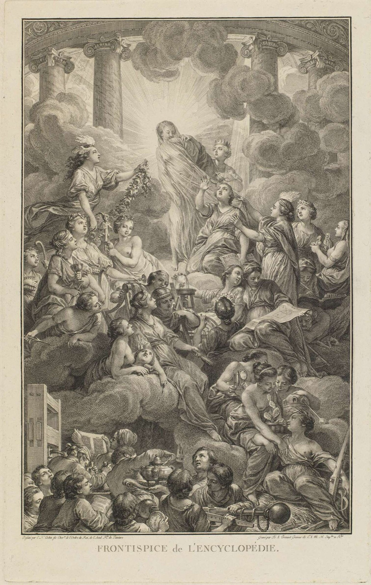
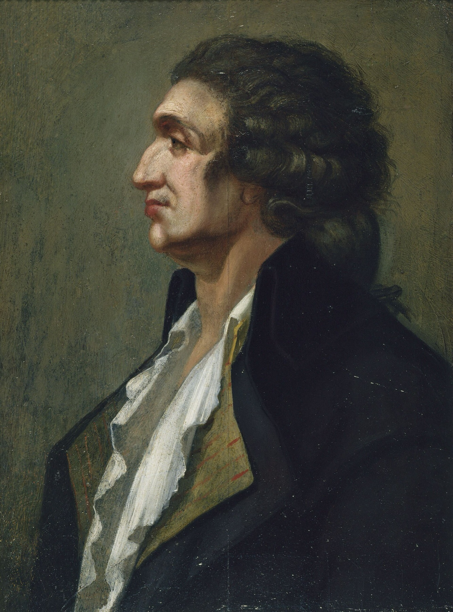
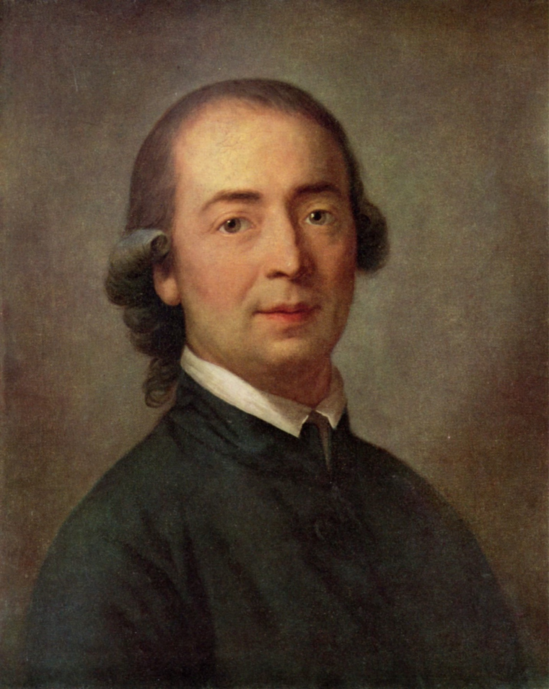

<!-- ========== TITLE ========== -->
<section data-transition="fade" markdown="1">
Making History • HIST 1105 • Week 4 · part two
{: .eyebrow}

# Enlightenment Progress
{: .main-point}

- Voltaire, *Age of Louis XIV* (1751), Introduction
- Kant, "Idea for a Universal History with a Cosmopolitan Purpose" (1784)
- Background: Popkin, ch. 3, 61–69
{: .source-list}

Voltaire cited by page (Fleming translation, the edition on the syllabus); Kant by thesis number (Beck translation); Popkin by page.
{: .detail style="margin-top:0.8em; font-size:0.5em;"}
</section>

<!-- ========== WHERE WE ARE ========== -->
<section data-transition="fade" markdown="1">
Where we are · three parts left
{: .eyebrow}

## Progress was not discovered. It was argued for.
{: .main-point}

###### 01 · Voltaire, 1751
{: .num}

#### Progress you can see

Four ages in the whole history of the world, ranked by taste and manners, with one court at the top.

###### 02 · Kant, 1784
{: .num}

#### Progress you have to argue for

Not which age had the most taste, but why history as a whole should be going anywhere at all.

###### 03 · What became of it
{: .num}

#### A ladder, and the objection

Condorcet and Ferguson turn the idea into a scale you can measure people on. Herder, the same year as Kant, refuses it.

</section>

<!-- ================================================================ -->
<!-- =============== PART TWO: VOLTAIRE ============================== -->
<!-- ================================================================ -->

<!-- ========== IMAGE: LOUIS XIV, THE EXPECTED SUBJECT ========== -->
<section class="image-slide" data-background="#0d1412" markdown="1">
<figure class="portrait">

<figcaption markdown="span">
What you'd expect this book to be about · Louis XIV, 1701
<em>Painted fourteen years before he died. The king Voltaire's title names. <strong>He is not the point of the book.</strong> (Hyacinthe Rigaud, Musée du Louvre. Public domain.)</em>
</figcaption>
</figure>
</section>

<!-- ========== IMAGE: VOLTAIRE, WHO HE IS ========== -->
<section class="image-slide" data-background="#0d1412" markdown="1">
<figure class="portrait">

<figcaption markdown="span">
Voltaire · 1694–1778
<em>François-Marie Arouet: gaoled in the Bastille twice, exiled to England, and by 1751 the most famous writer in Europe. He finished the <i>Age of Louis XIV</i> at Frederick the Great's court in Potsdam. <strong>Why he matters:</strong> not a court historian with royal archives but an independent celebrity, writing for a European public from outside the country he describes. (Largillière, c. 1724–25; he was 57 when he finished the book. Versailles, MV 8159. Public domain.)</em>
</figcaption>
</figure>
</section>

<!-- ========== VOLTAIRE 01: THE BOOK AS AN OBJECT ========== -->
<section markdown="1">
The text · what the *Age of Louis XIV* is
{: .eyebrow}

## Twenty years of work, printed in Berlin, about a king dead since 1715
{: .main-point}

##### The book

Two volumes, 1751. Voltaire had been working at it since the 1730s. Roughly the first half narrates the reign's wars and politics, the way a history was expected to. The rest is chapters on government, commerce, science, the arts, and religion — and that part is what was new.

##### How it got out

Printed in Berlin, not Paris, and issued under the name of a member of the Prussian Academy, M. de Francheville, rather than Voltaire's own. Publishing in France meant clearing the royal censor. He wrote about French greatness from beyond French jurisdiction.

###### What the list is doing
{: .label}

The Introduction is not Voltaire inventing history. It is Voltaire working inside an entirely ordinary genre and telling you, before the narrative starts, that he has changed what the book is *about*.

</section>

<!-- ========== VOLTAIRE 02: THE FOUR AGES ========== -->
<section markdown="1">
Voltaire 01 · The Introduction
{: .eyebrow}

## Only four ages in the whole history of the world
{: .main-point}

"Whosoever thinks, or, what is still more rare, whosoever has taste, will find but four ages in the history of the world. These four happy ages are those in which the arts were carried to perfection." Voltaire, *Age of Louis XIV*, Introduction, p. 5
{: .quote.fragment data-fragment-index="0"}

###### The list, and the test for making it
{: .label}

Greece under "Philip and Alexander." Rome under Caesar and Augustus. Medici Florence. And "the fourth age is that known by the name of the age of Louis XIV" — his own lifetime, named as one of only four peaks in recorded history (pp. 5–7). The test for entry is not military success. It's whether "the arts were carried to perfection."

###### Who's doing the ranking
{: .label}

The qualifier matters: not everyone sees four ages, only "whosoever has taste" — a category Voltaire is visibly placing himself and his reader inside. This is not a neutral inventory. It is a judgment, made by someone claiming the authority to make it.

###### Take home
{: .label}

"Progress" starts here as connoisseurship: a short list of peaks, picked by people confident they can tell taste from barbarism.

</section>

<!-- ========== VOLTAIRE 03: CONFINE OURSELVES ========== -->
<section markdown="1">
Voltaire 02 · What the book will and won't do
{: .eyebrow}

## Not battles. The genius and manners of mankind.
{: .main-point}

"In this history we shall confine ourselves only to what is deserving of the attention of all ages, what paints the genius and manners of mankind, contributes to instruction, and prompts to the love of virtue, of the arts, and of our country." Voltaire, *Age of Louis XIV*, Introduction, p. 11
{: .quote.fragment data-fragment-index="0"}

###### What he's refusing to write
{: .label}

A few sentences earlier, on the same page, he names the job he's leaving to someone else: "the compilers of annals," whose task is "to point out the marches and countermarches of armies" and which towns were "taken and retaken again by force of arms." That is a direct jab at the chronicle tradition — recording events in the sequence in which they happened, the form this course has already read.

###### Whose manners
{: .label}

Popkin's verdict on the result: Voltaire "practiced history as a form of literature, striving to infuse it with drama and a clear message," and emphasized cultural achievement — "although his interest was largely confined to elite culture" (p. 63). "The genius and manners of mankind" turns out to mean the manners of a few thousand people at the top.

###### Take home
{: .label}

A history book announcing what it refuses to cover is making an argument about what history is *for* — the same move Livy and Bede made, aimed at a new target.

</section>

<!-- ========== IMAGE: SALON DE MADAME GEOFFRIN ========== -->
<section class="image-slide" data-background="#0d1412" markdown="1">
<figure class="landscape">

<figcaption markdown="span">
What "manners" looks like · Madame Geoffrin's salon, Paris, 1755
<em>A reading of Voltaire's <i>L'Orphelin de la Chine</i>; Fontenelle, Montesquieu, Diderot and d'Alembert are in the room. <strong>It is also about forty people in one city.</strong> (Anicet-Charles-Gabriel Lemonnier, painted 1812, Château de Malmaison. Public domain.)</em>
</figcaption>
</figure>
</section>

<!-- ========== VOLTAIRE 04: EUROPE'S DEBT ========== -->
<section markdown="1">
Voltaire 03 · Where "progress" spreads from
{: .eyebrow}

## One court, and everyone else catching up
{: .main-point}

"This happy influence has not been confined to France; it has communicated itself to England... it has introduced taste into Germany, and the sciences into Russia; it has even re-animated Italy, which was languishing; and Europe is indebted for its politeness and spirit of society to the court of Louis XIV." Voltaire, *Age of Louis XIV*, Introduction, pp. 7–8
{: .quote.compact.fragment data-fragment-index="0"}

###### Where the verbs point
{: .label}

France doesn't receive influence in this sentence — it exports it. England is stirred, Germany gets taste "introduced" into it, Italy is "re-animated" from outside. One court is the source; every other nation is a destination the source reaches.

###### The shape this gives to "progress"
{: .label}

Progress here isn't just something that happened once, in four places. It radiates *outward*, from a center, to everyone still catching up. One standard, everyone else measured against it. Compare Week 9 (Said, Trouillot).

###### Take home
{: .label}

Ask of any progress story: who is the source, and who is cast as still arriving?

</section>

<!-- ========== DISCUSSION 02: A FIFTH AGE ========== -->
<section markdown="1">
Discussion · part two
{: .eyebrow}

## What would it take to add a fifth age to Voltaire's list?
{: .main-point}

He names four: Greece under "Philip and Alexander," Rome under Caesar and Augustus, Medici Florence, and the age of Louis XIV (pp. 5–7). The test for entry is that "the arts were carried to perfection," and the judges are "whosoever has taste" (p. 5).
{: .detail}

- Who, on his terms, is qualified to decide?
- Could a society outside Europe meet the test as he states it?
{: .questions.compact.fragment}
</section>

<!-- ========== ANSWER 02 ========== -->
<section markdown="1">
Answer · part two
{: .eyebrow}

## The test is not a measurement. It is a membership.
{: .main-point}

###### Why the list can't be argued with
{: .label}

Nothing in "the arts were carried to perfection" can be picked up by someone else and applied to produce a different list. The qualifier does the work: only "whosoever has taste" sees four ages, and that is a category Voltaire places himself and his reader inside. A criterion only its author can apply will return its author's answer. Nor does the test leave a door open: all four ages sit in one line of descent, and the judge is the heir of that line.

###### Take home
{: .label}

He is not setting out to rank nations; he is setting out to say what a great age looks like. But once the measure is taste, "Europe is indebted... to the court of Louis XIV" (pp. 7–8) can be written as though it were a description. The sorting was settled by the choice of test, several pages before any evidence arrived.

</section>

<!-- ================================================================ -->
<!-- =============== PART THREE: KANT ================================ -->
<!-- ================================================================ -->

<section data-transition="fade" markdown="1">
The next claim · thirty-three years later
{: .eyebrow}

## Voltaire described it. Kant tries to explain why it has to happen.
{: .main-point}

Thirty-three years later, a philosopher in a Prussian university town asks a harder question — not which ages showed the most taste, but why history as a whole should be going anywhere at all.
{: .detail}
</section>

<!-- ========== IMAGE: KANT, WHO HE IS ========== -->
<section class="image-slide" data-background="#0d1412" markdown="1">
<figure class="portrait">

<figcaption markdown="span">
Immanuel Kant · 1724–1804
<em>Born in Königsberg and, by every account, never far from it: he studied and taught at its university for his whole career, professor of logic and metaphysics from 1770. The <i>Critique of Pure Reason</i> (1781) had just made him Germany's most discussed philosopher; this essay ran in a magazine in 1784. <strong>Why he matters:</strong> Voltaire argued from travel, having seen the courts of Europe. Kant argues from one desk, by reasoning alone. (Unknown artist, c. 1790; Kant about 66. Public domain.)</em>
</figcaption>
</figure>
</section>

<!-- ========== KANT 01: THE TEXT AS OBJECT ========== -->
<section markdown="1">
The text · why this essay exists at all
{: .eyebrow}

## An essay written to correct a rumor about a dinner conversation
{: .main-point}

"A favorite idea of Professor Kant's is that the ultimate purpose of the human race is to achieve the most perfect civic constitution... he wishes that a philosophical historian might undertake to give us a history of humanity from this point of view." notice in the *Gothaische Gelehrte Zeitung*, 1784, quoted in Kant's own footnote
{: .quote.compact.fragment data-fragment-index="0"}

###### The source of that sentence
{: .label}

Those aren't Kant's words. They're a magazine's secondhand paraphrase of something he apparently said to "a scholar who was traveling through" Königsberg — gossip about a dinner conversation, printed in a scholarly gazette before Kant had written a word of it down himself.

###### What he does about it
{: .label}

Kant's own footnote says the notice "occasions this essay, without which that statement could not be understood." He publishes the full argument in the *Berlinische Monatsschrift*, November 1784 — the same journal that, one month later, runs his other famous short piece from that year, "An Answer to the Question: What Is Enlightenment?"

###### Take home
{: .label}

One of the most influential essays on the direction of history exists because a philosopher had to correct his own dinner conversation in print.

</section>

<!-- ========== IMAGE: KONIGSBERG ========== -->
<section class="image-slide" data-background="#0d1412" markdown="1">
<figure class="landscape">

<figcaption markdown="span">
"Plan der Stadt Koenigsberg," 1763 · twenty-one years before the essay
<em>Kant was already teaching on the Kneiphof (D), the island with the cathedral (c, <i>Der Dom</i>) where he is buried. <strong>Essentially the entire geography of his life.</strong> (Leibniz-Institut für Länderkunde, Leipzig. CC0.)</em>
</figcaption>
</figure>
</section>

<!-- ========== KANT 02: NATURE'S SECRET PLAN ========== -->
<section markdown="1">
Kant 01 · The Eighth Thesis
{: .eyebrow}

## History as the working-out of a plan nobody can see
{: .main-point}

"The history of mankind can be seen, in the large, as the realization of Nature's secret plan to bring forth a perfectly constituted state as the only condition in which the capacities of mankind can be fully developed." Kant, Eighth Thesis
{: .quote.fragment data-fragment-index="0"}

###### Whose plan, exactly
{: .label}

Not any person's plan — nobody alive is executing it on purpose. Kant's claim is that *Nature* has one, working itself out through people who have no idea they're part of it. History has a direction even though none of its participants agreed to one.

###### Kant's own hedge
{: .label}

He doesn't claim to have proven this. Later in the same thesis: "Does Nature reveal anything of a path to this end? And I say: She reveals something, but very little." The philosopher making the strongest claim about history's direction admits the evidence for it is thin.

###### Take home
{: .label}

This is a much bigger claim than Voltaire's. Voltaire ranks four periods that already happened. Kant argues the whole species has to be going somewhere — as a matter of theory, not observation.

</section>

<!-- ========== KANT 03: UNSOCIAL SOCIABILITY ========== -->
<section markdown="1">
Kant 02 · The Fourth and Fifth Theses
{: .eyebrow}

## The engine is vanity, not virtue
{: .main-point}

"By 'antagonism' I mean the unsocial sociability of men, i.e., their propensity to enter into society, bound together with a mutual opposition which constantly threatens to break up the society." Kant, Fourth Thesis
{: .quote.fragment data-fragment-index="0"}

###### What actually does the work
{: .label}

People need each other and can't stand each other, both at once. Later in the same thesis he names what runs on that friction: "Thanks be to Nature, then, for the incompatibility, for heartless competitive vanity, for the insatiable desire to possess and to rule! Without them, all the excellent natural capacities of humanity would forever sleep, undeveloped."

###### His own image for it
{: .label}

The Fifth Thesis gives the picture: trees in a forest "each needs the others" and grow "a beautiful, straight stature" by competing for light, while a tree left alone "put[s] out branches at random and grow[s] stunted, crooked, and twisted." Isolation doesn't produce virtue. Competition does.

###### Take home
{: .label}

For Voltaire, progress is made by admirable people — Pericles, the Medici. For Kant, it is produced by vanity and greed that nobody involved would call admirable.

</section>

<!-- ========== KANT 04: CROOKED TIMBER ========== -->
<section markdown="1">
Kant 03 · The Sixth Thesis
{: .eyebrow}

## Even Kant doesn't think this ends cleanly
{: .main-point}

"This task is therefore the hardest of all; indeed, its complete solution is impossible, for from such crooked wood as man is made of, nothing perfectly straight can be built." Kant, Sixth Thesis
{: .quote.fragment data-fragment-index="0"}

###### The problem he can't solve
{: .label}

Humanity needs a "master" to enforce the laws that keep everyone's freedom from destroying everyone else's. But: "the master is himself an animal, and needs a master." Whoever holds power needs to be checked, and whoever checks them needs checking too. Kant sees the infinite regress and doesn't pretend to close it.

###### What this does to the Eighth Thesis
{: .label}

The "perfectly constituted state" from two theses ago turns out to require solving a problem Kant has just called impossible. Nature's plan, on his own account, aims at a target it can't fully reach. He calls the whole "Idea" a "guiding thread" rather than a proven law, and grants it looks "apparently silly" if read as anything more (Ninth Thesis).

###### Take home
{: .label}

Kant is not selling a utopia. He is describing a direction with no clean arrival — closer to an asymptote than a finish line.

</section>

<!-- ========== DISCUSSION 03: WHY VANITY ========== -->
<section markdown="1">
Discussion · part three
{: .eyebrow}

## Why would you build an argument for progress out of vanity and greed?
{: .main-point}

Kant thanks Nature for "heartless competitive vanity" and "the insatiable desire to possess and to rule" (Fourth Thesis) — then concedes that the goal cannot be fully reached, because "from such crooked wood as man is made of, nothing perfectly straight can be built" (Sixth Thesis).
{: .detail}

- What does he gain by not requiring anyone to be good?
- What does he give up by putting the plan beyond anyone's intention?
{: .questions.compact.fragment}
</section>

<!-- ========== ANSWER 03 ========== -->
<section markdown="1">
Answer · part three
{: .eyebrow}

## A machine that runs on people as they actually are
{: .main-point}

###### The gain
{: .label}

Vanity and greed are reliable in a way virtue is not. A progress that waited for people to improve morally would be a hope; a progress driven by competition is a mechanism, and it keeps working whether or not anyone involved intends the outcome. That is what lets Kant claim history as a whole is going somewhere without claiming anyone in it is admirable.

###### The bill
{: .label}

If the destination belongs to Nature and not to us, no one can be credited or blamed for arriving — and no evidence can count against the plan, since setbacks are just the crooked wood. Kant half-concedes it: the whole essay is a "guiding thread," not a proven law.

</section>

<!-- ========== IMAGE: ENCYCLOPEDIE FRONTISPIECE ========== -->
<section class="image-slide" data-background="#0d1412" markdown="1">
<figure class="portrait">

<figcaption markdown="span">
The larger project both writers belong to · Frontispiece to the <i>Encyclopédie</i>, 1772
<em>Truth at the center, unveiled by Reason and Philosophy, the sciences and arts gathered below to receive the light. <strong>Progress with a picture of itself.</strong> (Charles-Nicolas Cochin, design; Benoît-Louis Prévost, engraving. Public domain.)</em>
</figcaption>
</figure>
</section>

<!-- ================================================================ -->
<!-- =============== PART FOUR: WHAT BECAME OF IT ==================== -->
<!-- ================================================================ -->

<!-- ========== IMAGE: CONDORCET ========== -->
<section class="image-slide" data-background="#0d1412" markdown="1">
<figure class="portrait">

<figcaption markdown="span">
Condorcet · 1743–1794
<em>Mathematician and revolutionary; argued in print for the abolition of slavery (1781) and for women's right to vote (1790). He wrote the <i>Sketch</i> in hiding from the Terror and never saw it published. <strong>Why he matters here:</strong> he takes progress to its limit — no ceiling at all — and turns it into an argument for emancipation. The same idea, aimed the other way. (Anonymous, Musée Carnavalet P1668, Paris Musées. Public domain.)</em>
</figcaption>
</figure>
</section>

<!-- ========== CONDORCET AND FERGUSON ========== -->
<section markdown="1">
What became of the idea · the ladder
{: .eyebrow}

## From a claim about the past to a scale you can measure people on
{: .main-point}

"nature has set no term to the perfection of human faculties" Condorcet, *Sketch for a Historical Picture of the Progress of the Human Mind* (1794), quoted in Popkin, p. 67
{: .quote.fragment data-fragment-index="0"}

###### Where he wrote it
{: .label}

Condorcet wrote the *Sketch* "in the midst of the upheavals of the French Revolution" (p. 67) — in hiding, under warrant from the Revolution he had helped make. He was arrested on 27 March 1794 and found dead in his cell two days later. The most confident statement of unlimited human progress was written by a man being hunted.

###### And now it has numbered stages
{: .label}

In Scotland, Adam Ferguson's *Essay on the History of Civil Society* set out a "conjectural history" in which all societies "inevitably moved through a series of economic and cultural stages" — herding, then agriculture, then trade and manufacturing (p. 67). Once progress has stages, any society you encounter can be assigned one.

###### Take home
{: .label}

Voltaire ranked four ages that were over. Kant argued for a direction. **Here the sorting stops being a side effect and becomes the instrument:** Ferguson's stages exist to be held up against a society and read off. Condorcet, meanwhile, is using the same idea to argue for abolition and for women's votes.

</section>

<!-- ========== IMAGE: HERDER ========== -->
<section class="image-slide" data-background="#0d1412" markdown="1">
<figure class="portrait">

<figcaption markdown="span">
Herder · 1744–1803
<em>Sat in Kant's lectures at Königsberg twenty years earlier; by 1784 court preacher at Weimar and publishing his own <i>Ideen</i> (1784–91), which Kant reviewed that year, unfavourably. <strong>Why he matters here:</strong> he refuses the single universal standard while Kant is still building on it — and his alternative, each people judged on its own terms, becomes nineteenth-century nationalism. (Anton Graff, 1785. Public domain.)</em>
</figcaption>
</figure>
</section>

<!-- ========== HERDER'S OBJECTION ========== -->
<section markdown="1">
The objection · Johann Gottfried von Herder, 1744–1803
{: .eyebrow}

## The critic was Kant's own student
{: .main-point}

"[Herder] objected to the idea of measuring the distinctive cultures of different nations according to a universal standard of civilization derived from the experience of Western Europe." Popkin, *From Herodotus to H-Net*, p. 68
{: .quote.compact.fragment data-fragment-index="0"}

###### Who he was, and what he proposed instead
{: .label}

Herder studied under Kant at Königsberg in the early 1760s — same university, same city, twenty years before the two of them published opposing accounts in the same year; by the 1780s he was court preacher at Weimar. His alternative, per Popkin: "every nation had its own unique characteristics," best seen in "the folk culture of its ordinary people rather than by its educated elites," so that "each nation's past was considered only on its own terms" (p. 68). No universal plan. No ranking by taste.

###### What this targets
{: .label}

"A universal standard of civilization derived from the experience of Western Europe" is precisely what "Europe is indebted... to the court of Louis XIV" builds, and precisely what a single "perfectly constituted state" assumes has one correct shape. Herder's objection lands on both of today's texts, and on Ferguson's stages.

###### His version has a bill too
{: .label}

By making the nation, "defined primarily in terms of a shared language, the fundamental unit of human society, Herder also anticipated the strongly nationalist character of most European history-writing in the nineteenth century" (p. 68). Refusing one universal standard is not the same as refusing to rank people.

###### Take home
{: .label}

The objection did not have to wait for a later century. It came from Kant's own former student, and it carried a cost of its own.

</section>

<!-- ========== COMPARISON: VOLTAIRE VS KANT ========== -->
<section markdown="1">
Comparison · Two writers, one word
{: .eyebrow}

## Description, and theory bolted onto it
{: .main-point}

##### Voltaire · 1751
Names four peaks already reached, and ranks them by taste. Progress is something you can already see, made by particular gifted people at particular courts — and it radiates outward from the best one.

##### Kant · 1784
Names no peaks at all. Argues the whole species must be moving toward one endpoint, produced by vanity and competition nobody intends — and admits the evidence for it is thin.

###### The real difference
{: .label}

Not optimism versus pessimism — both call it progress. It's the *kind* of claim. Voltaire is doing connoisseurship: which ages showed the most taste. Kant is doing metaphysics: why history as a whole has to have a direction at all. One can be argued about with examples; the other can't be checked against anything.

###### What they share
{: .label}

A single standard, and one place at the top of it — French taste for Voltaire, one "perfectly constituted state" for Kant. Neither of them had to argue for that part. It came with the idea.

###### Take home
{: .label}

"Progress" is not one idea in this period. It's a description, with a theory bolted on a generation later — and the theory is the more dangerous half.

</section>

<!-- ========== DISCUSSION 04: A HISTORY THAT DOESN'T RANK ========== -->
<!-- The answer to this one is the slide that follows: THE TAKE HOME, PAID OFF. -->
<section markdown="1">
Discussion · part four
{: .eyebrow}

## Can you argue that things got better without also sorting people?
{: .main-point}

Ferguson's stages assign any society a rung (p. 67). Herder refuses the universal standard — and his alternative "anticipated the strongly nationalist character of most European history-writing in the nineteenth century" (p. 68).
{: .detail}

- Is the problem the measure itself, or a measure that doesn't admit it is one?
- Condorcet used this idea to argue for abolition. Does that change your answer?
{: .questions.compact.fragment}
</section>

<!-- ========== THE TAKE HOME, PAID OFF ========== -->
<section markdown="1">
The take home · paid off
{: .eyebrow}

## Nobody discovered progress. It was argued for — and the measures did the sorting.
{: .main-point}

###### How it got built
{: .label}

A literary quarrel about whether living poets could match Virgil. A celebrity writer ranking four ages by taste from a foreign court. A professor arguing from one city that Nature must have a plan, then admitting he can barely see it. A mathematician in hiding insisting there is no limit at all. Four jobs, one word.

###### And what the measures did
{: .label}

Taste put France above the rest of Europe. One "perfectly constituted state" put every other arrangement below it. Ferguson's stages put anyone still tending flocks near the bottom. **Not one of these is offered as a ranking** — each arrives inside a claim about direction. That is exactly why it took a contemporary to see it: Herder, in 1784.

###### The question
{: .label}

When you next meet a claim that something is progress, "Is it true?" is the wrong question. Ask what is being counted as better, who chose that measure, and where it leaves the people who did not.

</section>

<!-- ========== RECAP ========== -->
<section data-transition="fade" markdown="1">
Recap
{: .eyebrow}

## Six things
{: .main-point}

###### 01 · Popkin, p. 62
{: .num}

#### The flip

Decline, a fixed ending, a standard not yet matched --- three shapes, none of them progress. A literary quarrel turned time around.

###### 02 · Popkin, pp. 62, 69
{: .num}

#### History's new job

If the past was benighted, why study it? Because it explains how the improvement happened.

###### 03 · Voltaire, pp. 5, 11; Popkin, p. 63
{: .num}

#### Ranked by taste, not battles

Four peaks in all history, picked by "whosoever has taste" --- then manners, mostly elite.

###### 04 · Voltaire, pp. 7--8
{: .num}

#### One court, everyone catching up

"Europe is indebted... to the court of Louis XIV." One source; every other nation a destination.

###### 05 · Kant, Fourth--Ninth Theses
{: .num}

#### A plan, run by vanity

Nature aims at a "perfectly constituted state" through greed, and builds nothing straight.

###### 06 · Popkin, pp. 67--68
{: .num}

#### A ladder, and the objection

Condorcet: no limit, and abolition. Ferguson: stages you can hold up against people. Herder: no universal standard --- and a nationalism of its own.

</section>

<!-- ========== CLOSING DISCUSSION ========== -->
<section markdown="1">
Discussion · 4.1
{: .eyebrow}

## Is progress a historical fact, or a story we tell?
{: .main-point}

Four versions of it are now on the table: a quarrel about whether living poets could match Virgil, a ranking of four ages by taste, a plan of Nature nobody can observe, and a ladder with numbered rungs. The question is worth asking with all four in view rather than one.
{: .detail}
</section>
