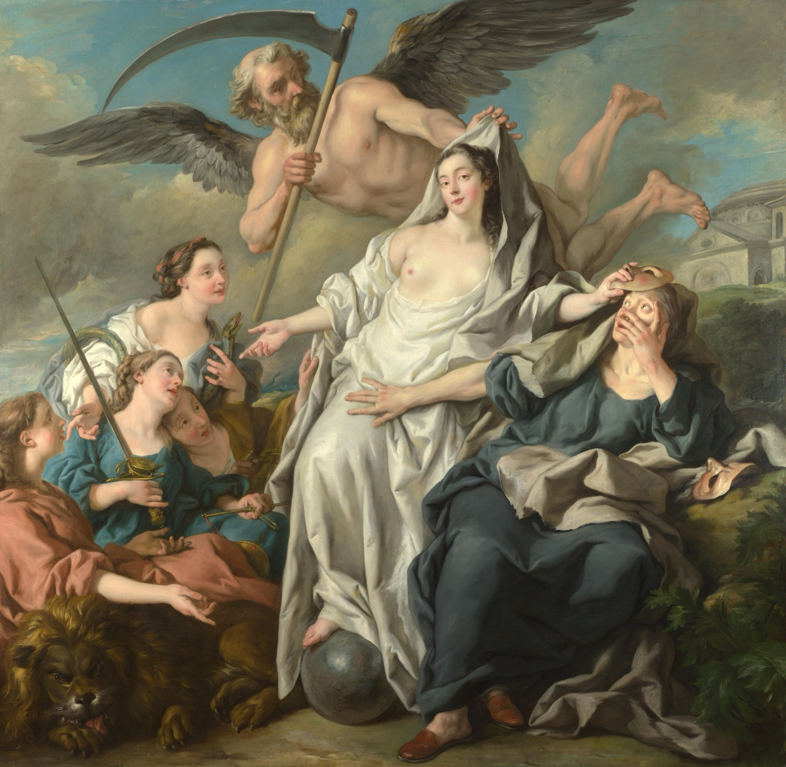
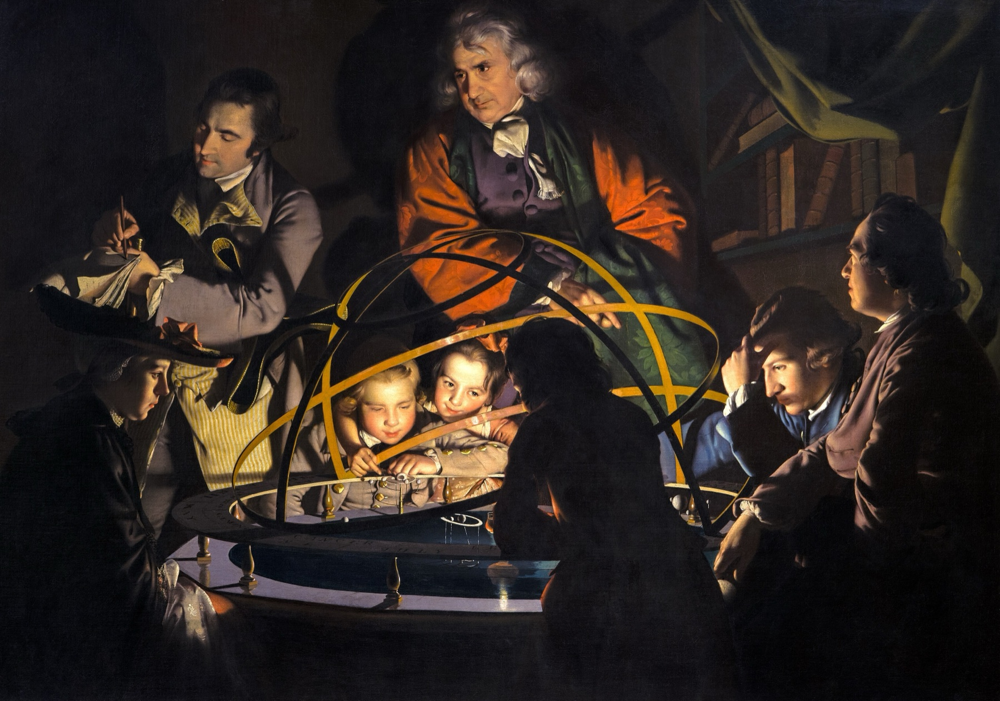
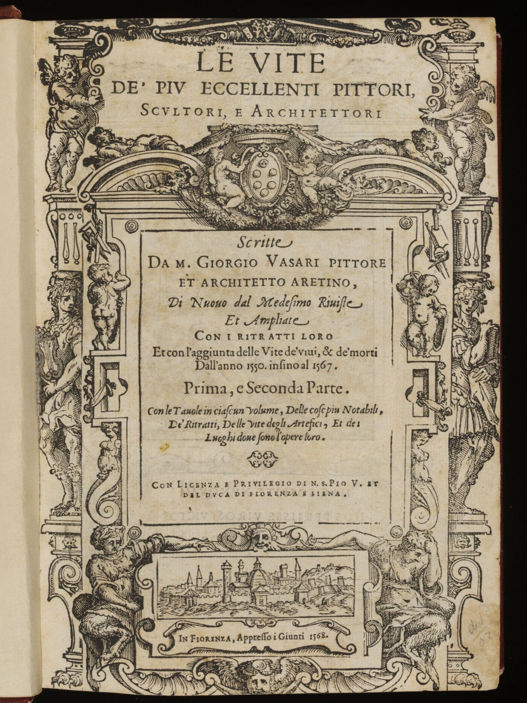
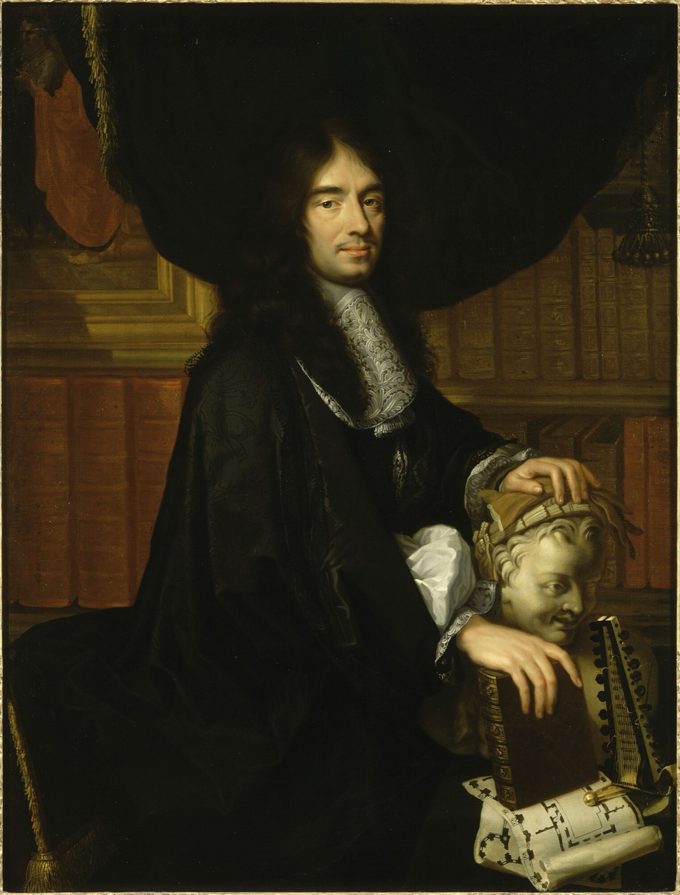
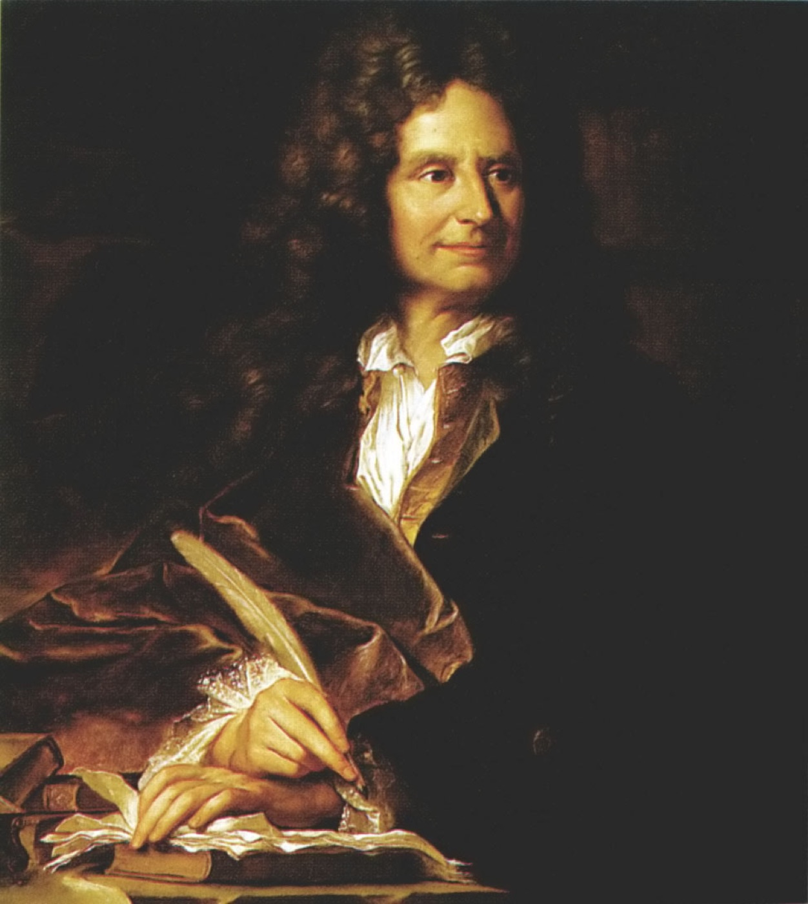
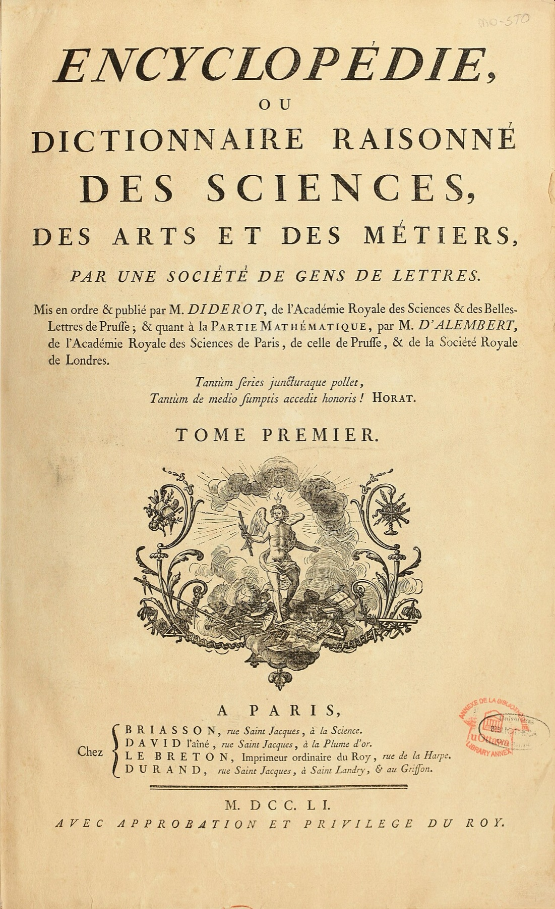
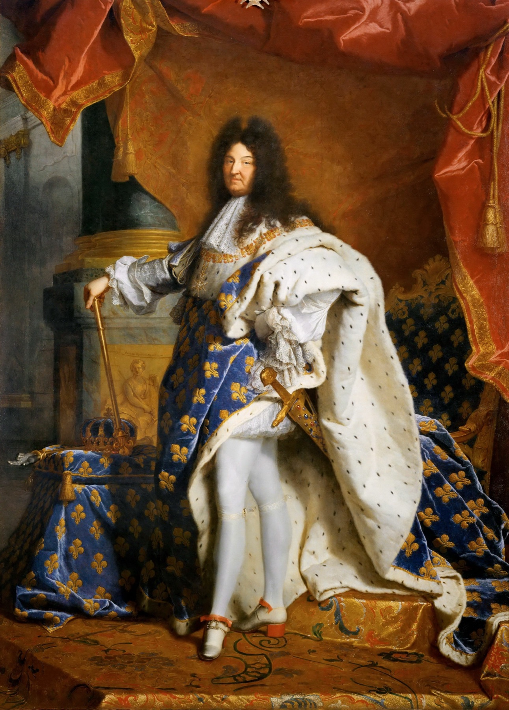
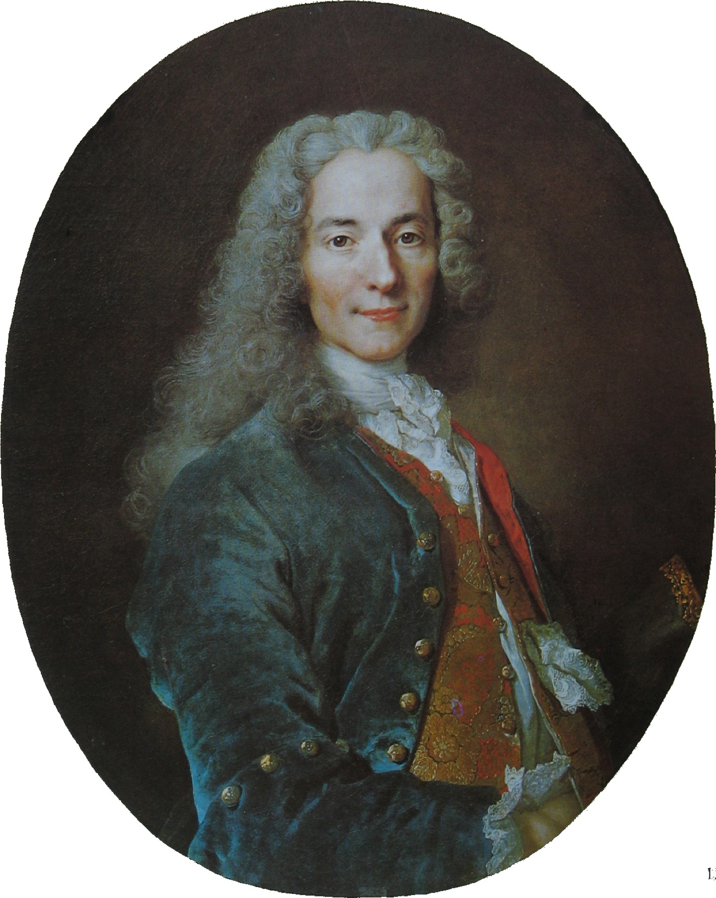
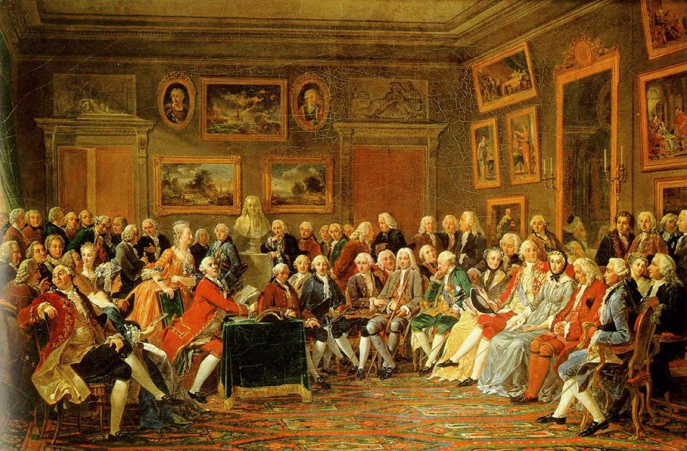

<!-- ========== COLD OPEN 01: TIME UNVEILING TRUTH ========== -->
<section class="image-slide" data-background="#0d1412" markdown="1">
<figure class="landscape">

<figcaption markdown="span">
<i>Time Unveiling Truth</i> · Jean-François de Troy, 1733
<em>Winged Time draws back the veil; Truth sits with her foot on the globe; Falsehood recoils on the right, clutching her masks. (National Gallery, London, NG6454. Public domain.)</em>
</figcaption>
</figure>
</section>

<!-- ========== COLD OPEN 01 NOTES: THE ALLEGORY ========== -->
<section markdown="1">

- **Time does the unveiling.** The winged old man with the scythe is Time, and he is the one pulling the cloth back. Not revelation, not authority — the passage of years. **That is the Enlightenment's central historical claim in one gesture, and it is the exact reverse of every scheme we just looked at, where time makes things worse.**
- **Truth's foot rests on the globe.** She is bright, unclothed and universal — true everywhere, for everyone. **That assumption is what makes a single standard of civilisation thinkable, and it is precisely what Herder will refuse at the end of today.**
- **Falsehood recoils, clutching masks.** Error is not shown as honest mistake; it is disguise, turning away from the light. **Enlightenment writers cast their opponents the same way — superstition and priestcraft as interested concealment rather than sincere disagreement.**
- **Nothing here is argued.** It is asserted, in the confident visual shorthand of an age that took the claim as settled. **Voltaire and Kant have to do what this painting skips.**

</section>

<!-- ========== COLD OPEN 02: THE ORRERY ========== -->
<section class="image-slide" data-background="#0d1412" markdown="1">
<figure class="landscape">

<figcaption markdown="span">
A lecture on a mechanical model of the solar system, England, c. 1766
<em>Joseph Wright of Derby, <i>A Philosopher Giving That Lecture on the Orrery, in which a Lamp is put in place of the Sun</i>. Derby Museum and Art Gallery. Public domain.</em>
</figcaption>
</figure>
</section>

<!-- ========== COLD OPEN 02 NOTES: THE LECTURE ========== -->
<section markdown="1">

- **The brass rings are an orrery**, a working model of the solar system, and the lamp at its centre stands in for the sun. **The universe is being shown as a mechanism whose parts run on rules you can predict — the same kind of order Kant will claim history has, working whether or not anyone intends it.**
- **The light is inside the machine.** Every face is lit by the model itself. **The age's favourite metaphor, made literal: illumination comes from the thing studied, not from above it.**
- **Someone is being paid to do this.** Travelling lecturers sold natural philosophy to provincial audiences by subscription. **Enlightenment is not only books and salons; it is a market — which is why the printers and booksellers matter, besides the writers.**
- **Two children are closest to the mechanism.** The scene is arranged around who comes next. **That is Diderot's stated reason for the whole Encyclopédie: to transmit it to those who come after, so past labour is not wasted.**

</section>

<!-- ========== COLD OPEN: THE TWO QUESTIONS ========== -->
<section markdown="1">
Before we start
{: .eyebrow}

## Two questions to hold onto
{: .main-point}

- How did Enlightenment thinking change *what history was for*?
- Three hundred years later, *what did it matter*?
{: .questions.compact}
</section>

<!-- ========== TITLE ========== -->
<section data-transition="fade" markdown="1">
Making History • HIST 1105 • Week 4
{: .eyebrow}

# Enlightenment Progress
{: .main-point}

- Voltaire, *Age of Louis XIV* (1751), Introduction
- Kant, "Idea for a Universal History with a Cosmopolitan Purpose" (1784)
- Background: Popkin, ch. 3, 61–69
{: .source-list}

Voltaire cited by page (Fleming translation, the edition on the syllabus); Kant by thesis number (Beck translation); Popkin by page.
{: .detail style="margin-top:0.8em; font-size:0.5em;"}
</section>

<!-- ========== THE TAKE HOME, UP FRONT ========== -->
<section data-transition="fade" markdown="1">
The take home · three things
{: .eyebrow}

## Progress was not discovered. It was argued for.
{: .main-point}

###### 01 · Nobody observed it
{: .label}

Nobody in 1751 walked outside and saw that history was improving. Writers **argued** it — in books, for reasons, against opposition, and for different purposes.

###### 02 · What they were arguing for
{: .label}

That human beings improve their own world by their own work — no providence, no golden age to get back to. Voltaire makes the case out of taste and cultural achievement, Kant out of theory. Both get called progress.

###### 03 · And every case needs a measure
{: .label}

To argue that things got better you have to say better *at what*. Name it, and you have sorted everybody by it — whether or not that was the point.

</section>

<!-- ========== THE ARC OF THE LECTURE ========== -->
<section data-transition="fade" markdown="1">
Where we're going · four parts
{: .eyebrow}

## The idea, the two writers you read, and what the next generation did with it
{: .main-point}

###### 01 · Before either book
{: .num}

#### Where the idea came from

The Renaissance had already cut time in three. A literary quarrel turned it around — and left history with a new job.

###### 02 · Voltaire, 1751
{: .num}

#### Progress you can see

Four ages in the whole history of the world, ranked by taste and manners, with one court at the top.

###### 03 · Kant, 1784
{: .num}

#### Progress you have to argue for

Not which age had the most taste, but why history as a whole should be going anywhere at all.

###### 04 · What became of it
{: .num}

#### A ladder, and the objection

Condorcet and Ferguson turn the idea into a scale you can measure people on. Herder, the same year as Kant, refuses it.

</section>

<!-- ================================================================ -->
<!-- =============== PART ONE: WHERE THE IDEA CAME FROM ============== -->
<!-- ================================================================ -->

<!-- ========== PERIODIZING 00: WHAT A PERIOD IS ========== -->
<section markdown="1">
Bridge between weeks 3 and 4
{: .eyebrow}

## Before you can say history improves, you have to cut it into pieces
{: .main-point}

"Renaissance historians stopped dividing history according to the framework of the 'four empires' inherited from the Bible and began instead to speak of three periods, antiquity, a 'middle age' from the fall of the western Roman Empire to their own day, and the new era in which they themselves lived, a way of dividing history into periods that is still prevalent." Popkin, *From Herodotus to H-Net*, pp. 50–51
{: .quote.compact.fragment data-fragment-index="0"}

###### What we saw last week
{: .label}

Valla proving the Donation of Constantine a forgery out of its own Latin. Machiavelli and Guicciardini writing what Popkin calls "purely secular narratives that made no pretense of trying to fit events into a divinely ordained plan or a grand scheme of universal history" (p. 52). Critical method and human causation are both in place a century before anyone says "Enlightenment."

###### What a periodization does
{: .label}

Naming the blocks decides three things at once: where one age stops, what the next one is for, and **which block the author is standing in**. Nobody finds these seams in the evidence. They are drawn. The rest of this part is people drawing them.

</section>

<!-- ========== PERIODIZING 01: THREE SHAPES ========== -->
<section markdown="1">
Before either book · the inherited options
{: .eyebrow}

## Three shapes time could have, and not one of them is progress
{: .main-point}

"Roman historians lamenting the corruption of republican values, Christian writers for whom human history began in the Garden of Eden, and Renaissance humanists for whom classical antiquity represented the pinnacle of human achievement had all agreed that the passage of time had left human beings worse off than they had once been." Popkin, *From Herodotus to H-Net*, p. 62
{: .quote.compact.fragment data-fragment-index="0"}

###### This course has read all three
{: .label}

**Classical: decline from a golden age.** Livy, on Rome falling away from its own virtue — here the good part really is behind you. **Christian: fallen, but aimed.** Bede counts from the Incarnation toward a fixed end. The world is worse than Eden and still going somewhere, on a schedule nobody sets. **Humanist: a standard not yet matched.** Antiquity as the mark the present is trying to reach again.

###### What they share, and what they don't
{: .label}

Popkin's point is the agreement: all three hold that time has left people **worse off than they once were**. But only the first runs simply downhill; the Christian version has a destination — which is why it is the one Kant will still need when he takes God out. **None of them offers a future better than any past, reached by human work.**

</section>

<!-- ========== PERIODIZING 02: THE FOUR EMPIRES ========== -->
<section markdown="1">
The scheme being dropped · Daniel 2
{: .eyebrow}

## The Bible already had a periodization, and you were living in its last age
{: .main-point}

"This image's head was of fine gold, his breast and his arms of silver, his belly and his thighs of brass, His legs of iron, his feet part of iron and part of clay." Daniel 2:32–33, King James Version
{: .quote.fragment data-fragment-index="0"}

###### What the statue was taken to mean
{: .label}

Daniel reads the dream to Nebuchadnezzar as a sequence of kingdoms: "Thou art this head of gold. And after thee shall arise another kingdom inferior to thee, and another third kingdom of brass... And the fourth kingdom shall be strong as iron" (2:38–40). Medieval chroniclers inherited it as four empires — Babylon, Persia, Greece, Rome — and counted their own rulers as Rome still going. This is the "framework of the 'four empires'" in the Popkin sentence you just read.

###### Read the metals in order
{: .label}

Gold, silver, brass, iron, then iron mixed with clay — and the last one is the one you are standing in. But notice where it is heading: there is no fifth kingdom, because what comes next is not another empire but the end — "in the days of these kings shall the God of heaven set up a kingdom, which shall never be destroyed" (2:44). This is not a story about decay. It is a story with an appointment.

###### Take home
{: .label}

For a thousand years this was the standard answer to "what period am I in?" **The fourth one. The last one. And the ending is already written.** History has a direction here — it just isn't ours to steer, and there is nothing to build.

</section>

<!-- ========== PERIODIZING 03: PETRARCH INVENTS THE MIDDLE ========== -->
<section markdown="1">
Petrarch · 1304–1374
{: .eyebrow}

## The middle age begins as a complaint about being born at the wrong time
{: .main-point}

"there was a more fortunate age and probably there will be one again; in the middle, in our time, you see the confluence of wretches and ignominy." Petrarch, *Epistolae metricae* III.33, trans. Theodor E. Mommsen, *Medieval and Renaissance Studies* (Cornell, 1959), pp. 127–128
{: .quote.compact.fragment data-fragment-index="0"}

###### Who is talking, and what he is actually doing
{: .label}

A Tuscan poet who spent his life hunting down, copying and correcting ancient Latin manuscripts — close enough to Cicero's prose to hear how far his own century had drifted from it. He is not proposing a chronology here. He is complaining about his luck. But count the times: a better past, a possible better future, and *in medium*, "in the middle," the present. The middle age exists because Petrarch needed somewhere to be standing.

###### And the metaphor that stuck to it
{: .label}

At the end of the *Africa* he writes to his own poem: "This sleep of forgetfulness will not last for ever. When the darkness has been dispersed, our descendants can come again in the former pure radiance" (IX.451–457, same translation, p. 127). Note what the better future is: a *return*. The best case is getting antiquity back. That is where "the Dark Ages" comes from — not from anyone who lived in them.

###### Take home
{: .label}

Petrarch cuts history in three by putting himself in the gap between two better times. Two centuries later Vasari fills the third period in with artists and calls it a rebirth. **A periodization is always drawn by someone, standing somewhere** — which is exactly what Voltaire will do with his four ages.

</section>

<!-- ========== IMAGE: MACHIAVELLI ========== -->
<section class="image-slide" data-background="#0d1412" markdown="1">
<figure class="portrait">

<figcaption markdown="span">
Where we left off · Machiavelli, last week's source
<em>He and Guicciardini wrote histories with no divine plan in them --- human causes only, two centuries before Voltaire. (Santi di Tito, Palazzo Vecchio, Florence. Public domain.)</em>
</figcaption>
</figure>
</section>

<!-- ========== PERIODIZING 04: VASARI, WHO HE IS ========== -->
<section markdown="1">
Vasari · 1511–1574
{: .eyebrow}

## The first history of art, written by a painter on the payroll
{: .main-point}

##### The man

Born in Arezzo in 1511; painter and architect to Cosimo I de' Medici in Florence. He decorated the Palazzo Vecchio and, from 1560, designed the Uffizi. He is not a scholar looking in from outside the trade: he is inside it, and inside the patronage that pays for it.

##### The book

*Le vite de' più eccellenti pittori, scultori et architettori* — Florence, 1550, much enlarged in 1568. Two hundred artists' lives, and the first attempt to narrate art as a development rather than a list. He wrote it while helping Cosimo found the Accademia delle Arti del Disegno (1563).

###### Keep this in view
{: .label}

The first history of art was written by a man with a stake in its outcome, about a period that ends with his own colleagues, for the duke who employed them all. **Nobody had to force a bias in later. It came built in.**

</section>

<!-- ========== IMAGE: VASARI'S LIVES ========== -->
<section class="image-slide" data-background="#0d1412" markdown="1">
<figure class="portrait">

<figcaption markdown="span">
Vasari's <i>Lives</i> · Giunti edition, Florence 1568
<em>Three centuries of painters sorted into a rising sequence ending in his own lifetime. <strong>The licence at the foot: printed by permission of the Pope and the Duke.</strong> (Public domain.)</em>
</figcaption>
</figure>
</section>

<!-- ========== PERIODIZING 05: VASARI'S THREE AGES ========== -->
<section markdown="1">
Vasari · Preface to the Second Part, 1550
{: .eyebrow}

## Three ages, and the third one is his own
{: .main-point}

"having made a distinction and division... into Three Parts, or we would rather call them ages, from the second birth of these arts up to the century wherein we live, by reason of that very manifest difference that is seen between one and another of them." Vasari, *Lives*, Preface to the Second Part, trans. Gaston du C. de Vere (1912–14)
{: .quote.compact.fragment data-fragment-index="0"}

###### "Second birth" is meant literally
{: .label}

His model is a life cycle. The arts, he writes in the Preface to the Lives, are "like human bodies," and "have their birth, their growth, their growing old, and their death" — which is why he can speak of "the progress of her second birth and of that very perfection whereto she has risen again in our times." Art died with Rome. Giotto is its infancy, the fifteenth century its adolescence, and his own generation its maturity. **This is where our word *Renaissance* comes from: a rebirth, on the calendar.**

###### And the third age has nowhere left to go
{: .label}

Of his own century he writes that "art has done everything that it is possible for her, as an imitator of nature, to do, and that she has climbed so high that she has rather to fear a fall to a lower height than to ever hope for more advancement." The peak is now — and because the peak is *recovery*, the ceiling is antiquity regained. There is no room above it.

###### Take home
{: .label}

Two centuries before Voltaire's four ages, here is a writer ranking periods by achievement and awarding the prize to his own. **The move is old. What is missing is a future** — and that absence is exactly what Kant and Condorcet will fill.

</section>

<!-- ========== THE ENLIGHTENMENT AS A PHENOMENON ========== -->
<section markdown="1">
The Enlightenment · roughly the 1680s to the 1790s
{: .eyebrow}

## Not a doctrine or a membership. A network, a print market, and a censor.
{: .main-point}

##### Who, and where

No institution, no manifesto, nobody who could say who was in it. A loose international traffic of writers, most of them not employed to think: Paris salons, Edinburgh clubs, Berlin, Naples, Philadelphia — and one salaried professor in Königsberg. They called it the Republic of Letters.

##### What made it possible

Two centuries of print. By 1700 there was "a large enough reading audience to support historical publications that were not underwritten by rulers or the church" (p. 59) — a writer could live on readers, not patrons. Learned journals reviewed the output; "[t]he system of 'peer review'... began to take shape" (p. 58). Against it: "formal systems of censorship, which had not existed in the Middle Ages" (p. 56), requiring approval before a book could be printed.

###### Why this matters for today's two texts
{: .label}

Both show their publishing situation on the page: Voltaire's printed in Berlin under another man's name, Kant's a magazine piece answering a rumor in another magazine. **The Enlightenment is not only a set of ideas. It is a print economy with a censor in it.**

</section>

<!-- ========== ENLIGHTENMENT 01: THE FLIP ========== -->
<section markdown="1">
The idea · before either book
{: .eyebrow}

## The turn happened in an argument about poetry
{: .main-point}

"As the 'moderns' began to prevail in this debate, they opened the way to a new vision of the meaning of time in which the future, with its possibilities for further achievement, loomed larger than the past." Popkin, *From Herodotus to H-Net*, p. 62
{: .quote.compact.fragment data-fragment-index="0"}

###### The quarrel
{: .label}

Not a treatise, and not a discovery. In the last decades of the seventeenth century the "quarrel of the ancients and the moderns" set writers who held that the Greeks and Romans could never be surpassed against writers who held that their own century had already matched them. It was about poems, plays and prose style.

###### What the moderns' win changed
{: .label}

Every scheme in the last four slides put the best age behind, or above, or already reached. Win the argument that living writers can beat the ancients, and the ceiling comes off: **the best age can be one nobody has seen yet.** That is the opening Voltaire and Kant walk through — and it is what makes their claim different from Vasari's rebirth.

###### Take home
{: .label}

The most consequential idea in this week's reading started as an argument about whether living poets were as good as Virgil.

</section>

<!-- ========== IMAGE: PERRAULT AND BOILEAU ========== -->
<section class="image-slide" data-background="#0d1412" markdown="1">
<figure class="pair">

<figcaption markdown="span">
Two sides of one quarrel · <strong>Perrault</strong> (left) and <strong>Boileau</strong> (right)
<em>January 1687: Perrault's poem tells the Académie française that his own century has beaten antiquity, and Boileau objects on the spot. <strong>Boileau was the king's own historiographer.</strong> (Left: Philippe Lallemand after Charles Le Brun, Château de Versailles. Right: workshop of Hyacinthe Rigaud, 1704. Both public domain.)</em>
</figcaption>
</figure>
</section>

<!-- ========== ENLIGHTENMENT 02: THE PROBLEM THE FLIP CREATES ========== -->
<section markdown="1">
The idea · the problem it creates
{: .eyebrow}

## If the past was benighted, why study it?
{: .main-point}

"For some authors, this put the value of studying history in question: if previous ages had been thoroughly benighted, what could their experience teach the present?" Popkin, *From Herodotus to H-Net*, p. 62
{: .quote.fragment data-fragment-index="0"}

###### The bind
{: .label}

A story of progress makes the present the best moment there has ever been. That is excellent news for the present and very bad news for the past, which becomes a record of error and superstition kept by people who didn't know what we know. History has just been demoted to a museum of mistakes.

###### The answer that saved the field
{: .label}

Others "still saw the study of the past as crucial for identifying the factors that had made progress possible and the obstacles that had to be overcome to facilitate it" (p. 62). History earns its keep by explaining the machinery of improvement — which is also Popkin's summary of the whole period: the idea of progress "challenged historians to defend the value of their discipline by arguing that it could contribute to the construction of a better future for humankind" (p. 69).

###### Take home
{: .label}

Every writer this term has had to answer "what is history for?" The Enlightenment is the moment the answer becomes: it shows you how to get where we're going.

</section>

<!-- ========== IMAGE: ENCYCLOPEDIE TITLE PAGE ========== -->
<section class="image-slide" data-background="#0d1412" markdown="1">
<figure class="portrait">

<figcaption markdown="span">
<i>Encyclopédie</i>, volume one, Paris 1751
<em>"Par une société de gens de lettres," four named booksellers, and "avec approbation et privilège du roy" --- the censor's licence, revoked eight years later. <strong>M.DCC.LI: the same year as Voltaire's book.</strong> (University of Ottawa copy, via ARTFL. Public domain; the red stamp is a modern library mark.)</em>
</figcaption>
</figure>
</section>

<!-- ========== ENLIGHTENMENT 03: THE PROJECT AT WORK ========== -->
<section markdown="1">
The <i>Encyclopédie</i> · Diderot's own article, 1755
{: .eyebrow}

## Not a place to store knowledge. A way to hand it on.
{: .main-point}

"the aim of an *Encyclopédie* is to assemble the knowledge scattered over the surface of the earth; to set out its general system to the men with whom we live, and to transmit it to the men who will come after us; so that the labours of centuries past shall not have been useless labours for the centuries that follow; that our descendants, becoming better instructed, shall at the same time become more virtuous and happier; and that we should not die without having deserved well of the human race." Diderot, "Encyclopédie," *Encyclopédie* vol. V (1755); my translation from the first-edition text
{: .quote.compact.fragment data-fragment-index="0"}

###### Read the verbs
{: .label}

Assemble, set out, **transmit**. The purpose is not that the book holds what is known but that it hands it forward — and the reason given is that otherwise the labour of past centuries is wasted. That is this week's whole idea written as a job description, and it is the same answer Popkin reports historians reaching for: study the past to find what made improvement possible.

###### What it actually took
{: .label}

Twenty-eight folio volumes over twenty-one years — seventeen of text (1751–1765), eleven of plates (1762–1772). More than 70,000 articles from more than 140 contributors, **Voltaire among them**. Sold by subscription to make the money back, printed under the royal licence you just saw on the title page, and carried on after 1759 without it.

###### The question it leaves open
{: .label}

"The knowledge scattered over the surface of the earth" — collected by whom, and arranged into whose general system? The sentence assumes there is one, and that a few men in Paris are the ones to set it out. **Hold that against Voltaire's four ages, twenty minutes from now.**

</section>

<!-- ========== ENLIGHTENMENT 04: WHAT "A HISTORY" WAS ========== -->
<section markdown="1">
The craft · what "a history" was in 1751
{: .eyebrow}

## Two respectable things to do with the past, and a gap between them
{: .main-point}

"[R]ather than following Vico, the most widely read historians of the Enlightenment era claimed to make use of the critical methods developed by their predecessors from the Renaissance onward, but they complained that the careful analysis of sources recommended by Mabillon too often resulted in dry antiquarian publications that discouraged readers and failed to teach useful lessons." Popkin, *From Herodotus to H-Net*, p. 63
{: .quote.compact.fragment data-fragment-index="0"}

###### Option one · the narrative of deeds
{: .label}

Wars, treaties, reigns, embassies, set down in sequence. This is what most readers meant by "a history," and it is exactly what Voltaire's own title promises: the age of a king. It is also the job he will hand off to "the compilers of annals."

###### Option two · the document scholars
{: .label}

Since Valla, and far more since the Benedictine Jean Mabillon (1632–1707) set out rules for judging whether a document is genuine, there was a rigorous alternative: establish what the sources *are* before anyone tells a story with them. "Mabillon's guidelines for the evaluation of evidence are still echoed in the training professional historians receive" (p. 60). Rigorous — and, per the complaint above, unread.

###### The gap Voltaire aims at
{: .label}

He wants the readability of the first and the seriousness of the second, pointed at a subject neither one covers: how people lived, thought, traded, and behaved. **That subject is the new part. The genre is not.**

</section>

<!-- ========== DISCUSSION 01: HUMAN CAUSES ========== -->
<section markdown="1">
Discussion · part one
{: .eyebrow}

## What does a historian gain by taking God out of the causal story?
{: .main-point}

Enlightenment writers insisted that "the motor forces of history were human rather than divine" (Popkin, p. 62). In Week 3 we read Bede, for whom God acts in the events being narrated.
{: .detail}

- What can a historian do with human causes that they cannot do with divine ones?
- And what does the change cost — what could Bede explain that Voltaire cannot?
{: .questions.compact.fragment}
</section>

<!-- ========== ANSWER 01 ========== -->
<section markdown="1">
Answer · part one
{: .eyebrow}

## Causes you can argue with, and a meaning nobody is guaranteeing
{: .main-point}

###### The gain
{: .label}

A human cause can be checked. If the claim is that a printing market and a censor produced a certain kind of writing, someone else can go look at printers and censors and disagree. Providence cannot be examined that way — it can only be believed or not. Once causes are human, history becomes a field where evidence settles arguments, which is the discipline this course has been watching get built.

###### What it costs
{: .label}

Bede's history has a guaranteed meaning: however far the world has fallen since Eden, it is still going somewhere, because God is taking it there. Remove that and the direction has to be argued for from scratch. **Hold onto this. Kant's "secret plan of Nature" is built to fill exactly the hole that opens here.**

</section>

<!-- ================================================================ -->
<!-- =============== PART TWO: VOLTAIRE ============================== -->
<!-- ================================================================ -->

<!-- ========== IMAGE: LOUIS XIV, THE EXPECTED SUBJECT ========== -->
<section class="image-slide" data-background="#0d1412" markdown="1">
<figure class="portrait">

<figcaption markdown="span">
What you'd expect this book to be about · Louis XIV, 1701
<em>Painted fourteen years before he died. The king Voltaire's title names. <strong>He is not the point of the book.</strong> (Hyacinthe Rigaud, Musée du Louvre. Public domain.)</em>
</figcaption>
</figure>
</section>

<!-- ========== VOLTAIRE 00: WHO HE IS ========== -->
<section markdown="1">
Voltaire · 1694–1778
{: .eyebrow}

## A guest of one king, writing about another
{: .main-point}

##### Already famous, already exiled

Born François-Marie Arouet in Paris. Imprisoned in the Bastille twice, in 1717 and again in 1726 after a quarrel with a nobleman; exiled to England for nearly three years, where he read Newton and Locke. By 1751 he is the most famous writer in Europe — plays, poetry, philosophy, all of it.

##### Where he actually wrote this book

Not in France. In 1750 Frederick the Great of Prussia invited him to Potsdam. Voltaire finishes the *Age of Louis XIV* there in 1751 — a Frenchman, at a Prussian court, writing the most influential celebration of French civilization of the century.

###### Why this matters
{: .label}

He is not a court historian working from royal archives. He is an independent celebrity, writing for a European reading public, from outside the country he is writing about.

</section>

<!-- ========== IMAGE: VOLTAIRE PORTRAIT ========== -->
<section class="image-slide" data-background="#0d1412" markdown="1">
<figure class="portrait">

<figcaption markdown="span">
Voltaire, age about thirty · Nicolas de Largillière, c. 1724–1725
<em>Some twenty-five years before the book on today's slides; he was 57 when he finished it. <strong>The closest thing to a likeness from life.</strong> (Nicolas de Largillière, Château de Versailles, MV 8159. Public domain.)</em>
</figcaption>
</figure>
</section>

<!-- ========== VOLTAIRE 01: THE BOOK AS AN OBJECT ========== -->
<section markdown="1">
The text · what the *Age of Louis XIV* is
{: .eyebrow}

## Twenty years of work, printed in Berlin, about a king dead since 1715
{: .main-point}

##### The book

Two volumes, 1751. Voltaire had been working at it since the 1730s. Roughly the first half narrates the reign's wars and politics, the way a history was expected to. The rest is chapters on government, commerce, science, the arts, and religion — and that part is what was new.

##### How it got out

Printed in Berlin, not Paris, and issued under the name of a member of the Prussian Academy, M. de Francheville, rather than Voltaire's own. Publishing in France meant clearing the royal censor. He wrote about French greatness from beyond French jurisdiction.

###### Why this matters
{: .label}

The Introduction is not Voltaire inventing history. It is Voltaire working inside an entirely ordinary genre and telling you, before the narrative starts, that he has changed what the book is *about*.

</section>

<!-- ========== VOLTAIRE 02: THE FOUR AGES ========== -->
<section markdown="1">
Voltaire 01 · The Introduction
{: .eyebrow}

## Only four ages in the whole history of the world
{: .main-point}

"Whosoever thinks, or, what is still more rare, whosoever has taste, will find but four ages in the history of the world. These four happy ages are those in which the arts were carried to perfection." Voltaire, *Age of Louis XIV*, Introduction, p. 5
{: .quote.fragment data-fragment-index="0"}

###### The list, and the test for making it
{: .label}

Greece under "Philip and Alexander." Rome under Caesar and Augustus. Medici Florence. And "the fourth age is that known by the name of the age of Louis XIV" — his own lifetime, named as one of only four peaks in recorded history (pp. 5–7). The test for entry is not military success. It's whether "the arts were carried to perfection."

###### Who's doing the ranking
{: .label}

Notice the qualifier: not everyone sees four ages, only "whosoever has taste" — a category Voltaire is visibly placing himself and his reader inside. This is not a neutral inventory. It is a judgment, made by someone claiming the authority to make it.

###### Take home
{: .label}

"Progress" starts here as connoisseurship: a short list of peaks, picked by people confident they can tell taste from barbarism.

</section>

<!-- ========== VOLTAIRE 03: CONFINE OURSELVES ========== -->
<section markdown="1">
Voltaire 02 · What the book will and won't do
{: .eyebrow}

## Not battles. The genius and manners of mankind.
{: .main-point}

"In this history we shall confine ourselves only to what is deserving of the attention of all ages, what paints the genius and manners of mankind, contributes to instruction, and prompts to the love of virtue, of the arts, and of our country." Voltaire, *Age of Louis XIV*, Introduction, p. 11
{: .quote.fragment data-fragment-index="0"}

###### What he's refusing to write
{: .label}

A few sentences earlier, on the same page, he names the job he's leaving to someone else: "the compilers of annals," whose task is "to point out the marches and countermarches of armies" and which towns were "taken and retaken again by force of arms." That is a direct jab at the chronicle tradition — recording events in the sequence in which they happened, the form this course has already read.

###### Then ask whose manners
{: .label}

Popkin's verdict on the result: Voltaire "practiced history as a form of literature, striving to infuse it with drama and a clear message," and emphasized cultural achievement — "although his interest was largely confined to elite culture" (p. 63). "The genius and manners of mankind" turns out to mean the manners of a few thousand people at the top.

###### Take home
{: .label}

A history book announcing what it refuses to cover is making an argument about what history is *for* — the same move Livy and Bede made, aimed at a new target.

</section>

<!-- ========== IMAGE: SALON DE MADAME GEOFFRIN ========== -->
<section class="image-slide" data-background="#0d1412" markdown="1">
<figure class="landscape">

<figcaption markdown="span">
What "manners" looks like · Madame Geoffrin's salon, Paris, 1755
<em>A reading of Voltaire's <i>L'Orphelin de la Chine</i>; Fontenelle, Montesquieu, Diderot and d'Alembert are in the room. <strong>It is also about forty people in one city.</strong> (Anicet-Charles-Gabriel Lemonnier, painted 1812, Château de Malmaison. Public domain.)</em>
</figcaption>
</figure>
</section>

<!-- ========== VOLTAIRE 04: EUROPE'S DEBT ========== -->
<section markdown="1">
Voltaire 03 · Where "progress" spreads from
{: .eyebrow}

## One court, and everyone else catching up
{: .main-point}

"This happy influence has not been confined to France; it has communicated itself to England... it has introduced taste into Germany, and the sciences into Russia; it has even re-animated Italy, which was languishing; and Europe is indebted for its politeness and spirit of society to the court of Louis XIV." Voltaire, *Age of Louis XIV*, Introduction, pp. 7–8
{: .quote.compact.fragment data-fragment-index="0"}

###### Read where the verbs point
{: .label}

France doesn't receive influence in this sentence — it exports it. England is stirred, Germany gets taste "introduced" into it, Italy is "re-animated" from outside. One court is the source; every other nation is a destination the source reaches.

###### The shape this gives to "progress"
{: .label}

Progress here isn't just something that happened once, in four places. It radiates *outward*, from a center, to everyone still catching up. That shape — one standard, everyone else measured against it — is exactly the shape historians in Week 9 (Said, Trouillot) will find underneath nineteenth-century imperial history.

###### Take home
{: .label}

Ask of any progress story: who is the source, and who is cast as still arriving?

</section>

<!-- ========== DISCUSSION 02: A FIFTH AGE ========== -->
<section markdown="1">
Discussion · part two
{: .eyebrow}

## What would it take to add a fifth age to Voltaire's list?
{: .main-point}

He names four: Greece under "Philip and Alexander," Rome under Caesar and Augustus, Medici Florence, and the age of Louis XIV (pp. 5–7). The test for entry is that "the arts were carried to perfection," and the judges are "whosoever has taste" (p. 5).
{: .detail}

- Who, on his terms, is qualified to decide?
- Could a society outside Europe meet the test as he states it?
{: .questions.compact.fragment}
</section>

<!-- ========== ANSWER 02 ========== -->
<section markdown="1">
Answer · part two
{: .eyebrow}

## The test is not a measurement. It is a membership.
{: .main-point}

###### Why the list can't be argued with
{: .label}

Nothing in "the arts were carried to perfection" can be picked up by someone else and applied to produce a different list. The qualifier does the work: only "whosoever has taste" sees four ages, and that is a category Voltaire places himself and his reader inside. A criterion only its author can apply will return its author's answer. Nor does the test leave a door open: all four ages sit in one line of descent, and the judge is the heir of that line.

###### Take home
{: .label}

He is not setting out to rank nations; he is setting out to say what a great age looks like. But once the measure is taste, "Europe is indebted... to the court of Louis XIV" (pp. 7–8) can be written as though it were a description. The sorting was settled by the choice of test, several pages before any evidence arrived.

</section>

<!-- ================================================================ -->
<!-- =============== PART THREE: KANT ================================ -->
<!-- ================================================================ -->

<section data-transition="fade" markdown="1">
The next claim · thirty-three years later
{: .eyebrow}

## Voltaire described it. Kant tries to explain why it has to happen.
{: .main-point}

Thirty-three years later, a philosopher in a Prussian university town asks a harder question — not which ages showed the most taste, but why history as a whole should be going anywhere at all.
{: .detail}
</section>

<!-- ========== KANT 00: WHO HE IS ========== -->
<section markdown="1">
Immanuel Kant · 1724–1804
{: .eyebrow}

## A professor who did not travel to make his case
{: .main-point}

##### The life

Born in Königsberg, in Prussia; studied and then taught at its university for his entire career, appointed professor of logic and metaphysics in 1770. By standard biographical accounts he never travelled far from the city.

##### The moment

Three years before this essay, the *Critique of Pure Reason* (1781) had made him the most talked-about philosopher in Germany — dense, technical, hard. This short essay, published in November 1784, is him trying the same questions in public, in a magazine.

###### Why this matters
{: .label}

Voltaire built his claim from travel and connoisseurship — he had seen courts across Europe. Kant builds his from a desk in one city, by argument alone.

</section>

<!-- ========== IMAGE: KANT PORTRAIT ========== -->
<section class="image-slide" data-background="#0d1412" markdown="1">
<figure class="portrait">

<figcaption markdown="span">
Kant, c. 1790 · six years after this essay
<em>Artist not securely known; Kant would have been about 66. <strong>About as close to a portrait from life as survives.</strong> (Unknown artist, possibly Elisabeth von Stägemann. Public domain.)</em>
</figcaption>
</figure>
</section>

<!-- ========== KANT 01: THE TEXT AS OBJECT ========== -->
<section markdown="1">
The text · why this essay exists at all
{: .eyebrow}

## An essay written to correct a rumor about a dinner conversation
{: .main-point}

"A favorite idea of Professor Kant's is that the ultimate purpose of the human race is to achieve the most perfect civic constitution... he wishes that a philosophical historian might undertake to give us a history of humanity from this point of view." notice in the *Gothaische Gelehrte Zeitung*, 1784, quoted in Kant's own footnote
{: .quote.compact.fragment data-fragment-index="0"}

###### Read the source of that sentence
{: .label}

Those aren't Kant's words. They're a magazine's secondhand paraphrase of something he apparently said to "a scholar who was traveling through" Königsberg — gossip about a dinner conversation, printed in a scholarly gazette before Kant had written a word of it down himself.

###### What he does about it
{: .label}

Kant's own footnote says the notice "occasions this essay, without which that statement could not be understood." He publishes the full argument in the *Berlinische Monatsschrift*, November 1784 — the same journal that, one month later, runs his other famous short piece from that year, "An Answer to the Question: What Is Enlightenment?"

###### Take home
{: .label}

One of the most influential essays on the direction of history exists because a philosopher had to correct his own dinner conversation in print.

</section>

<!-- ========== IMAGE: KONIGSBERG ========== -->
<section class="image-slide" data-background="#0d1412" markdown="1">
<figure class="landscape">

<figcaption markdown="span">
"Plan der Stadt Koenigsberg," 1763 · twenty-one years before the essay
<em>Kant was already teaching on the Kneiphof (D), the island with the cathedral (c, <i>Der Dom</i>) where he is buried. <strong>Essentially the entire geography of his life.</strong> (Leibniz-Institut für Länderkunde, Leipzig. CC0.)</em>
</figcaption>
</figure>
</section>

<!-- ========== KANT 02: NATURE'S SECRET PLAN ========== -->
<section markdown="1">
Kant 01 · The Eighth Thesis
{: .eyebrow}

## History as the working-out of a plan nobody can see
{: .main-point}

"The history of mankind can be seen, in the large, as the realization of Nature's secret plan to bring forth a perfectly constituted state as the only condition in which the capacities of mankind can be fully developed." Kant, Eighth Thesis
{: .quote.fragment data-fragment-index="0"}

###### Whose plan, exactly
{: .label}

Not any person's plan — nobody alive is executing it on purpose. Kant's claim is that *Nature* has one, working itself out through people who have no idea they're part of it. History has a direction even though none of its participants agreed to one.

###### Kant's own hedge
{: .label}

He doesn't claim to have proven this. Later in the same thesis: "Does Nature reveal anything of a path to this end? And I say: She reveals something, but very little." The philosopher making the strongest claim about history's direction admits the evidence for it is thin.

###### Take home
{: .label}

This is a much bigger claim than Voltaire's. Voltaire ranks four periods that already happened. Kant argues the whole species has to be going somewhere — as a matter of theory, not observation.

</section>

<!-- ========== KANT 03: UNSOCIAL SOCIABILITY ========== -->
<section markdown="1">
Kant 02 · The Fourth and Fifth Theses
{: .eyebrow}

## The engine is vanity, not virtue
{: .main-point}

"By 'antagonism' I mean the unsocial sociability of men, i.e., their propensity to enter into society, bound together with a mutual opposition which constantly threatens to break up the society." Kant, Fourth Thesis
{: .quote.fragment data-fragment-index="0"}

###### What actually does the work
{: .label}

People need each other and can't stand each other, both at once. Later in the same thesis he names what runs on that friction: "Thanks be to Nature, then, for the incompatibility, for heartless competitive vanity, for the insatiable desire to possess and to rule! Without them, all the excellent natural capacities of humanity would forever sleep, undeveloped."

###### His own image for it
{: .label}

The Fifth Thesis gives the picture: trees in a forest "each needs the others" and grow "a beautiful, straight stature" by competing for light, while a tree left alone "put[s] out branches at random and grow[s] stunted, crooked, and twisted." Isolation doesn't produce virtue. Competition does.

###### Take home
{: .label}

For Voltaire, progress is made by admirable people — Pericles, the Medici. For Kant, it is produced by vanity and greed that nobody involved would call admirable.

</section>

<!-- ========== KANT 04: CROOKED TIMBER ========== -->
<section markdown="1">
Kant 03 · The Sixth Thesis
{: .eyebrow}

## Even Kant doesn't think this ends cleanly
{: .main-point}

"This task is therefore the hardest of all; indeed, its complete solution is impossible, for from such crooked wood as man is made of, nothing perfectly straight can be built." Kant, Sixth Thesis
{: .quote.fragment data-fragment-index="0"}

###### The problem he can't solve
{: .label}

Humanity needs a "master" to enforce the laws that keep everyone's freedom from destroying everyone else's. But: "the master is himself an animal, and needs a master." Whoever holds power needs to be checked, and whoever checks them needs checking too. Kant sees the infinite regress and doesn't pretend to close it.

###### What this does to the Eighth Thesis
{: .label}

The "perfectly constituted state" from two theses ago turns out to require solving a problem Kant has just called impossible. Nature's plan, on his own account, aims at a target it can't fully reach. He calls the whole "Idea" a "guiding thread" rather than a proven law, and grants it looks "apparently silly" if read as anything more (Ninth Thesis).

###### Take home
{: .label}

Kant is not selling a utopia. He is describing a direction with no clean arrival — closer to an asymptote than a finish line.

</section>

<!-- ========== DISCUSSION 03: WHY VANITY ========== -->
<section markdown="1">
Discussion · part three
{: .eyebrow}

## Why would you build an argument for progress out of vanity and greed?
{: .main-point}

Kant thanks Nature for "heartless competitive vanity" and "the insatiable desire to possess and to rule" (Fourth Thesis) — then concedes that the goal cannot be fully reached, because "from such crooked wood as man is made of, nothing perfectly straight can be built" (Sixth Thesis).
{: .detail}

- What does he gain by not requiring anyone to be good?
- What does he give up by putting the plan beyond anyone's intention?
{: .questions.compact.fragment}
</section>

<!-- ========== ANSWER 03 ========== -->
<section markdown="1">
Answer · part three
{: .eyebrow}

## A machine that runs on people as they actually are
{: .main-point}

###### The gain
{: .label}

Vanity and greed are reliable in a way virtue is not. A progress that waited for people to improve morally would be a hope; a progress driven by competition is a mechanism, and it keeps working whether or not anyone involved intends the outcome. That is what lets Kant claim history as a whole is going somewhere without claiming anyone in it is admirable.

###### The bill
{: .label}

If the destination belongs to Nature and not to us, no one can be credited or blamed for arriving — and no evidence can count against the plan, since setbacks are just the crooked wood. Kant half-concedes it: the whole essay is a "guiding thread," not a proven law.

</section>

<!-- ========== IMAGE: ENCYCLOPEDIE FRONTISPIECE ========== -->
<section class="image-slide" data-background="#0d1412" markdown="1">
<figure class="portrait">

<figcaption markdown="span">
The larger project both writers belong to · Frontispiece to the <i>Encyclopédie</i>, 1772
<em>Truth at the centre, unveiled by Reason and Philosophy, the sciences and arts gathered below to receive the light. <strong>Progress with a picture of itself.</strong> (Charles-Nicolas Cochin, design; Benoît-Louis Prévost, engraving. Public domain.)</em>
</figcaption>
</figure>
</section>

<!-- ================================================================ -->
<!-- =============== PART FOUR: WHAT BECAME OF IT ==================== -->
<!-- ================================================================ -->

<!-- ========== CONDORCET AND FERGUSON ========== -->
<section markdown="1">
What became of the idea · the ladder
{: .eyebrow}

## From a claim about the past to a scale you can measure people on
{: .main-point}

"nature has set no term to the perfection of human faculties" Condorcet, *Sketch for a Historical Picture of the Progress of the Human Mind* (1794), quoted in Popkin, p. 67
{: .quote.fragment data-fragment-index="0"}

###### Where he wrote it
{: .label}

Condorcet wrote the *Sketch* "in the midst of the upheavals of the French Revolution" (p. 67) — in hiding, under warrant from the Revolution he had helped make. He was arrested on 27 March 1794 and found dead in his cell two days later. The most confident statement of unlimited human progress was written by a man being hunted.

###### And now it has numbered stages
{: .label}

In Scotland, Adam Ferguson's *Essay on the History of Civil Society* set out a "conjectural history" in which all societies "inevitably moved through a series of economic and cultural stages" — herding, then agriculture, then trade and manufacturing (p. 67). Once progress has stages, any society you encounter can be assigned one.

###### Take home
{: .label}

Voltaire ranked four ages that were over. Kant argued for a direction. **Here the sorting stops being a side effect and becomes the instrument:** Ferguson's stages exist to be held up against a society and read off. Condorcet, meanwhile, is using the same idea to argue for abolition and for women's votes.

</section>

<!-- ========== IMAGE: CONDORCET ========== -->
<section class="image-slide" data-background="#0d1412" markdown="1">
<figure class="portrait">

<figcaption markdown="span">
Condorcet · anonymous portrait, Musée Carnavalet
<em>Mathematician; argued in print for the abolition of slavery (1781) and for women's right to vote (1790). <strong>He wrote the <i>Sketch</i> in hiding from the Terror</strong> and never saw it published. (Anonymous, Musée Carnavalet P1668, Paris Musées. Public domain.)</em>
</figcaption>
</figure>
</section>

<!-- ========== HERDER'S OBJECTION ========== -->
<section markdown="1">
The objection · Johann Gottfried von Herder, 1744–1803
{: .eyebrow}

## The critic was Kant's own student
{: .main-point}

"[Herder] objected to the idea of measuring the distinctive cultures of different nations according to a universal standard of civilization derived from the experience of Western Europe." Popkin, *From Herodotus to H-Net*, p. 68
{: .quote.compact.fragment data-fragment-index="0"}

###### Who he was, and what he proposed instead
{: .label}

Herder studied under Kant at Königsberg in the early 1760s — same university, same city, twenty years before the two of them published opposing accounts in the same year; by the 1780s he was court preacher at Weimar. His alternative, per Popkin: "every nation had its own unique characteristics," best seen in "the folk culture of its ordinary people rather than by its educated elites," so that "each nation's past was considered only on its own terms" (p. 68). No universal plan. No ranking by taste.

###### Name what this targets
{: .label}

"A universal standard of civilization derived from the experience of Western Europe" is precisely what "Europe is indebted... to the court of Louis XIV" builds, and precisely what a single "perfectly constituted state" assumes has one correct shape. Herder's objection lands on both of today's texts, and on Ferguson's stages.

###### His version has a bill too
{: .label}

By making the nation, "defined primarily in terms of a shared language, the fundamental unit of human society, Herder also anticipated the strongly nationalist character of most European history-writing in the nineteenth century" (p. 68). Refusing one universal standard is not the same as refusing to rank people.

###### Take home
{: .label}

The objection to this week's writers didn't have to wait for a later century. It was down the hall — and it came with a cost of its own.

</section>

<!-- ========== IMAGE: HERDER ========== -->
<section class="image-slide" data-background="#0d1412" markdown="1">
<figure class="portrait">

<figcaption markdown="span">
Herder · Anton Graff, 1785, the year after Kant's essay
<em>He had sat in Kant's lectures twenty years earlier; by now court preacher at Weimar, publishing his own <i>Ideen</i> (1784–91). <strong>Kant reviewed it that year, unfavorably.</strong> (Anton Graff, 1785. Public domain.)</em>
</figcaption>
</figure>
</section>

<!-- ========== COMPARISON: VOLTAIRE VS KANT ========== -->
<section markdown="1">
Comparison · Two writers, one word
{: .eyebrow}

## Description, and theory bolted onto it
{: .main-point}

##### Voltaire · 1751
Names four peaks already reached, and ranks them by taste. Progress is something you can already see, made by particular gifted people at particular courts — and it radiates outward from the best one.

##### Kant · 1784
Names no peaks at all. Argues the whole species must be moving toward one endpoint, produced by vanity and competition nobody intends — and admits the evidence for it is thin.

###### The real difference
{: .label}

Not optimism versus pessimism — both call it progress. It's the *kind* of claim. Voltaire is doing connoisseurship: which ages showed the most taste. Kant is doing metaphysics: why history as a whole has to have a direction at all. One can be argued about with examples; the other can't be checked against anything.

###### What they share
{: .label}

A single standard, and one place at the top of it — French taste for Voltaire, one "perfectly constituted state" for Kant. Neither of them had to argue for that part. It came with the idea.

###### Take home
{: .label}

"Progress" is not one idea in this period. It's a description, with a theory bolted on a generation later — and the theory is the more dangerous half.

</section>

<!-- ========== DISCUSSION 04: A HISTORY THAT DOESN'T RANK ========== -->
<!-- The answer to this one is the slide that follows: THE TAKE HOME, PAID OFF. -->
<section markdown="1">
Discussion · part four
{: .eyebrow}

## Can you argue that things got better without also sorting people?
{: .main-point}

Ferguson's stages assign any society a rung (p. 67). Herder refuses the universal standard — and his alternative "anticipated the strongly nationalist character of most European history-writing in the nineteenth century" (p. 68).
{: .detail}

- Is the problem the measure itself, or a measure that doesn't admit it is one?
- Condorcet used this idea to argue for abolition. Does that change your answer?
{: .questions.compact.fragment}
</section>

<!-- ========== THE TAKE HOME, PAID OFF ========== -->
<section markdown="1">
The take home · paid off
{: .eyebrow}

## Nobody discovered progress. It was argued for — and the measures did the sorting.
{: .main-point}

###### How it got built
{: .label}

A literary quarrel about whether living poets could match Virgil. A celebrity writer ranking four ages by taste from a foreign court. A professor arguing from one city that Nature must have a plan, then admitting he can barely see it. A mathematician in hiding insisting there is no limit at all. Four jobs, one word.

###### And what the measures did
{: .label}

Taste put France above the rest of Europe. One "perfectly constituted state" put every other arrangement below it. Ferguson's stages put anyone still tending flocks near the bottom. **Not one of these is offered as a ranking** — each arrives inside a claim about direction. That is exactly why it took a contemporary to see it: Herder, in 1784.

###### The question worth carrying
{: .label}

When you next meet a claim that something is progress, the useful question isn't "is it true?" It's: what is this counting as better, who chose that measure, and where does it leave the people who did not?

</section>

<!-- ========== RECAP ========== -->
<section data-transition="fade" markdown="1">
Recap
{: .eyebrow}

## Six things
{: .main-point}

###### 01 · Popkin, p. 62
{: .num}

#### The flip

Decline, a fixed ending, a standard not yet matched --- three shapes, none of them progress. A literary quarrel turned time around.

###### 02 · Popkin, pp. 62, 69
{: .num}

#### History's new job

If the past was benighted, why study it? Because it explains how the improvement happened.

###### 03 · Voltaire, pp. 5, 11; Popkin, p. 63
{: .num}

#### Ranked by taste, not battles

Four peaks in all history, picked by "whosoever has taste" --- then manners, mostly elite.

###### 04 · Voltaire, pp. 7--8
{: .num}

#### One court, everyone catching up

"Europe is indebted... to the court of Louis XIV." One source; every other nation a destination.

###### 05 · Kant, Fourth--Ninth Theses
{: .num}

#### A plan, run by vanity

Nature aims at a "perfectly constituted state" through greed, and builds nothing straight.

###### 06 · Popkin, pp. 67--68
{: .num}

#### A ladder, and the objection

Condorcet: no limit, and abolition. Ferguson: stages you can hold up against people. Herder: no universal standard --- and a nationalism of its own.

</section>

<!-- ========== CLOSING DISCUSSION ========== -->
<section markdown="1">
Discussion · 4.1
{: .eyebrow}

## Is progress a historical fact, or a story we tell?
{: .main-point}

Four versions of it are now on the table: a quarrel about whether living poets could match Virgil, a ranking of four ages by taste, a plan of Nature nobody can observe, and a ladder with numbered rungs. The question is worth asking with all four in view rather than one.
{: .detail}
</section>
