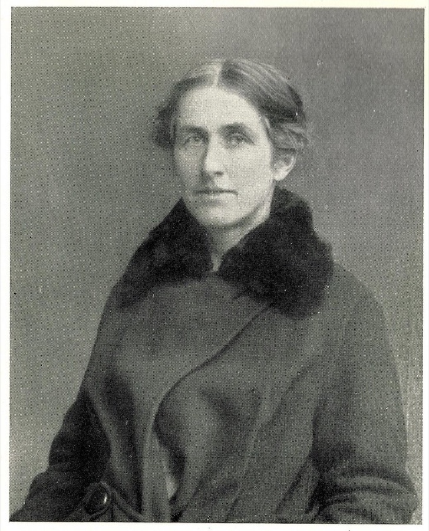
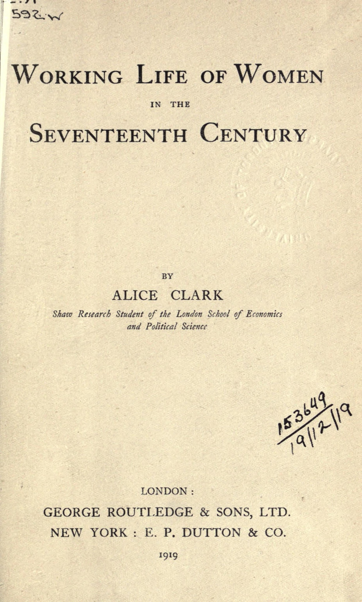
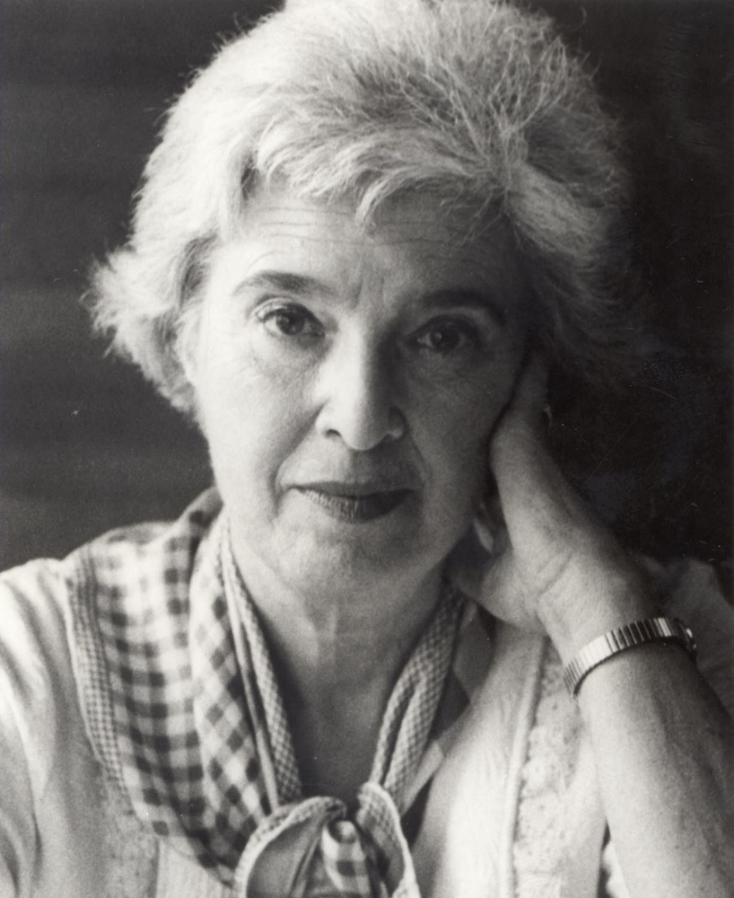
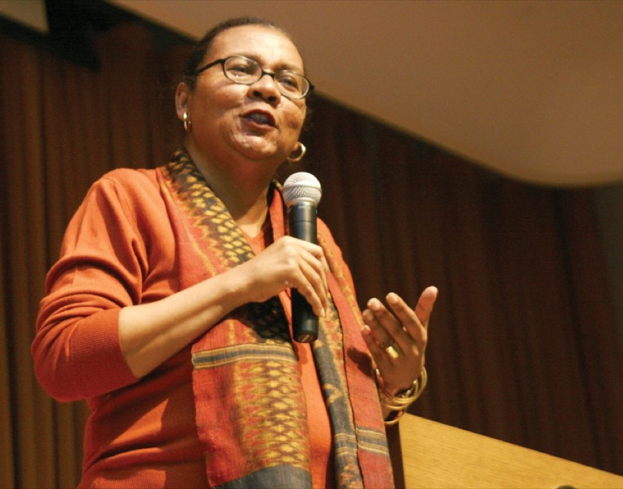
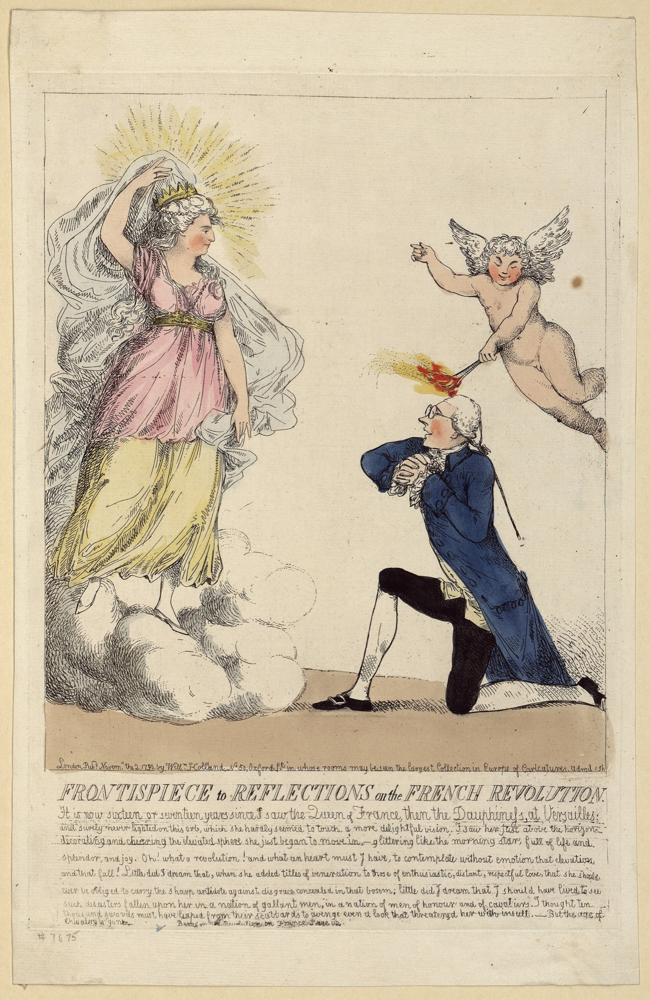
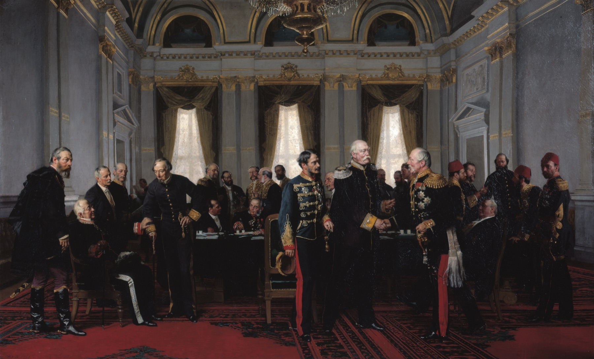

<!-- ========== COLD OPEN: THE ROOM ========== -->
<section class="image-slide bleed"
 data-background-image="images/berlin-congress-1892.jpg"
 data-background-size="contain"
 data-background-color="#0d1412" markdown="1">

An oil painting of a high gilded hall: two dozen men in uniforms, sashes, frock coats and fezzes stand and sit around a long table under tall curtained windows, one shaking hands at the center
{: .bleed-alt}

Anton von Werner, *Der Kongreß zu Berlin* — the closing session, 13 July 1878; painted 1892 · Deutsches Historisches Museum · public domain
{: .credit}

</section>

<!-- ========== COLD OPEN: THE FRAMING QUESTION ========== -->
<section markdown="1">
Berlin · 13 July 1878
{: .eyebrow}

## Today's claim is that this is a picture about gender
{: .main-point}

---

There is not a woman in the room. Where would you even start looking?
{: .question}
</section>

<!-- ========== TITLE ========== -->
<section data-transition="fade" markdown="1">
Making History • HIST 1105 • Week 6.2
{: .eyebrow}

# Gender: A Useful Category
{: .main-point}

---

- Background: Anna Green and Kathleen Troup, *The Houses of History* (1999), ch. 10: "Gender and History", 253–260
- Joan Wallach Scott, "Gender: A Useful Category of Historical Analysis", *American Historical Review* 91, no. 5 (1986): 1053–1075
{: .source-list}

Scott is cited by the page of the *AHR* printing. The Green and Troup pages are the editors' own introduction to their chapter; where they quote someone else, the slide names both ends.
{: .citation-note}
</section>

<!-- ========== THROUGHLINE ========== -->
<section markdown="1">
Today in context
{: .eyebrow}

## What makes history happen?
{: .main-point}

---

###### Week 5 · Marx and Braudel
{: .num}

Structures. Class conflict over production; sea, soil and climate underneath everything.

###### Week 6.1 · Thompson, 1963
{: .num}

People — making themselves, out of what they experience and what they do about it.

###### Week 6.2 · Scott, 1986
{: .num}

Gender, as the system that makes any of those arrangements look natural.

###### Week 7.1 · Ginzburg, 1976
{: .num}

One miller's cosmos, and what a single case can be made to carry.

</section>

<!-- ================================================================ -->
<!-- ===== PART ONE: HOW WOMEN GOT INTO HISTORY WRITING ============= -->
<!-- ================================================================ -->

<!-- ========== 1. THE COMPLAINT ========== -->
<section markdown="1">
Part one · the 1960s
{: .eyebrow}

## Women's liberation in the 1960s is when women set out to correct the record
{: .main-point}

---

"…it was during the 1960s' women's liberation movement that women began actively working to redress the absence of their lives and experience from most historical writing."

Green and Troup, <i>The Houses of History</i>, p. 253

</section>

<!-- ========== 2. WHY IT MATTERED ========== -->
<section markdown="1">
Part one · why it mattered
{: .eyebrow}

## Without a history, the way things are looks like the way things must be
{: .main-point}

---

"[t]o be without history is to be trapped in a present where oppressive social relations appear natural and inevitable. Knowledge of history is knowledge that things have changed and do change."

Glenn Jordan and Chris Weedon, <i>Cultural Politics</i> (1995), quoted in Green and Troup, p. 253

</section>

<!-- ========== 3. IMAGE: ALICE CLARK 1919 ========== -->
<section class="image-slide" data-background="#0d1412" markdown="1">
<figure class="pair">

<figcaption markdown="span">
Alice Clark, c. 1922, and her book of 1919
<em>The complaint is older than the movement: Clark wrote this as a research student at the London School of Economics. Green and Troup name her first among historians "researching women's lives from early this century" (p. 253). (Photograph: LSE Library, used for teaching. Title page: Internet Archive, public domain.)</em>
</figcaption>
</figure>
</section>

<!-- ========== 4. SEX AND GENDER ========== -->
<section markdown="1">
Part one · the distinction
{: .eyebrow}

## Sex is biology. Gender is what a society makes of it.
{: .main-point}

---

"Since sex is only rarely subject to change, it is not a useful concept for most historians." Gender is "the cultural definitions of behaviour defined as appropriate to the sexes in a given society at a given time."

Green and Troup, p. 253, the second phrase quoting Gerda Lerner (photographed c. 1981), <i>The Creation of Patriarchy</i> (1986)

</section>

<!-- ========== 5. GENDER HAS A HISTORY ========== -->
<section markdown="1">
Part one · the consequence
{: .eyebrow}

## If gender is made, then gender has a history
{: .main-point}

---

"If gender is a social construction, then gender has a history and we can ask the questions: who makes gender and by what means, and how does it endure and change?"

Green and Troup, pp. 253–54

</section>

<!-- ========== 6. RECOVERING WOMEN ========== -->
<section markdown="1">
Part one · recovering women
{: .eyebrow}

## Historians began by finding the women and writing them back in
{: .main-point}

---

"In the United States, activists lobbied for equal rights and historians tended to focus on examining women's status and experience in the past, sometimes writing about famous women."

Green and Troup, p. 254

</section>

<!-- ========== 7. PERIODIZATION ========== -->
<section markdown="1">
Part one · Joan Kelly, 1928–1982
{: .eyebrow}

## Adding women broke the periods historians already had
{: .main-point}

---

A Renaissance historian at City College, who came to women's history through Gerda Lerner and then asked her own period whether it happened.
{: .detail}

"there was no renaissance for women — at least, not during the Renaissance"

Joan Kelly, quoted in Green and Troup, p. 254

</section>

<!-- ========== 8. GENDER AND CLASS ========== -->
<section markdown="1">
Part one · gender and class
{: .eyebrow}

## Gender seemed to cut across class, and that is what broke the class analysis
{: .main-point}

---

"it seemed that some aspects of oppression and experience were common to women of all ranks despite the differences in their lives. And this oppression could be attributed to men, rather than to the specific economic system under which the women lived."

Green and Troup, pp. 254–55

</section>

<!-- ========== 9. WHICH WOMEN ========== -->
<section markdown="1">
Part one · the criticism
{: .eyebrow}

## Women of color showed that the shared experience was white and middle class
{: .main-point}

---

"[t]here is much evidence substantiating the reality that race and class identity creates differences in quality of life, social status, and lifestyle that take precedence over the common experience women share — differences which are rarely transcended"

bell hooks, <i>Feminist Theory: From Margin to Center</i> (1984), quoted in Green and Troup, p. 255, who call the premise she attacks "manifestly incorrect"

</section>

<!-- ========== 10. GENDER WITHOUT WOMEN ========== -->
<section markdown="1">
Part one · where it ended up
{: .eyebrow}

## Follow gender far enough and it turns up where no women are
{: .main-point}

---

"gender is present even when women are not"

Ava Baron, quoted in Green and Troup, p. 259

</section>

<!-- ================================================================ -->
<!-- =============== PART TWO: SCOTT'S LANGUAGE ===================== -->
<!-- ================================================================ -->

<!-- ========== IMAGE: JOAN SCOTT ========== -->
<section class="image-slide" data-background="#0d1412" markdown="1">
<figure class="portrait">

<figcaption markdown="span">
Joan Wallach Scott · b. 1941
<em>A historian of French labor, who had already written on women and work with Louise A. Tilly. She gave this paper to the American Historical Association in December 1985; the *AHR* printed it a year later.<strong>Why she matters:</strong> she argues that gender is not a subject to add to history but a category that changes what any history can ask.(Photograph by B. Sutherton, 2013, cropped. CC BY-SA 3.0.)</em>
</figcaption>
</figure>
</section>

<!-- ========== WHY THE WORD ========== -->
<section markdown="1">
Part two · why "gender"
{: .eyebrow}

## The word was chosen to say the difference is social, not natural
{: .main-point}

---

The word "denoted a rejection of the biological determinism implicit in the use of such terms as 'sex' or 'sexual difference.'"

Scott, p. 1054

</section>

<!-- ========== THE SAFE WORD ========== -->
<section markdown="1">
Part two · what happened to it
{: .eyebrow}

## Within ten years it had become a quieter way of saying women
{: .main-point}

---

"In its simplest recent usage, 'gender' is a synonym for 'women.'"

Scott, p. 1056

</section>

<!-- ========== A TOPIC, NOT A CATEGORY ========== -->
<section markdown="1">
Part two · the charge
{: .eyebrow}

## That makes gender a topic, and a topic changes nothing
{: .main-point}

---

"Gender is a new topic, a new department of historical investigation, but it does not have the analytic power to address (and change) existing historical paradigms."

Scott, p. 1057

</section>

<!-- ========== DEFINITION, FIRST HALF ========== -->
<section markdown="1">
Part two · the definition, first half
{: .eyebrow}

## Her definition turns on one word: perceived
{: .main-point}

---

"gender is a constitutive element of social relationships based on **perceived** differences between the sexes"

Scott, p. 1067 — also quoted in Green and Troup, p. 253. Emphasis added

</section>

<!-- ========== DEFINITION, SECOND HALF ========== -->
<section markdown="1">
Part two · the definition, second half
{: .eyebrow}

## Her theory of gender is in the second half
{: .main-point}

---

"gender is a primary way of signifying relationships of power"

Scott, p. 1067

</section>

<!-- ========== THE FOUR ELEMENTS ========== -->
<section markdown="1">
Part two · where to look
{: .eyebrow}

## Four places a historian can actually go looking for it
{: .main-point}

---

###### 01
{: .num}

#### Symbols

Eve and Mary, light and dark, purification and pollution.

###### 02
{: .num}

#### Norms

Doctrines that fix one meaning of male and female and state it "as the only possible one."

###### 03
{: .num}

#### Institutions

Kinship, the labour market, education, and the vote.

###### 04
{: .num}

#### Identity

How particular people were made into gendered subjects.

Scott, pp. 1067–68.
{: .cite}
</section>

<!-- ========== IMAGE: THE BURKE FRONTISPIECE ========== -->
<section class="image-slide" data-background="#0d1412" markdown="1">
<figure class="portrait">

<figcaption markdown="span">
*Frontispiece to Reflections on the French Revolution* · 1790
<em>Burke kneels to a vision of Marie-Antoinette while a cherub sets his head alight. Published 2 November 1790 — the day after Burke's book — with his own sentences about the queen engraved underneath. (Library of Congress, British Cartoon Prints Collection. Public domain.)</em>
</figcaption>
</figure>
</section>

<!-- ========== BURKE ========== -->
<section markdown="1">
Part two · Burke, 1790
{: .eyebrow}

## Burke argues against a revolution using two kinds of women
{: .main-point}

---

He sets "the furies of hell, in the abused shape of the vilest of women" against Marie-Antoinette, who fled the crowd to "seek refuge at the feet of a king and husband."

Edmund Burke, <i>Reflections on the Revolution in France</i>, summarized and quoted in Scott, p. 1071

</section>

<!-- ========== HIGH POLITICS ========== -->
<section markdown="1">
Part two · high politics
{: .eyebrow}

## A room with no women in it is the gendered one
{: .main-point}

---

"High politics itself is a gendered concept, for it establishes its crucial importance and public power … precisely in its exclusion of women from its work."

Scott, p. 1073

</section>

<!-- ========== DISCUSSION: PART TWO ========== -->
<section markdown="1">
Part two · discussion
{: .eyebrow}

## Gender without women
{: .main-point}

---

Scott says gender is at work in that room. What evidence would you need to show it, and where would you go looking?
{: .question .fragment data-fragment-index="1"}

Not the delegates' sex but what the room claims for itself: strength and weakness in the despatches, protection in the treaties, the laws each power took home about its own women.

</section>

<!-- ========== THE ARC ========== -->
<section markdown="1">
The lecture · looking back
{: .eyebrow}

## Getting women in, fixing the word, and a room full of men
{: .main-point}

---

###### 01 · Green and Troup
{: .num}

#### Getting women in

Recover the women, then break the periods, then set gender beside class — and each of those made the category "women" harder to hold.

###### 02 · Scott, 1986
{: .num}

#### Fixing the word

"Gender" had gone quiet, meaning "women" and threatening nothing. Her definition puts power back into it.

###### 03 · The payoff
{: .num}

#### Where it reaches

A treaty room whose authority runs on who is not in it.

</section>

