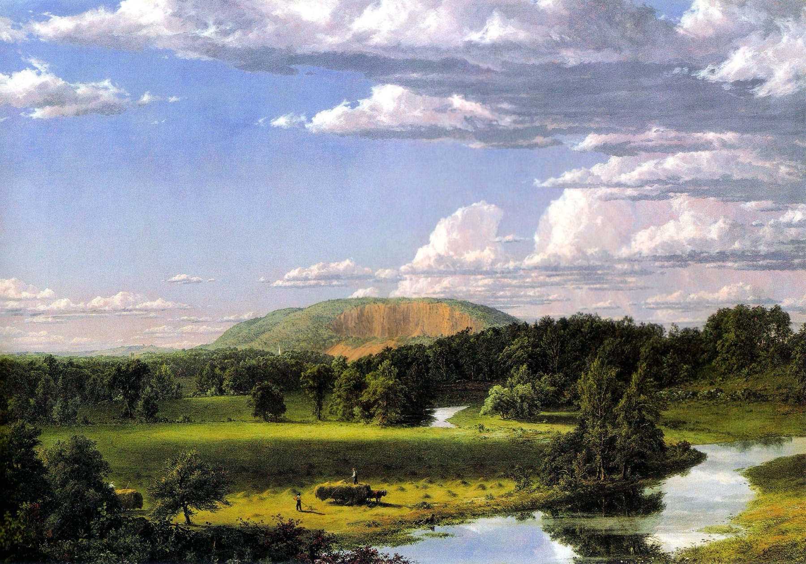
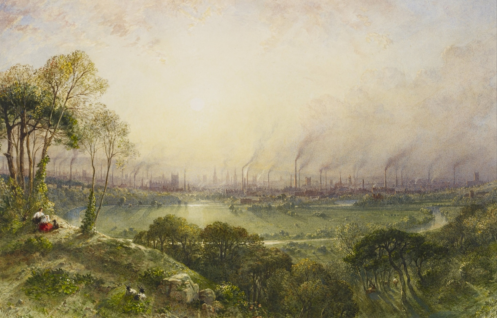
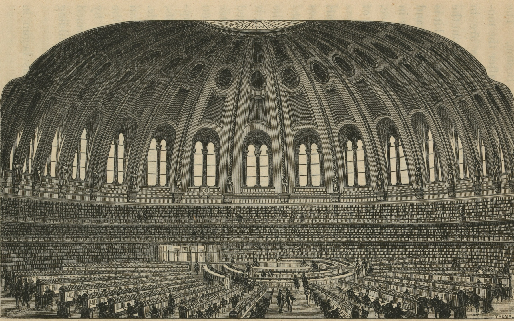
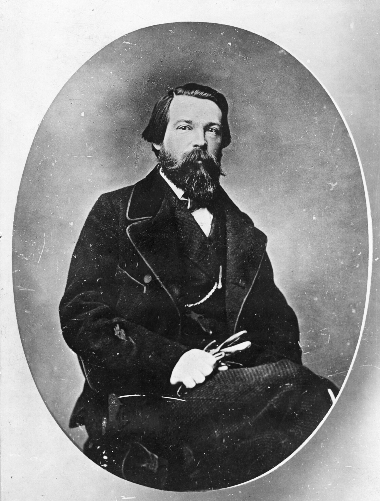
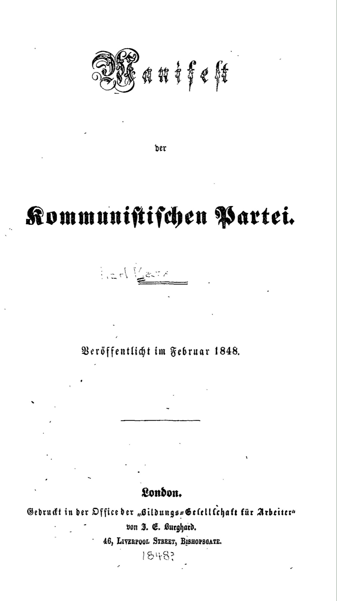
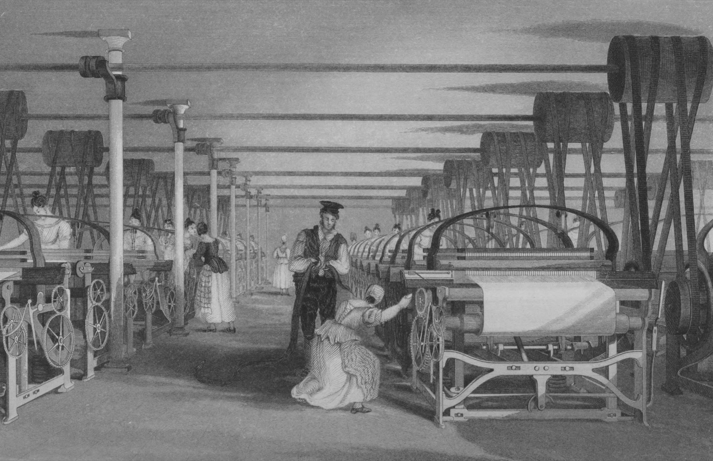
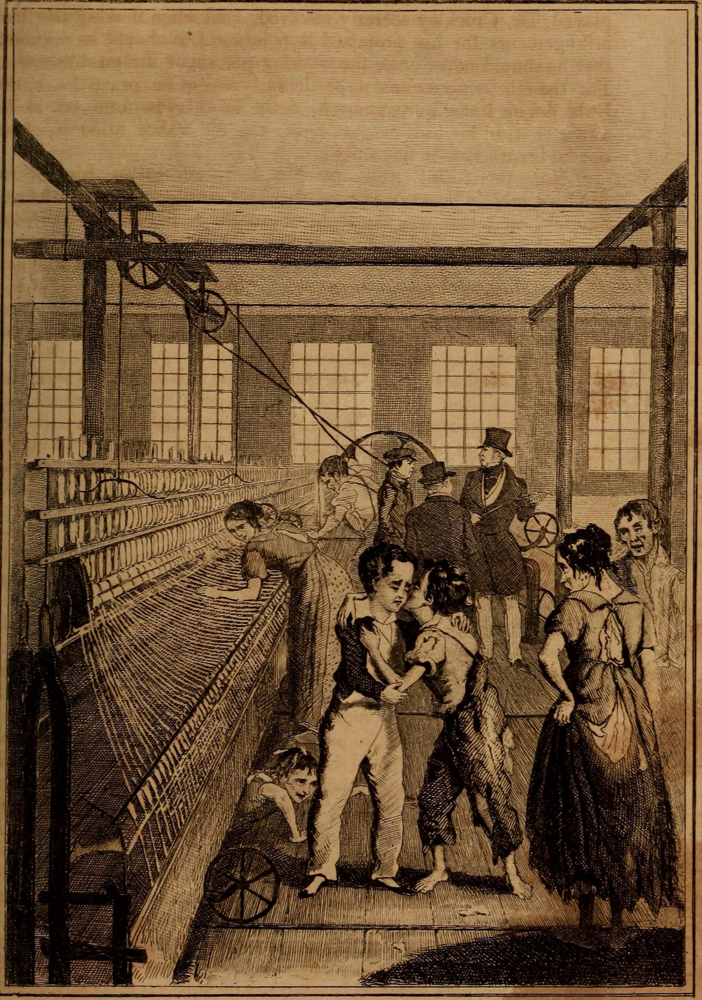
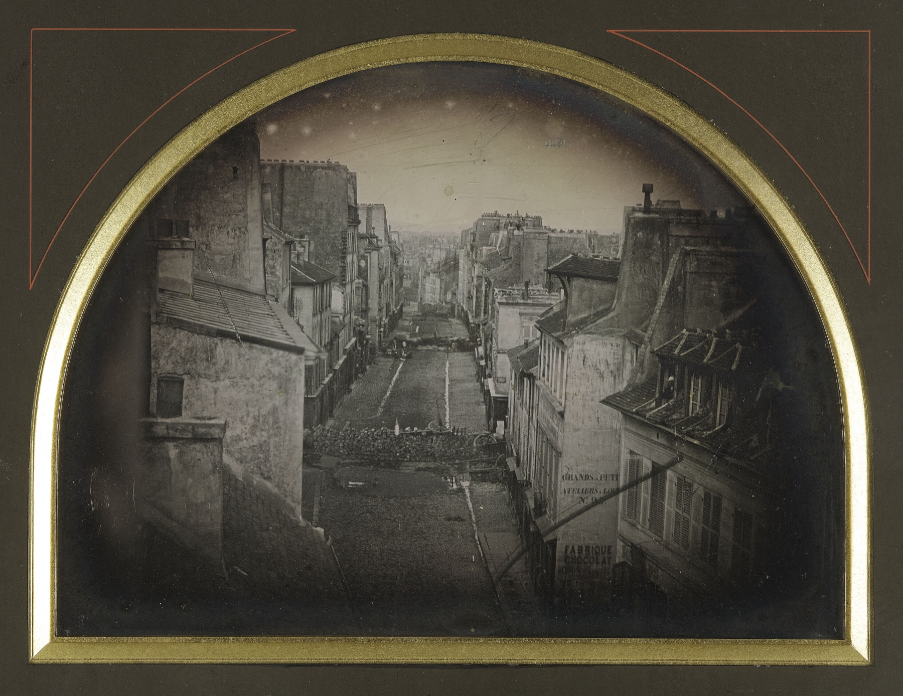
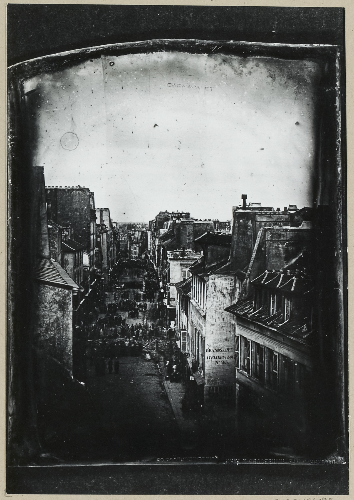
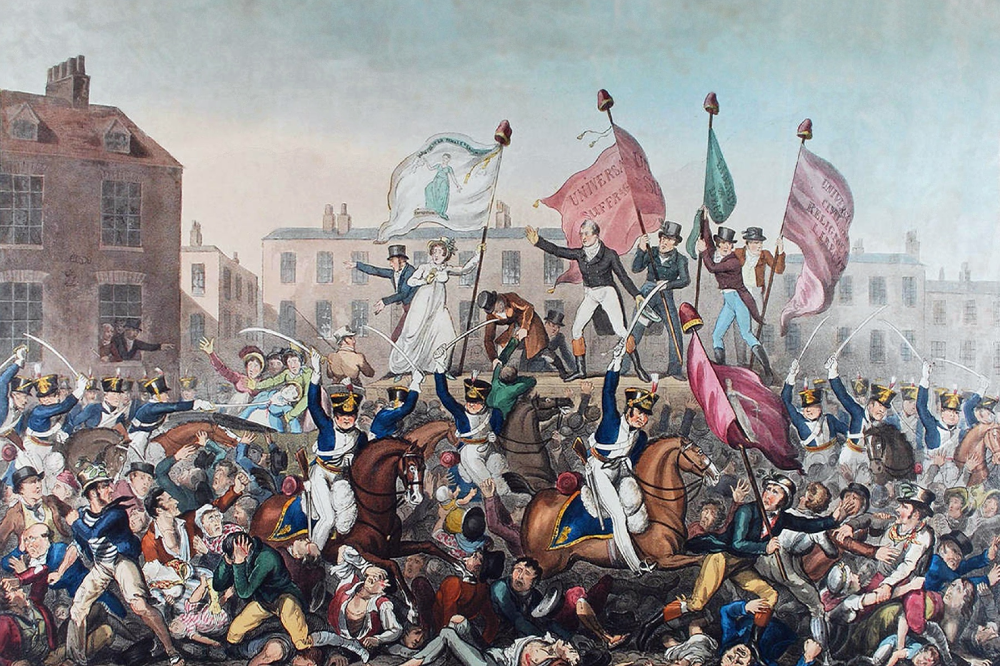

<!-- ========== COLD OPEN: WEST ROCK ========== -->
<section class="image-slide" data-background="#0d1412" markdown="1">
<figure class="landscape">

<figcaption markdown="span">
<i>West Rock, New Haven</i> · Frederic Edwin Church, 1849
<em>Haymakers loading a cart in a Connecticut valley, a church spire at the foot of the ridge. Painted the year after the <i>Manifesto</i>. (New Britain Museum of American Art. Public domain.)</em>
</figcaption>
</figure>
</section>

<!-- ========== COLD OPEN: MANCHESTER ========== -->
<section class="image-slide" data-background="#0d1412" markdown="1">
<figure class="landscape">

<figcaption markdown="span">
<i>Manchester from Kersal Moor</i> · William Wyld, 1852
<em>Painted four years after the <i>Manifesto</i>. Goats, a woman in a red skirt and a stand of trees in the foreground; along the horizon the mill chimneys of the world's first industrial city, in a haze the watercolour makes golden. <strong>A picturesque landscape convention, applied to Cottonopolis.</strong> (Royal Collection, via Google Art Project. Public domain.)</em>
</figcaption>
</figure>
</section>

<!-- ========== COLD OPEN NOTES ========== -->
<section markdown="1">

- **The chimneys are the horizon.** They run the full width of the picture, and each one is a steam engine burning coal. Manchester's population grew roughly fourfold in the first half of the century. <em class="ask">If nobody decided this, what kind of explanation could account for it?</em>
- **The foreground is Church's valley.** Goats, trees, a couple resting on a bank: the same landscape furniture as *West Rock*, set in front of industrial production. Both are in the frame because both were in the county. <em class="ask">When a new way of producing things arrives, does the old one vanish — or stay on in the foreground?</em>
- **The people who work in the mills are not in the picture.** Church put his haymakers in the middle of the field. Here the only figures are at rest; the thousands tending machines are out of sight under the smoke. <em class="ask">A history of forces can explain the chimneys. Where does it put the people inside the mills?</em>

</section>

<!-- ========== COLD OPEN: THE FRAMING QUESTION ========== -->
<section markdown="1">
Before we start
{: .eyebrow}

## Who decided Manchester would look like this?
{: .main-point}

- Nobody voted for the mill, the chimney, or the move from field to factory.
- If the largest change of the century had no author, what kind of explanation fits it — and what is left for the people living through it?
{: .questions.compact}
</section>

<!-- ========== TITLE ========== -->
<section data-transition="fade" markdown="1">
Making History • HIST 1105 • Week 5
{: .eyebrow}

# Marx and the Motor of History
{: .main-point}

- Marx and Engels, *Manifesto of the Communist Party* (1848), Part I: "Bourgeois and Proletarians"
- Background: Green and Troup, *The Houses of History*, ch. 2: "Marxist historians," 33–41
{: .source-list}

Marx's explanation of what drives historical change, the problem it ran into in 1848, and what historians did with that problem. Green and Troup cited by page; the *Manifesto* by section, since the assigned PDF reprints the 1888 Moore translation without the original pagination.
{: .detail}
</section>

<!-- ========== THE TAKE HOME AND THE ARC ========== -->
<section data-transition="fade" markdown="1">
The take home · three parts
{: .eyebrow}

## How people make a living drives history. People still have to act.
{: .main-point}

###### 01 · 1846–1867
{: .num}

#### The motor

Marx explains change by production, not by what rulers decide. Conflict breaks each order, and the next stage is "equally inevitable."

###### 02 · 1848–1852
{: .num}

#### The problem

Revolutions spread across Europe and failed. Marx concedes that people "make their own history, but they do not make it just as they please."

###### 03 · Since 1931
{: .num}

#### What historians did

How much the structure decides, and how much people do, is the argument Marxist historians kept having. Thompson follows in Week 6.

</section>

<!-- ================================================================ -->
<!-- =============== PART ONE: THE MOTOR ============================ -->
<!-- ================================================================ -->

<!-- ========== RANKE: WHAT EVENT HISTORY EXPLAINS ========== -->
<section markdown="1">
Part one · Ranke, 1824
{: .eyebrow}

## Ranke's history is built from what participants saw and decided
{: .main-point}

"The basis of the present work, the sources of its material, are memoirs, diaries, letters, ambassadors' reports, and original accounts of eyewitnesses..." Ranke, 1824 introduction
{: .quote.compact.fragment data-fragment-index="0"}

###### What those sources record
{: .label}

Each is one person's account of what they saw, intended or negotiated: kings, ministers, envoys, witnesses. Compare 4.2.

###### What they cannot explain
{: .label}

Green and Troup: putting economic relationships at the core "fundamentally differentiated" Marx from Ranke (p. 36). **No minister decided Manchester's skyline.**

</section>

<!-- ========== IMAGE: THE READING ROOM ========== -->
<section class="image-slide" data-background="#0d1412" markdown="1">
<figure class="landscape">

<figcaption markdown="span">
The Reading Room of the British Museum, 1859
<em>Smirke's domed room opened in 1857. Marx, a reader since 1850, spent years here working the theory he had sketched in 1848 into <i>Capital</i> (1867), which cites the reports of Britain's factory inspectors page after page. <strong>Not philosophy alone: the case was made from historical evidence.</strong> Compare Ranke's library in 4.2. (Wood engraving, 1859. Library of Congress, LC-DIG-ppmsca-15551. Public domain.)</em>
</figcaption>
</figure>
</section>

<!-- ========== READING ROOM NOTES ========== -->
<section markdown="1">

- **Find the readers.** They are the small dark shapes at the desks, nearly lost under the dome. Marx spent years at desks like these on a question nobody had assigned him: what drives economic and social change. <em class="ask">Where does a historian's question come from, if not out of the archive?</em>
- **Everything on these shelves is print.** Among it, the reports of Britain's factory inspectors and royal commissions: the state documenting factories in order to regulate them. <i>Capital</i> reads the same pages as evidence of a system. <em class="ask">What can reports like these show about a system, and what do they leave out about the people counted in them?</em>
- **The shelves run the whole circumference.** A claim about one decision can rest on one letter. A claim about what drives every society needs cases across centuries and countries. <em class="ask">How many cases does it take before a pattern counts as a cause?</em>

</section>

<!-- ========== IMAGE: MARX, WHO HE IS ========== -->
<section class="image-slide" data-background="#0d1412" markdown="1">
<figure class="portrait">

<figcaption markdown="span">
Karl Marx · 1818–1883
<em>Born in Trier; studied law and philosophy; edited a Cologne newspaper until Prussian censors shut it. Expelled from Paris, he reached England in 1849 and stayed for the rest of his life (Green and Troup, p. 34). <strong>Why he matters:</strong> "the single most influential theorist for twentieth-century historical writing" (p. 33) — who never held a post in history, or in any other subject. (John Jabez Edwin Mayall, 1875. Städel Museum. Public domain.)</em>
</figcaption>
</figure>
</section>

<!-- ========== IMAGE: ENGELS, WHO HE IS ========== -->
<section class="image-slide" data-background="#0d1412" markdown="1">
<figure class="portrait">

<figcaption markdown="span">
Friedrich Engels · 1820–1895
<em>A textile manufacturer's son from Barmen, sent at twenty-two to the family's cotton business in Manchester, and back in Barmen two years later wrote <i>The Condition of the Working Class in England</i> (1845) out of what he had seen there. Marx's "life-long collaborator" (Green and Troup, p. 34) and co-author of the text you read. <strong>Why he matters:</strong> much of the factory evidence in the <i>Manifesto</i> is his, and so are the footnotes qualifying it forty years later. (Amsler &amp; Ruthardt, c. 1860. Public domain.)</em>
</figcaption>
</figure>
</section>

<!-- ========== THE MOTOR: OVERVIEW ========== -->
<section markdown="1">
The motor · four parts
{: .eyebrow}

## Marx's motor of history has four parts
{: .main-point}

###### 01 · 1846, 1859
{: .num}

#### Production

People must first produce what they need to live. Law, politics and ideas rest on how they do it.

###### 02 · Manifesto
{: .num}

#### Classes

Each way of producing divides people into those who own and those who work for them.

###### 03 · Manifesto
{: .num}

#### Contradiction

Production outgrows the property order built around it, and the order breaks.

###### 04 · Manifesto
{: .num}

#### The next stage

Capitalism creates the working class that will overthrow it.

Step 1: *The German Ideology* (1846) and the 1859 preface. Steps 2–4: the *Manifesto*, Part I.
{: .detail}
</section>

<!-- ========== THE MOTOR 1: PRODUCTION ========== -->
<section markdown="1">
The motor · 1 · production
{: .eyebrow}

## Before anything else, people have to eat
{: .main-point}

"life involves before everything else eating and drinking, a habitation, clothing and many other things. The first historical act is thus the production of the means to satisfy these needs, the production of material life itself." Marx and Engels, <i>The German Ideology</i>, quoted in Green and Troup, p. 34
{: .quote.compact.fragment data-fragment-index="0"}

###### The two storeys
{: .label}

- **Base** — the forces of production (tools, technology, raw materials) and the relations of cooperation or subordination people enter to use them (p. 35).
- **Superstructure** — law, politics, religion and ideas, which Marx saw as arising out of material life rather than existing on their own (p. 35).

###### The 1859 version
{: .label}

Marx's preface puts the order in one sentence: "It is not the consciousness of men that determines their being, but, on the contrary, their social being that determines their consciousness" (p. 35).

###### Where that leaves people
{: .label}

**If social being determines consciousness, people's beliefs and choices follow from how they work.**

</section>

<!-- ========== IMAGE: THE 1848 TITLE PAGE ========== -->
<section class="image-slide" data-background="#0d1412" markdown="1">
<figure class="portrait">

<figcaption markdown="span">
<i>Manifest der Kommunistischen Partei</i> · London, February 1848
<em>"Manifesto of the Communist Party" — the first edition. A pamphlet, not a book, printed in Bishopsgate at the office of the <i>Bildungs-Gesellschaft für Arbeiter</i>, the Educational Society for Workingmen. <strong>No author is named anywhere on it.</strong> The pencilled "Karl Marx" and the "1848?" at the foot were added later, by someone cataloguing the sheet. (Public domain.)</em>
</figcaption>
</figure>
</section>

<!-- ========== THE MOTOR 2: CLASSES ========== -->
<section markdown="1">
The motor · 2 · classes
{: .eyebrow}

## Every society so far has divided into oppressor and oppressed
{: .main-point}

"The history of all hitherto existing society is the history of class struggles." Manifesto, Part I
{: .quote.fragment data-fragment-index="0"}

###### The pairs
{: .label}

"Freeman and slave, patrician and plebeian, lord and serf, guild-master and journeyman, in a word, oppressor and oppressed, stood in constant opposition to one another" (Part I). Each pair is defined by its place in producing things.

###### A class is a position, not an income
{: .label}

Engels's 1888 note defines the bourgeoisie as "owners of the means of social production and employers of wage labour," and the proletariat as those who, owning none, "are reduced to selling their labour power in order to live." Neither mentions how much anyone earns.

###### Classes and people
{: .label}

**A class is made by its place in the work, not by what its members choose.**

</section>

<!-- ========== THE MOTOR 3: CONTRADICTION ========== -->
<section markdown="1">
The motor · 3 · contradiction
{: .eyebrow}

## What builds an order is what breaks it
{: .main-point}

"the feudal relations of property became no longer compatible with the already developed productive forces; they became so many fetters. They had to be burst asunder; they were burst asunder." Manifesto, Part I
{: .quote.compact.fragment data-fragment-index="0"}

###### The mechanism
{: .label}

Productive forces develop; the property order obstructs them; the order breaks, as feudalism did. Each stage holds "a dominant class, and one which would overthrow it" (p. 35).

###### Turned on the present
{: .label}

Capitalism's crises come from "too much civilisation, too much means of subsistence, too much industry, too much commerce." **The crisis comes from the system, not from anyone's decision.**

</section>

<!-- ========== IMAGE: THE POWER LOOM SHED ========== -->
<section class="image-slide" data-background="#0d1412" markdown="1">
<figure class="landscape">

<figcaption markdown="span">
Power-loom weaving · from Edward Baines, <i>History of the Cotton Manufacture in Great Britain</i>, 1835
<em>Rows of looms driven by belts from one overhead shaft, in a clean, well-lit hall. Almost every worker in the plate is a woman or a girl. <strong>Baines's book is a defence of the cotton industry</strong> — this is how it chose to picture a factory. (T. Allom, engraved by J. Tingle, 1835. Public domain.)</em>
</figcaption>
</figure>
</section>

<!-- ========== IMAGE: THE SPINNING ROOM ========== -->
<section class="image-slide" data-background="#0d1412" markdown="1">
<figure class="portrait">

<figcaption markdown="span">
"Love conquered Fear" · Auguste Hervieu, 1839
<em>A plate for Frances Trollope's <i>Michael Armstrong, the Factory Boy</i>: two brothers embrace between the spinning mules while the mill owner watches in a top hat, and a child crouches under the machine. <strong>Trollope wrote the novel against the factory system.</strong> (Plate dated 20 April 1839, Henry Colburn; faces ch. VIII. Library of Congress copy, via Internet Archive. Public domain.)</em>
</figcaption>
</figure>
</section>

<!-- ========== FACTORY NOTES ========== -->
<section markdown="1">

- **The same industry, drawn twice.** Baines (1835) shows an orderly weaving hall, in a book defending cotton. Hervieu (1839) shows a spinning room of ragged, barefoot children, the owner behind them in a top hat. <em class="ask">Which picture is evidence of factory conditions, and what is the other evidence of?</em>
- **Look under the machine.** Trollope names the job: the "scavenger," "a little girl about seven years old," obliged "to stretch itself with sudden quickness on the ground, while the hissing machinery passed over her" (ch. VIII, p. 80). <em class="ask">The worker "becomes an appendage of the machine." Does the motor need to know what that was like?</em>
- **Both were made to persuade.** Trollope's preface gives her aim: "to drag into the light of day... the hideous mass of injustice and suffering to which thousands of infant labourers are subjected." <em class="ask">If every picture of a factory was made to win an argument, what could tell a historian what factories were like?</em>

</section>

<!-- ========== THE MOTOR 4: THE NEXT STAGE ========== -->
<section markdown="1">
The motor · 4 · the next stage
{: .eyebrow}

## Capitalism builds the class that will overthrow it
{: .main-point}

"...its own grave-diggers. Its fall and the victory of the proletariat are equally inevitable." Manifesto, Part I
{: .quote.fragment data-fragment-index="0"}

###### How the factory makes a class
{: .label}

- **Deskilled.** The worker "becomes an appendage of the machine."
- **Cheapened.** Wages fall toward "the means of subsistence."
- **Assembled.** "Masses of labourers, crowded into the factory, are organised like soldiers," and their clashes with employers "take more and more the character of collisions between two classes."

###### The word "inevitable"
{: .label}

**Here the motor finishes the story by itself. Nobody has to choose the outcome.**

</section>

<!-- ========== DISCUSSION: IS IT PROVABLE? ========== -->
<section markdown="1">
Discussion · the motor
{: .eyebrow}

## Is this provable? What would proof look like?
{: .main-point}

Part I claims a pattern across "all hitherto existing society" and an outcome that is "equally inevitable." Marx spent much of the next twenty years in the Reading Room, working it out against evidence.
{: .detail}

- Which parts could a historian check against records, and which could no record settle?
- What would count as evidence against it?
{: .questions.compact.fragment}
</section>

<!-- ========== ANSWER: IS IT PROVABLE? ========== -->
<section markdown="1">
Answer · the motor
{: .eyebrow}

## The pieces can be checked. The whole is judged by what it explains.
{: .main-point}

###### What records can settle
{: .label}

Wages, hours, deskilling, factory size, the timing of crises: the kind of evidence in the inspectors' reports Marx read. Some held and some did not. Real wages rose across the later nineteenth century, and the unions that formed were "primarily reformist in intent" (p. 38).

###### What no single record settles
{: .label}

A pattern across "all hitherto existing society" is judged by how many cases it explains, and how well. A forecast of what is "inevitable" can only be waited for.

###### Where the evidence leads
{: .label}

**The records that test the motor are records of what people did — and it was not what "inevitable" predicted.**

</section>

<!-- ================================================================ -->
<!-- =============== PART TWO: THE PROBLEM ========================== -->
<!-- ================================================================ -->

<!-- ========== 1848 ========== -->
<section markdown="1">
Part two · 1848–1849
{: .eyebrow}

## In 1848 revolutions spread across Europe. In Paris, workers rose and lost.
{: .main-point}

###### The year
{: .label}

- **February.** The pamphlet is printed in London. That same month Paris rises and the king abdicates.
- **March to May.** Vienna, Berlin, Milan, Venice, Budapest, Prague: mostly liberal and national revolts.
- **June.** Paris workers build barricades and are cleared from them in four days. By August 1849 the last holdouts, Hungary and Venice, have surrendered.

###### What the motor does not say
{: .label}

**The motor explains why workers had grievances. It does not explain who went to the barricades, or why they lost.**

</section>

<!-- ========== IMAGE: THE BARRICADE, BEFORE ========== -->
<section class="image-slide" data-background="#0d1412" markdown="1">
<figure class="landscape">

<figcaption markdown="span">
The rue Saint-Maur barricades · Sunday 25 June 1848, about 7:30 a.m.
<em>Charles François Thibault's daguerreotype, taken from high above the street before General Lamoricière's troops attacked. The label on the mount calls the street the Faubourg du Temple. (Musée Carnavalet, PH2861. CC0.)</em>
</figcaption>
</figure>
</section>

<!-- ========== IMAGE: THE BARRICADE, AFTER ========== -->
<section class="image-slide" data-background="#0d1412" markdown="1">
<figure class="portrait">

<figcaption markdown="span">
The same street · Monday 26 June 1848, after the attack
<em>Thibault's second plate, from the same viewpoint. Where the barricades stood, the street is full of figures and carts. (Copy print of the daguerreotype in the Musée d'Orsay, showing the whole plate. Musée Carnavalet. CC0.)</em>
</figcaption>
</figure>
</section>

<!-- ========== BARRICADE NOTES ========== -->
<section markdown="1">

- **Look for the people.** On Sunday morning the street is empty: two walls of paving stones and one figure at a dormer window. Whoever built the barricades overnight, out of the street itself, is out of sight. <em class="ask">What would a theory of production tell you about the people who built these?</em>
- **The same view on Monday.** After the troops attacked, the street where the barricades stood is crowded with figures and carts. <em class="ask">What changed between the two plates: how Paris made its living, or what people did in a day?</em>
- **Among the first news photographs.** Both plates were engraved for the illustrated press, so readers saw the barricade before the attack and after it. <em class="ask">If these two pictures were all you had, what could you say about why the June rising failed?</em>

</section>

<!-- ========== THE EIGHTEENTH BRUMAIRE ========== -->
<section markdown="1">
<i>The Eighteenth Brumaire of Louis Bonaparte</i> · 1852
{: .eyebrow}

## Marx's own answer: people make history, but not as they please
{: .main-point}

"Men make their own history, but they do not make it just as they please; they do not make it under circumstances chosen by themselves, but under circumstances directly encountered, given, and transmitted from the past." Marx, quoted in Green and Troup, p. 36
{: .quote.compact.fragment data-fragment-index="0"}

###### What the book is
{: .label}

Marx's history of what had just happened in France: how the revolution of 1848 produced the rule of Louis Bonaparte. The sentence explains why people who make a revolution do not get the one they intended.

###### A paradox inside the motor
{: .label}

Green and Troup: the dialectic of change "is, nonetheless, dependent upon the consciousness and actions of men and women" (p. 36). **The structure changes only when people act.**

</section>

<!-- ========== DISCUSSION: THE PROBLEM ========== -->
<section markdown="1">
Discussion · the problem
{: .eyebrow}

## If the motor runs by itself, why did 1848 turn on what people did?
{: .main-point}

The *Manifesto* calls the outcome "equally inevitable." The *Brumaire* says people make history "under circumstances directly encountered, given, and transmitted from the past."
{: .detail}

- What does the *Brumaire* sentence give to people, and what does it keep from them?
- If people have to act for the structure to change, is "inevitable" still the right word?
{: .questions.compact.fragment}
</section>

<!-- ========== ANSWER: THE PROBLEM ========== -->
<section markdown="1">
Answer · the problem
{: .eyebrow}

## The structure sets the terms. People decide what happens within them.
{: .main-point}

###### Both halves of the sentence
{: .label}

Circumstances "given, and transmitted from the past" limit what anyone can do. Within them, what people understand and choose decides the outcome. Green and Troup read this as challenging a determinism that "can be seen as implicit" in the theory (p. 36).

###### The argument Marx left
{: .label}

Hobsbawm: "the crucial argument about the materialist conception of history has concerned the fundamental relationship between social being and consciousness." Green and Troup suggest it "might be described as one of the strongest unifying themes" of Hill, Hobsbawm and Thompson (p. 36).

###### What historians inherited
{: .label}

**How much the structure decides, and how much people do.**

</section>

<!-- ================================================================ -->
<!-- =============== PART THREE: WHAT HISTORIANS DID ================= -->
<!-- ================================================================ -->

<!-- ========== HILL AND HOBSBAWM ========== -->
<section markdown="1">
Part three · Christopher Hill and Eric Hobsbawm
{: .eyebrow}

## Hill and Hobsbawm took the motor into the archive
{: .main-point}

"The bottom fell out of our universe in 1931, the year I went up to Balliol... Marxism seemed to me (and many others) to make better sense of the world situation than anything else, just as it seemed to make better sense of seventeenth-century English history." Christopher Hill, quoted in Green and Troup, p. 36
{: .quote.compact.fragment data-fragment-index="0"}

###### Who they were
{: .label}

Members, with E. P. Thompson, of the Communist Party Historians Group, formed 1947. Hill and Thompson broke with the Party after the Soviet invasion of Hungary in 1956; Hobsbawm never did. Harvey Kaye gives their "core proposition... that class struggle has been central to the historical process" (p. 34).

###### How far the structure decides
{: .label}

- **Hill** made the English Civil War a class war, mapping Parliament's support in "the economically advanced south and east of England" — while paying "a great deal of attention to the world of ideas" (p. 37).
- **Hobsbawm** traced a well-paid "upper strata" of workers whose politics followed their wages, an equation critics called "far too neat" (p. 38).

###### Hobsbawm, unrepentant
{: .label}

"I remain sufficient of a traditionalist Marxist to stress its determination by the economic base" (pp. 38–39). **Hill gave ideas more room; Hobsbawm stayed closest to the economic base.**

</section>

<!-- ========== IMAGE: PETERLOO ========== -->
<section class="image-slide" data-background="#0d1412" markdown="1">
<figure class="landscape">

<figcaption markdown="span">
Peterloo · St Peter's Field, Manchester, 16 August 1819
<em>Cavalry riding into a meeting for parliamentary reform; around eighteen people were killed. Carlile published this print six weeks later and dedicated it to Henry Hunt, the chairman — and "to the female Reformers of Manchester and the adjacent towns." <strong>The banners read UNIVERSAL SUFFRAGE and UNIVERSAL CIVIL AND RELIGIOUS LIBERTY.</strong> (Richard Carlile, hand-coloured aquatint and etching, 1 October 1819. Public domain.)</em>
</figcaption>
</figure>
</section>

<!-- ========== PETERLOO NOTES ========== -->
<section markdown="1">

- **Read the banners.** UNIVERSAL SUFFRAGE and UNIVERSAL CIVIL AND RELIGIOUS LIBERTY, with red caps of liberty on the poles. The meeting was called to demand parliamentary reform. <em class="ask">If how people make a living drives history, why do the banners ask for the vote, not for wages?</em>
- **A woman in white stands on the platform.** Behind her is a banner with a female figure, and Carlile dedicated the print "to the female Reformers of Manchester and the adjacent towns." <em class="ask">Why would a radical publisher put a woman at the centre, under the sabres?</em>
- **Nobody here is at work.** People from Manchester and the adjacent towns, at a political meeting rather than at a loom or a mule. <em class="ask">Is this crowd a class yet? What would you need to know to decide?</em>

</section>

<!-- ========== THOMPSON: NEXT WEEK ========== -->
<section markdown="1">
Next week · E. P. Thompson, 1963
{: .eyebrow}

## Thompson: class is something people make
{: .main-point}

"[C]lass happens when some men, as a result of common experiences (inherited or shared), feel and articulate the identity of their interests as between themselves, and as against other men whose interests are different from (and usually opposed to) theirs... If the experience appears as determined, class-consciousness does not." Thompson, quoted in Green and Troup, p. 39
{: .quote.compact.fragment data-fragment-index="0"}

###### The other half of the *Brumaire* sentence
{: .label}

Thompson keeps the base and refuses to read consciousness off it. **People make their class, under circumstances they did not choose.**

- Week 6.1 reads his preface. His book is called *The Making of the English Working Class*: who is doing the making?
- Carlile dedicated his Peterloo print to "the female Reformers." Did they make history, or support the men who did? (Week 6.2)
{: .questions.compact.fragment data-fragment-index="2"}
</section>

<!-- ========== RECAP ========== -->
<section data-transition="fade" markdown="1">
Recap
{: .eyebrow}

## How people make a living drives history. People still have to act.
{: .main-point}

###### 01 · Manifesto; Green and Troup
{: .num}

#### The motor

Production, then classes, contradiction, and an "inevitable" next stage. Checkable in pieces; judged as a whole by what it explains.

###### 02 · Green and Troup, p. 36
{: .num}

#### The problem

"Men make their own history, but they do not make it just as they please." The structure changes only when people act.

###### 03 · Green and Troup, pp. 36–40
{: .num}

#### What historians did

Hobsbawm stayed closest to the economic base; Hill gave ideas room. Next week Thompson's class "happens."

</section>
