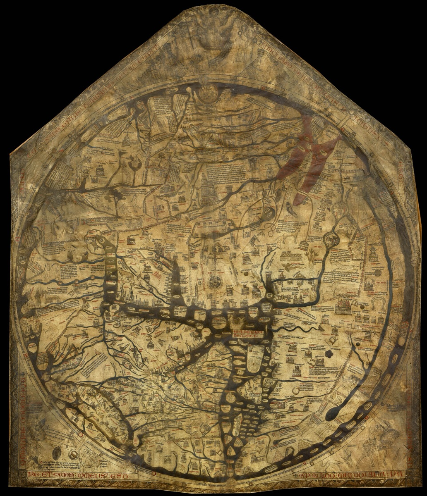
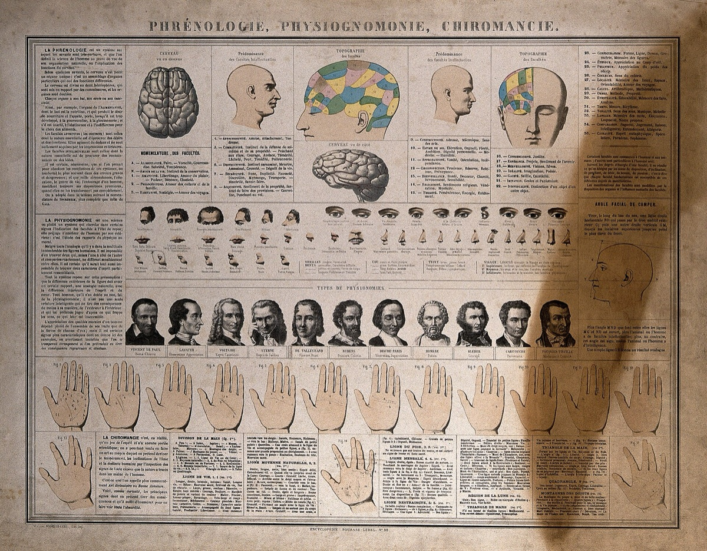
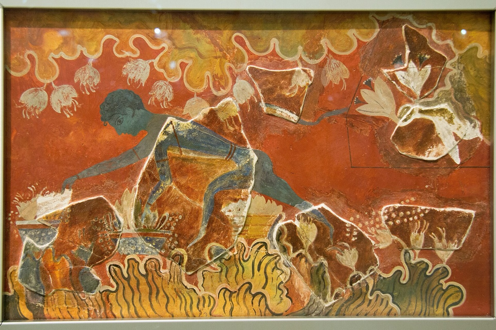
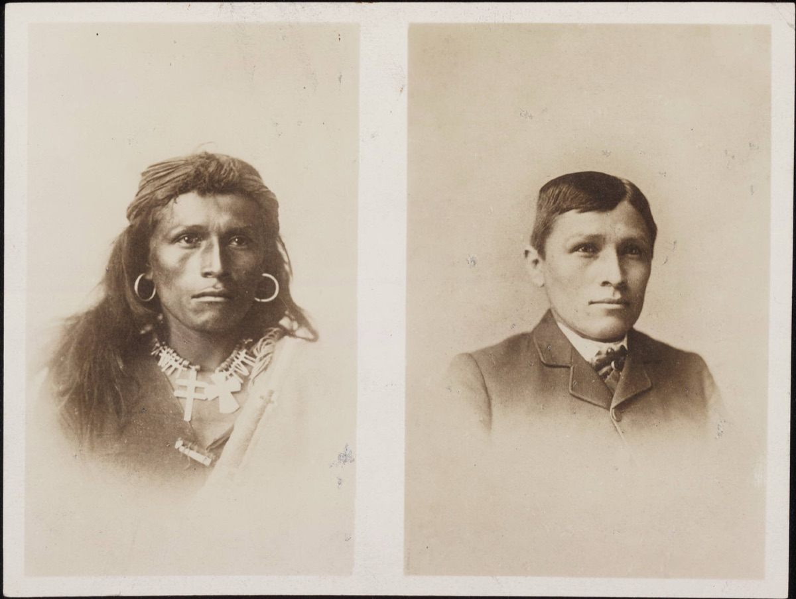
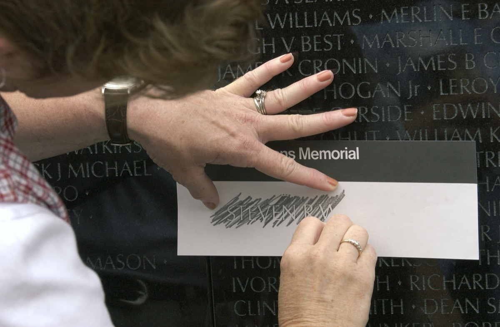
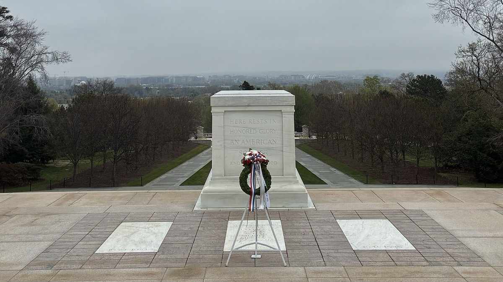
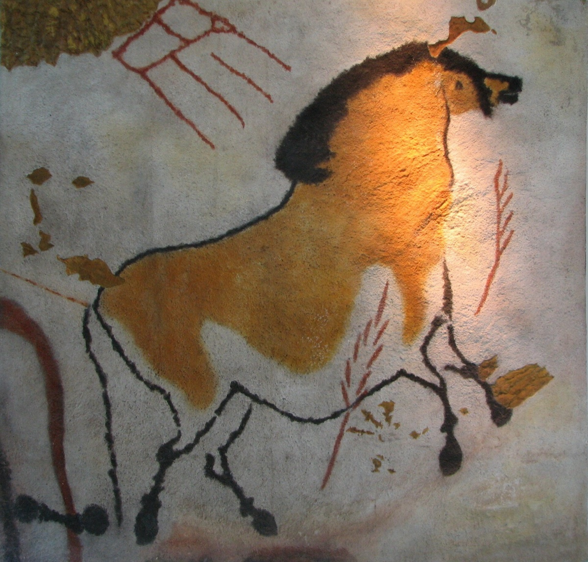
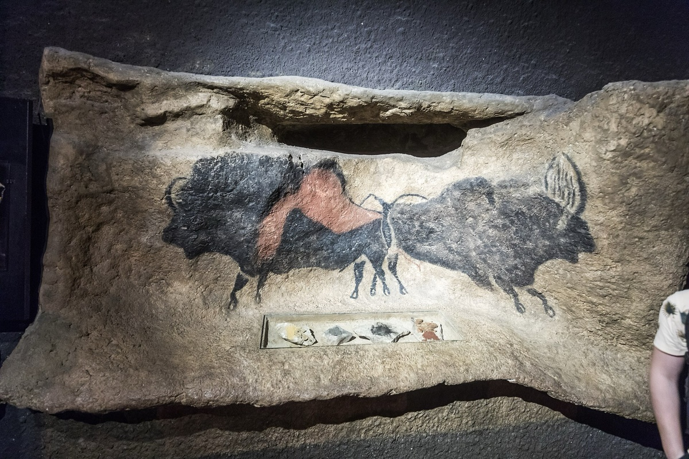
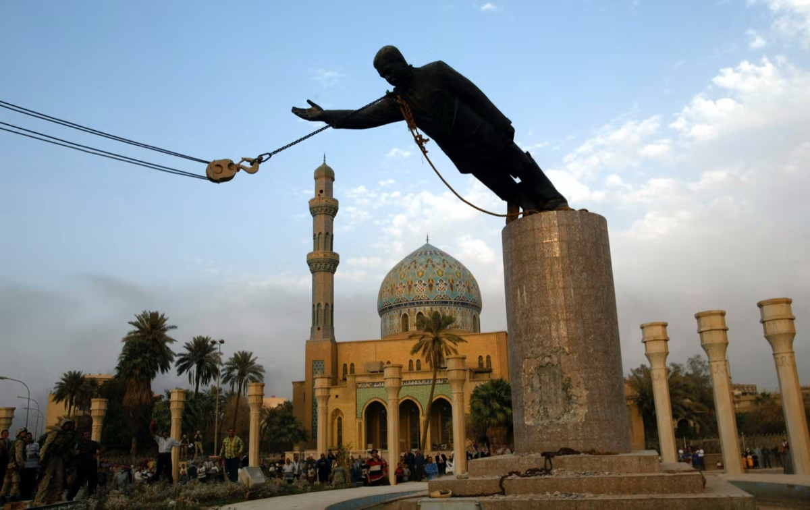

<!-- ========== TITLE ========== -->
<section data-transition="fade" markdown="1">
Making History • HIST 1105 • Week 8.1
{: .eyebrow}

# Pick the Better One
{: .main-point}

- Seven pictures. None of them is from the reading, and you answer each one out loud.
- Bring Carr, Ranke, Marx, Thompson, Scott and Ginzburg to things they never saw.
- Part one · has historical writing got better?
- Part two · what was any of it for?
{: .source-list}
</section>

<!-- ================================================================ -->
<!-- =============== PART ONE · PROGRESS ============================= -->
<!-- ================================================================ -->

<!-- ========== 1. TWO PICTURES OF THE WHOLE WORLD ========== -->
<section class="image-slide provoke">
<figure class="pair">

Both are pictures of the whole world. One is centred on Jerusalem on purpose. The other is conventionally printed the other way up from how it was taken. Which one is edited?

<figcaption markdown="span">
The Hereford <i>Mappa Mundi</i>, c. 1300 · <i>The Blue Marble</i>, Apollo 17, 7 December 1972
<em>(Left: Hereford Cathedral, via unesco.org.uk, public domain. Right: Harrison Schmitt / Apollo 17, NASA AS17-148-22727, public domain.)</em>
</figcaption>
</figure>
</section>

<!-- ========== 2. TWO SCIENCES OF THE MIND ========== -->
<section class="image-slide provoke">
<figure class="pair">

Both of these claim to show where in the head a person's character lives. One of them also reads palms. In a hundred and fifty years, which half of this slide will the other one look like?

<figcaption markdown="span">
<i>Phrénologie, physiognomonie, chiromancie</i>, French wall chart, 19th c. · Basal ganglia activation, fMRI, 2014
<em>(Left: Wellcome Collection V0009525, CC BY 4.0. Right: Miller et al., <i>PLOS ONE</i> 9(5), 2014, CC BY 4.0.)</em>
</figcaption>
</figure>
</section>

<!-- ========== 3. THE MONKEY ========== -->
<section class="image-slide provoke">
<figure class="landscape">

The solid paint is what survived. The flat areas between are what Arthur Evans's restorer added. He made this figure a boy — but the fragments have a tail, and it was a monkey. Which part of this is evidence?

<figcaption markdown="span">
The "Saffron Gatherer," Knossos, restored under Arthur Evans by Émile Gilliéron · Archaeological Museum of Heraklion
<em>(Photograph Zde, via Wikimedia Commons; public domain. Evans's excavation ran from 1900; the figure was re-identified as a monkey later in the 20th century.)</em>
</figcaption>
</figure>
</section>

<!-- ========== 4. A PHOTOGRAPH OF PROGRESS ========== -->
<section class="image-slide provoke">
<figure class="landscape">

Tom Torlino, Diné, photographed at the Carlisle Indian Industrial School about three years apart. The school made the pair, and printed it this way round, to show what it had achieved. What is it evidence of, and for whom?

<figcaption markdown="span">
Tom Torlino on arrival and after about three years at Carlisle, c. 1882–85 · photographs by John N. Choate
<em>(Beinecke Rare Book &amp; Manuscript Library, Yale University, via Wikimedia Commons; public domain. Carlisle's own promotional use of before-and-after pairs is documented in the school's publications.)</em>
</figcaption>
</figure>
</section>

<!-- ========== DISCUSSION · PROGRESS ========== -->
<section markdown="1">
Part one · discussion
{: .eyebrow}

## Progress or accumulation
{: .main-point}

---

Is there any "progress" in historical writing? Are we now closer to the truth, or just accumulating competing frameworks?
{: .question .fragment data-fragment-index="1"}

Carlisle and Knossos were made by people who thought they were the rigorous ones. Which should slow us down about which half of the phrenology slide we are standing on.

</section>

<!-- ================================================================ -->
<!-- =============== PART TWO · PURPOSE ============================== -->
<!-- ================================================================ -->

<!-- ========== 5. EVERY NAME, OR NO NAME ========== -->
<section class="image-slide provoke">
<figure class="pair">

Both are for people killed in American wars. One insists on every single name; the other insists on no name at all. What does each one think remembering is for?

<figcaption markdown="span">
Vietnam Veterans Memorial, Washington, 2003 · Tomb of the Unknown Soldier, Arlington National Cemetery
<em>(Left: U.S. Navy photo by CWO Seth Rossman, 030616-N-9593R-145, public domain. Right: SNik7Real, via Wikimedia Commons, CC BY 4.0.)</em>
</figcaption>
</figure>
</section>

<!-- ========== 6. NEITHER OF THESE IS THE CAVE ========== -->
<section class="image-slide provoke">
<figure class="pair">

Neither of these is the cave. Lascaux was sealed in 1963 and almost nobody alive has been inside it. Millions of people have been to see it. What have they seen?

<figcaption markdown="span">
A Lascaux replica in the Anthropos Museum, Brno · the interior of Lascaux II, Montignac, built 200 m from the original
<em>(Left: HTO, via Wikimedia Commons, public domain. Right: Raimond Spekking, via Wikimedia Commons, CC BY-SA 4.0.)</em>
</figcaption>
</figure>
</section>

<!-- ========== 7. THE PICTURE THAT RAN EVERYWHERE ========== -->
<section class="image-slide provoke">
<figure class="landscape">

This was on front pages around the world the next morning. The plaza is nearly empty and the frame is tight. What is this photograph a source for?

<figcaption markdown="span">
The statue of Saddam Hussein pulled down in Firdos Square, Baghdad, 9 April 2003
<em>(U.S. Department of Defense, via Wikimedia Commons; public domain. Wider shots taken the same afternoon show a sparsely filled square.)</em>
</figcaption>
</figure>
</section>

<!-- ========== DISCUSSION · PURPOSE ========== -->
<section markdown="1">
Part two · discussion
{: .eyebrow}

## Which purpose is defensible
{: .main-point}

---

Livy wants moral examples. Voltaire wants civilizational lessons. Ranke wants truth. Marx wants revolution. Thompson wants to rescue the forgotten. Which purpose do you find most defensible, and why?
{: .question .fragment data-fragment-index="1"}

Every picture today was decidable once you said what you wanted the history for, and undecidable until you did. Which is the answer you have been circling for seven weeks.

</section>

<!-- ========== CLOSING ========== -->
<section data-transition="fade" markdown="1">
Next · Week 9, after the break
{: .eyebrow}

## Many national traditions were invented, and recently
{: .main-point}

Nations feel ancient. Hobsbawm argues that many of their traditions were invented, often deliberately; Anderson calls nations imagined, not faked. Compare Kant's plan nobody alive could see, in 4.1.
{: .detail}
</section>
