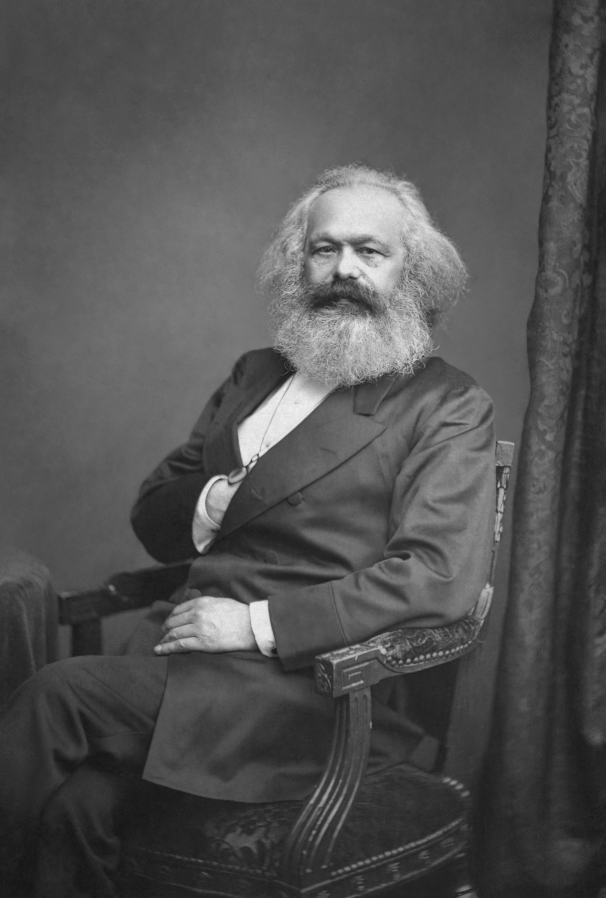
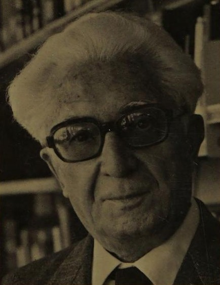

<!-- ========== TITLE ========== -->
<section data-transition="fade" markdown="1">
Making History • HIST 1105 • Week 7 · Review
{: .eyebrow}

# What Makes History Happen?
{: .main-point}

- Carr, *What Is History?* · Week 1
- Herodotus to Ranke · Weeks 2–4 (full review: Week 5)
- Marx, Braudel · Week 5
- Thompson, Scott · Week 6
- Ginzburg · Week 7.1
{: .source-list}

Six weeks of answers to one running question, and what actually changed — and didn't — in what history is, how it gets made, and what it's for.
{: .detail}

Carr cited by the Penguin *What Is History?* page. Marx and Engels from the *Manifesto* (Moore trans., 1888). Braudel from "The *Longue Durée*" (1958) and the essays collected in *On History*. Thompson cited by the page of *The Making of the English Working Class* (1963). Scott cited by the page of the 1986 *AHR* printing.
{: .citation-note}
</section>

<!-- ========== THROUGHLINE ========== -->
<section markdown="1">
Today in context
{: .eyebrow}

## What makes history happen?
{: .main-point}

---

###### Week 1 · Carr, 1961
{: .num}

Nothing, by itself. A historian decides which facts get to speak.

###### Weeks 2–4 · Herodotus to Ranke
{: .num}

A wrongdoer, a god, Fortune, a plan no one inside it can see — and then, no plan at all.

###### Week 5 · Marx and Braudel
{: .num}

Structures. Class conflict over production; sea, soil and climate underneath everything.

###### Week 6 · Thompson and Scott
{: .num}

People, making themselves; and gender, the system that makes the arrangement look natural.

###### Week 7.1 · Ginzburg, 1976
{: .num}

One miller's cosmos, and what a single case can carry.

###### Week 9 · Hobsbawm, Anderson
{: .num}

Nations, invented and then believed in.

</section>

<!-- ================================================================ -->
<!-- =============== WEEK 1 · CARR =================================== -->
<!-- ================================================================ -->

<!-- ========== WEEK 1: CARR ========== -->
<section markdown="1">
Week 1 · Carr, *What Is History?* (1961)
{: .eyebrow}

## Facts don't speak for themselves
{: .main-point}

"It used to be said that facts speak for themselves. This is, of course, untrue. The facts speak only when the historian calls on them: it is he who decides to which facts to give the floor, and in what order or context." Carr, p. 11
{: .quote.compact.fragment data-fragment-index="0"}

###### Why the record already leans
{: .label}

"Our picture has been preselected and predetermined for us... by people who... thought the facts which supported that view worth preserving." Carr, p. 13

**Study the historian before you study the facts (p. 23) — the question for every week since.**

That day's question: Carr wrote in 1961. Does his argument still hold?
{: .detail}
</section>

<!-- ================================================================ -->
<!-- =============== WEEKS 2-4 · RECAP ================================ -->
<!-- ================================================================ -->

<!-- ========== WEEKS 2-4: RECAP ========== -->
<section data-transition="fade" markdown="1">
Weeks 2–4 · recap
{: .eyebrow}

## Kant hoped history had a plan. Ranke said none could be proved.
{: .main-point}

###### 01 · Week 2
{: .num}

#### Memory and lessons

Herodotus and Thucydides ask why the war happened; Livy and Sima Qian draw lessons from character.

###### 02 · Week 3
{: .num}

#### God and the prince

The *Chronicle* and Bede find God behind events; Machiavelli reads for power.

###### 03 · Week 4
{: .num}

#### Progress

Kant gives history a direction nobody inside it can see.

###### 04 · Week 4
{: .num}

#### What actually happened

Ranke sets aside lessons and plans, and keeps to the documents.

Full treatment: Slides of *Who Makes History Happen?* (Week 5). That week's synthesis question: which of these eight would recognize each other as doing the same job?
{: .detail}
</section>

<!-- ================================================================ -->
<!-- =============== WEEK 5.1 · MARX =================================== -->
<!-- ================================================================ -->

<!-- ========== IMAGE: MARX ========== -->
<section class="image-slide" data-background="#0d1412" markdown="1">
<figure class="portrait">

<figcaption markdown="span">
Karl Marx · 1818–1883
<em>Born in Trier; studied law and philosophy; edited a Cologne newspaper until Prussian censors shut it. Expelled from Paris, he reached England in 1849 and stayed for the rest of his life.<strong>Why he matters:</strong> "the single most influential theorist for twentieth-century historical writing," who never held a post in history, or in any other subject.(John Jabez Edwin Mayall, 1875. Städel Museum. Public domain.)</em>
</figcaption>
</figure>
</section>

<!-- ========== WEEK 5.1: MARX ========== -->
<section markdown="1">
Week 5.1 · Marx and Engels, *The Communist Manifesto* (1848)
{: .eyebrow}

## History runs on how people produce what they need
{: .main-point}

"The history of all hitherto existing society is the history of class struggles." Marx and Engels, *Manifesto*, Part I
{: .quote.fragment data-fragment-index="0"}

###### The prediction
{: .label}

Capitalism creates "...its own grave-diggers. Its fall and the victory of the proletariat are equally inevitable." Manifesto, Part I

**How people make a living drives history. People still have to act.**

That day's question: Is class struggle a good explanation for everything? What does it miss?
{: .detail}
</section>

<!-- ================================================================ -->
<!-- =============== WEEK 5.2 · BRAUDEL ================================ -->
<!-- ================================================================ -->

<!-- ========== IMAGE: BRAUDEL ========== -->
<section class="image-slide" data-background="#0d1412" markdown="1">
<figure class="portrait">

<figcaption markdown="span">
Fernand Braudel · 1902–1985
<em>A schoolteacher's son who taught in Algiers from 1923 and at São Paulo from 1935, and came home to five years as a prisoner of war. He succeeded Febvre at the Collège de France in 1950.<strong>Why he matters:</strong> he gave the *Annales* the thesis its founders had deliberately gone without: structures explain events, not the other way round.(Photograph on the dust jacket of *The Identity of France*, 1988.)</em>
</figcaption>
</figure>
</section>

<!-- ========== WEEK 5.2: BRAUDEL ========== -->
<section markdown="1">
Week 5.2 · Braudel, "The *Longue Durée*" (1958)
{: .eyebrow}

## A structure is what a society cannot get past
{: .main-point}

"Some structures, because of their long life, become stable elements for an infinite number of generations: they get in the way of history, hinder its flow, and in hindering it shape it." Braudel, p. 31
{: .quote.compact.fragment data-fragment-index="0"}

###### Where he and Marx part
{: .label}

Both explain by structures; Marx names one motor, Braudel refuses to name any. "Marx explains why an order ends. Braudel explains why one lasts."

**A structure is defined by what it forbids.**

That day's question: do you lose too much when zooming out to centuries-long patterns?
{: .detail}
</section>

<!-- ================================================================ -->
<!-- =============== WEEK 6.1 · THOMPSON =============================== -->
<!-- ================================================================ -->

<!-- ========== IMAGE: THOMPSON ========== -->
<section class="image-slide" data-background="#0d1412" markdown="1">
<figure class="portrait">

<figcaption markdown="span">
E. P. Thompson · 1924–1993
<em>A Marxist historian who left the Communist Party in 1956 over Hungary and spent sixteen years teaching working people in adult-education classes, on the extra-mural staff at Leeds rather than a conventional post. At an anti-nuclear rally, Oxford, 1980.<strong>Why he matters:</strong> class, he argued, is not a structure found in the numbers but something people do, and has to be described rather than deduced.(Photograph by Kim Traynor, 1980. CC BY-SA 4.0.)</em>
</figcaption>
</figure>
</section>

<!-- ========== WEEK 6.1: THOMPSON ========== -->
<section markdown="1">
Week 6.1 · Thompson, *The Making of the English Working Class* (1963)
{: .eyebrow}

## Class is something people do, not a structure you can find
{: .main-point}

"I do not see class as a 'structure', nor even as a 'category', but as something which in fact happens (and can be shown to have happened) in human relationships." Thompson, p. 9
{: .quote.compact.fragment data-fragment-index="0"}

###### Who he wants back
{: .label}

"...the poor stockinger, the Luddite cropper, the 'obsolete' hand-loom weaver, the 'utopian' artisan, and even the deluded follower of Joanna Southcott, from the enormous condescension of posterity." Thompson, p. 12

**Every rule about what counts as evidence is also a decision about whose past can be known.**

That day's question: who is missing from the histories you learned in school? What kinds of sources might recover them?
{: .detail}
</section>

<!-- ================================================================ -->
<!-- =============== WEEK 6.2 · SCOTT ================================== -->
<!-- ================================================================ -->

<!-- ========== IMAGE: SCOTT ========== -->
<section class="image-slide" data-background="#0d1412" markdown="1">
<figure class="portrait">

<figcaption markdown="span">
Joan Wallach Scott · b. 1941
<em>A historian of French labor, who had already written on women and work with Louise A. Tilly. She gave this paper to the American Historical Association in December 1985; the *AHR* printed it a year later.<strong>Why she matters:</strong> she argues that gender is not a subject to add to history but a category that changes what any history can ask.(Photograph by B. Sutherton, 2013, cropped. CC BY-SA 3.0.)</em>
</figcaption>
</figure>
</section>

<!-- ========== WEEK 6.2: SCOTT ========== -->
<section markdown="1">
Week 6.2 · Scott, "Gender: A Useful Category" (1986)
{: .eyebrow}

## A room with no women in it is the gendered one
{: .main-point}

"Gender is a primary way of signifying relationships of power." Scott, p. 1067
{: .quote.fragment data-fragment-index="0"}

###### The example
{: .label}

"High politics itself is a gendered concept, for it establishes its crucial importance and public power ... precisely in its exclusion of women from its work." Scott, p. 1073

**Adding women to a syllabus and treating gender as power are two different projects — this class read the second one.**

That day's question: what does it mean that gender is performed?
{: .detail}
</section>

<!-- ================================================================ -->
<!-- =============== SYNTHESIS ========================================= -->
<!-- ================================================================ -->

<!-- ========== SYNTHESIS ========== -->
<section data-transition="fade" markdown="1">
Six weeks · three questions
{: .eyebrow}

## What changed, and what didn't
{: .main-point}

###### What history is
{: .num}

#### Selection, always

Carr's facts never spoke alone; Ranke's documents needed a chooser too. What changed is who counts as worth choosing.

###### How to do it
{: .num}

#### Evidence widened, method didn't relax

Al-Biruni named his sources; Ranke made the archive the test; Thompson and Vansina made memory and oral tradition count as evidence too.

###### What it's for
{: .num}

#### From lesson to explanation to rescue

Livy taught virtue, Kant found a plan, Marx found a motor. Thompson and Scott went looking for who each method leaves out.

</section>

<!-- ================================================================ -->
<!-- =============== DISCUSSION ========================================= -->
<!-- ================================================================ -->

<!-- ========== DISCUSSION 1 ========== -->
<section markdown="1">
Discussion · 1 of 4
{: .eyebrow}

## Progress, or fashion?
{: .main-point}

---

Ranke corrects Voltaire's speculation; Marx corrects Ranke's elitism; Thompson corrects Marx's abstraction; Ginzburg corrects Thompson's anonymity. Is that sequence getting closer to the truth, or just accumulating competing frameworks?
{: .question .fragment data-fragment-index="1"}

Each turn fixes a specific complaint against the one before it — real progress on a narrow question. Nothing in the sequence settles the big one.

</section>

<!-- ========== DISCUSSION 2 ========== -->
<section markdown="1">
Discussion · 2 of 4
{: .eyebrow}

## What is history for?
{: .main-point}

---

Livy wants moral examples. Voltaire wants civilizational lessons. Ranke wants truth. Marx wants revolution. Thompson wants to rescue the forgotten. Which purpose do you find most defensible, and why?
{: .question .fragment data-fragment-index="1"}

These aren't compatible goals — they would produce different histories even from the same sources.

</section>

<!-- ========== DISCUSSION 3 ========== -->
<section markdown="1">
Discussion · 3 of 4
{: .eyebrow}

## Is the fact/interpretation problem solved?
{: .main-point}

---

Ranke says show it "as it actually was." Vansina and Thompson say the real problem is the archive was built to exclude people, not that interpretation is unavoidable. Does anyone escape Carr's tension — or just relocate it?
{: .question .fragment data-fragment-index="1"}

Every fix we've read moves the choosing somewhere else — onto the document, the structure, or the archive. None removes it.

</section>

<!-- ========== DISCUSSION 4 ========== -->
<section markdown="1">
Discussion · 4 of 4
{: .eyebrow}

## What does zooming cost?
{: .main-point}

---

Braudel zooms to centuries; Ginzburg zooms to one miller's trial. What do you lose zooming in, and what do you lose zooming out? Is there a scale that's "right" for historical argument?
{: .question .fragment data-fragment-index="1"}

Zoom out and you can explain everything and decide nothing. Zoom in and you can decide everything and explain almost nothing.

</section>

<!-- ================================================================ -->
<!-- =============== ARC ================================================ -->
<!-- ================================================================ -->

<!-- ========== ARC ========== -->
<section markdown="1">
The course so far · looking back
{: .eyebrow}

## Six weeks, four turns
{: .main-point}

###### 01 · Weeks 1–4
{: .num}

#### Carr to Ranke

No fact, no plan, and no document stands without someone choosing it.

###### 02 · Week 5
{: .num}

#### Marx and Braudel

Structures explain the order; people still have to break it, or just outlast it.

###### 03 · Week 6
{: .num}

#### Thompson and Scott

Class happens; gender signifies. Both make the excluded visible.

###### 04 · Week 7.1
{: .num}

#### Ginzburg

One trial, one cosmos — the smallest case still argues about everyone.

</section>

<!-- ========== TAKE HOME ========== -->
<section data-transition="fade" markdown="1">
The take home · six weeks
{: .eyebrow}

## The record was never neutral, and the disagreement moved, not disappeared
{: .main-point}

###### What stayed constant
{: .label}

Every writer we've read decides which facts get to speak, and every one of them believes the decision is justified.

###### What actually changed
{: .label}

Who got to be a fact: kings and wars, then structures, then class as lived experience, then gender, then a single trial.

**Six weeks moved the argument from what happened to who gets to count as having happened at all.**

</section>

<!-- ========== CLOSING ========== -->
<section data-transition="fade" markdown="1">
Next · Week 9
{: .eyebrow}

## After the break: history made on purpose
{: .main-point}

Nations feel ancient. Hobsbawm and Anderson argue they were invented, on purpose, quite recently. Compare Kant's plan nobody could see — the two constructions could not be more different.
{: .detail}
</section>
