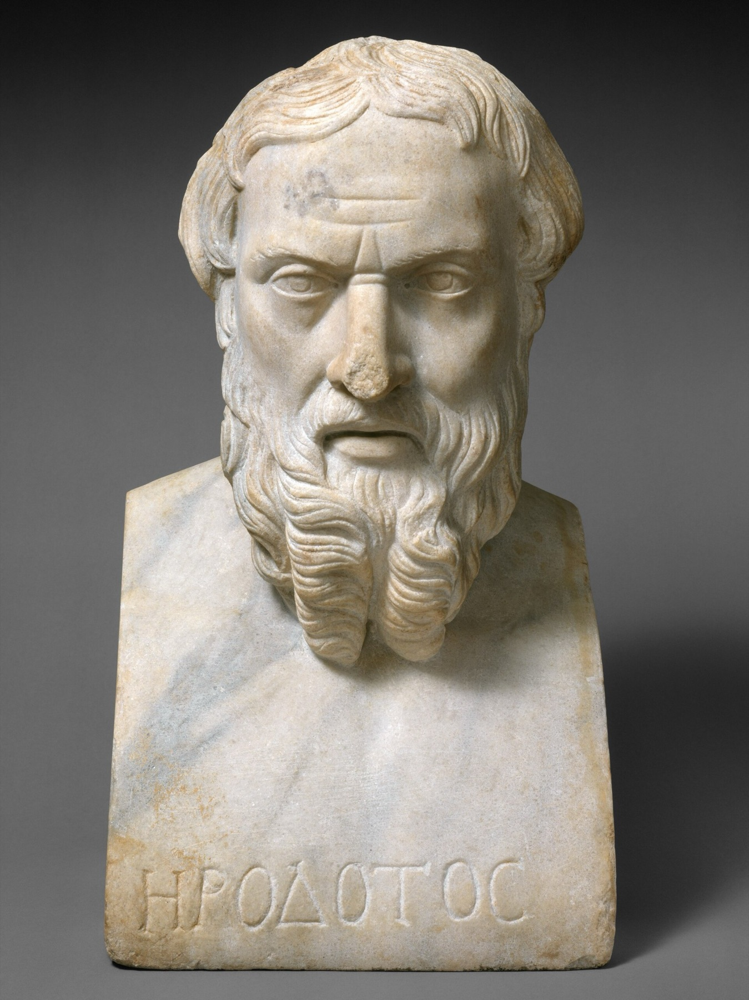
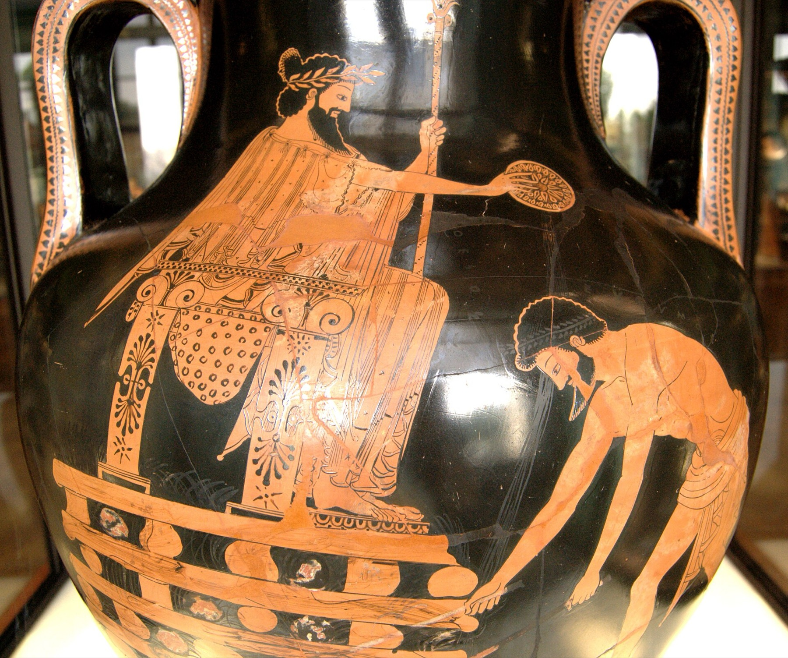
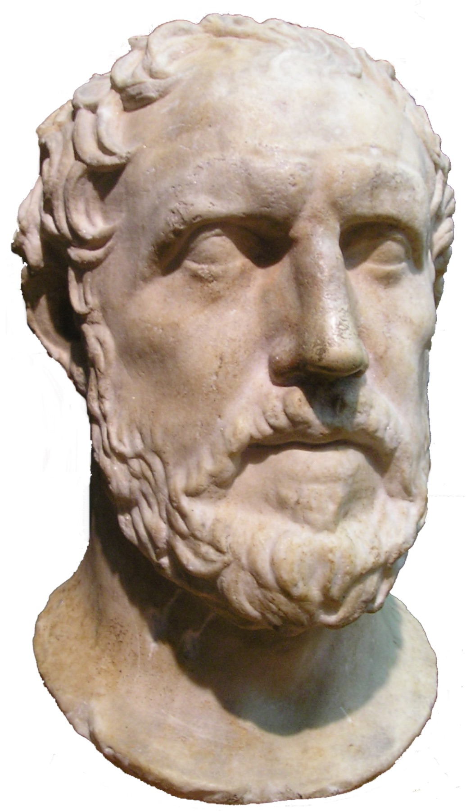
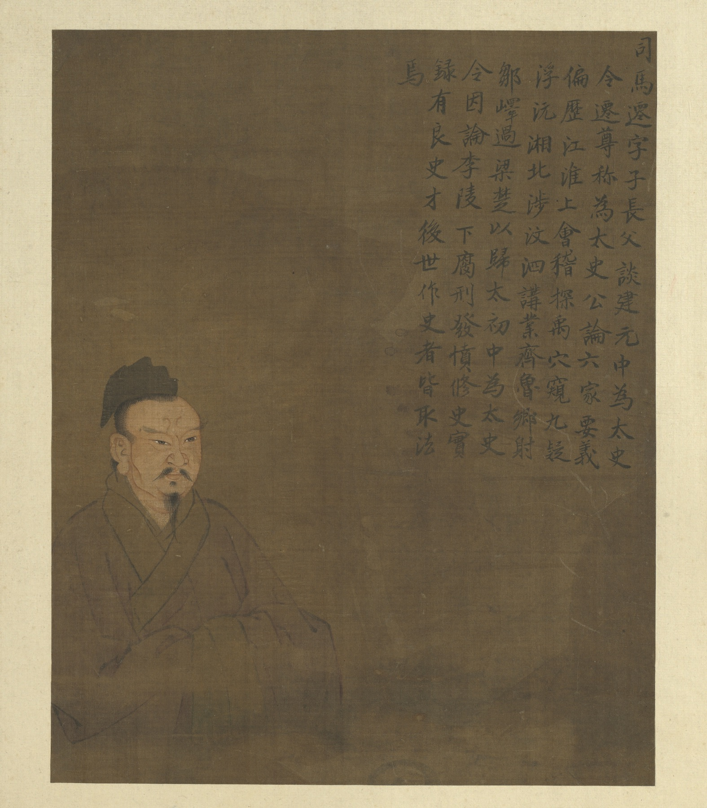
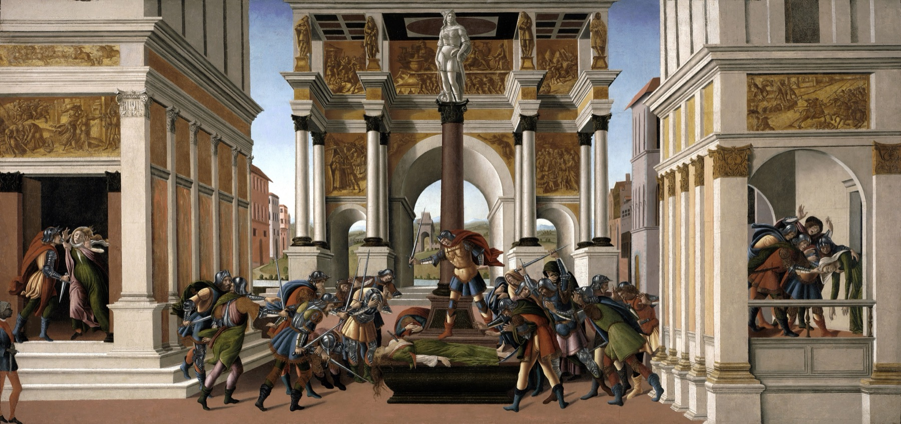
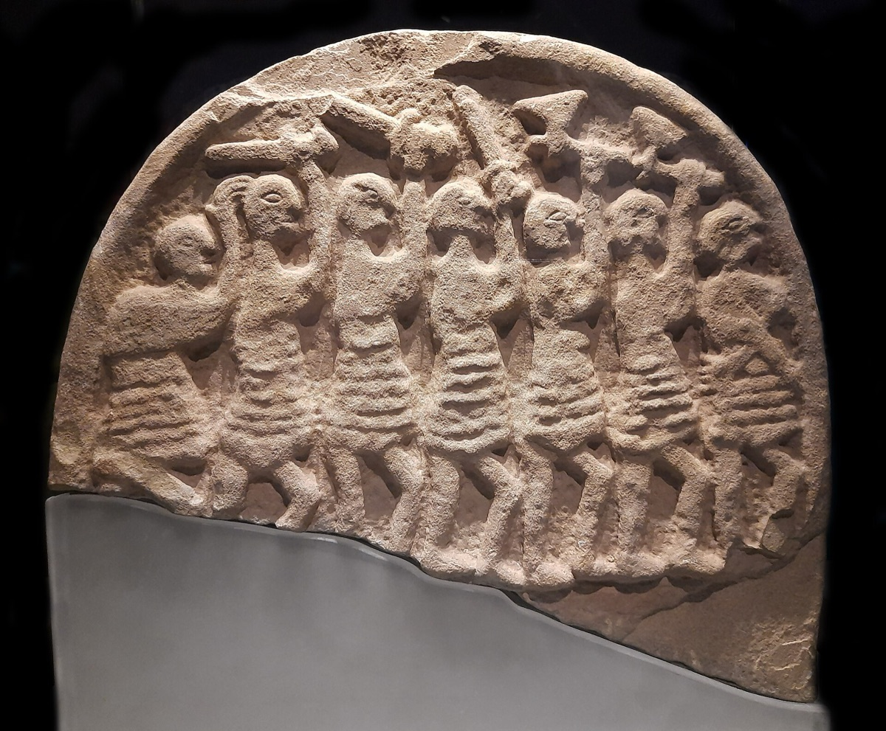
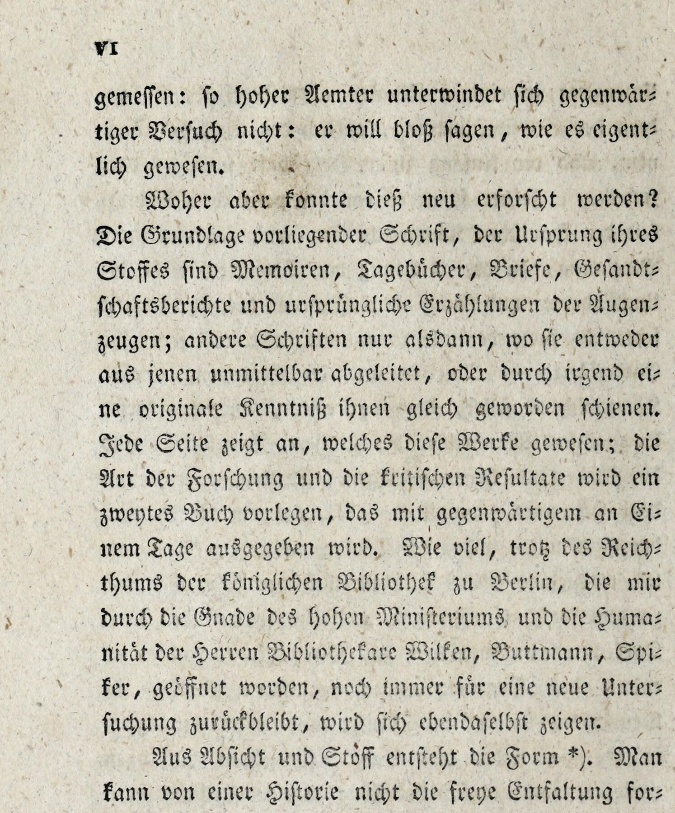

<!-- ========== TITLE ========== -->
<section data-transition="fade" markdown="1">
Making History • HIST 1105 • Week 5 · Review
{: .eyebrow}

# Who Makes History Happen?
{: .main-point}

- Herodotus, Thucydides, Livy, Sima Qian · Week 2
- The *Anglo-Saxon Chronicle*, Bede, Machiavelli · Week 3
- Kant and Ranke · Week 4
{: .source-list}

Weeks 2–4 in brief: what history was for, and who or what it said made events happen. Translations: Herodotus (Godley), Thucydides (Crawley; Melos from the assigned selection), Livy (Foster), the *Chronicle* (Giles), Machiavelli (Marriott), Kant (Beck), Ranke (GHDI), the *Manifesto* (Moore, 1888).
{: .detail}
</section>

<!-- ========== THE TAKE HOME, UP FRONT ========== -->
<section data-transition="fade" markdown="1">
The take home · three things
{: .eyebrow}

## Kant hoped history had a plan. Ranke said none could be proved.
{: .main-point}

###### What history was for
{: .label}

Moral examples, God's work, lessons in power, progress, "what actually happened."

###### Who did the causing
{: .label}

- A wrongdoer, a proud ruler, or a people's morals
- Power, and the fear it inspires
- God, announcing a raid with signs in the sky
- Fortune, who "leaves us to direct the other half"
- Nature, with a plan "for creatures who have no plan of their own"
- For Ranke, what participants saw and decided

###### 1848
{: .label}

**Marx claims the necessity Ranke denied: production drives history, and the next stage is "equally inevitable."**

</section>

<!-- ========== THE ARC ========== -->
<section data-transition="fade" markdown="1">
The arc · Weeks 2–4
{: .eyebrow}

## Four answers to what history is for
{: .main-point}

###### 01 · Week 2
{: .num}

#### Memory and lessons

Herodotus and Thucydides ask why the war happened; Livy and Sima Qian draw lessons from character.

###### 02 · Week 3
{: .num}

#### God and the prince

The *Chronicle* and Bede find God behind events; Machiavelli reads for power.

###### 03 · Week 4
{: .num}

#### Progress

Kant gives history a direction nobody inside it can see.

###### 04 · Week 4
{: .num}

#### What actually happened

Ranke sets aside lessons and plans, and keeps to the documents.

</section>

<!-- ================================================================ -->
<!-- =============== 01 · MEMORY AND LESSONS ======================== -->
<!-- ================================================================ -->

<!-- ========== IMAGE: HERODOTUS ========== -->
<section class="image-slide" data-background="#0d1412" markdown="1">
<figure class="portrait">

<figcaption markdown="span">
Herodotus · c. 484–c. 425 BCE
<em>From Halicarnassus, a Greek city under Persian rule, he traveled widely to collect what people told him about the wars between Greeks and Persians. The bust was carved centuries after his death. <strong>Why he matters:</strong> he calls his work an inquiry, and asks why the war happened. (Roman portrait bust, 2nd century CE. Metropolitan Museum of Art. CC0.)</em>
</figcaption>
</figure>
</section>

<!-- ========== HERODOTUS ========== -->
<section markdown="1">
Herodotus · *Histories*, Book 1
{: .eyebrow}

## Herodotus looks for who did wrong first
{: .main-point}

"...that the memory of the past may not be blotted out from among men by time, and that great and marvellous deeds done by Greeks and foreigners and especially the reason why they warred against each other may not lack renown." Herodotus 1.1 (Godley trans.)
{: .quote.compact.fragment data-fragment-index="0"}

###### His answer · 1.5
{: .label}

"...I will name him whom I myself know to have done unprovoked wrong to the Greeks." The next chapter opens with Croesus.

**The reason for a war is a person: the one who did wrong first.**

</section>

<!-- ========== IMAGE: CROESUS ========== -->
<section class="image-slide" data-background="#0d1412" markdown="1">
<figure class="landscape">

<figcaption markdown="span">
Croesus on the pyre · Attic red-figure amphora by Myson, c. 500–490 BCE
<em>In Herodotus, Cyrus orders the fire put out once Croesus repeats Solon's warning; it goes out only when Croesus prays to Apollo and a sudden storm breaks, "so the Lydians relate" (1.86–87). <strong>A lesson in human pride, and a god's rescue, in one scene.</strong> (Louvre G 197, from Vulci. Public domain.)</em>
</figcaption>
</figure>
</section>

<!-- ========== IMAGE: THUCYDIDES ========== -->
<section class="image-slide" data-background="#0d1412" markdown="1">
<figure class="portrait">

<figcaption markdown="span">
Thucydides · c. 460–c. 400 BCE
<em>An Athenian who lived through the whole war and was exiled for twenty years "after my command at Amphipolis," which let him observe "both parties" (5.26). <strong>Why he matters:</strong> he separates the real cause of a war from the grievances each side announced. (Roman copy of a Greek original. Royal Ontario Museum. Public domain.)</em>
</figcaption>
</figure>
</section>

<!-- ========== THUCYDIDES ========== -->
<section markdown="1">
Thucydides · *History of the Peloponnesian War*
{: .eyebrow}

## The real cause is not the stated one
{: .main-point}

"The real cause I consider to be the one which was formally most kept out of sight. The growth of the power of Athens, and the alarm which this inspired in Lacedaemon, made war inevitable." Thucydides 1.23 (Crawley trans.)
{: .quote.fragment data-fragment-index="0"}

###### Power · the Melian Dialogue, 5.89
{: .label}

The Athenians to Melos: "the question of justice arises only between parties equal in strength, and that the strong do what they can, and the weak submit."

**Power and fear make the war. Because "human things" repeat, the history is "a possession for all time" (1.22).**

</section>

<!-- ========== IMAGE: SIMA QIAN ========== -->
<section class="image-slide" data-background="#0d1412" markdown="1">
<figure class="portrait">

<figcaption markdown="span">
Sima Qian · c. 145–c. 86 BCE
<em>Grand Historian at the Han court, finishing the history his father had begun. The face is a later imagining, from an album of portraits of sages. <strong>Why he matters:</strong> he closes most chapters with a signed verdict on the people in them. (<i>Half-Length Portraits of Sages Through the Ages</i>. National Palace Museum, Taipei. CC BY 4.0.)</em>
</figcaption>
</figure>
</section>

<!-- ========== LIVY AND SIMA QIAN ========== -->
<section markdown="1">
Livy and Sima Qian · 1st century BCE
{: .eyebrow}

## History is a stock of examples to imitate or avoid
{: .main-point}

"...you behold the lessons of every kind of experience set forth as on a conspicuous monument; from these you may choose for yourself and for your own state what to imitate, from these mark for avoidance what is shameful in the conception and shameful in the result." Livy, *Ab Urbe Condita*, Preface (Foster trans.)
{: .quote.compact.fragment data-fragment-index="0"}

###### Sima Qian on Xiang Yu · *Shiji* 7
{: .label}

Xiang Yu "relied on his own intelligence without learning from the past," then said Heaven had destroyed him: "was this not a great fallacy!"

**The explanation is character, of a ruler or of a whole people.**

</section>

<!-- ========== IMAGE: LUCRETIA ========== -->
<section class="image-slide" data-background="#0d1412" markdown="1">
<figure class="landscape">

<figcaption markdown="span">
Sandro Botticelli, <i>The Story of Lucretia</i> · c. 1500–01
<em>The assault at left, the death at right, and at the center Brutus over the body, raising the army. <strong>A private catastrophe arranged so that it ends in a change of regime, as Livy tells it.</strong> (Isabella Stewart Gardner Museum, Boston. Public domain.)</em>
</figcaption>
</figure>
</section>

<!-- ================================================================ -->
<!-- =============== 02 · GOD AND THE PRINCE ======================== -->
<!-- ================================================================ -->

<!-- ========== IMAGE: LINDISFARNE STONE ========== -->
<section class="image-slide" data-background="#0d1412" markdown="1">
<figure class="landscape">

<figcaption markdown="span">
Grave marker · Lindisfarne, first quarter of the 9th century
<em>Seven men with raised swords and axes. The other face carries a cross between sun and moon and hands raised in prayer, so the front may show the Last Judgement rather than the raid of 793. (Lindisfarne Priory, English Heritage, inv. 81077057. Photo Schillerwein, CC0.)</em>
</figcaption>
</figure>
</section>

<!-- ========== THE CHRONICLE AND BEDE ========== -->
<section markdown="1">
The *Anglo-Saxon Chronicle* · annal for 793
{: .eyebrow}

## The warning comes before the raid
{: .main-point}

"This year dire forwarnings came over the land of the North-humbrians, and miserably terrified the people; these were excessive whirlwinds, and lightnings; and fiery dragons were seen flying in the air. A great famine soon followed these tokens; and a little after that... the ravaging of heathen men lamentably destroyed God's church at Lindisfarne through rapine and slaughter." *Anglo-Saxon Chronicle*, 793 (Giles trans.)
{: .quote.compact.fragment data-fragment-index="0"}

###### Bede · 731
{: .label}

Bede keeps the moral purpose, examples to imitate, and puts God behind the events: a martyr's miracles count as evidence (Preface; I.7).

**The *Chronicle* does not argue causes. It lines up the signs, the famine and the raid, and leaves their meaning to God.**

</section>

<!-- ========== IMAGE: MACHIAVELLI ========== -->
<section class="image-slide" data-background="#0d1412" markdown="1">
<figure class="portrait">

<figcaption markdown="span">
Niccolò Machiavelli · 1469–1527
<em>Fourteen years running Florentine war and diplomacy, until the Medici returned in 1512: dismissed, arrested, tortured, exiled to a farm. He wrote <i>The Prince</i> there. <strong>Why he matters:</strong> he reads history as a set of cases for whoever holds power. (Santi di Tito, later 16th century. Palazzo Vecchio, Florence. Public domain.)</em>
</figcaption>
</figure>
</section>

<!-- ========== MACHIAVELLI ========== -->
<section markdown="1">
Machiavelli · *The Prince*, written 1513
{: .eyebrow}

## History teaches whoever holds power
{: .main-point}

"A wise man ought always to follow the paths beaten by great men, and to imitate those who have been supreme, so that if his ability does not equal theirs, at least it will savour of it." Machiavelli, *The Prince*, ch. 6 (Marriott trans.)
{: .quote.fragment data-fragment-index="0"}

###### Fortune · ch. 25
{: .label}

"...Fortune is the arbiter of one-half of our actions, but that she still leaves us to direct the other half, or perhaps a little less."

**Fortune decides half. The prince decides the rest, and is judged by whether it worked.**

</section>

<!-- ================================================================ -->
<!-- =============== 03 · PROGRESS ================================== -->
<!-- ================================================================ -->

<!-- ========== IMAGE: THE ORRERY ========== -->
<section class="image-slide" data-background="#0d1412" markdown="1">
<figure class="landscape">

<figcaption markdown="span">
A lecture on the orrery, England, c. 1766
<em>A lamp stands in for the sun at the center of a brass model of the solar system. <strong>The planets move by laws anyone in the room can learn.</strong> (Joseph Wright of Derby, <i>A Philosopher Giving That Lecture on the Orrery, in which a Lamp is put in place of the Sun</i>. Derby Museum and Art Gallery. Public domain.)</em>
</figcaption>
</figure>
</section>

<!-- ========== IMAGE: KANT ========== -->
<section class="image-slide" data-background="#0d1412" markdown="1">
<figure class="portrait">

<figcaption markdown="span">
Immanuel Kant · 1724–1804
<em>Studied and taught at the university in Königsberg for his whole career. The <i>Critique of Pure Reason</i> (1781) had just made him Germany's most discussed philosopher when this essay ran in a magazine in 1784. <strong>Why he matters:</strong> a philosopher, not a historian, asks whether history as a whole has a plan. (Unknown artist, c. 1790. Public domain.)</em>
</figcaption>
</figure>
</section>

<!-- ========== KANT ========== -->
<section markdown="1">
Kant · "Idea for a Universal History," 1784
{: .eyebrow}

## Kant gives history a plan that no one in it knows
{: .main-point}

"Each, according to his own inclination, follows his own purpose, often in opposition to others; yet each individual and people, as if following some guiding thread, go toward a natural but to each of them unknown goal." Kant, Introduction (Beck trans.)
{: .quote.compact.fragment data-fragment-index="0"}

###### A Kepler for history
{: .label}

"...we leave it to Nature to produce the man capable of composing it. Thus Nature produced Kepler... and she produced Newton, who explained these laws by a universal natural cause." (Introduction)

**A plan "for creatures who have no plan of their own." Kant leaves the law itself for someone else to find.**

</section>

<!-- ========== IMAGE: ENCYCLOPEDIE FRONTISPIECE ========== -->
<section class="image-slide" data-background="#0d1412" markdown="1">
<figure class="portrait">

<figcaption markdown="span">
Frontispiece to the <i>Encyclopédie</i> · 1772
<em>Truth at the center, unveiled by Reason and Philosophy, the sciences and arts gathered below to receive the light. <strong>Progress with a picture of itself.</strong> (Charles-Nicolas Cochin, design, 1764; Benoît-Louis Prévost, engraving, 1772. Public domain.)</em>
</figcaption>
</figure>
</section>

<!-- ================================================================ -->
<!-- =============== 04 · WHAT ACTUALLY HAPPENED ==================== -->
<!-- ================================================================ -->

<!-- ========== IMAGE: RANKE ========== -->
<section class="image-slide" data-background="#0d1412" markdown="1">
<figure class="portrait">

<figcaption markdown="span">
Leopold von Ranke · 1795–1886
<em>Teaching at a Gymnasium in Frankfurt an der Oder when his first book appeared in 1824; it won him a post at Berlin, where he taught from 1825 into the 1870s. Here in his library in the early 1880s. <strong>Why he matters:</strong> he makes the original document the test of history, and gives up judging the past. (Leopold von Ranke Papers, Syracuse University. Public domain.)</em>
</figcaption>
</figure>
</section>

<!-- ========== RANKE ========== -->
<section markdown="1">
Ranke · 1824 introduction
{: .eyebrow}

## Ranke gives up judging the past
{: .main-point}

"History has had assigned to it the office of judging the past and of instructing the present for the benefit of the future ages. To such high offices the present work does not presume: it seeks only to show what actually happened [*wie es eigentlich gewesen*]." Ranke, 1824 introduction (GHDI trans.)
{: .quote.compact.fragment data-fragment-index="0"}

###### The sources · 1824
{: .label}

"...memoirs, diaries, letters, ambassadors' reports, and original accounts of eyewitnesses." The papers of people who were there, including envoys reporting on rulers.

###### No plan can be proved · 1854
{: .label}

"...either a general directing will guides the development of the human race... or humanity contains an onward-marching progression of the spirit which necessarily drives it toward a defined goal. I should prefer to characterize both these ways as neither philosophically tenable nor historically provable."

**Livy's lessons and Kant's plan are both set aside. What is left is what participants saw and decided.**

</section>

<!-- ========== IMAGE: RANKE PREFACE PAGE ========== -->
<section class="image-slide" data-background="#0d1412" markdown="1">
<figure class="portrait">

<figcaption markdown="span">
The sentence on the page · preface, p. VI, 1824
<em>Top three lines: <i>er will bloß sagen, wie es eigentlich gewesen</i>, "it wants only to say how it actually was." Directly under it, the source list, and "Jede Seite zeigt an": every page shows which works those were. (Cropped from the Internet Archive scan, <i>geschichtenderro00rank</i>. Public domain.)</em>
</figcaption>
</figure>
</section>

<!-- ========== RECAP ========== -->
<section data-transition="fade" markdown="1">
Recap · Weeks 2–4
{: .eyebrow}

## Kant hoped history had a plan. Ranke said none could be proved.
{: .main-point}

###### 01 · Herodotus to Sima Qian
{: .num}

#### Memory and lessons

The first wrongdoer, power and fear, or character, of a ruler or a whole people.

###### 02 · *Chronicle*, Bede, Machiavelli
{: .num}

#### God and the prince

God sends the signs; Fortune takes half, and the prince directs the rest.

###### 03 · Kant
{: .num}

#### Progress

A plan "for creatures who have no plan of their own," still waiting for its Kepler.

###### 04 · Ranke
{: .num}

#### What actually happened

No plan can be proved. What participants saw and decided, from their own papers.

</section>

<!-- ================================================================ -->
<!-- =============== DISCUSSION · OBJECTIVITY ======================= -->
<!-- ================================================================ -->

<!-- Discussion slides take the palette of 1105r&vhdiscussion.pdf (charcoal,
     white, orange) so the exercise reads as a break from the lecture. The theme
     colours everything through --ts-* variables, so overriding them on the
     section is enough. -->

<!-- ========== DISCUSSION BREAK ========== -->
<section class="discussion-pdf" data-background-color="#1c1c1c" data-transition="fade" markdown="1">
Discussion · Humboldt and Ranke
{: .eyebrow}

# Discussion break
{: .main-point}

Use this time to bring up the Humboldt and Ranke readings.
{: .detail}
</section>

<!-- ========== DISCUSSION: HOLLER OUT ========== -->
<section class="discussion-pdf" data-background-color="#1c1c1c" markdown="1">
Holler out · the whole room
{: .eyebrow}

## Define objectivity
{: .main-point}
</section>

<!-- ========== DISCUSSION: PARTNERS ========== -->
<section class="discussion-pdf" data-background-color="#1c1c1c" markdown="1">
Turn to a partner and discuss
{: .eyebrow}

## How do Humboldt and Ranke define objectivity?
{: .main-point}

- And so... what does objectivity mean for the historian?
- With your partner, pull an example from either reading that encompasses the role of objectivity in history.
{: .questions}
</section>

<!-- ========== DISCUSSION: HISTORY APPLIED ========== -->
<section class="discussion-pdf" data-background-color="#1c1c1c" markdown="1">
History applied · in your pair or small group
{: .eyebrow}

## Think back to the last time you could not escape history
{: .main-point}

High school? A college-level history survey class?
{: .detail}

- Give an example of where you see objectivity play out in your example. What does it look and sound like?
- How does objectivity (or the assumption of it) affect your understanding of history in your example?
{: .questions}
</section>

<!-- ========== DISCUSSION: HISTORY APPLIED, CONT'D ========== -->
<section class="discussion-pdf" data-background-color="#1c1c1c" markdown="1">
History applied · continued
{: .eyebrow}

## What might the "objectivity" of a story emphasize or leave out?
{: .main-point}

- Is something left out of your example?
- ...So what?
{: .questions}
</section>

<!-- ========== THIS WEEK: THE QUESTION ========== -->
<section markdown="1">
This week · Marx, 1848 · Braudel, 1958
{: .eyebrow}

## What if one cause does run under all of history?
{: .main-point}

"The history of all hitherto existing society is the history of class struggles." Marx and Engels, *Manifesto*, Part I (Moore trans., 1888)
{: .quote.fragment data-fragment-index="0"}

"Just as Darwin discovered the law of development of organic nature, so Marx discovered the law of development of human history: the simple fact... that mankind must first of all eat, drink, have shelter and clothing, before it can pursue politics, science, art, religion, etc." Engels, at Marx's grave, 17 March 1883 · compare Kant's Kepler and Newton
{: .pull-quote.compact.fragment data-fragment-index="1"}

- Thucydides found the real cause of one war (1.23). Can one cause explain all of history?
- Ranke's objectivity rests on what participants saw and wrote down. What happens to it if the real cause is something none of them saw?
- Braudel (5.2) looks for causes slower than any life. What does a historian lose by looking there?
{: .questions.compact.fragment data-fragment-index="2"}
</section>
