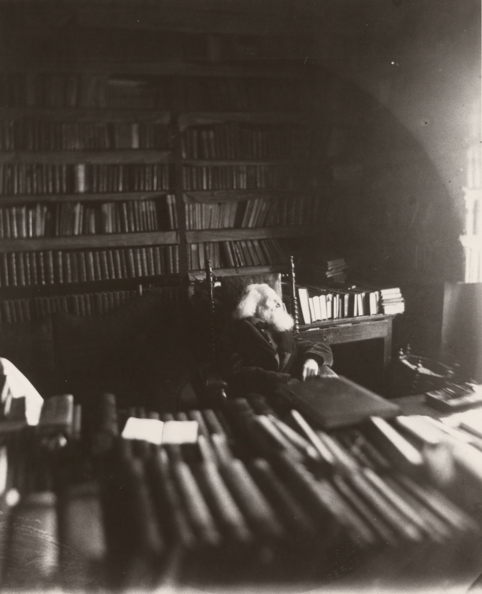
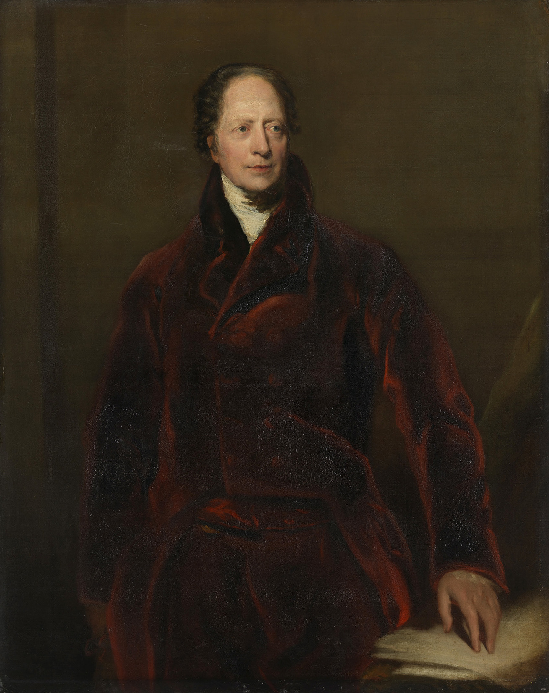
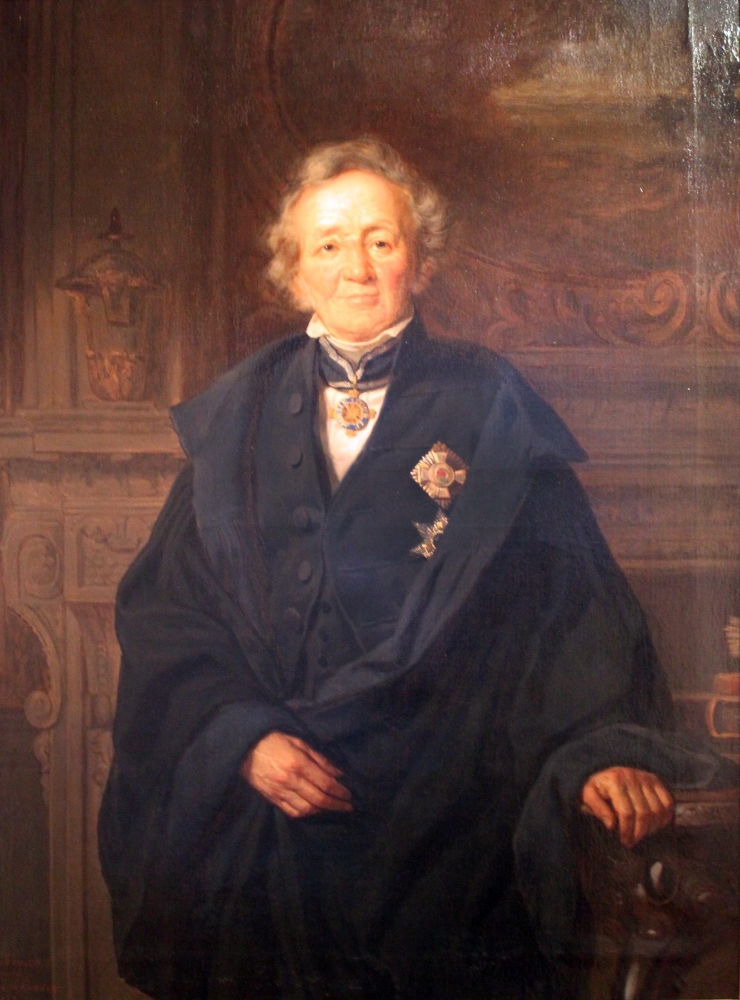
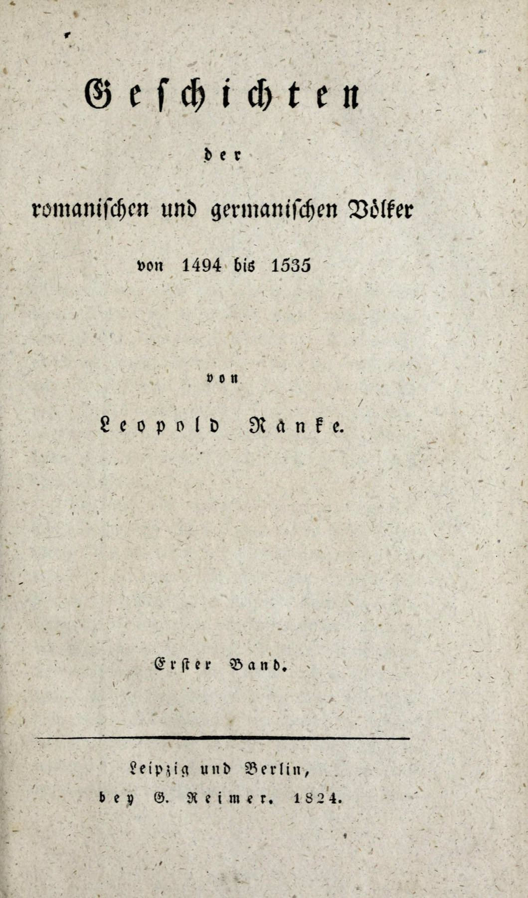
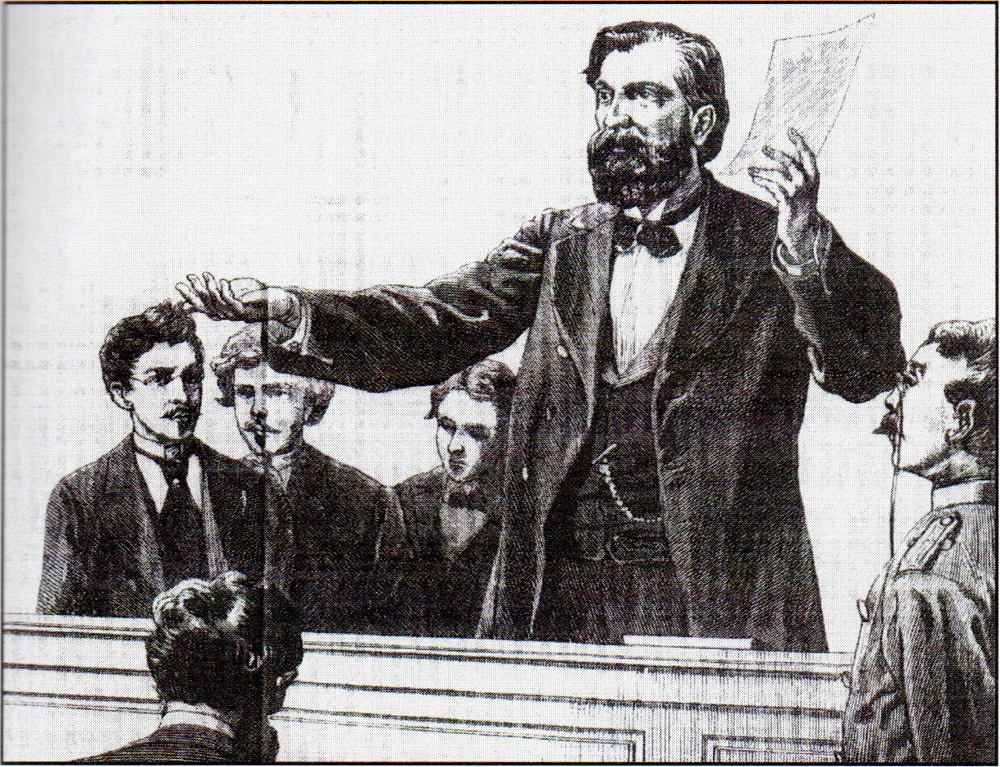
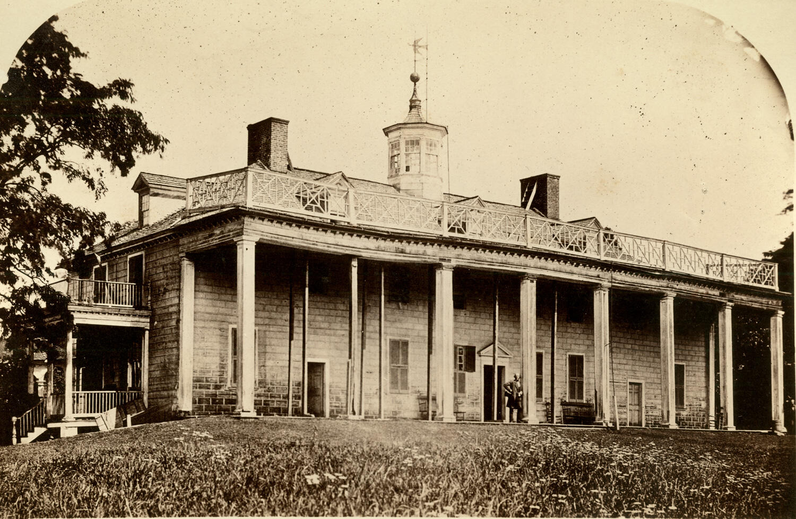

<!-- ========== COLD OPEN: RANKE IN HIS LIBRARY ========== -->
<section class="image-slide" data-background="#0d1412" markdown="1">
<figure class="portrait">

<figcaption markdown="span">
Leopold von Ranke in his library, early 1880s
<em>He is about eighty-seven here, and nearly blind; the last volumes were dictated. (Leopold von Ranke Papers, Syracuse University Special Collections. Public domain.)</em>
</figcaption>
</figure>
</section>

<!-- ========== COLD OPEN NOTES ========== -->
<section markdown="1">

- **You have to look for the man.** The shelves and the stacks take the picture; he is a pale smudge at the centre of it — the self-portrait of a historian who claimed his job was to disappear behind his sources. <em class="ask">If a historian disappears behind the sources, who chose which sources to stand behind?</em>
- **This is a working archive, not a study.** Documents stored so that one claim can be checked against another. <em class="ask">What history becomes possible in a room like this — and what becomes impossible?</em>
- **Somebody built this room.** Prussian ministries opened the archives, a university paid the salary, a publisher printed the footnotes — each for reasons of its own. <em class="ask">Does it matter to the truth of a history book who paid for the paper it rests on?</em>
- **He is at the end of it.** Sixty years on: honoured across Europe, nearly blind, still dictating. <em class="ask">Would he say the method delivered what its first sentence promised?</em>

</section>

<!-- ========== COLD OPEN: THE TWO QUESTIONS ========== -->
<section markdown="1">
Before we start
{: .eyebrow}

## Two questions to hold onto
{: .main-point}

- What would a historian have to do to show "what actually happened"?
- If that is impossible, why has the promise lasted two hundred years?
{: .questions.compact}
</section>

<!-- ========== TITLE ========== -->
<section data-transition="fade" markdown="1">
Making History • HIST 1105 • Week 4
{: .eyebrow}

# Scientific History
{: .main-point}

- Humboldt, "On the Historian's Task" (delivered 1821, published 1822)
- Ranke, introduction to the *History of the Latin and Teutonic Nations* (1824)
- Background: Popkin, ch. 4, 71–98
{: .source-list}

Three years apart, two writers promise the same thing *in English* — and a discipline gets built on it. Popkin cited by page, Ranke by which of his three excerpts.
{: .detail}
</section>

<!-- ========== THE TAKE HOME, UP FRONT ========== -->
<section data-transition="fade" markdown="1">
The take home · three things
{: .eyebrow}

## Both of them promise "what actually happened." Neither meant just the facts.
{: .main-point}

###### 01 · The sentence is a renunciation
{: .label}

It is not a boast about access to the past. It is a refusal of two older jobs — judging the past, and drawing lessons for the present. Ranke says so in the same breath.

###### 02 · And it came with an apparatus
{: .label}

Archives, footnotes, a seminar, journals, a doctorate. Objectivity was made teachable — a set of practices you could be trained in and judged on.

###### 03 · Whoever builds the apparatus sets the questions
{: .label}

States paid for the archives and the chairs. The seminar admitted a narrow few. **A method can be honest and still only ever get asked about certain things, by certain people.**

</section>

<!-- ========== THE ARC OF THE LECTURE ========== -->
<section data-transition="fade" markdown="1">
Where we're going · three parts
{: .eyebrow}

## One sentence, the machinery built under it, and what it cost
{: .main-point}

###### 01 · 1821 and 1824
{: .num}

#### The same promise, twice

Humboldt and Ranke both promise what actually happened — and each immediately qualifies it in a different way.

###### 02 · 1819–1895
{: .num}

#### What made it a discipline

Archives, footnotes, the research seminar, the journals. Objectivity as a workflow you can be trained in and judged by.

###### 03 · 1854–1896
{: .num}

#### What came with it

A profession funded by states, a seminar that admitted almost nobody, and Ranke's own refusal of Enlightenment progress.

</section>

<!-- ================================================================ -->
<!-- =============== PART ONE: THE SAME PROMISE, TWICE =============== -->
<!-- ================================================================ -->

<!-- ========== BRIDGE: WHAT 1806 DID ========== -->
<section markdown="1">
Bridge from 4.1 · Prussia, 1806–1810
{: .eyebrow}

## A defeated state builds a university, and history is in it
{: .main-point}

"The nineteenth century would see history transformed into an academic discipline. At the same time, historical writing would become intimately associated with the development of national identities." Popkin, *From Herodotus to H-Net*, p. 71
{: .quote.compact.fragment data-fragment-index="0"}

###### The situation
{: .label}

Napoleon crushes Prussia in 1806. In 1810 the University of Berlin is founded "as part of a deliberate program to promote German national identity in opposition to the influence of the French" (p. 79). Its plan is drafted by Wilhelm von Humboldt. Ranke will teach there for most of his working life.

###### Why start here
{: .label}

The two texts you read are not free-floating opinions about method. They are written inside a project to rebuild a defeated state, at an institution created for that purpose. **Both facts are true at once: the method is a real advance, and it was funded for a reason.**

</section>

<!-- ========== IMAGE: HUMBOLDT ========== -->
<section class="image-slide" data-background="#0d1412" markdown="1">
<figure class="portrait">

<figcaption markdown="span">
Wilhelm von Humboldt · Sir Thomas Lawrence
<em>Painted for George IV's Waterloo Chamber, the series of allied statesmen. <strong>No orders, no decorations — a hand resting on papers.</strong> (Royal Collection Trust, RCIN 404936. Public domain.)</em>
</figcaption>
</figure>
</section>

<!-- ========== HUMBOLDT 00: WHO HE IS ========== -->
<section markdown="1">
Wilhelm von Humboldt · 1767–1835
{: .eyebrow}

## A comparative linguist, not a historian, defines the historian's task
{: .main-point}

###### Who he was
{: .label}

A comparative linguist and philosopher of language — Basque, Kawi, the theory of *Bildung* — who was also a Prussian diplomat at the Congress of Vienna. He directed Prussia's education section from 1809, drafted the plan for a university in Berlin on the principle that teaching and research belong in the same hands, and resigned the post in 1810, months before it opened. He read this essay to the Prussian Academy in 1821.

###### Why he comes first
{: .label}

Popkin notes his essay "set out a program that anticipated many of Ranke's ideas" (p. 79). The institution and the method were specified by the same person, three years before Ranke's preface.

</section>

<!-- ========== HUMBOLDT 01: THE FIRST SENTENCE ========== -->
<section markdown="1">
The text · read to the Prussian Academy, 1821
{: .eyebrow}

## He opens with the promise, then spends the essay taking it apart
{: .main-point}

"The historian's task is to present what actually happened." Humboldt, "On the Historian's Task," p. 57
{: .quote.fragment data-fragment-index="0"}

###### What he says next
{: .label}

That an event is only *partly* available to the senses — the rest has to be supplied by the historian, through inference and judgment. Sorting out what happened gets you a skeleton, not an event; the connections between facts are added, not found. And the historian, he argues, has to show each event as part of a whole.

###### So the first sentence is not naive
{: .label}

It is a standard, not a description of an easy job. **"What actually happened" is what you are aiming at precisely because the evidence never simply hands it to you.** Every complaint made against scientific history for the next two centuries is already inside its founding document.

</section>

<!-- ========== IMAGE: RANKE PORTRAIT ========== -->
<section class="image-slide" data-background="#0d1412" markdown="1">
<figure class="portrait">

<figcaption markdown="span">
Leopold von Ranke, aged about eighty · Adolf Jebens, 1875
<em><strong>Note the two Prussian decorations on his chest.</strong> He insisted historians be judged by trained peers rather than by rulers — and wore the rulers' decorations. (Adolf Jebens, 1875. Public domain.)</em>
</figcaption>
</figure>
</section>

<!-- ========== RANKE 00: WHO HE IS ========== -->
<section markdown="1">
Leopold von Ranke · 1795–1886
{: .eyebrow}

## A schoolmaster of twenty-eight
{: .main-point}

###### Who he was
{: .label}

Trained in theology and classical philology, and teaching at a Gymnasium in Frankfurt an der Oder when he wrote this — not a professor, not commissioned by anyone. The book got him a post at Berlin, where he taught from 1825 into the 1870s and trained a generation. He died in 1886, aged ninety.

###### Worth keeping in view
{: .label}

The most famous sentence in the discipline is written by a young schoolteacher in a preface, apologising for his book. It was made famous later, by other people, for their own purposes.

</section>

<!-- ========== IMAGE: THE 1824 TITLE PAGE ========== -->
<section class="image-slide" data-background="#0d1412" markdown="1">
<figure class="portrait">

<figcaption markdown="span">
<i>Geschichten der romanischen und germanischen Völker von 1494 bis 1535</i> · Leipzig and Berlin, 1824
<em>"Histories of the Romance and Germanic Peoples, 1494 to 1535" — volume one, from a commercial house, by a first-time author. <strong>Note the plural, <i>Geschichten</i>:</strong> "it contains only histories, not History," as the preface says. No patron, no dedication, no royal privilege — and no frontispiece. (Internet Archive, <i>geschichtenderro00rank</i>. Public domain.)</em>
</figcaption>
</figure>
</section>

<!-- ========== RANKE 01: THE RENUNCIATION ========== -->
<section markdown="1">
The preface · 1824
{: .eyebrow}

## Two jobs history had always claimed
{: .main-point}

"History has had assigned to it the office of judging the past and of instructing the present for the benefit of the future ages. To such high offices the present work does not presume: it seeks only to show what actually happened [*wie es eigentlich gewesen*]." Ranke, 1824 introduction
{: .quote.compact.fragment data-fragment-index="0"}

###### Read the word "only"
{: .label}

This is modesty, not ambition. Judging and instructing were what Livy did, what Bede did, what Machiavelli did, what Voltaire did last session. Ranke is declining all of it — and Popkin is explicit that the target is "Enlightenment historians such as Voltaire and Gibbon" (p. 79).

###### What the smaller job buys
{: .label}

A claim that can be argued with. If a historian is delivering verdicts, you can only agree or disagree with their values. If they are claiming an event went a particular way, **you can go and look.** The authority moves from the historian's standing to their sources.

</section>

<!-- ========== IMAGE: THE PAGE ITSELF ========== -->
<section class="image-slide" data-background="#0d1412" markdown="1">
<figure class="portrait">

<figcaption markdown="span">
The sentence on the page · preface, p. VI, 1824
<em>Top three lines: <i>er will bloß sagen, wie es eigentlich gewesen</i>. Directly under it, the source list — and <strong>"Jede Seite zeigt an": every page shows which works those were.</strong> The promise and the apparatus, one paragraph apart. (Cropped from the Internet Archive scan, <i>geschichtenderro00rank</i>. Public domain.)</em>
</figcaption>
</figure>
</section>

<!-- ========== RANKE 02: WHERE THE EVIDENCE COMES FROM ========== -->
<section markdown="1">
The preface · sources
{: .eyebrow}

## The famous line is worthless without the paragraph that follows it
{: .main-point}

"The basis of the present work, the sources of its material, are memoirs, diaries, letters, ambassadors' reports, and original accounts of eyewitnesses... These sources will be noted on every page." Ranke, 1824 introduction
{: .quote.compact.fragment data-fragment-index="0"}

###### Three commitments in one paragraph
{: .label}

**A hierarchy of evidence** — eyewitness and administrative papers over later narratives. **Full disclosure** — the sources named on every page, so a reader can retrace the work. **A separate volume of criticism**, issued the same day, showing how he judged the sources. Anthony Grafton calls the result "a distinctively modern, double story": the past, and the historian's effort to reconstruct it (Popkin, p. 80).

###### This is the actual innovation
{: .label}

Not the phrase — versions of it were common. **The footnote is the argument.** Ranke publishes his workings, which means he can be caught being wrong, by anyone willing to go to the same documents. He also declares "a strict presentation of the facts, contingent and unattractive though they may be, is the highest law."

</section>

<!-- ========== DISCUSSION 01 ========== -->
<section markdown="1">
Discussion · part one
{: .eyebrow}

## Why would a historian give up judging the past in order to describe it?
{: .main-point}

Ranke hands back both traditional offices of history — judgment and instruction — and keeps only description. Voltaire, seventy years earlier, was doing nothing but ranking.
{: .detail}

- What does a historian gain by claiming the smaller job?
- Ranke's own preface says the history of the "racially kindred" Germanic and Latin nations "forms the heart of all modern history" — "racially kindred" being his English translator's word for *stammverwandt*, of kindred stock. Is that a judgment, or a description?
{: .questions.compact.fragment}
</section>

<!-- ========== ANSWER 01 ========== -->
<section markdown="1">
Answer · part one
{: .eyebrow}

## A claim you can check — and a set of judgments moved out of sight
{: .main-point}

###### The gain is real
{: .label}

Verdicts can only be shared or refused; described events can be checked. By naming his sources on every page Ranke makes his own work falsifiable, and that is what lets history accumulate rather than merely accumulate opinions. This is a genuine advance and it is why the method survived its author.

###### The cost is where you stop looking
{: .label}

Refusing to judge does not remove the judgments — it moves them upstream, into what counts as a subject at all. Ranke's decision that the history of Germanic and Latin Europe "forms the heart of all modern history" is made in the preface, before any source is consulted, and Popkin says plainly that it dismisses "non-European civilizations as unimportant" (p. 83). **Nothing in the method catches that, because the method starts after the question is chosen.**

</section>

<!-- ================================================================ -->
<!-- =============== PART TWO: WHAT MADE IT A DISCIPLINE ============= -->
<!-- ================================================================ -->

<!-- ========== MACHINERY 01: THE SEMINAR ========== -->
<section markdown="1">
Berlin · from the later 1820s
{: .eyebrow}

## What travelled was not the sentence but the seminar
{: .main-point}

"Ranke's innovation was to systematically engage students in the process of source interpretation by having them closely study primary documents and present their conclusions to other scholars, who would subject them to criticism." Popkin, *From Herodotus to H-Net*, p. 81
{: .quote.compact.fragment data-fragment-index="0"}

###### What it looked like
{: .label}

An American student who sat in one: "There the student appears, fortified by books and documents borrowed from the university library, and prepared with his brief of points and citations, like a lawyer about to plead a case in the court room... Authorities are discussed, parallel sources are cited; old opinions are exploded, standard histories are riddled by criticism" (p. 81).

###### Why this matters more than the sentence
{: .label}

A phrase cannot be transmitted; a procedure can. The seminar turned "check the sources" into something you could be trained in, examined on, and fail. Popkin dates the first American history PhD programme to Johns Hopkins, 1876. **The graduate seminar still runs on this model.**

</section>

<!-- ========== MACHINERY 02: THE INFRASTRUCTURE ========== -->
<section markdown="1">
Europe · 1819–1895
{: .eyebrow}

## A method needs buildings, budgets and a place to publish
{: .main-point}

###### 1819 · Popkin, p. 84
{: .num}

#### Editions

The *Monumenta Germaniae Historica*, a scholarly edition of German medieval sources. Popkin credits the Prussian government with initiating it.

###### 1821 · Popkin, p. 84
{: .num}

#### Archivists

The *École des chartes* in Paris, the first school for training the people who keep the documents.

###### 1859–1895 · Popkin, pp. 84–85
{: .num}

#### Journals, and a standard

*Historische Zeitschrift*, *Revue historique*, *English Historical Review*, *Shigaku Zasshi*, *American Historical Review*. The *Revue* demanded "each assertion accompanied by proof, by source references and quotations."

###### 1876–1885 · Popkin, pp. 81, 97–98
{: .num}

#### Degrees, and a club

Popkin dates the first American history PhD to Johns Hopkins. The American Historical Association is founded in 1884 — and makes Ranke its first honorary member in 1885.

</section>

<!-- ========== DISCUSSION 02 ========== -->
<section markdown="1">
Discussion · part two
{: .eyebrow}

## Why is a room of people attacking your footnotes a better test than a brilliant lecture?
{: .main-point}

Popkin says the seminar carried "the sense of being initiated into an elite club, limited to those who had mastered the exacting techniques of scientific scholarship" (p. 81).
{: .detail}

- What does criticism by trained peers catch that nothing else does?
- And what does a club like that reliably fail to catch?
{: .questions.compact.fragment}
</section>

<!-- ========== ANSWER 02 ========== -->
<section markdown="1">
Answer · part two
{: .eyebrow}

## It catches errors, and it cannot catch a shared assumption
{: .main-point}

###### What peer criticism is good at
{: .label}

Misread documents, forged charters, dates that cannot be right, a conclusion the cited source does not support. It works because everyone in the room can go to the same paper and look. Popkin marks the shift precisely: a historian's success was now "determined by the judgment of their professional peers, rather than by the reactions of the public or honors awarded by rulers" (p. 82).

###### What it is structurally blind to
{: .label}

Anything the whole room already believes. A seminar of men trained in the same tradition, reading state papers held in state archives, will catch a mistranscribed date every time and a shared assumption about who matters approximately never. **Peer review polices accuracy. It does not police the question.**

</section>

<!-- ================================================================ -->
<!-- =============== PART THREE: WHAT CAME WITH IT =================== -->
<!-- ================================================================ -->

<!-- ========== COST 01: WHO PAID ========== -->
<section markdown="1">
The profession and the state · 1819 onward
{: .eyebrow}

## The archives that made history checkable were built to make citizens
{: .main-point}

"The increasingly professionalized scholarly history of the nineteenth century was heavily dependent on national governments for support." Popkin, *From Herodotus to H-Net*, p. 85
{: .quote.compact.fragment data-fragment-index="0"}

###### The arrangement
{: .label}

Governments funded the universities where the new history was taught and the archives where its documents were made available (p. 85). Popkin has the Prussian government initiating the *Monumenta* in 1819 "as part of its program for strengthening national consciousness after the Napoleonic wars" (p. 84). Donald Kelley calls the resulting nationalist history a new kind of "mythistory," successful "because of its emotional appeal rather than its factual basis" (p. 85).

###### And nobody had to be bought
{: .label}

Popkin quotes a scholar on nineteenth-century nationalist historians: they were "true believers.... No one had to pay them to write their national histories; that was an added (and later) bonus" (p. 85). **The bias did not need to be bought because it was built into which papers survived, who kept them, and who was hired to read them.**

</section>

<!-- ========== IMAGE: TREITSCHKE ========== -->
<section class="image-slide" data-background="#0d1412" markdown="1">
<figure class="landscape">

<figcaption markdown="span">
Heinrich von Treitschke lecturing, 1879
<em>Popkin's "most notorious of Ranke's students" (p. 88), and the most popular lecturer in Berlin. <strong>He was almost completely deaf</strong> — he could hold a hall he could not hear. (Contemporary engraving, artist unknown. Public domain.)</em>
</figcaption>
</figure>
</section>

<!-- ========== COST 02: TREITSCHKE ========== -->
<section markdown="1">
Heinrich von Treitschke · 1834–1896
{: .eyebrow}

## The best-trained history in Europe was put to work for the nation
{: .main-point}

"The nationalist and anti-Semitic outlook propagated in Treitschke's influential works helped create the climate that led many Germans to support the policies that led to World War I and later made the rise of Hitler possible." Popkin, *From Herodotus to H-Net*, p. 89
{: .quote.compact.fragment data-fragment-index="0"}

###### He is not a failure of the method
{: .label}

Treitschke trained under Ranke, used the archives, cited his sources, held the chair at Berlin. His *German History in the Nineteenth Century* told the story of unification "in a way that made Bismarck's accomplishment appear necessary and inevitable" (p. 88). Ranke's students, Popkin notes, "saw unification as an expression of the individuality of the German nation, expressing itself as historicist teaching indicated" (p. 88).

###### Which is the uncomfortable part
{: .label}

The apparatus performed exactly as designed and produced this. **Rigour about evidence is not a safeguard against anything, because it never touches the prior question of what the evidence is being gathered to show.**

</section>

<!-- ========== COST 03: WHO WAS LET IN ========== -->
<section markdown="1">
The seminar · through the nineteenth century
{: .eyebrow}

## The room that certified historians did not admit most people
{: .main-point}

"Women remained almost entirely excluded from the university seminars that had now become crucial for the achievement of academic status in the historical profession." Popkin, *From Herodotus to H-Net*, p. 94
{: .quote.compact.fragment data-fragment-index="0"}

###### It was argued for, not merely assumed
{: .label}

Popkin notes that "even some women endorsed this view" — the British writer M. A. Stodart, in 1843, held that women's "powers of mind are hardly fitted to enter this field for the sake of instructing others... her feelings usurp the seat of judgment, and she is carried away by their power" (p. 93). Meanwhile women wrote a great deal of history — biography, popular history, historical fiction, the first American house museums (pp. 93–94) — none of it counted as scholarship.

###### What Bonnie Smith adds
{: .label}

Smith argues the Rankean seminar "excluded women, who did not gain access to higher education until the twentieth century" (p. 83) — and that the exclusion was part of the model, not incidental to it. Ranke himself described archival research in explicitly masculine terms, writing of a "sweet, magnificent fling with the object of my love" (p. 80). **Objectivity was defined, in part, against everything the profession coded as feminine.**

</section>

<!-- ========== IMAGE: MOUNT VERNON ========== -->
<section class="image-slide" data-background="#0d1412" markdown="1">
<figure class="landscape">

<figcaption markdown="span">
Mount Vernon in 1858, the year the Ladies' Association bought it
<em>The piazza roof held up by ship's masts. Women "led the movement to create the first 'house museum'" — which, Popkin notes, carried the message that women contributed to history "by creating tasteful domestic environments for the male protagonists of public affairs" (pp. 93–94). <strong>History preserved, and not counted as scholarship.</strong> (Photographer unknown, 1858. Public domain.)</em>
</figcaption>
</figure>
</section>

<!-- ========== COST 04: RANKE REFUSES PROGRESS ========== -->
<section markdown="1">
Ranke · lectures on world history, 1854
{: .eyebrow}

## He also throws out the idea Voltaire and Kant were arguing for
{: .main-point}

"I would maintain that every epoch is immediate to God, and that its value consists, not in what follows it, but in its own existence, its own proper self." Ranke, 1854 lectures
{: .quote.compact.fragment data-fragment-index="0"}

###### Aimed straight at Voltaire and Kant
{: .label}

He asks flatly: "What is progress? Where is this progress of mankind to be seen?" To hold that every generation is more perfect than the last, so that earlier ones are "only porters for the following generations," he calls **"a divine injustice."** Of the philosophers of history: "Out of the infinite array of facts, they select those which they wish to believe" (1881–88 notes).

###### Which changes what Week 4 is about
{: .label}

Scientific history is not the Enlightenment's story of progress made rigorous. **It is partly a refusal of it** — and Herder, who closed the last session refusing any universal standard, is the ancestor of the move. But note the limit: Ranke refuses to rank *generations*, and in the same lecture calls Asia's history "retrogressive" and dates art's peak to the sixteenth century.

</section>

<!-- ========== DISCUSSION 03 ========== -->
<section markdown="1">
Discussion · part three
{: .eyebrow}

## Is "every epoch is immediate to God" a finding, or a preference Ranke brought with him?
{: .main-point}

Voltaire ranked four ages by taste; Kant argued the species was headed somewhere. Ranke says no generation may be ranked above another, and gives a theological reason for it — while ranking peoples and periods freely in the same lecture.
{: .detail}

- What evidence could possibly settle whether epochs are equal?
- If nothing could, is Ranke doing something different from Kant, or the same thing in the other direction?
{: .questions.compact.fragment}
</section>

<!-- ========== ANSWER 03 ========== -->
<section markdown="1">
Answer · part three
{: .eyebrow}

## Not a result. A premise.
{: .main-point}

###### No archive can tell you this
{: .label}

There is no document that establishes epochs are of equal worth. "Immediate to God" is a theological claim, and it does the same structural job Kant's secret plan of Nature did last session: it supplies a shape for history that no evidence could confirm or refute. Both men needed one. Ranke simply chose the shape that flattens rather than the shape that climbs.

###### But notice which premise costs more to hold
{: .label}

A ladder lets you skip the ages near the bottom; this premise obliges him to take each period on its own terms, which is more work and yields better history. **He does not hold to it consistently** — the same lecture ranks peoples, and his 1824 preface had already settled which nations counted. The rule outlived the man who broke it: **it is the defensible core Popkin says survives him** — "judicious evaluation of evidence, with careful attention to its historical context, and a recognition of the distinctiveness of the different periods of the past" (p. 98). The premise is not provable. It is still the more productive one.

</section>

<!-- ========== COMPARISON: HUMBOLDT VS RANKE ========== -->
<section markdown="1">
Comparison · two men, one sentence
{: .eyebrow}

## A problem described, and a problem given a procedure
{: .main-point}

##### Humboldt · 1821
An address by a philosopher and statesman. The gap between the evidence and the event is his actual subject: the senses give you fragments, and the historian must supply the connections. He describes the difficulty honestly and leaves you with it.

##### Ranke · 1824
A preface to a working book of history. The same gap is treated as a problem to be managed — a hierarchy of sources, a citation on every page, a companion volume of criticism. He does not solve it. He makes it auditable.

###### Why Ranke is the famous one
{: .label}

Not because his promise is better — in English the two read almost identically. In German they are not the same sentence at all: Humboldt writes *die Darstellung des Geschehenen*, Ranke *wie es eigentlich gewesen*. **The convergence is the translators'.** What made Ranke's the slogan is that a procedure travels and an insight does not — you can export a footnote convention and a seminar to Tokyo, Baltimore and Paris; you cannot export "use good judgment."

###### Take home
{: .label}

Objectivity in history has never meant a historian with no view. It means **work laid out so that someone who disagrees can find where you went wrong** — which is a lower and much more useful standard.

</section>

<!-- ========== THE TAKE HOME, PAID OFF ========== -->
<section markdown="1">
The take home
{: .eyebrow}

## Both promise "what actually happened." What made it a discipline was everything else.
{: .main-point}

###### What was actually built
{: .label}

It began by giving something up: the right to judge and to instruct. What replaced them was a hierarchy of evidence, a citation on every page, a second volume showing the workings, a room where students tore each other's readings apart, an edition project, a school for archivists, five journals and a doctorate. Not one of these is a claim about truth. All of them are arrangements for catching people out.

###### And what it could not do
{: .label}

It could not choose its own questions. States built the archives and paid the chairs; the seminar admitted a narrow few; Ranke settled who mattered in his preface, before any document was opened. **The apparatus checks answers. Somebody else has always chosen the question.**

###### The question worth carrying
{: .label}

When you meet a claim to objectivity — in a history book, a news report, a model — the useful question isn't "is this person biased?" It's: what would it take to catch them being wrong, who paid for the evidence, and who was in the room when the question got chosen?

</section>

<!-- ========== RECAP ========== -->
<section data-transition="fade" markdown="1">
Recap
{: .eyebrow}

## Six things
{: .main-point}

###### 01 · Humboldt, p. 57
{: .num}

#### The sentence, then the trouble

"Present what actually happened" — followed by the admission that the senses give you only part of any event.

###### 02 · Ranke, 1824 introduction
{: .num}

#### A renunciation, not a boast

Judging and instructing handed back. "Only" to show what happened — a smaller job, deliberately.

###### 03 · Ranke, 1824; Popkin, p. 80
{: .num}

#### The footnote is the argument

Memoirs, letters, ambassadors' reports, "noted on every page," plus a whole volume of criticism. Workings published.

###### 04 · Popkin, pp. 81–82
{: .num}

#### The seminar

Source criticism made teachable and examinable. It polices accuracy — never the choice of question.

###### 05 · Popkin, pp. 83–85, 88, 94
{: .num}

#### Who paid, who was let in

State archives, state chairs, a nationalist profession of "true believers" — and a seminar that excluded women by design.

###### 06 · Ranke, 1854 lectures
{: .num}

#### Progress, refused

"Every epoch is immediate to God." The ladder Voltaire and Ferguson built, thrown out on principle.

</section>

<!-- ========== CLOSING DISCUSSION ========== -->
<section markdown="1">
Discussion · 4.2
{: .eyebrow}

## What does "objectivity" mean for a historian — and is it possible?
{: .main-point}

You now have a specific version of the question rather than an abstract one: a hierarchy of sources, a citation on every page, a seminar of critics, a state that paid for the archive, and a preface that decided who mattered before any of it started. Answer it with those in view.
{: .detail}

- If objectivity is a historical idea with a date and a funder, does that make it less binding on us?
- And why has the promise outlived every objection raised to it?
{: .questions.compact.fragment}
</section>
