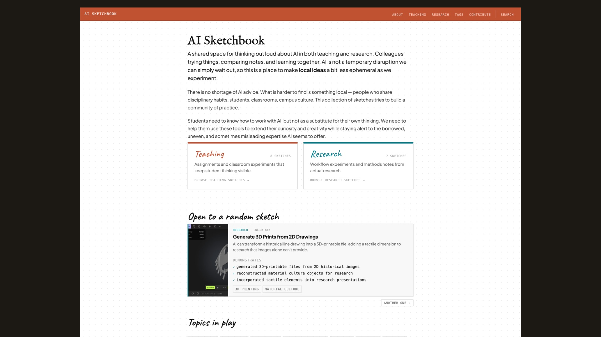
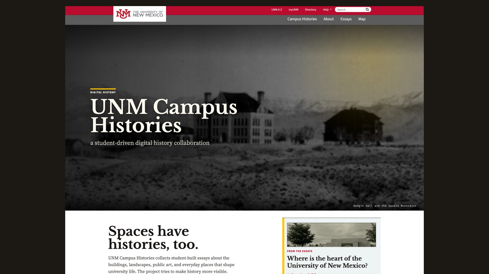
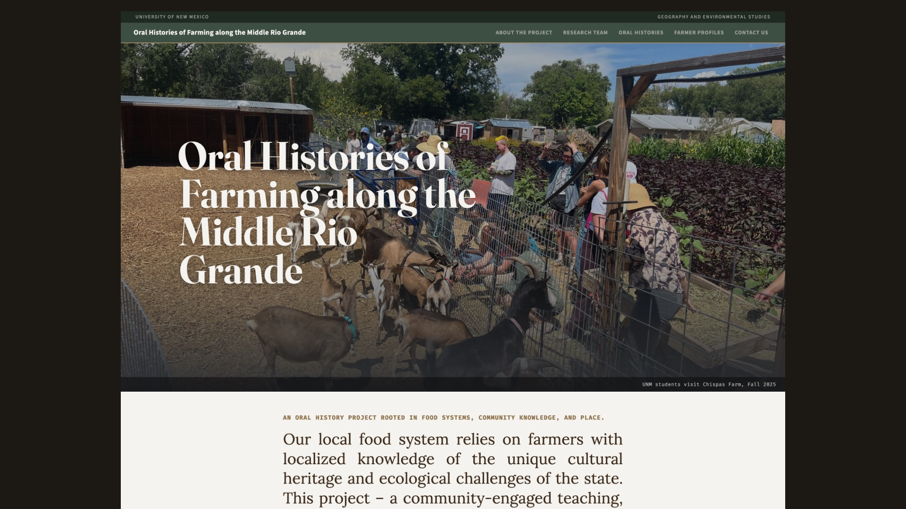
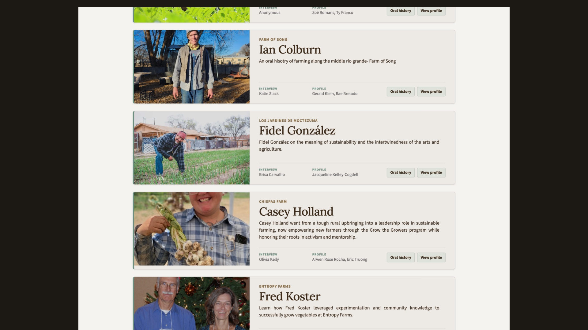
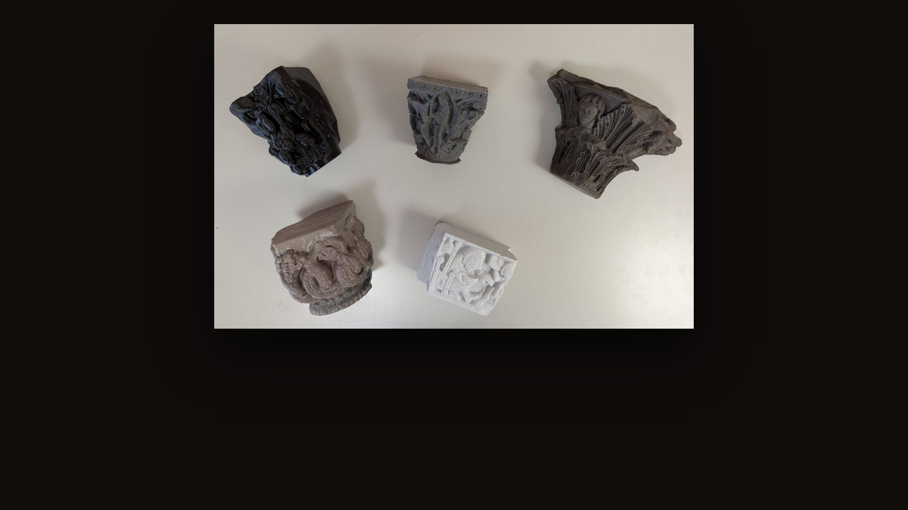
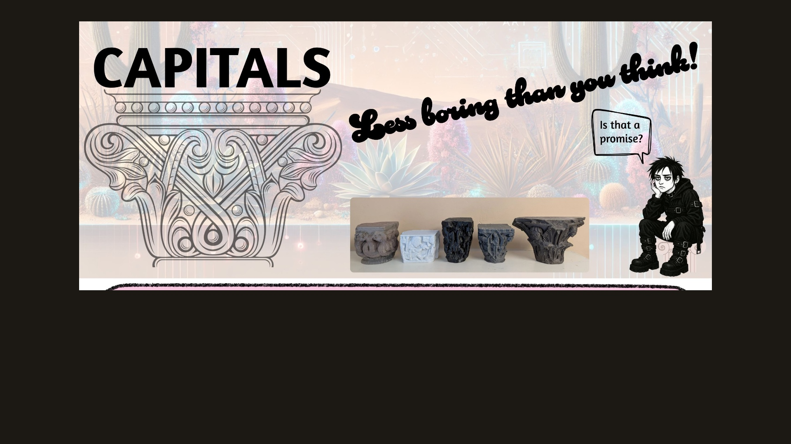

{::options parse_block_html="true" auto_ids="false" /}

<!-- 01 ---------------------------------------------------------------------- -->
<section class="s-title scrim-left"
 data-background-image="images/sandia.jpg"
 data-background-size="cover"
 data-background-position="center"
 aria-label="Title">

September 28, 2026
{: .pv-eyebrow}

# Expertise and Trust in Humanities AI
{: .xl}

What AI changes about humanities research, and how might recalibrates trust.

Fred Gibbs
: fredgibbs.net

History
: history.unm.edu

Amaranth
: amaranth.unm.edu

{: .pv-meta}

<aside class="notes">
**0:00–0:30**

Fifteen minutes. The deck alternates: a claim, then the thing the claim is about. I am going to move fast through a lot of projects, because the argument is in the pattern across them rather than in any one of them.

The through-line: AI moved the cost of doing humanities work, and it moved it in a direction that puts more weight on human judgment, not less — which makes the question of who we trust, and on what basis, the practical problem rather than the philosophical one.
</aside>
</section>

<!-- 02 ---------------------------------------------------------------------- -->
<section class="s-statement scrim-none" aria-label="We can already trust AI">

Provocation
{: .pv-eyebrow .terra}

## We can already trust AI.

---

Do you trust me? That is the real issue. AI is trustworthy in the sense that skilled users know what to expect and that AI output is already consistent (while improving). The question we need to answer is **how do we know to trust those who use it?**
{: .full}

<aside class="notes">
**0:30–1:20**

I am not much worried about whether the model is reliable. Inside a task you have scoped, it is: a skilled user knows what it will do, the output is consistent, and it improves. Treating "can we trust AI" as the open question has eaten a lot of faculty meetings and settled nothing.

The open question is the one on the slide. When I hand you a transcript, a map, a reconstruction, a student essay, you are not evaluating the model. You are evaluating me — whether I knew enough to check it, whether I actually checked, and whether I told you where I stopped. That is a claim about expertise, and we have no established way to warrant it yet.

So: do you trust me? Everything after this slide is the attempt to earn a yes.
</aside>
</section>

<!-- 03 ---------------------------------------------------------------------- -->
<section class="s-plate band-lg scrim-none"
 data-background-color="#100d0b"
 aria-label="Galileo's Moon in the Venice first edition and in the Frankfurt piracy of the same year">

 
 Venice 1610 · etched
 Frankfurt 1610 · pirated

Precedent 1
{: .pv-eyebrow .terra}

## Print was not automatically trustworthy.

The same Moon, the same year. Galileo's own etching on the left; on the right a Frankfurt piracy, recut in wood and printed upside down with stronger contrast. The latter was far more reprinted. Which is, or becomes, true?
{: .pv-cap}

<aside class="notes">
**1:20–2:00**

Before any of my own work, two slides of history — because that question is old, and we are not the first people to face it.

Print did not arrive trustworthy. More copies meant more chances for corruption, and no reader could check a text against an exemplar they would never see. What eventually made print credible was not the press; it was a century of institution-building around it — correctors on the payroll, printing privileges, colophons naming who was answerable, a trade register. Adrian Johns's argument: fixity is not a property of print. It is something people had to manufacture, and keep manufacturing.

Now the picture, which is the argument in one object. Galileo published in Venice in March 1610 with copper etchings made from his own wash drawings. Within months a Frankfurt printer reissued it without permission, and in the hurry the plates were recut as woodcuts — cheaper, coarser, and set into the forme upside down. Point at the big crater: low on the terminator on the left, high on the right.

Then the sting, which is the reason this slide is here. The pirated woodcuts were the ones later editions copied, and the ones that went into moon handbooks for centuries. Scholars who never saw a first edition concluded that Galileo was a crude draughtsman. The bad copy outcompeted the good one, and the author took the reputational damage for it.

Say the parallel lightly. The next slide completes it.

Sources: Adrian Johns, *The Nature of the Book* (1998). Edition history and the upside-down woodcuts: Linda Hall Library, "The Face of the Moon," section B (1610–1700). Images: Sidereus Nuncius, Venice: Baglioni, 1610 (Smithsonian Libraries copy, Internet Archive `Sidereusnuncius00Gali`) and Frankfurt: Palthenius, 1610 (Boston Public Library copy, Internet Archive `sidereusnunciusm00gali_0`) — both public domain.
{: .sources}
</aside>
</section>

<!-- 04 ---------------------------------------------------------------------- -->
<section class="s-plate band-lg heavy"
 data-background-image="images/air-pump.jpg"
 data-background-size="cover"
 data-background-position="center 45%"
 aria-label="Joseph Wright of Derby, An Experiment on a Bird in an Air Pump, 1768">

Precedent 2
{: .pv-eyebrow .terra}

## Science had to build its trust network.

Joseph Wright of Derby, 1768 — a century after Boyle's pump, and a fact is still made by gathering people into a room and letting them watch the bird die. The Royal Society, the witnessed demonstration, reports written so a distant reader could witness at second hand: trust infrastructure, and it took generations to build. Does AI threaten that?
{: .pv-cap}

<aside class="notes">
**2:00–2:40**

Same problem, next century, and this one is a laboratory.

The experimental philosophy produced claims almost nobody could check: what happened inside Boyle's air pump was believable only if you trusted the people standing there. So the period built machinery for exactly that — the Royal Society as a standing body of credible witnesses, demonstrations performed in front of an audience rather than reported afterwards, and papers written in enough circumstantial detail that a reader in another country could witness them at second hand. Shapin and Schaffer call that virtual witnessing.

Now the date on this picture. It is 1768 — more than a hundred years after Boyle. They are *still* doing it: still gathering people into a room, still watching each other's faces. That is the part I want to land. The network that makes knowledge trustworthy was not switched on. It was built slowly, argued over, and it took generations.

We are about two years into ours.

Sources: Steven Shapin and Simon Schaffer, *Leviathan and the Air-Pump* (1985); Steven Shapin, *A Social History of Truth* (1994). Image: Joseph Wright of Derby, *An Experiment on a Bird in an Air Pump*, 1768, National Gallery, London — public domain.
{: .sources}
</aside>
</section>

<!-- 05 ---------------------------------------------------------------------- -->
<section class="s-column scrim-none"
 data-background-color="#100d0b"
 aria-label="Amaranth, UNM's digital humanities studio">

amaranth.unm.edu
{: .pv-eyebrow}

### A studio, not a service desk.

Amaranth is UNM’s digital humanities studio: a research and teaching space where faculty, students, and community partners investigate how digital methods can deepen humanistic inquiry, strengthen public scholarship, and build the digital literacy students need for an AI-shaped world.

{: .pv-cap}

<aside class="notes">
**2:40–3:30**

Open here, because every problem in this talk comes out of this room. Cultivating Amaranth has been most of my institutional energy for the last two years.

A service desk takes a finished request and returns a deliverable. That model fails in the humanities, because the interesting decisions are all upstream — what counts as an item, what the metadata should be, what the argument is. By the time the request is well specified, the scholarship has already been done, usually badly. So we ask for the half-formed question instead, and we sit in the design conversation.

Hold the last line, because the argument at the end depends on it: undergraduates and one faculty member. That was not possible three years ago at this scale.
</aside>
</section>

<!-- 06 ---------------------------------------------------------------------- -->
<section class="s-column scrim-none"
 data-background-color="#100d0b"
 aria-label="The AI Sketchbook">

AI Sketchbook
{: .pv-eyebrow}

### Field notes, especially the failures.

A shared space where colleagues try something, write down what happened, and tag it. Fifteen sketches so far, each marked tested or untested — because the honest answer is usually *that it half worked*.

Does AI encourage local knowledge more valuable?
{: .pv-cap}

<aside class="notes">
**3:30–4:15**

This is where the research actually happens, and it is deliberately unglamorous.

Read the last line of the intro out loud: students should stay alert to "the borrowed, uneven, and sometimes misleading expertise AI seems to offer." Borrowed expertise is the whole problem from the previous slide in four words — and noticing when you are holding some is a skill, which means it can be taught and it can be evidenced.
</aside>
</section>

<!-- 07 ---------------------------------------------------------------------- -->
<section class="s-statement scrim-none" aria-label="Scale is no longer the obstacle">

Humanities workflows
{: .pv-eyebrow .terra}

## Scale is no longer the obstacle.

---

Reading across thousands of pages, drafting transcripts for a whole interview collection, describing a few hundred photographs so they can be searched — all of it is now a few weeks of supervised work rather than a years-long funded project. The main constraint is no longer capacity, it is **judgment** and **competency**.
{: .full}

<aside class="notes">
**4:15–5:00**

The first focus: bringing AI into humanities research itself, not just into the classroom.

Be concrete about what changed. It isn't that the machine is smart. It's that three or four specific bottlenecks — transcription, description, normalization of messy archival data, first-pass reading at scale — got cheap enough that a single researcher or a class can now attempt a collection that used to need a grant and a team.

And be equally concrete about what didn't change: every one of those outputs is wrong somewhere, usually in the places that carry the most meaning. So the work didn't disappear; it moved to checking, and checking requires more expertise than producing did.

Next on this list is mapping: georectification, layer alignment and feature extraction are exactly the technical drudgery that keeps spatial analysis out of a humanities course. AI does the lift; the reading stays ours.
</aside>
</section>

<!-- 08 ---------------------------------------------------------------------- -->
<section class="s-index scrim-none"
 data-background-color="#100d0b"
 aria-label="Three AI-assisted humanities workflows and the trust cost of each">

AI for humanities research
{: .pv-eyebrow}

### New reach, and new ways to be wrong.

01 / ACROSS TEXTS
{: .num}

#### Read ten thousand pages you haven't read.

Themes traced across a whole corpus, language shifting over decades, patterns no close reading would surface.

You are now vouching for a pattern you did not see.
{: .risk}

02 / IN SPEECH
{: .num}

#### Forty hours of tape, searchable tomorrow.

Draft transcripts of an entire oral history collection in days rather than months, and build an index.

It mangles the names, the Spanish, and the place words — which is most of what the collection is about.
{: .risk}

03 / IN THE LITERATURE
{: .num}

#### Transcend disciplines.

The major positions, the live debates, the search terms, chart a route into a literature you have not read.

It invents sources. Or does it?
{: .risk}

<aside class="notes">
**5:00–5:50**

Three real workflows, and I want the pairs rather than the promises.

The top line of each is a genuine change in reach. Work that needed a team and a grant is now a semester project — that part is not hype.

The bottom line is what it costs, and notice the pattern: in every case the machine is weakest exactly where the material is most specific. It reads a corpus but cannot tell you which pattern matters. It transcribes fluently and then flattens the proper nouns, the Spanish, and the acequia vocabulary — the words that carry the local knowledge. It maps a literature and salts the map with books that do not exist.

So the competence required went up, not down. You now need enough expertise to catch a confident machine in the places it is confidently wrong — and that is precisely the expertise a reader outside the field cannot check.

Which is the trust problem in its working form: not "is the AI reliable," but "how would you know whether I checked."

Source: amaranth.unm.edu/projects/ai-humanities — the workflows and their stated caveats.
{: .sources}
</aside>
</section>

<!-- 09 ---------------------------------------------------------------------- -->
<section class="s-statement scrim-none" aria-label="Every reconstruction is an argument with the confidence turned up">

Reconstruction
{: .pv-eyebrow .terra}

## Every reconstruction is an argument with the *confidence turned up*.

---

LiDAR and photogrammetry fail visibly: a gap in a point cloud looks like a gap. A generated elevation looks finished whether or not anyone alive knows what was there. **If we build these, the drawing convention has to carry the evidence** — which is a discipline architectural illustration has had for a century and the new tools do not.
{: .full}

<aside class="notes">
**5:50–6:35**

The other half of the research work is historical reconstruction — buildings and landscapes that are gone, in AR and VR.

The appeal is obvious: you can put a body in a space that no longer exists, which no photograph and no scan can do. The danger is equally obvious once you say it plainly. Scanning records what survived. Reconstruction invents what didn't, and it invents it at the same visual confidence as the parts that are documented.

The fix is not technical and it is not new. Reconstruction drawings have always distinguished extant fabric from conjecture with line weight and hatching. We need to carry that convention into the medium, and we need to do it now, while the conventions are still being set.
</aside>
</section>

<!-- 10 ---------------------------------------------------------------------- -->
<section class="s-plate band-lg heavy"
 data-background-image="images/vr-reconstruction.jpg"
 data-background-size="cover"
 data-background-position="center"
 aria-label="A generated VR view splitting standing ruins from a fully rendered reconstruction, with an AI confidence score">

AI-generated image
{: .pv-eyebrow .terra}

## Ninety-four per cent confident. Of what?

Both halves are generated — the "reality" on the left is not a photograph either. Nothing in the reconstruction is sourced to anything, and the number measures nothing at all.
{: .pv-cap}

<aside class="notes">
**6:35–7:30**

Let them look before you say anything. Someone will read the panel out loud.

What the picture promises is a clean split: measured fact on the left, reconstruction on the right, and a seam down the middle you can see. What it actually delivers is a single generated image in which both halves are invented, including the ruin. There is no survey behind the wall on the left and no source behind the roof beams, the plaster, the hanging corn, or the people on the right.

Then the number. Ninety-four per cent confident — of what, measured against what? A confidence score needs a ground truth to be a percentage of, and for a building nobody alive has stood inside there isn't one. It is a number with the grammar of evidence and none of the substance, and it is the most persuasive thing on the screen. If you remember one image from this talk, make it this one.

The remedy is old and this field already owns it. Reconstruction drawings have distinguished extant fabric from conjecture for a century, with line weight and hatching. I have a drawn version of this for the Alvarado Hotel — solid for what is photographed, dashed for what is inferred from building type, dotted for what I would be inventing. It is less impressive and it is honest, and the discipline has to be in the drawing convention rather than in a disclaimer nobody reads.

Sources: image generated with Google Gemini for this talk, September 2026. The panel's own claims — Aztec Ruins National Monument, Pueblo III — are the model's, not mine; do not repeat them as fact.
{: .sources}
</aside>
</section>

<!-- 11 ---------------------------------------------------------------------- -->
<section class="s-column scrim-none"
 data-background-color="#100d0b"
 aria-label="UNM Campus Histories">

Teaching
{: .pv-eyebrow}

### Teach peer review

When public scholarship is the default output, the possibilities and incentives change from day one: students write for readers, cite for strangers, and think about trust.

UNM Campus Histories — a multi-semester project. Each cohort builds on what the last one made.
{: .pv-cap}

<aside class="notes">
**7:30–8:20**

Invert the usual arrangement. A student writes for one reader who is paid to finish it, and the public version, if the project is lucky, happens afterwards. That afterwards almost never arrives. Make the public artifact the assignment instead and they start asking who is going to read this — the question that makes every other question worth asking.

The moment I like best: once the collection got large enough to browse, students needed categories — academic building, classroom building, public art, landscape. Nobody assigned that. Inventing a classification is preservation work whether or not you call it that.

The scale, if anyone wants it: 14 courses and about 180 students in the first year, nine collaborative class websites live.
</aside>
</section>

<!-- 12 ---------------------------------------------------------------------- -->
<section class="s-column scrim-none"
 data-background-color="#100d0b"
 aria-label="Oral Histories of Farming along the Middle Rio Grande">

Community storytelling
{: .pv-eyebrow .terra}

### The knowledge is already in the community.

Farmers along the Middle Rio Grande hold knowledge about water, soil, and land use that exists in no document anywhere..

Is this a conversation or an archive?
{: .pv-cap}

<aside class="notes">
**8:20–9:10**

The word that matters here is authority. The default posture of a university project is that the community is the subject of the research. The posture here is that the community is a source of authority in it.

Then be honest about what AI changed and what it did not. Draft transcripts for a whole collection in days is a real change in what is attemptable — an undergraduate class can now take on a collection that used to need a grant. But the drafts are wrong in exactly the places that carry the meaning: proper nouns, Spanish, local place names, irrigation vocabulary. The labour did not vanish. It moved toward deciding what a collection means, which is the part we wanted students doing.
</aside>
</section>

<!-- 13 ---------------------------------------------------------------------- -->
<section class="s-column scrim-none"
 data-background-color="#100d0b"
 aria-label="Farmer profiles, each crediting the narrator, the interviewer and the authors">

Stewardship
{: .pv-eyebrow .terra}

### Do human voice matter more?

Every profile credits the farmer, the student who ran the interview, and the students who wrote it up, the instructor who guided the class.

Can AI tools cite this?
{: .pv-cap}

<aside class="notes">
**9:10–10:00**

This is the question I get asked least and should be asked most, so I put it in unprompted.

The uncomfortable fact: the collections where AI would help most have the strongest claims against casual processing. A community's oral histories are not a dataset. Somebody trusted a student with them. Consent to be interviewed is not consent to be uploaded. Sometimes the answer is that we do it slower, by hand — saying that out loud is the only thing that makes the rest of the policy credible.

Then point at the credit block on each card. Three names on every entry: the farmer, the student who did the interview, the students who wrote the profile. Nobody here is a data source. It costs nothing to build and it changes what the project is.
</aside>
</section>

<!-- 15 ---------------------------------------------------------------------- -->
<section class="s-plate band-lg scrim-none"
 data-background-color="#100d0b"
 aria-label="Five 3D-printed medieval capitals on a table">

 

Amaranth · 3D pedagogy
{: .pv-eyebrow}

## Scan it — then put it back in a hand.

We printed five medieval capitals from Scan the World. Set them on a table and the Romanesque-to-Gothic transition stops being a claim in a textbook: it becomes something you see by *turning two objects*.
{: .pv-cap}

<aside class="notes">
**10:50–11:10**

Scanning is the middle of the pipeline, not the end of it. The partnership version: students have been scanning artifacts at UNM's Maxwell Museum and documenting the workflow so the next person can repeat it, and student researchers have taken 3D printing into high school history classrooms. An undocumented digitization is a one-off, not infrastructure.
</aside>
</section>

<!-- 16 ---------------------------------------------------------------------- -->
<section class="s-column scrim-none"
 data-background-color="#100d0b"
 aria-label="The 3D Capitals poster">

Amaranth · 3D pedagogy
{: .pv-eyebrow}

### Then tell people what to look at.

The poster is the contextualising layer — the digitizing workflow, the feature-by-feature comparison, and the museum that holds each original.

<aside class="notes">
**11:10–11:40**

Five lumps of grey filament on a table are five lumps of grey filament until something tells you what to look at. That is what the poster is for, and it hangs in the studio beside the prints.

The tone is deliberate too. A poster nobody stops at is a poster that failed.
</aside>
</section>

<!-- 17 ---------------------------------------------------------------------- -->
<section class="s-statement scrim-none" aria-label="Speculative fiction as a classroom exercise">

Speculative fiction
{: .pv-eyebrow .terra}

## Ask it for a place that never existed.

---

The most useful exercise I have found puts all of this together: have a model generate a landscape, a building, a settlement — something plausible and wholly invented — and then argue about it. **Practice the methods of AI critique**.
{: .full}

<aside class="notes">
**11:40–12:30**

Last section, and it combines everything: the research question, the reconstruction problem, and the classroom.

Generative models are very good at speculative fiction, which is a polite name for confident invention. That is normally the thing we warn students about. Here it is the raw material, on purpose, and out in the open where everyone can see it happening.

The move is to generate something that could not be a photograph of anywhere, hand it to a room of people who know the region, and let them take it apart.
</aside>
</section>

<!-- 18 ---------------------------------------------------------------------- -->
<section class="s-plate band-lg"
 data-background-image="images/ai-mesa-verde.jpg"
 data-background-size="cover"
 data-background-position="center"
 aria-label="An AI-generated model landscape of cliff dwellings">

AI-generated image
{: .pv-eyebrow .terra}

## What here is real? What isn't?

A generated model landscape of cliff dwellings. No site, no survey, no scale. Students are asked which parts they would defend, on what evidence, and what would settle it.
{: .pv-cap}

<aside class="notes">
**12:30–13:40**

Put it up and let the room work on it for a moment before you say anything. Say clearly that it is AI-generated — after the last two slides it would be absurd not to.

Then the questions, in order. What is doing the work of realism here? The contour terrain reads as a survey model, which is a claim about measurement that nothing in this image is entitled to make. Where are the dwellings placed, and is that where they are actually built? What is the construction — is that masonry coursing or is it texture? What is missing that would be there: middens, water, paths, agriculture, any sign of how anyone got in or out?

A student who knows the Southwest will get to "the siting is wrong" fast. Getting them to say *how they know* is the entire pedagogical payload.
</aside>
</section>

<!-- 19 ---------------------------------------------------------------------- -->
<section class="s-statement scrim-none" aria-label="Closing: the complaint is the lesson">

The questions
{: .pv-eyebrow}

## These slides are AI-generated

---
But what does that mean?

Does AI use matter when carefully mediated? 

Does AI use matter, or AI credentials?
{: .full}

Fred Gibbs · fredgibbs.net · amaranth.unm.edu
{: .pv-cap}

<aside class="notes">
**13:40–15:00**

Land it and stop.

The complaint that generative images are fake is correct, and on its own it is inert. It becomes education at the moment you ask the person complaining to be specific — because being specific about why an image is wrong requires knowing what right looks like, and that is domain expertise, and building it is what we are for.

That is the whole argument. The tools got cheap enough that a student can make things that used to take a team. Whether what they make is any good is a question of judgment, and judgment is the thing we still have to teach — which is why the expertise question I opened with is a teaching question, not a technology question.

Leave the rest of the window for questions.
</aside>
</section>
