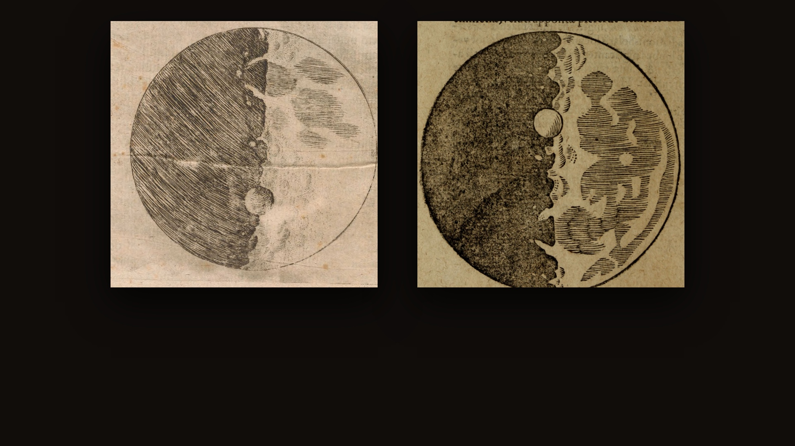
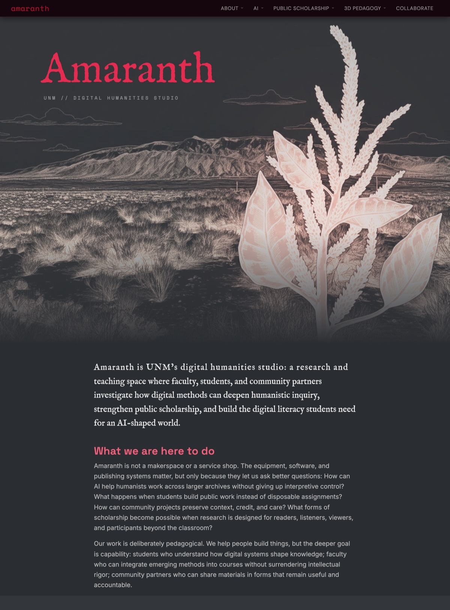
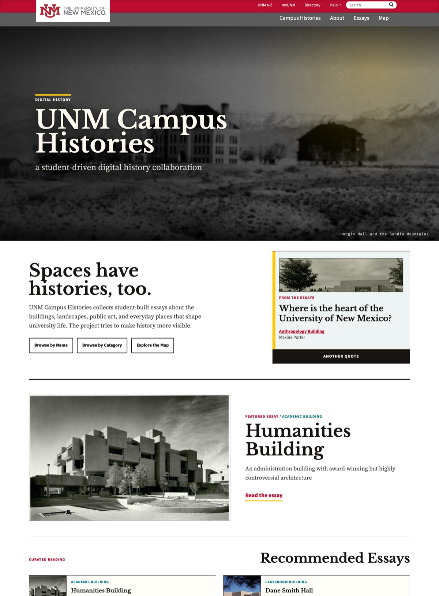
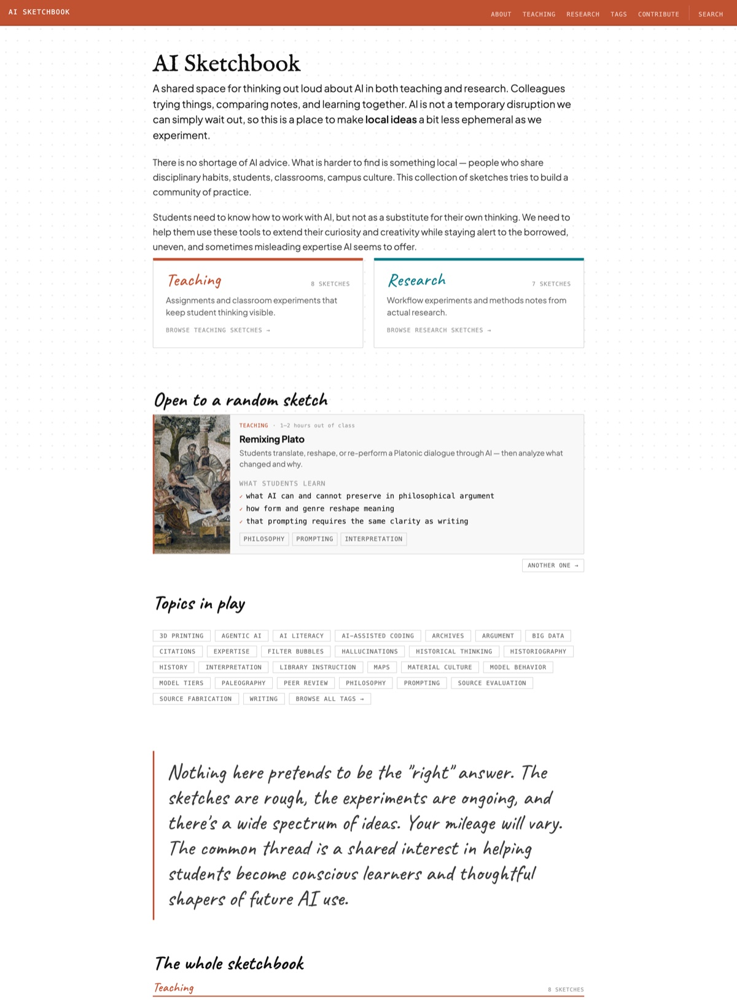
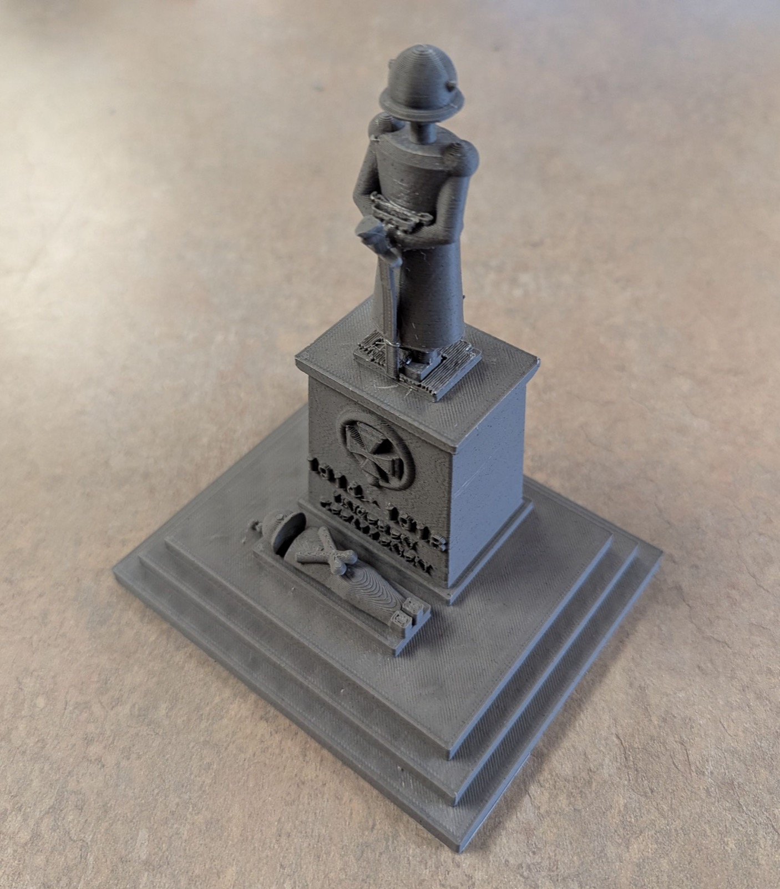

{::options parse_block_html="true" auto_ids="false" /}

<!-- 01 ---------------------------------------------------------------------- -->
<section class="s-title scrim-left"
 data-background-image="images/sandia.jpg"
 data-background-size="cover"
 data-background-position="center"
 aria-label="Title">

September 23, 2026
{: .pv-eyebrow}

# Expertise and Trust in Humanities AI
{: .xl}

What AI changes about humanities research, and how it recalibrates trustwork.

Fred Gibbs
: fredgibbs.net

History
: history.unm.edu

Amaranth
: amaranth.unm.edu

{: .pv-meta}

<aside class="notes">
**0:00–0:25**

Fifteen minutes. The deck alternates: a claim, then the thing the claim is about. I am going to move fast through a lot of projects, because the argument is in the pattern across them rather than in any one of them.

The through-line: AI moved the cost of doing humanities work, and it moved it in a direction that puts more weight on human judgment, not less — which makes the question of who we trust, and on what basis, the practical problem rather than the philosophical one.
</aside>
</section>

<!-- 07 ---------------------------------------------------------------------- -->
<section class="s-statement scrim-none" aria-label="Scale is no longer the obstacle">

Digital? Humanities workflows
{: .pv-eyebrow .terra}

## _Techne_ is no longer an issue

---

The Digital Humanities have long championed working at scale, exploring data, and methodological experiments. The main constraint is no longer technical capacity, it is **judgment** and **competency**. Old epistemology questions are back!
{: .full}

<aside class="notes">
**0:25–1:05**

The first focus: bringing AI into humanities research itself, not just into the classroom.

Be concrete about what changed. It isn't that the machine is smart. It's that three or four specific bottlenecks — transcription, description, normalization of messy archival data, first-pass reading at scale — got cheap enough that a single researcher or a class can now attempt a collection that used to need a grant and a team.

And be equally concrete about what didn't change: every one of those outputs is wrong somewhere, usually in the places that carry the most meaning. So the work didn't disappear; it moved to checking, and checking requires more expertise than producing did.

Next on this list is mapping: georectification, layer alignment and feature extraction are exactly the technical drudgery that keeps spatial analysis out of a humanities course. AI does the lift; the reading stays ours.
</aside>
</section>

<!-- 08 ---------------------------------------------------------------------- -->
<section class="s-index scrim-none"
 data-background-color="#100d0b"
 aria-label="Three AI-assisted humanities workflows and the trust cost of each">

AI for humanities research
{: .pv-eyebrow}

### New reach, and new ways to be wrong.

01 / ACROSS TEXTS
{: .num}

#### Read ten thousand pages you haven't read.

Themes traced across a whole corpus, language shifting over decades, patterns no close reading would surface.

You are now vouching for a pattern you did not see. But what does seeing mean?
{: .risk}

02 / IN SPEECH
{: .num}

#### Forty hours of stories, searchable tomorrow.

Draft transcripts of an entire oral history collection in days rather than months, and build an index.

It mangles the names, the Spanish, and the place words. But aren't they correctable?
{: .risk}

03 / IN THE LITERATURE
{: .num}

#### Transcend disciplines.

The major positions, the live debates, the search terms, chart a route into a literature you have not read.

It invents sources. But can't better rules mitigate that?
{: .risk}

<aside class="notes">
**1:05–1:55**

Three real workflows, and I want the pairs rather than the promises.

The top line of each is a genuine change in reach. Work that needed a team and a grant is now a semester project — that part is not hype.

The bottom line is what it costs, and notice the pattern: in every case the machine is weakest exactly where the material is most specific. It reads a corpus but cannot tell you which pattern matters. It transcribes fluently and then flattens the proper nouns, the Spanish, and the acequia vocabulary — the words that carry the local knowledge. It maps a literature and salts the map with books that do not exist.

So the competence required went up, not down. You now need enough expertise to catch a confident machine in the places it is confidently wrong — and that is precisely the expertise a reader outside the field cannot check.

Which is the trust problem in its working form: not "is the AI reliable," but "how would you know whether I checked."

Source: amaranth.unm.edu/projects/ai-humanities — the workflows and their stated caveats.
{: .sources}
</aside>
</section>

<!-- 10 ---------------------------------------------------------------------- -->
<section class="s-plate band-lg heavy"
 data-background-image="images/vr-reconstruction.jpg"
 data-background-size="contain"
 data-background-position="center"
 aria-label="A generated VR view splitting standing ruins from a fully rendered reconstruction, with an AI confidence score">

Recreating history
{: .pv-eyebrow .terra}

## New historical realities

Both halves are generated — the "reality" on the left is not a photograph either, and the number measures nothing at all. A gap in a point cloud looks like a gap; a generated elevation looks finished whether or not anyone alive knows what was there. **If we reimagine history with AI, how do we delineate "fact" and "fiction"?**
{: .pv-cap}

<aside class="notes">
**1:55–3:30**

The other half of the research work is historical reconstruction — buildings and landscapes that are gone, in AR and VR. The appeal is obvious: you can put a body in a space that no longer exists, which no photograph and no scan can do. The danger is equally obvious once you say it plainly. Scanning records what survived; reconstruction invents what didn't, and it invents it at the same visual confidence as the parts that are documented. LiDAR and photogrammetry fail visibly — a gap in a point cloud looks like a gap. A generated elevation fails invisibly.

Then let them look before you say anything else. Someone will read the panel out loud.

What the picture promises is a clean split: measured fact on the left, reconstruction on the right, and a seam down the middle you can see. What it actually delivers is a single generated image in which both halves are invented, including the ruin. There is no survey behind the wall on the left and no source behind the roof beams, the plaster, the hanging corn, or the people on the right.

Then the number. Ninety-four per cent confident — of what, measured against what? A confidence score needs a ground truth to be a percentage of, and for a building nobody alive has stood inside there isn't one. It is a number with the grammar of evidence and none of the substance, and it is the most persuasive thing on the screen. If you remember one image from this talk, make it this one.

The remedy is old and this field already owns it. Reconstruction drawings have distinguished extant fabric from conjecture for a century, with line weight and hatching. I have a drawn version of this for the Alvarado Hotel — solid for what is photographed, dashed for what is inferred from building type, dotted for what I would be inventing. It is less impressive and it is honest, and the discipline has to be in the drawing convention rather than in a disclaimer nobody reads.

Sources: image generated with Google Gemini for this talk, September 2026. The panel's own claims — Aztec Ruins National Monument, Pueblo III — are the model's, not mine; do not repeat them as fact.
{: .sources}
</aside>
</section>

<!-- 02 ---------------------------------------------------------------------- -->
<section class="s-statement scrim-none" aria-label="We can already trust AI">

Provocation
{: .pv-eyebrow .terra}

## We can already trust AI.

---

Do you trust me to write history with AI? That is the real issue. AI is trustworthy in the sense that skilled users know what to expect and that AI output is already consistent (while improving). The question we need to answer is **how do we know when to trust those who use it?**
{: .full}

<aside class="notes">
**3:30–4:10**

I am not much worried about whether the model is reliable. Inside a task you have scoped, it is: a skilled user knows what it will do, the output is consistent, and it improves. Treating "can we trust AI" as the open question has eaten a lot of faculty meetings and settled nothing.

The open question is the one on the slide. When I hand you a transcript, a map, a reconstruction, a student essay, you are not evaluating the model. You are evaluating me — whether I knew enough to check it, whether I actually checked, and whether I told you where I stopped. That is a claim about expertise, and we have no established way to warrant it yet.

So: do you trust me? Everything after this slide is the attempt to earn a yes.
</aside>
</section>

<!-- A1 ---------------------------------------------------------------------- -->
<section class="s-index scrim-none"
 data-background-color="#100d0b"
 aria-label="The research experiment: two literatures the chapter has to join, and the gap between them">

Research experiment
{: .pv-eyebrow}

## Texts prescribe. Bodies record.

### Two literatures that barely cite each other.

01 / THE TEXTS
{: .num}

#### Medieval dietetics

Regimen literature, Galenic and Islamicate. Food as the first instrument of medicine — what learned practice told people to eat, and on what theory.

My field. I can tell when a reading is wrong.
{: .risk}

02 / THE BODIES
{: .num}

#### Bioarchaeology

Stable isotopes, dental calculus, paleopathology. What skeletons record about what people actually ate, decades at a time.

Not my field. I cannot tell when a reading is wrong.
{: .risk}

03 / THE GAP
{: .num}

#### One cemetery at a time

Integration already happens — but site by site, small samples, told as a narrative about that site.

The synthesis at scale "has yet to materialize."
{: .risk}

<aside class="notes">
**4:10–5:05**

Turn from the general case to a single project. Everything so far has been a claim about capability; this is where I have to show my work.

The chapter is for the *Cambridge History of Medicine*, volume two, medieval. Eight thousand words on food, health and medicine, and the claim that makes it worth writing is the headline. Learned medicine told people what to eat. Skeletons record what people actually ate. Those two records diverge, and the divergence is historically meaningful rather than embarrassing.

Then the three columns, and the honest asymmetry in the bottom line of each.

Column one is where I live — regimen literature, twenty years of it. Column two I had to enter from scratch, and entering it is not optional, because the chapter's claim is a claim about both. Be blunt about what that means: I can read an isotope paper's abstract and I cannot tell you whether its sampling strategy is sound. A reader would be right not to take my word for it.

Column three is the opening. The phrase in quotation marks is from my own abstract — that a large-scale synthesis beyond site-by-site findings has yet to materialize — so it is a claim I owe evidence for, and the evidence is the field's own review. Gundula Müldner: the publications are focused on individual sites or cemeteries, and the numbers of individuals analysed are relatively small. The prescription-versus-practice comparison is well established and I must not pretend to have invented it. It has simply been assembled one dig at a time, because assembling it otherwise means reading across two literatures that share no journals, no vocabulary and no conferences.

That is a reading problem before it is anything else. Which is where the machine comes in.
</aside>
</section>

<!-- A3 ---------------------------------------------------------------------- -->
<section class="s-statement scrim-none" aria-label="Not prompts, protocol: the workflow every source runs through">

Method
{: .pv-eyebrow .terra}

## Not prompts. Protocol.

---

Every source runs the same pipeline — **read, note, synthesize, outline, draft** — with a written rule governing each hand-off, and a file left behind at every stage. Historians do all of this constantly and never write it down: we learn it by apprenticeship and then it goes tacit. **Tacit method cannot be applied evenly across two fields. Written method can — and can be checked.**
{: .full}

<aside class="notes">
**5:05–5:45**

This is the slide I would defend as the actual contribution, so slow down here.

What I spent the first weeks of this project doing was not research. It was writing instructions. A reading protocol, a note template, nine interrogation lenses, a style guide. If anyone wants the number: about seven thousand four hundred words on how to read, for a chapter that is contracted at eight thousand. The instructions are nearly as long as the thing they produce, and I do not think that is a mistake.

The analogy that kept occurring to me: it is like supervising a very fast, very literal graduate student who has read everything and understands nothing. You cannot tell that student "read it properly." You have to say what properly means. And saying what properly means turned out to be genuinely hard, which is the finding.

Here is the concrete version. I have been reading scholarship for twenty years, and it had never occurred to me to articulate that the first thing I look for in an article is who it is arguing *against* — because the polemical target is how you find out what is actually at stake, and whether the claim is a real intervention or a restatement. That is not in any methods course. You absorb it in graduate school and then it goes tacit, and tacit is exactly what cannot be handed to anything — a machine, a research assistant, or a reader who wants to check you.

Read the pipeline off the slide, because the next four slides walk it: the rules themselves, then the note, then the synthesis, then the outline. One file per stage, and each one is the input to the next.

Now the significance, which is the reason this slide exists. The reason integration in this field happens one cemetery at a time is that every study reads its own material in its own way — there is no common footing to synthesize *from*. Uniform, explicit, inspectable reading is the precondition for putting two literatures beside each other at all. So the protocol is not overhead on the research. It is the part that makes the synthesis possible, and it is the part a stranger could audit.
</aside>
</section>

<!-- A4 ---------------------------------------------------------------------- -->
<section class="s-frame scrim-none"
 data-background-color="#100d0b"
 aria-label="The project brief's trigger map, shown as it appears in the file">

 
<i></i><i></i><i></i>AGENTS.md

 <pre class="src">## Workflow — trigger-map (when → what → where)

| Trigger (when it fires)     | Do               | Detail lives in   |
|-----------------------------|------------------|-------------------|
| On every read of a source   | Write a note     | reading-protocol  |
| Every 3 sources read        | OFFER a red team | interrogation-log |
| Tension with our OWN thesis | Log it           | emergent-ideas    |
| Workflow changes            | Record the why   | methods-log       |

## Working rules (no silent fallbacks)

- Closed corpus. Every factual claim must cite a source in
  sources/ with page number. If no source covers a claim,
  flag it as a GAP — never fill from general knowledge
  without marking it [UNVERIFIED — from model knowledge].</pre>

How the project is organized
{: .pv-eyebrow}

### Folders, files, triggers.

A place for everything so I can find inspect it, but also rules for *when this happens, do this.* A rule that fires at the moment it is needed.

<aside class="notes">
**5:45–6:35**

That was the workflow. This is where it is written down — and what makes each stage fire.

This is the file. I am not showing you a folder tree, because showing you my folder tree would tell you nothing — you all have `notes` and `sources` and `drafts`, and a picture of folders is a picture of storage. What matters is the middle column: not where things live, but the moment a rule goes off.

Three rows worth reading aloud.

Row one: on every read, the note gets written before I know what I want from the source. That is the only reliable defence I have found against reading a book for the sentence you already wanted.

Row two, and this is the one I would defend hardest — every three sources it *offers* to red-team the corpus. Note the capital letters on OFFER, and "don't auto-run." An automatic critic becomes wallpaper in about a week. Making it ask keeps the decision mine, and keeps me noticing that I am making one.

Row three: when something surfaces a tension with my *own* thesis — not with the sources, with me — that gets logged rather than quietly resolved.

Then the working rule at the bottom, which is the one from the last slide, and now you can see that it lives in the same file as everything else, in the same register, and gets applied the same way. No claim without a page. Otherwise the flag stays in the file, visible, until I deal with it.

The heading is the honest one: no silent fallbacks. Everything this thing cannot do, it has to say it cannot do.

Now three slides, one per stage, showing what those rules actually leave behind.
</aside>
</section>

<!-- A4b --------------------------------------------------------------------- -->
<section class="s-frame scrim-none"
 data-background-color="#100d0b"
 aria-label="Stage one of the pipeline: a structured source note">

 
<i></i><i></i><i></i>notes/Muldner-2009-…isotopes.md

 <pre class="src"># Notes: Müldner, "Investigating Medieval Diet and Society by
# Stable Isotope Analysis of Human Bone" (2009)

**Status:** ✅ READ from the corpus PDF (verified close read)
**Evidence type:** field review of C/N isotope analysis, written
  for a non-specialist audience
**Role in chapter:** ⭐⭐⭐ best orienting source for M2/M4

## Why it positions the M4 gap-claim
- The prescription-vs-practice comparison IS established — she
  reviews it. So M4 must NOT claim to invent this.
- BUT she states the FIELD'S LIMIT plainly: "Many of the
  currently available publications are focused on individual
  sites or cemeteries. The number of individuals analysed
  … often relatively small." (p. 340)
  → single-site, small-n, narrative. This is the gap M4 fills.

## Citation profile — how to cite THIS source
- (a) Pinpoint [P]: the "individual sites / small-n" limitation
- (b) Orienting [O]: best overview cite for isotopes + diet</pre>

1/3: Source summary
{: .pv-eyebrow}

### Read it on its own terms first.

Notes for each source, all following the same rules. Identify historiographical interventions, secondary source base, primary source base, outliers. Pin them to specific passages.

<aside class="notes">
**6:35–7:15**

Stage one. Fifty-six of these, and every one has the same sections in the same order because the protocol says so.

What to point at. The middle block is Müldner saying the field works site by site, with her page number. That sentence is what my entire case study leans on — it is the licence for claiming a gap — and notice it is in the note *before* it is in the chapter. It is there because I read her, not because the model recalled her. A model can produce a sentence like that from thin air and it will be plausible and it will be unattributable. This one has a page.

Then the line above it, which is the discipline actually working: "the comparison IS established — so M4 must not claim to invent this." That is the note arguing against the chapter's interest. The rule that produces it is the one on the previous slide — don't recruit a source to the thesis, state its own emphasis first. Left to its own devices, any research assistant, human or otherwise, writes down the part you wanted. This template makes it write down the part that constrains you.

And the bottom: every source gets sorted into pinpoint or orienting. Pinpoint means there is a specific page the argument will lean on. Orienting means the work is foundational but so absorbed into the field that there is nothing particular to quote. Pinpoint gets this treatment; orienting gets three lines. That triage is the only reason sixty-odd sources across two fields is affordable at all.
</aside>
</section>

<!-- A4c --------------------------------------------------------------------- -->
<section class="s-frame scrim-none"
 data-background-color="#100d0b"
 aria-label="Stage two of the pipeline: the synthesis built out of the notes">

 
<i></i><i></i><i></i>synthesis/emergent-ideas.md

 <pre class="src"># Emergent Ideas — hypotheses the research surfaces

Ideas, reframings and tensions that arise FROM the reading and
cross-reading — things NOT in the original abstract.
An emergent idea is a LIVE hypothesis. When one matures it
migrates to the conclusions ledger and stages a proposed
abstract revision (proposed, not silent). When one is
contradicted, mark it so.

Status: 🌱 live · ↑ strengthening · ⛔ contradicted · ✅ matured

## EI-001 courses, not emulsion — THE SPINE, all sections
Texts and bodies are two distinct interpretive registers,
read in conjunction — neither is ground truth.
  ↳ M2: bodies are not ground truth (construct + plasticity)
  ↳ M4: productive divergence — the gap IS the finding

## EI-003 the gap-claim genre — M3 + M4 + Conclusion
The chapter's own AI gap-claim: own it reflexively.</pre>

2/3: Synthesis
{: .pv-eyebrow}

### Bring notes together.

Built out of the notes by cross-reading. These are claims about *my* argument rather than about anybody's evidence — which is exactly why they need a human on them.

<aside class="notes">
**7:15–7:55**

Stage two, and this is the one where the trust question actually bites.

The notes are about sources. This file is about my argument — patterns that surfaced across the reading, reframings, and tensions with the thesis I started from. It is the most useful thing in the project and the thing I trust least, for the same reason: nothing here is anchored to a page. It is inference.

So look at the rules it operates under. An entry is a *live hypothesis*, not a finding — it has a status marker, and it can be contradicted and marked so. And when one matures, it does not quietly become the chapter's position: it has to stage a proposed revision to the abstract. Proposed, not silent. The abstract I wrote at the start is kept fixed on purpose so that drift is measurable rather than invisible.

Then the substance, which is the best idea in the project and did not come from me in any simple sense. EI-001: texts and bodies are two distinct interpretive registers read in conjunction — courses, not emulsion. Neither is ground truth. That emerged out of cross-reading, I argued with it for a week, and it is now the spine of the whole chapter.

Which is the honest version of what this collaboration is. Not the machine having the idea, and not me having it unaided. The idea came out of a process I designed, and the judgment about whether to keep it was mine, and both halves of that sentence are load-bearing.
</aside>
</section>

<!-- A4d --------------------------------------------------------------------- -->
<section class="s-frame scrim-none"
 data-background-color="#100d0b"
 aria-label="Stage three of the pipeline: the chapter outline, written before any prose">

 
<i></i><i></i><i></i>drafts/chapter-skeleton.md

 <pre class="src"># Chapter Skeleton — "Food, Diet, and Health"
# (Ch. 24, Cambridge History of Medicine vol. 2)

**What this is:** the single whole-chapter view — every section's
job, its argument beats, the sources it surveys. Built to confirm
the story reads coherently end-to-end BEFORE any prose.

**Length target:** 8,000 words final
**Structure:** Part 1 (diagnosis)  = Movements 1–3
               Part 2 (case study) = Movement 4

## Standing guardrails (bind every section)
(1) anti-Whig / alterity — changing frameworks, not progress
    toward modern nutrition; don't manufacture a presentist foil
(2) European focus, reflexively named — Islamicate and
    Chinese as gesture, not coverage
(3) ch. 25 (Regimen) boundary — gesture, don't anatomize
(4) Provisional accumulation, not verdicts — "hasn't
    materialized in the corpus," never "doesn't exist"</pre>

3/3: Add to outline
{: .pv-eyebrow}

### Sketch out a place.

The guardrails at the bottom constantly scan for biases and drift.

<aside class="notes">
**7:55–8:35**

Stage three, and then we are done with the plumbing.

The skeleton exists so the argument can be checked whole before any of it is written, which is when changing it is still cheap. Every section's job, its beats, the sources it surveys. Prose comes after, and prose comes last.

The part worth reading aloud is the guardrails, because they are the standing constraints on everything the machine drafts, and every one of them is a historian's instinct written down as a rule it cannot forget.

One: anti-Whig. Changing frameworks, not progress toward modern nutrition — and specifically, don't manufacture a presentist foil, which is a habit the model has and had to be broken of more than once.

Two: European focus, named as a limit rather than hidden. The volume's mandate is global; this chapter is not, and saying so in the chapter is more honest than gesturing at coverage I do not have.

Four is the one I would hand to anyone doing this kind of work. Provisional accumulation, not verdicts. "Has not materialized in the corpus" — never "does not exist." The difference between those two sentences is the difference between a claim about my reading and a claim about the world, and a system that will produce either with equal fluency needs to be told, in writing, which one it is allowed to produce.

That is the workflow. Read, note, synthesize, outline, draft, and a file at every stage. Now the part where it went wrong.
</aside>
</section>

<!-- A5 ---------------------------------------------------------------------- -->
<section class="s-index two scrim-none"
 data-background-color="#100d0b"
 aria-label="Two corrections from the methods log that no fact-check would have caught">

Where it went ... wrong?
{: .pv-eyebrow}

### Hallucination or conference convo?

CATCH 01 / THE INVENTED OPPONENT
{: .num}

#### It argued against nobody.

The outline kept surfacing the idea that medieval diet was not proto-nutrition---true, but everyone already knows that. I asked who actually holds that view. Nobody does. It dropped the foil.

The rule that came out of it: *don't argue against a position no one in your conversation actually holds.*
{: .risk}

CATCH 02 / THE PREMATURE VERDICT
{: .num}

#### It closed a question.

It wrote that a line of inquiry from sources had "collapsed" and could be closed. We had read dozens of studies out of hundreds.

The rule that came out of it: *"nothing in the current corpus" — never "there is no such thing."*
{: .risk}

<aside class="notes">
**8:35–9:25**

This is the slide the talk is actually for, so take the time. Read the headline first and let it sit.

Neither of these is a hallucination. No fact is wrong. No citation is fake. Every page number checks out. A fact-checker would pass both, and so would every AI-detection tool anyone has demonstrated to me.

Catch one. The chapter had quietly organised itself against an opponent: the view that medieval people were doing primitive nutrition science and gradually getting better at it. That is a real position — it was the standard reading — and the field retired it decades ago. So the draft was vigorously arguing against nobody. I asked the simple question, which is the question a supervisor asks: who actually says this? Nobody in the corpus. We dropped it. And within the hour it had reached for a replacement opponent — wellness culture, "medieval people intuited what we now know" — which also nobody in the scholarship claims. Same error, one move later.

That is the diagnosis worth having. The pull is not toward any particular wrong idea. It is toward the *shape* of "arguing against X," because that shape is rhetorically satisfying and massively rehearsed in everything it has ever read. It will generate plausible opponents faster than it will notice that none of them are real.

Catch two is quieter and I think more dangerous. It wrote that a question could be closed, that some sources had collapsed. We had read perhaps forty studies in a literature of hundreds, and in this field a single good study can turn a conclusion over. The distinction it had lost is between a claim about my reading and a claim about the world. Those are different sentences and a fluent system will produce either with the same confidence.

You saw the rule on the outline slide two minutes ago — provisional accumulation, not verdicts. This is the afternoon it got written.

And the point for this room: catching either of these required knowing what the field actually argues about right now. Not whether a citation exists — whether a debate is live. That is disciplinary currency, it is the last thing to make it into any training corpus, and it is exactly what twenty years of reading regimen literature buys.

So this is what my expertise was for. Not producing the prose. Noticing, on a Tuesday, that a methodologically impeccable paragraph was fighting an imaginary enemy.
</aside>
</section>

<!-- P1 ---------------------------------------------------------------------- -->
<section class="s-statement scrim-none" aria-label="Why the history of earlier disruptions is the relevant evidence">

Why history
{: .pv-eyebrow .terra}

## Tech disruptions also disrupt social trust

---
Just a few historical examples of when **trust had to be manufactured** deliberately, by people, over decades.
{: .full}

<aside class="notes">
**9:25–10:05**

Change gear here. Everything so far has been one historian's working practice; the rest of the talk is the argument that practice is pointing at.

Start with the word, because it does real work. "Unprecedented" is the most common thing said about this technology and it is almost always doing something other than describing. It excuses us from evidence. If the situation is genuinely without precedent then nobody can be expected to know anything, every opinion is as good as every other, and the committee can meet again in the spring.

It is not unprecedented. We have two well-documented cases of exactly this: a technology that could produce knowledge-objects faster than any existing means of checking them, dropped into a scholarly culture that had no idea what to do about it. Both are cases historians have worked over thoroughly, which is the whole reason a historian is standing here rather than someone from computer science.

And the finding in both is the same, and it is not the comforting one. Trust did not arrive with the technology and it did not emerge on its own. It was *manufactured* — built deliberately, by identifiable people, over decades, and it cost money and took institutions that did not previously exist.

So: two slides, about ninety seconds, and then what I think they tell us to do.
</aside>
</section>

<!-- 03 ---------------------------------------------------------------------- -->
<section class="s-plate band-lg scrim-none"
 data-background-color="#100d0b"
 aria-label="Galileo's Moon in the Venice first edition and in the Frankfurt piracy of the same year">

 
 Venice 1610 · etched
 Frankfurt 1610 · pirated

Precedent 1: Galileo's Sidereus Nuncius
{: .pv-eyebrow .terra}

## Print was not automatically trustworthy.

The same Moon, the same year. Galileo's own etching on the left; on the right a Frankfurt piracy, recut in wood and printed upside down with stronger contrast. The latter was far more reprinted.
{: .pv-cap}

**Which is, or becomes, true?**
{: .pv-cap}

<aside class="notes">
**10:05–10:50**

Case one, and it is the argument in a single object.

Print did not arrive trustworthy. More copies meant more chances for corruption, and no reader could check a text against an exemplar they would never see. What eventually made print credible was not the press; it was a century of institution-building around it — correctors on the payroll, printing privileges, colophons naming who was answerable, a trade register. Adrian Johns's argument: fixity is not a property of print. It is something people had to manufacture, and keep manufacturing.

Now the picture, which is the argument in one object. Galileo published in Venice in March 1610 with copper etchings made from his own wash drawings. Within months a Frankfurt printer reissued it without permission, and in the hurry the plates were recut as woodcuts — cheaper, coarser, and set into the forme upside down. Point at the big crater: low on the terminator on the left, high on the right.

Then the sting, which is the reason this slide is here. The pirated woodcuts were the ones later editions copied, and the ones that went into moon handbooks for centuries. Scholars who never saw a first edition concluded that Galileo was a crude draughtsman. The bad copy outcompeted the good one, and the author took the reputational damage for it.

Say the parallel lightly. The next slide completes it.

Sources: Adrian Johns, *The Nature of the Book* (1998). Edition history and the upside-down woodcuts: Linda Hall Library, "The Face of the Moon," section B (1610–1700). Images: Sidereus Nuncius, Venice: Baglioni, 1610 (Smithsonian Libraries copy, Internet Archive `Sidereusnuncius00Gali`) and Frankfurt: Palthenius, 1610 (Boston Public Library copy, Internet Archive `sidereusnunciusm00gali_0`) — both public domain.
{: .sources}
</aside>
</section>

<!-- 04 ---------------------------------------------------------------------- -->
<section class="s-plate band-lg heavy"
 data-background-image="images/air-pump.jpg"
 data-background-size="cover"
 data-background-position="center 45%"
 aria-label="Joseph Wright of Derby, An Experiment on a Bird in an Air Pump, 1768">

Precedent 2: The Scientific "Revolution" (that didn't happen)
{: .pv-eyebrow .terra}

## Science had to build its trust network.
A demonstration is worthless unless someone credible saw it. Reproducing experiments could be hard, but not harder than assembling a network of trusted sources, authorities, and publishers.
{: .pv-cap}

<aside class="notes">
**10:50–11:30**

Same problem, next century, and this one is a laboratory.

The experimental method has the trust problem in its purest form. An experiment happens once, in one room, and everyone else has to take somebody's word for it. Boyle's answer was not a better pump. It was a social apparatus: perform before witnesses, name them in print, write it up in flat circumstantial prose so a reader feels present, and — the part nobody likes saying out loud — recruit witnesses whose word already counted. Gentlemen. Shapin and Schaffer's argument, and Shapin's after it: the credibility of the new science was manufactured out of existing social credit before it had any of its own.

Look at the picture on those terms. It is not a picture of an experiment. It is a picture of an audience — and Wright paints them all differently. Rapt, bored, calculating, one child distraught about the bird, the man at the right checking his watch. That range is the subject. The question the painting is actually asking is who in this room you would believe afterwards.

Now the sting for us, and then move on. That solution was exclusionary and we should say so — it ran on class and gender, and "credible witness" meant a particular kind of person. But it worked, and what it tells us is uncomfortable: the trust problem got solved socially rather than technically, and the institutions came first and the credentials came later. In both of these cases, the skill migrated from making the thing to judging the thing, and the way of certifying the judging lagged a generation behind. That is exactly where we are standing.

Sources: Steven Shapin and Simon Schaffer, *Leviathan and the Air-Pump* (1985); Steven Shapin, *A Social History of Truth* (1994). Image: Joseph Wright of Derby, *An Experiment on a Bird in an Air Pump*, 1768, National Gallery, London — public domain via Wikimedia Commons.
{: .sources}
</aside>
</section>

<!-- C1 ---------------------------------------------------------------------- -->
<section class="s-statement scrim-none" aria-label="Opening the section on what to build">

What is to be done?
{: .pv-eyebrow .terra}

## Critical Thinking via AI

---

Not a policy; not a disclosure checkbox. Continued engagement with AI in research, teaching, and service. So scholars learn to engage with AI-assisted scholarship and for students to sharpen critical thinking. **AI will erode critical thinking only if we let it.**
{: .full}

<aside class="notes">
**11:30–12:05**

Turn from diagnosis to what I am actually doing about it, and say plainly that none of it is finished.

The reason to act now rather than wait for guidance is the lesson of the last three slides. Conventions harden. The upside-down Moon got copied for two hundred years because it was the version in circulation when the copying started. Whatever we normalize in the next few years about how AI-assisted scholarship presents itself is what our students will inherit as simply how it is done.

So: four things, all small, all at one university, all of them attempts at the same problem — making the checking visible, and making students the people who do it.
</aside>
</section>

<!-- 05 ---------------------------------------------------------------------- -->
<section class="s-column scrim-none"
 data-background-color="#100d0b"
 aria-label="Amaranth, UNM's digital humanities studio">

amaranth.unm.edu
{: .pv-eyebrow}

### A digital humanities studio

Amaranth is a research and teaching space where faculty, students, and community partners investigate how digital methods can deepen humanistic inquiry, strengthen public scholarship, and build the digital literacy students need for an AI-shaped world.

{: .pv-cap}

<aside class="notes">
**12:05–12:50**

Start here, because every problem in this talk comes out of this room. Cultivating Amaranth has been most of my institutional energy for the last two years.

A service desk takes a finished request and returns a deliverable. That model fails in the humanities, because the interesting decisions are all upstream — what counts as an item, what the metadata should be, what the argument is. By the time the request is well specified, the scholarship has already been done, usually badly. So we ask for the half-formed question instead, and we sit in the design conversation.

Hold the last line, because the argument at the end depends on it: undergraduates and one faculty member. That was not possible three years ago at this scale.
</aside>
</section>

<!-- 11 ---------------------------------------------------------------------- -->
<section class="s-column scrim-none"
 data-background-color="#100d0b"
 aria-label="UNM Campus Histories">

Teaching
{: .pv-eyebrow}

### Teach peer review

When public scholarship is the default output, the possibilities and incentives change from day one: students write for readers, establish credibility, cite for strangers, and think about trusting unknown authors.

UNM Campus Histories asks students to compare vanilla AI histories to what's in the official archive--and manage their collaborator. 
{: .pv-cap}

<aside class="notes">
**12:50–13:35**

Invert the usual arrangement. A student writes for one reader who is paid to finish it, and the public version, if the project is lucky, happens afterwards. That afterwards almost never arrives. Make the public artifact the assignment instead and they start asking who is going to read this — the question that makes every other question worth asking.

The moment I like best: once the collection got large enough to browse, students needed categories — academic building, classroom building, public art, landscape. Nobody assigned that. Inventing a classification is preservation work whether or not you call it that.

The scale, if anyone wants it: 14 courses and about 180 students in the first year, nine collaborative class websites live.
</aside>
</section>

<!-- 06 ---------------------------------------------------------------------- -->
<section class="s-column scrim-none"
 data-background-color="#100d0b"
 aria-label="The AI Sketchbook">

AI Sketchbook
{: .pv-eyebrow}

### Field notes, especially the failures.

A shared space where colleagues try something, write down what happened, and tag it. ~15 sketches so far with fieldnotes.

amaranth.unm.edu/ai-sketchbook
{: .pv-cap}

<aside class="notes">
**13:35–14:15**

This is where the research actually happens, and it is deliberately unglamorous.

Read the last line of the intro out loud: students should stay alert to "the borrowed, uneven, and sometimes misleading expertise AI seems to offer." Borrowed expertise is the whole first half of this talk in four words — and noticing when you are holding some is a skill, which means it can be taught and it can be evidenced.
</aside>
</section>

<!-- 17 ---------------------------------------------------------------------- -->
<section class="s-column scrim-none"
 data-background-color="#100d0b"
 aria-label="A 3D print of an AI-designed 1920s German war memorial, with questions for interrogating it">

Designed by AI
{: .pv-eyebrow .terra}

### Print it, then take it apart.

A memorial that never existed, composed by a model from 1920s German memorials and footnoted to real ones.

The helmet is the only modern object here. An M1916 *Stahlhelm*?
{: .pv-cap}

Iron Cross, or a star in a wreath? And what does the inscription say?
{: .pv-cap}

A sword, in a war of artillery — the 1920s' choice, or the model's?
{: .pv-cap}

Every feature is footnoted to a named monument. Do they exist?
{: .pv-cap}

No woman, no wound, no face. The period, or the prompt?
{: .pv-cap}

<aside class="notes">
**14:20–14:55**

Hand it round if you have printed one. The point of the object is that it is the only thing in this talk that can be picked up, and picking it up is what makes the questions feel answerable rather than rhetorical.

What it is: someone prompted a model to research how 1920s German memorials depicted the male soldier, synthesise the most common elements into a single imaginary *Kriegerdenkmal*, and deliver a printable STL plus a document tying each feature to specific named monuments. So it arrives with a bibliography — which is exactly what makes it teachable. An image you can only argue about. A footnoted object you can check.

Work the questions in that order, because they get progressively harder to answer from the object alone.

The helmet and the Iron Cross are answerable by looking, and they are where the print's own errors live: the design calls for an M1916 helmet with side lugs and a cross pattée in a laurel wreath, and at 1:40 the lugs are under a millimetre, so the FDM print blurs both. That is a useful distinction to draw out — some of what is wrong here is the model's invention and some is the printer's resolution, and telling those apart is a skill.

The inscription is the turn. The design specifies "1914 · 1918 / UNSEREN GEFALLENEN", and on the print it is unreadable mush. You cannot answer the question from the object; you have to go back to the document that generated it. That is the whole lesson in one move.

The sword and the absences are the interpretive questions, and the source document has real arguments for both — the medieval weapon standing in for industrial killing, and the deliberate exclusion of any woman, wound or face as a claim about what mainstream memorials refused to show. Those arguments may well be right. Ask anyway whose argument it is.

The last question is the assignment. The document names monuments — Münster's *Stehender Soldat*, the Munich Hofgarten crypt, Plön, Berlin-Mariendorf — and cites a scholarly literature. Its own note on that literature says the sources come "from prior knowledge" and should be verified before citing. Send students to find out. Some will check out; the interesting seminar is about the ones that don't, and about how you would know either way.

Sources: object and design document from jeseyfried.github.io/war-monuments, whose page states that everything on it was written by Claude Fable 5.1 from a single research prompt. The monument is imaginary. The named German monuments, artists, dates and scholarship are the model's claims and I have not verified them — that is the point of the slide, not an endorsement. Confirm permission and credit for the photograph before presenting.
{: .sources}
</aside>
</section>

<!-- 18 ---------------------------------------------------------------------- -->
<section class="s-plate band-lg"
 data-background-image="images/ai-mesa-verde.jpg"
 data-background-size="cover"
 data-background-position="center"
 aria-label="An AI-generated model landscape of cliff dwellings">

Imagined Landscapes 
{: .pv-eyebrow .terra}

## What here is real? What isn't?

A generated landscape of cliff dwellings. No site, no survey, no scale. Students are asked which parts they would defend, on what evidence, and what would settle it.
{: .pv-cap}

<aside class="notes">
**14:55–15:50**

Put it up and let the room work on it for a moment before you say anything. Say clearly that it is AI-generated — after the slide before it would be absurd not to.

Then the questions, in order. What is doing the work of realism here? The contour terrain reads as a survey model, which is a claim about measurement that nothing in this image is entitled to make. Where are the dwellings placed, and is that where they are actually built? What is the construction — is that masonry coursing or is it texture? What is missing that would be there: middens, water, paths, agriculture, any sign of how anyone got in or out?

A student who knows the Southwest will get to "the siting is wrong" fast. Getting them to say *how they know* is the entire pedagogical payload.
</aside>
</section>

<!-- 19 ---------------------------------------------------------------------- -->
<section class="s-statement scrim-none" aria-label="Closing: the complaint is the lesson">

With interative prompting and spot editing...
{: .pv-eyebrow}

## These slides are AI-generated

---
But what does that mean? Are they less trustworthy?

Does AI use matter when carefully mediated?

I have history credentials. What do AI credentials look like?
{: .full}

Fred Gibbs · fredgibbs.net · amaranth.unm.edu
{: .pv-cap}

<aside class="notes">
**15:50–16:30**

Ask the three questions out loud and do not answer them here — the next slide is the only answer I have.

The complaint that generative images are fake is correct, and on its own it is inert. It becomes education at the moment you ask the person complaining to be specific — because being specific about why an image is wrong requires knowing what right looks like, and that is domain expertise, and building it is what we are for.

That is the whole argument. The tools got cheap enough that a student can make things that used to take a team. Whether what they make is any good is a question of judgment, and judgment is the thing we still have to teach — which is why the expertise question I opened with is a teaching question, not a technology question.

Then the third line, which is the one I actually cannot answer. I have history credentials: a doctorate, a press, peer review, a job. Every one of those tells you something about my judgment *before* you read a word. There is no equivalent for any of the work in this talk. Nothing on my CV tells you I am the kind of person who checks the page number.

Hold that question open going into the last slide.
</aside>
</section>

