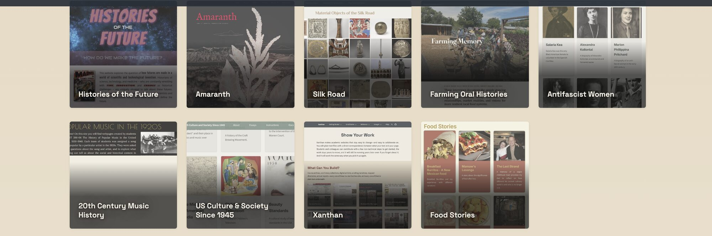
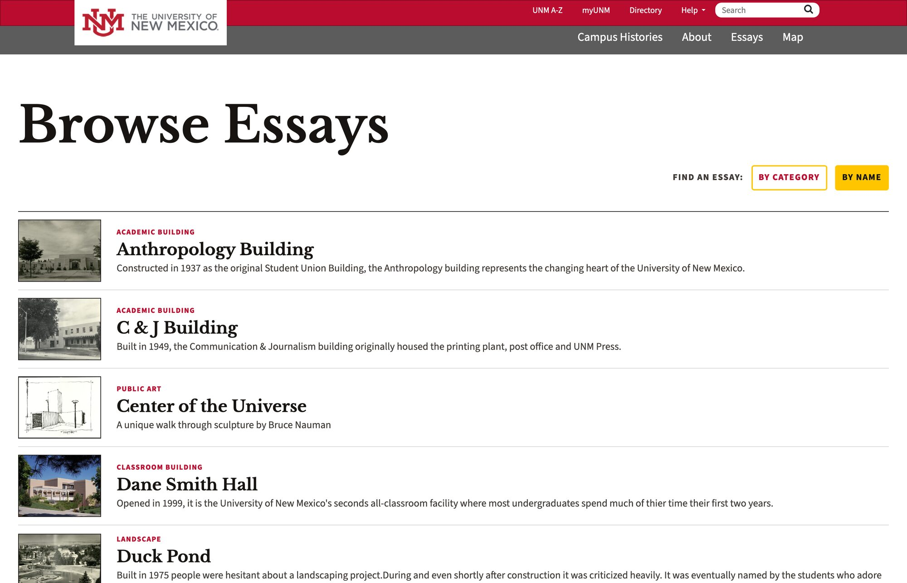
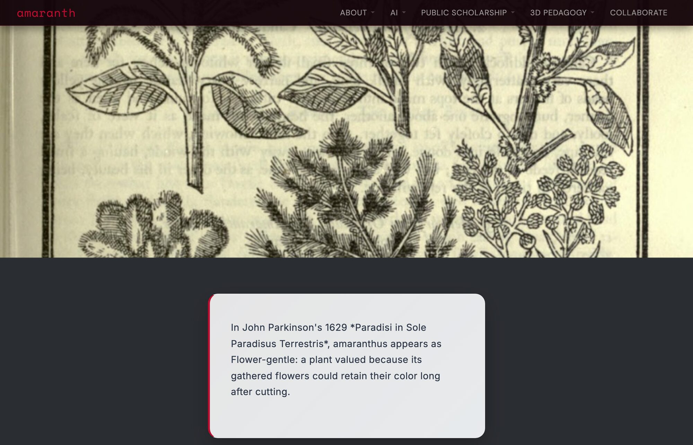
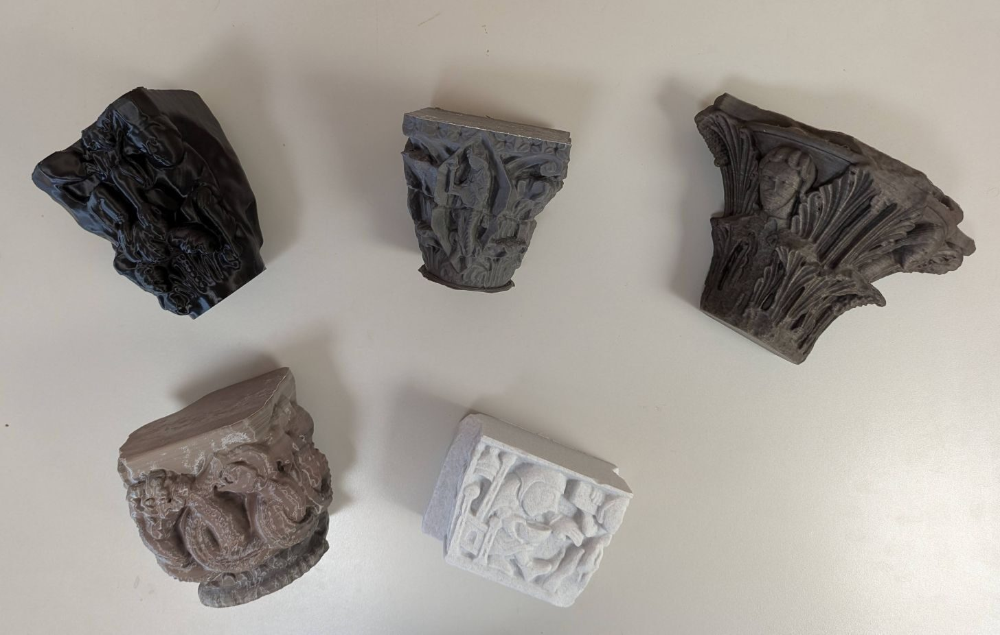

{::options parse_block_html="true" auto_ids="false" /}

<!-- 01 ------------------------------------------------------------------ -->
<section class="s-title scrim-left"
 data-background-image="images/sandia.jpg"
 data-background-size="cover"
 data-background-position="center"
 aria-label="Title">

Scanning the Past Symposium
{: .pv-eyebrow}

# What the Scan Can't See
{: .xl}

AI, student research, and the public histories that never made it into the record.

Speaker
: Fred Gibbs

Affiliation
: Department of History & Amaranth, University of New Mexico

fredgibbs.net
{: .pv-meta}

<aside class="notes">
**0:00–0:25**

Ten minutes, mostly pictures. The title is a complaint about the symposium title, offered affectionately. Scanning is extraordinary — and it can only ever record what is still standing. I want to talk about the two things it can't reach: the buildings that are gone, and the people who were never written down in the first place.
</aside>
</section>

<!-- 02 ------------------------------------------------------------------ -->
<section class="s-full scrim-bottom"
 data-background-image="images/amaranth-home.jpg"
 data-background-size="cover"
 data-background-position="center"
 aria-label="Amaranth, UNM's digital humanities studio">

Where I'm standing
{: .pv-eyebrow}

## A studio, not a service desk.

UNM's digital humanities studio: websites, scroll-driven narratives, oral history, 3D printing, and AI-assisted research — made with students, in public, on infrastructure the authors keep.

amaranth.unm.edu
{: .pv-cap}

Everything that follows was built by undergraduates and one faculty member.
{: .pv-cap}

<aside class="notes">
**0:25–0:55**

This is my context. Amaranth is small — it is a room, a printer, a few machines, and students. No dev team. No grant-funded engineering staff. Hold that in mind, because the argument at the end of this talk depends on it.
</aside>
</section>

<!-- 03 ------------------------------------------------------------------ -->
<section class="s-statement scrim-none" aria-label="Pedagogy: whoever holds the question holds the authority">

Pedagogy
{: .pv-eyebrow .terra}

## Whoever holds the question holds the *authority*.

---

AI does the technical translation. The student keeps the question, the evidence, and the responsibility for both. That division isn't a caveat on the syllabus — it **is** the syllabus.
{: .wide}

<aside class="notes">
**0:55–1:25**

The pedagogical claim in one line. Students direct; AI translates. The moment it inverts — the student accepting output they can't evaluate — the assignment has failed, and the whole course is designed to make that failure visible early and cheaply.
</aside>
</section>

<!-- 04 ------------------------------------------------------------------ -->
<section class="s-frame scrim-none" aria-label="Xanthan: plain-text web publishing">

 
<i></i><i></i><i></i>xanthan-web.github.io

 

Infrastructure
{: .pv-eyebrow}

### Plain text. Named parts. No landlord.

**Jekyll and GitHub Pages.** Free to host, nothing to renew.

**Every part of a page has a name** — which is what lets an AI change one thing instead of rewriting the site.

*Some of these haven't been touched in nearly a decade.* They still work.

<aside class="notes">
**1:25–1:55**

Xanthan is the framework underneath all of this. For this room, the relevant claim is the last one: durability. You care about buildings outliving their owners. I care about projects outliving their grant cycle. Plain text on open standards is the digital equivalent of building in adobe rather than a proprietary panel system — anyone can repair it later, without the original vendor.
</aside>
</section>

<!-- 05 ------------------------------------------------------------------ -->
<section class="s-full scrim-bottom heavy"
 data-background-image="images/campus-hero.jpg"
 data-background-size="cover"
 data-background-position="center"
 aria-label="UNM Campus Histories">

Student-driven research
{: .pv-eyebrow}

## A campus surveyed by the people who live in it.
{: .sm}

UNM Campus Histories — a multi-semester project. Each cohort builds on what the last one made.
{: .pv-cap}

amaranth.unm.edu/campus-history
{: .pv-cap}

<aside class="notes">
**1:55–2:25**

Campus Histories. Students write the history of the buildings they walk through every day. It has run across many semesters, and it accumulates — which is rare for coursework, and is the single feature instructors respond to most.
</aside>
</section>

<!-- 06 ------------------------------------------------------------------ -->
<section class="s-frame scrim-none" aria-label="Campus Histories essay index by building type">

 
<i></i><i></i><i></i>amaranth.unm.edu/campus-history/all-essays

 

What they produced
{: .pv-eyebrow}

### An inventory, with a typology.

**Academic building. Classroom building. Public art. Landscape.**

Nobody assigned those categories. Students needed them once the collection got large enough to browse — and inventing a classification *is* preservation work, whether or not you call it that.

<aside class="notes">
**2:25–2:50**

Look at the left column: the category labels. That's a building typology, arrived at by undergraduates who needed to organize their own work. This is the moment a course assignment turns into a survey — and where students discover that description is an argument.
</aside>
</section>

<!-- 07 ------------------------------------------------------------------ -->
<section class="s-full mid scrim-left heavy"
 data-background-image="images/humanities.jpg"
 data-background-size="cover"
 data-background-position="center"
 aria-label="The UNM Humanities Building">

One essay
{: .pv-eyebrow}

## Brutalism, argued over by undergraduates.

An award-winning building that much of its campus dislikes. The essay has to hold both facts at once — which is the whole problem of postwar preservation, arriving early and by accident.

UNM Humanities Building — student essay, Campus Histories
{: .pv-cap}

<aside class="notes">
**2:50–3:10**

Fast slide. This building wins awards and gets called an eyesore. Students writing it have to take architectural intent seriously while also taking public dislike seriously. That's exactly the argument this field is having about mid-century buildings right now, and a nineteen-year-old walked straight into it because they had to write 800 words about a building they have class in.
</aside>
</section>

<!-- 08 ------------------------------------------------------------------ -->
<section class="s-statement scrim-none" aria-label="Public scholarship as the default output">

Why the form matters
{: .pv-eyebrow .terra}

## The paper was never the point. The site *is* the deliverable.

---

When public scholarship is the default output rather than something translated out of a seminar paper afterwards, the incentives change on day one. Students write for readers, cite for strangers, and design for someone arriving by search. **Preservation research nobody can find is preservation research that didn't happen.**
{: .full}

<aside class="notes">
**3:10–3:45**

This is the argument I most want to land with this audience. Almost every preservation-adjacent research project produces a PDF that goes into a drawer or a repository nobody browses. If the public artifact is the assignment rather than a downstream chore, you get public scholarship by default — and students who have actually practiced writing for a non-captive reader.
</aside>
</section>

<!-- 09 ------------------------------------------------------------------ -->
<section class="s-full scrim-bottom heavy"
 data-background-image="images/farming.jpg"
 data-background-size="cover"
 data-background-position="center"
 aria-label="Oral Histories of Farming along the Middle Rio Grande">

Community storytelling
{: .pv-eyebrow}

## The knowledge is already in the community.
{: .sm}

Oral Histories of Farming along the Middle Rio Grande — farmer profiles from student interviews.
{: .pv-cap}

Cross-course collaboration
{: .pv-cap}

<aside class="notes">
**3:45–4:15**

Two courses, one project: qualitative methods students and local food systems students interviewing farmers along the Middle Rio Grande. The farmers hold knowledge about water, soil, and land use that exists in no document anywhere. The site is where it becomes citable. This is what community storytelling looks like when the community is not the subject of the research but a source of authority in it.
</aside>
</section>

<!-- 10 ------------------------------------------------------------------ -->
<section class="s-statement scrim-none" aria-label="What AI changed about oral history">

What actually changed
{: .pv-eyebrow}

## Forty hours of tape, searchable by Thursday.

---

Transcription used to be the budget line that killed the project. Now it's the cheap part — and it needs checking, because machines mangle names, accents, and every term specific to a place. The expensive work moved back where it belongs: **deciding what a collection means, and who gets to say so.**
{: .full}

<aside class="notes">
**4:15–4:45**

Be concrete and be honest here. Draft transcripts in days instead of months is a real change in what's attemptable — an undergraduate class can now take on a collection that used to need a grant. But the drafts are wrong in exactly the places that matter most: proper nouns, Spanish, local place names, irrigation vocabulary. So the labor didn't vanish, it moved. It moved toward interpretation, which is the part we actually want students doing.
</aside>
</section>

<!-- 11 ------------------------------------------------------------------ -->
<section class="s-frame scrim-none" aria-label="The scrollstory form">

 
<i></i><i></i><i></i>amaranth.unm.edu/studio/name-origins

 

Form
{: .pv-eyebrow}

### Scroll rate is pacing.

**The background holds; the text moves over it.** Images change under fixed prose, at a moment the author chooses.

So *pacing becomes an argument* — the same claim lands differently depending on what you're looking at when you read it.

The author writes Markdown and names an image. There is no code.

<aside class="notes">
**4:45–5:15**

A still image undersells this badly — say so, and gesture at the motion. The reason I care about the form for this audience: a scrollstory is the closest a web page gets to a walking tour. You control sequence and dwell time. For a building or a landscape, that's not decoration, it's the argument's structure.
</aside>
</section>

<!-- 12 ------------------------------------------------------------------ -->
<section class="s-full scrim-bottom heavy"
 data-background-image="images/scroll-mvh.jpg"
 data-background-size="cover"
 data-background-position="center"
 aria-label="An administrative memo on dormitory construction">

Who is in the record
{: .pv-eyebrow .terra}

## The building committee speaks. The women do not.
{: .lg}

UNM administrative memo on dormitory construction, read in a scrollstory.
{: .pv-cap}

Mesa Vista Hall
{: .pv-cap}

<aside class="notes">
**5:15–5:50**

The pivot of the talk. This is a real document in a real scrollstory. Read the phrase out loud: supervision "of the best sort." Here is a building whose program — its plan, its budget, its very existence — was shaped by an intention about the surveillance of women students. The architects are named. The building committee is named. The costs are itemized to the dollar. Not one woman is quoted, asked, or named. The archive of the built environment is overwhelmingly the archive of the people who commissioned it.
</aside>
</section>

<!-- 13 ------------------------------------------------------------------ -->
<section class="s-quote scrim-none" data-background-color="#100d0b" aria-label="Saidiya Hartman on narrative restraint">

Method
{: .pv-eyebrow .plain}

> Narrative restraint, the *refusal to fill in the gaps* and provide closure, is a requirement of this method.

Saidiya Hartman, "Venus in Two Acts," Small Axe 26 (2008)
{: .pv-cite}

<aside class="notes">
**5:50–6:20**

Hartman is writing about the archive of Atlantic slavery, where enslaved women appear only as numbers in a ledger or as the object of a violent sentence. Her method — critical fabulation — is to narrate what the archive refuses, while refusing to pretend the gap has been closed. The discipline is in the second half of the sentence: restraint. The gap stays visible.

Source: Saidiya Hartman, "Venus in Two Acts," *Small Axe* 12, no. 2 (June 2008).
{: .sources}
</aside>
</section>

<!-- 14 ------------------------------------------------------------------ -->
<section class="s-statement scrim-none" aria-label="AI cannot perform narrative restraint">

The problem with the machine
{: .pv-eyebrow .terra}

## A model will never tell you the archive was *silent*.

---

It fills. Fluently, plausibly, without a seam. Hartman demands restraint at precisely the point where a language model is least capable of it — which makes AI a genuinely dangerous instrument here, and a genuinely useful one, **but only if the invention is marked as invention.**
{: .full}

<aside class="notes">
**6:20–6:55**

This is the critical core. A model's defining behavior is to produce the most plausible continuation. That is the exact opposite of narrative restraint. Ask it for the voice of a woman student in that dormitory and it will give you a beautifully written paragraph with no seam in it, and no way for a reader to see where evidence stopped. That's not a bug you can prompt away; it's what the thing is. So the answer isn't to forbid it — it's to make the seam a requirement of the assignment.
</aside>
</section>

<!-- 15 ------------------------------------------------------------------ -->
<section class="s-index scrim-none" data-background-color="#100d0b" aria-label="An assignment structure for critical fabulation with AI">

In the classroom
{: .pv-eyebrow}

### Three moves, in this order.

01 / GENERATE
{: .num}

#### Voice the person who isn't there.

Ask the model to narrate the building from the position the record omits. It will comply, immediately and well.

02 / SOURCE
{: .num}

#### Make it show its footing.

Demand a source for every sentence. Watch most of them evaporate. This is the lesson; the generated text was only the bait.

03 / MARK
{: .num}

#### Publish the seam, not the smoothness.

What survives gets published as invention, labelled, beside the document it departs from. The seam is the scholarship.

<aside class="notes">
**6:55–7:25**

This is the assignment I actually run, in compressed form. Step two is where the learning happens — students are genuinely shocked the first time they ask for citations and watch a confident paragraph collapse. After that they never trust fluency again, which is the most durable thing I can teach them about this technology. Step three is what makes it scholarship rather than a creative writing exercise: the published artifact shows its own construction.
</aside>
</section>

<!-- 16 ------------------------------------------------------------------ -->
<section class="s-split scrim-none" aria-label="3D printed architectural capitals">

The other direction
{: .pv-eyebrow}

### Scan it — then put it back in a hand.

**Romanesque to Gothic, five capitals, one table.** The stylistic transition stops being a claim in a textbook and becomes something you see by turning two objects.

A student is scanning Peruvian artifacts at UNM's Maxwell Museum and *documenting the workflow* so the next person can repeat it. The pipeline is the scholarship.

<aside class="notes">
**7:25–7:50**

Quick, but it matters for this room: scanning is not the end of the pipeline, it's the middle. These are prints of capitals from cultural heritage repositories. Put five of them on a table and the Romanesque-to-Gothic transition becomes obvious in a way no slide achieves. And the Maxwell project is explicitly about documenting the workflow, not just producing the scans — because an undocumented digitization is a one-off, not infrastructure.
</aside>
</section>

<!-- 17 ------------------------------------------------------------------ -->
<section class="s-statement scrim-none" aria-label="Scanning presupposes survival">

Scanning the past
{: .pv-eyebrow}

## A scan records what survived. *Most of it didn't.*

---

LiDAR, photogrammetry, structured light — every one of them presupposes a thing still standing. But the buildings that shaped how a place understands itself are very often the ones that are gone.
{: .wide}

<aside class="notes">
**7:50–8:10**

Short and pointed. I'm not against scanning — obviously. I'm noting that our best tools are all aimed at surviving fabric, and that a city's self-understanding is often organized around an absence.
</aside>
</section>

<!-- 18 ------------------------------------------------------------------ -->
<section class="s-statement scrim-none" data-background-color="#100d0b" aria-label="The Alvarado Hotel, 1902 to 1970">

Albuquerque
{: .pv-eyebrow .terra}

1902 — 1970
{: .pv-dates}

---
{: .long}

The **Alvarado Hotel**. Charles Whittlesey for the Santa Fe Railway; Mission Revival; the largest of the Harvey hotels. Demolished in 1970 over citizen protest — a loss the preservationist Susan Dewitt called **"the most serious loss of a landmark the city has sustained."** It is a large part of why this city has a preservation movement at all.
{: .full}

<aside class="notes">
**8:10–8:40**

Everyone in this room knows this building, or knows the hole where it was. A small group fought for it and lost. The site is now the Alvarado Transportation Center. I'm choosing it deliberately: it is the ABQ building that the most people have the strongest feelings about and that no one under sixty has stood inside.

Sources: Wikipedia, "Alvarado Hotel"; Susan Dewitt quoted in coverage of the 1970 demolition.
{: .sources}
</aside>
</section>

<!-- 19 ------------------------------------------------------------------ -->
<section class="s-mock scrim-none" data-background-color="#100d0b" aria-label="A simulated augmented reality reconstruction">

 

 <svg viewBox="0 0 312 634" preserveAspectRatio="xMidYMid slice" role="img" aria-label="Simulated camera view with a wireframe building reconstruction">
 <defs>
 <linearGradient id="sky" x1="0" y1="0" x2="0" y2="1">
 <stop offset="0%" stop-color="#1b2430"/>
 <stop offset="58%" stop-color="#3a3740"/>
 <stop offset="100%" stop-color="#6b4a36"/>
 </linearGradient>
 <linearGradient id="ground" x1="0" y1="0" x2="0" y2="1">
 <stop offset="0%" stop-color="#241d18"/>
 <stop offset="100%" stop-color="#0c0a08"/>
 </linearGradient>
 </defs>

 <!-- camera view: sky, the Sandias, the street -->
 <rect x="0" y="0" width="312" height="470" fill="url(#sky)"/>
 <path d="M0 372 L40 344 L70 358 L108 326 L140 342 L174 316 L212 340 L248 324 L282 344 L312 330 L312 470 L0 470 Z"
 fill="#222731" opacity="0.8"/>
 <rect x="0" y="470" width="312" height="164" fill="url(#ground)"/>
 <path d="M104 470 L208 470 L286 634 L26 634 Z" fill="#171310" opacity="0.55"/>

 <!-- present-day massing on the site: the transportation center -->
 <g fill="#2b2620" opacity="0.9">
 <rect x="0" y="392" width="44" height="78"/>
 <rect x="268" y="404" width="44" height="66"/>
 </g>

 <!-- ============ the reconstruction overlay ============
 Line weight carries the evidence, and nothing here is a
 photograph: solid = documented, dashed = inferred from type,
 dotted = invented. The three chips in the HUD name each band. -->

 <!-- arcade: nine bays, solid (well documented in photographs) -->
 <g stroke="#d4a84b" stroke-width="1.5" fill="none" opacity="0.96">
 <path d="M24 470 L24 432 A11.5 11.5 0 0 1 47 432 L47 470"/>
 <path d="M53.8 470 L53.8 432 A11.5 11.5 0 0 1 76.8 432 L76.8 470"/>
 <path d="M83.6 470 L83.6 432 A11.5 11.5 0 0 1 106.6 432 L106.6 470"/>
 <path d="M113.3 470 L113.3 432 A11.5 11.5 0 0 1 136.3 432 L136.3 470"/>
 <path d="M143.1 470 L143.1 432 A11.5 11.5 0 0 1 166.1 432 L166.1 470"/>
 <path d="M172.9 470 L172.9 432 A11.5 11.5 0 0 1 195.9 432 L195.9 470"/>
 <path d="M202.7 470 L202.7 432 A11.5 11.5 0 0 1 225.7 432 L225.7 470"/>
 <path d="M232.4 470 L232.4 432 A11.5 11.5 0 0 1 255.4 432 L255.4 470"/>
 <path d="M262.2 470 L262.2 432 A11.5 11.5 0 0 1 285.2 432 L285.2 470"/>
 <path d="M18 470 L294 470"/>
 <path d="M18 402 L294 402"/>
 <path d="M18 396 L294 396"/>
 </g>

 <!-- second storey: inferred from what Mission Revival hotels did -->
 <g stroke="#de8466" stroke-width="1.3" fill="none" stroke-dasharray="6 4" opacity="0.92">
 <path d="M18 396 L18 334 L294 334 L294 396"/>
 <rect x="30" y="350" width="14" height="28"/>
 <rect x="60" y="350" width="14" height="28"/>
 <rect x="90" y="350" width="14" height="28"/>
 <rect x="120" y="350" width="14" height="28"/>
 <rect x="150" y="350" width="14" height="28"/>
 <rect x="180" y="350" width="14" height="28"/>
 <rect x="210" y="350" width="14" height="28"/>
 <rect x="240" y="350" width="14" height="28"/>
 <rect x="268" y="350" width="14" height="28"/>
 </g>

 <!-- roofline, towers, cupola: no surviving source -->
 <g stroke="#a89e90" stroke-width="1.2" fill="none" stroke-dasharray="1.8 3.8" opacity="0.8">
 <path d="M10 334 L38 308 L274 308 L302 334"/>
 <path d="M28 308 L28 272 L80 272 L80 308"/>
 <path d="M28 272 L54 248 L80 272"/>
 <path d="M232 308 L232 272 L284 272 L284 308"/>
 <path d="M232 272 L258 248 L284 272"/>
 <path d="M140 308 L140 280 L172 280 L172 308"/>
 <path d="M140 280 L156 262 L172 280"/>
 </g>

 <!-- tracking reticle on the pavement -->
 <g stroke="#e8e0d4" stroke-width="0.9" opacity="0.38" fill="none">
 <path d="M138 506 L138 496 L148 496"/>
 <path d="M164 496 L174 496 L174 506"/>
 <path d="M174 520 L174 530 L164 530"/>
 <path d="M148 530 L138 530 L138 520"/>
 </g>
 </svg>
 

 

 

 Alvarado · AR
 ● Tracking
 

 Arcade · photographed
 Windows · inferred
 Roofline · no source

 

 
Alvarado Hotel

 
1902–1970 · Demolished · You are standing in the lobby

 

 

 

Simulation — not a working app
{: .pv-tag .warn}

### Stand on the site. Hold up a phone.

I didn't build this. It's a drawing of a proposal. But every piece of it — the model, the tracking, the interface — is now within reach of **one person over a few weekends** rather than a funded team over three years.

---
{: .short}

 
<b>Solid</b> — documented in photographs

 
<b>Dashed</b> — inferred from building type

 
<b>Dotted</b> — invented; no surviving source

<aside class="notes">
**8:40–9:20**

Spend your time here — this is the provocation the whole talk is built toward. Say plainly: this is a mockup I drew, not a product, and I'd rather show you an honest drawing than a dishonest render.

Then point at the line weights. Solid gold is the arcade, which is well photographed. Dashed is the second storey, inferred from what buildings of this type did. Dotted is the roofline and the towers, where I'd be inventing. The interface shows its own epistemics — the confidence is in the drawing convention, the way it is on an archaeological site plan.

And the line at the bottom of the phone: "You are standing in the lobby." That is what AR can do that a scan cannot — put a body in a space that no longer exists.
</aside>
</section>

<!-- 20 ------------------------------------------------------------------ -->
<section class="s-statement scrim-none" aria-label="Every reconstruction is an argument">

The catch
{: .pv-eyebrow .terra}

## Every reconstruction is an argument with the *confidence turned up*.

---

Photogrammetry at least fails visibly: a gap in a point cloud looks like a gap. A generated elevation looks finished whether or not anyone alive knows what was there. **If we build these, the drawing convention has to carry the evidence** — or we hand the public a memory of a building that never existed.
{: .full}

<aside class="notes">
**9:20–9:45**

The counterweight, and the connection back to Hartman. Same problem, different medium: fluent output with no visible seam. A point cloud is epistemically honest by accident — the holes show. A generated elevation is epistemically dishonest by default. The discipline this field already has — hatching conventions, reconstruction drawings that distinguish extant from conjectural fabric — is exactly the discipline the new tools lack. You already own the solution.
</aside>
</section>

<!-- 21 ------------------------------------------------------------------ -->
<section class="s-full mid scrim-left heavy"
 data-background-image="images/cliff-model.jpg"
 data-background-size="cover"
 data-background-position="center"
 aria-label="Closing">

Ending
{: .pv-eyebrow}

## Scan what survived. Then argue, in public, about the rest.
{: .lg}

The tools got cheap enough that a student can make the argument. Whether the argument is any good is still entirely up to us.

Fred Gibbs · fredgibbs.net · amaranth.unm.edu
{: .pv-cap}

Background: AI-generated image
{: .pv-cap}

<aside class="notes">
**9:45–10:00**

Land it and stop. Note the background is AI-generated — say it out loud, because after the last two slides it would be absurd not to, and the small honesty does more work than the image does.
</aside>
</section>
